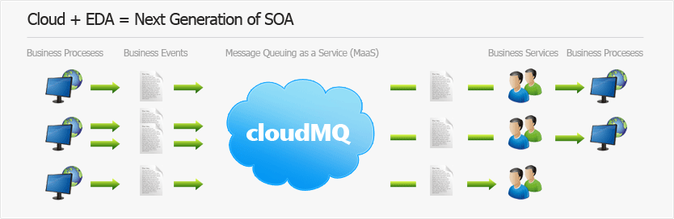

# CloudMQ

Platform components as a service will hit the software marked hard in 2009 and 2010, but until developers and architects understand how to leverage the platform components in a clear and consistent way, they will add more pain than salvation... Read up on some of the architecture axioms and distributed architectures and analyse your current design and architectures before moving to platform component services is advised. :)

<!-- more -->

Reference: [http://www.cloudmq.com/](http://www.cloudmq.com/)
