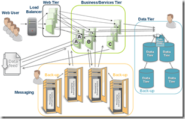

# Its time for auto scaling - avoid peak load provisioning for web applications

Good blog-post on an old-trick:

<!-- more -->

- **The missing piece - middleware virtualization**

If you take pretty much any existing application, add another machine into the network, and watch what happens, you wouldn't be surprised that nothing much would happen at all.

Non-virtualized middleware

Today's applications aren't able to dynamically take advantage of new computing resources that become available. That's also true for cloud based environments like EC2 - the fact that you can now add machines easily is nice, but it doesn't mean that the application can do anything with it. What is missing is a layer that helps the application take advantage of these new resources dynamically, as they are being added to the system. This is where middleware virtualization comes to the rescue.

Reference: [http://natishalom.typepad.com/nati_shaloms_blog/2009/03/its-time-for-auto-scaling-avoid-peak-load-provisioning.html](http://natishalom.typepad.com/nati_shaloms_blog/2009/03/its-time-for-auto-scaling-avoid-peak-load-provisioning.html)
