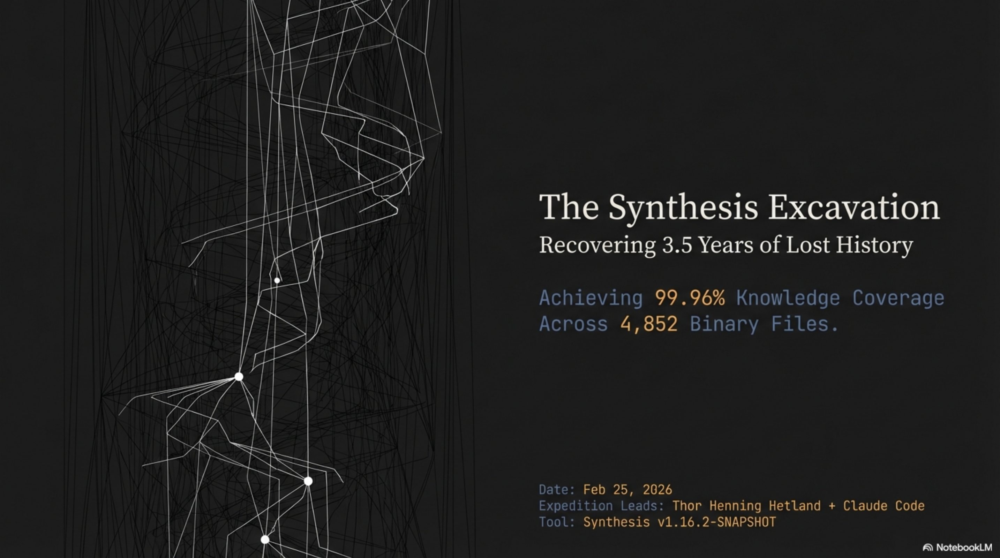
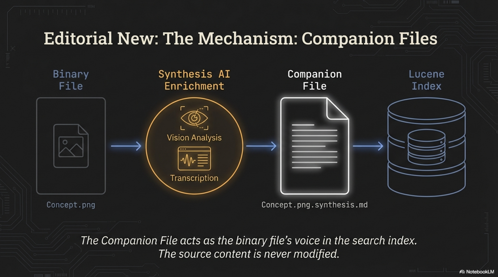
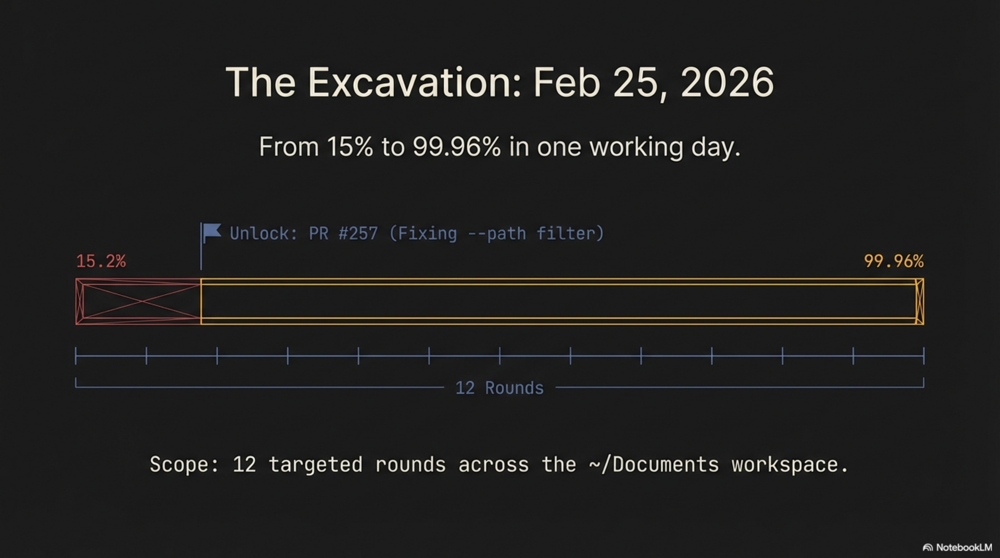
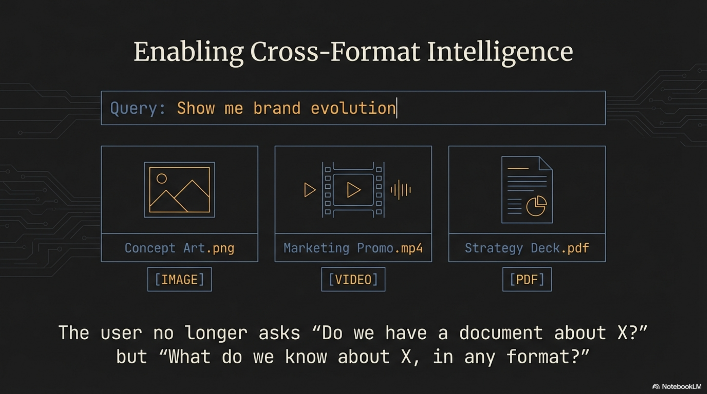

# The Synthesis Excavation: Recovering 3.5 Years of Lost History

We build Synthesis — a knowledge indexing tool whose purpose is to make everything in a workspace searchable. We had been running it on our own workspace for months and the coverage number looked excellent: **99.6%**. Nearly perfect.

That number was a vanity metric. It told us exactly what we wanted to hear while hiding what we needed to know. The real asset coverage was **15.2%**.

<!-- more -->

## The Comfortable Lie

Here is what 99.6% actually meant: of the text files Synthesis knew about, nearly all were indexed. But text files are the visible fraction of a knowledge base. They have high searchability and low storage mass. The real mass — the dark matter — was 4,852 binary files sitting on disk, invisible to every search query we ever ran. Images. PDFs. Videos. Audio recordings. Files accumulating for 3.5 years across eXOReaction, Quadim, Cantara, and archived projects.

**Text Coverage: 99.6%. Real Asset Coverage: 15.2%.**

We had been measuring the sliver we already knew about and calling it comprehensive. The shoemaker's children were barefoot, and we had not bothered to look down.

## The Shoemaker's Recursion

Before I tell the excavation story, I need to explain why it matters beyond one company's files. There is a cycle at work here that I think is the central insight.

It starts with velocity. We built lib-pcb with Claude Code in 11 days — 197,831 lines of Java, 7,461 tests, 691 files per day. That output velocity created a knowledge management crisis. Files accumulated faster than anyone could organize them. So we built Synthesis to solve that crisis. Same methodology, different domain, same results: a tool that indexes 200-300 files per second and returns sub-second search results across every format.

Then Synthesis validated the methodology. Which built the workshop business. Which generated business documents, marketing materials, client proposals, pipeline tracking, screenshots, voice prototypes, concept art, presentation recordings. Which generated more content that needed to be organized. Which required extending Synthesis to handle images, video, and audio. Which revealed 3.5 years of hidden content in the workspace where all of this was built.

Build. Crisis. Tool. Proof. Build again.

> "A proof of concept executed on the hardest possible test case — the builder's own mess."

That recursive loop is not incidental. It is the whole argument for the tool. If Synthesis cannot manage the corpus it generated, it cannot manage yours. February 25 was the day we closed the loop.

## Gated Behind a Bug Fix

The excavation almost did not happen. When we expanded the configuration to include image, video, and audio formats — adding file extensions to `includePatterns` — the workspace jumped from 7,509 indexed entries to 11,872. We could suddenly see 4,852 binary files that had been invisible. But when we ran `synthesis enrich --path` to process them by directory, it returned zero results. Every time. Zero companions generated.

The `--path` filter was broken. PR #257. A bug that had existed for months, never noticed because we had never used the tool at this scale on our own content. The shoemaker, finally trying to make shoes for his own children, discovering the lasts were the wrong size.

The fix took a morning. Then an out-of-memory fix for binary file reads (PR #258) — Synthesis was trying to load entire image files into memory for text extraction, which is not a productive thing to do with a 15 MB PNG. Two bugs. Both invisible until we ate our own dogfood at full scale.

Once PR #257 landed, the whole operation unlocked. From zero to 3,922 companion files in one working day.

## Dark Matter

I have started calling these invisible binary files "dark matter" — borrowing the physics metaphor because it fits uncomfortably well. Dark matter has mass. It influences the structure of the system. But it does not interact with the instruments designed to observe it.

A PNG screenshot of a product UI has information content. A PDF business plan has information content. An MP4 product demo has information content. An MP3 voice prototype has information content. But none of it responds to a text search query. These files sit in directory listings, occupy storage, sometimes get referenced in documents — but when you search for what they contain, they are silent.

Our dark matter comprised:

- **4,042 images** — product screenshots, presentation slides, marketing assets, concept art
- **671 documents** — business plans, sales decks, client proposals, research papers
- **65 videos** — product demos, marketing content, conference recordings
- **74 audio files** — voice prototypes, presentation recordings

That is 4,852 files invisible to search. The majority of our knowledge base by volume. The 99.6% had been measuring the comfortable minority.

## The Mechanism: Companion Files

The solution is structurally simple. For every binary file, Synthesis generates a companion — a markdown sidecar with the extension `.synthesis.md` — that describes the content in searchable text. The binary stays untouched. The companion sits beside it and speaks on its behalf.

For images, a vision-capable AI model analyzes the visual content: type classification, title, organizations depicted, topics, narrative description, keywords. For PDFs, Synthesis extracts text directly or generates metadata-level companions for complex layouts. For video and audio, companions capture what can be inferred from filename, duration, directory context, and metadata.

The companion file acts as the binary file's voice in the search index. Lucene cannot read a PNG. It can read the `.synthesis.md` sitting next to it. The source content is never modified.

## The Excavation: Twelve Rounds

February 25, 2026. One working day. Twelve enrichment rounds. Each round targeted a directory chosen by business value.

**Rounds 1–3: The Business Layer.** Marketing materials, strategy documents, knowledge infrastructure assets. 143 companions in Round 1, pushing coverage to 18.2%. Business and media directories followed. Coverage at 36%.

**Round 4: The Turning Point.** Quadim product screenshots. 426 files in nested directories — the entire visual evolution of the Quadim interface. Skill management dashboards. The Frøya AI agent interface. KCI visualizations. User onboarding flows. Every screen, sitting as numbered PNG files with zero semantic content in the filenames, unsearchable for years. Coverage jumped from 36% to 45% in a single round. This was the moment the excavation stopped feeling mechanical and started feeling archaeological.

**Rounds 5–7: Client Work.** Proposals, presentations, Elprint manufacturing files, Entra identity management assets. Coverage pushed to 77.6%.

**Round 8: Long Tail.** Miscellaneous directories, remaining gaps. Coverage at 80%, then 89.7%.

**Rounds 9–11: The Archive Bet.** This is the part that keeps me honest. The archive sub-workspace contained 2,638 files and 569 MB. The AI assistant — my collaborator for the session — recommended skipping it as low-priority. Old downloads, reference PDFs, historical material of limited current value.

I challenged that. The bet: enrich a sample and see what comes out.

Round 9 (media): The earliest ElevenLabs voice prototypes for Frøya — experiments in giving Quadim's AI digital co-worker a voice, created months before the feature was documented anywhere. Forgotten entirely.

Round 10 (documents): 736 files including Hetlands chemistry t-shirt designs — a family brand project playing on endothermic and exothermic reactions. Organizational satire infographics mapping dysfunction flows: Misalignment leads to Silos leads to Overthink leads to Burnout leads to Meetings About Meetings. The kind of content useful for workshops — if you can find it.

Round 11 (photos): 3.5 years of team history. Events. Faces. Context.

> "The archive wasn't junk. It was the company's subconscious memory."

Coverage surged from 89% to 97%. The thing I was told to skip contained the deepest material.

**Round 12: Final sweep.** Remaining gaps closed. 99.96%.

## Anatomy of an Artifact

Let me show what enrichment looks like on a single file. In the archive, there is a ChatGPT-generated image from April 2025. The filename: `ChatGPT Image Apr 28, 2025, 08_41_37 AM.png`. Zero semantic content in the name.

The vision AI described it as: an artistic painting combining classical religious iconography with modern urban elements — a figure wearing a golden winged headband and halo, dressed in earth-toned robes, rendered in a Byzantine or early Renaissance style, with modern office buildings bearing Quadim signage in the background.

This was a brand identity experiment from a specific strategic period. We call it internally "the Quadim Halo." It represented a design direction — tradition meets innovation — that influenced subsequent brand decisions. Without the companion file, it was a cryptically named PNG in a directory nobody searched. With it, a query for "brand evolution" returns the concept art alongside marketing videos, strategy decks, and logo appearances across materials.

> "The user no longer asks 'Do we have a document about X?' but 'What do we know about X, in any format?'"

That is the shift. Not better search — different search. Cross-format intelligence. A single query returning images, video, PDFs, and text, unified by meaning rather than file type.

## The Numbers

| Category | Metric | Value |
|----------|--------|-------|
| **Scope** | Total binary files | 4,852 |
| | Images (PNG/JPG) | 4,042 (83%) |
| | Documents (PDF) | 671 (14%) |
| | Videos + Audio | 139 (3%) |
| **Coverage** | Pre-expansion (vanity metric) | 99.6% of text files |
| | Post-expansion (reality) | 15.2% of all assets |
| | **Final** | **99.96% (4,850/4,852)** |
| **Output** | Companion files generated | ~3,922 new |
| | Enrichment rounds | 12 |
| **Storage** | Content corpus | 4,500 MB |
| | Lucene index | 23.2 MB |
| | Index overhead | <1% |
| | Index efficiency | 1 MB index per 194 MB content |
| **Duration** | Workspace age | ~3.5 years |
| | Enrichment session | 1 working day |
| **Unlock** | Critical bug fix | PR #257 (`--path` filter) |

The storage efficiency deserves a note. Adding 3,400 MB of image content grew the Lucene index by approximately 3 MB. Each companion file is a few kilobytes of markdown. The entire companion corpus for 5,052 files is roughly 10–15 MB. Less than 1% overhead to make 4,500 MB of content searchable. One megabyte of index covers 194 megabytes of content.

## The Three That Remain

4,850 of 4,852 files are now searchable. Three persist as failures with understood causes:

- 1 PDF with a filename exceeding OS path length limits
- 2 PNGs that trigger vision API timeouts — complex infographics with dense layered content

Accepted. Documented. Not worth losing sleep over at 99.96%.

## The Lesson the Shoemaker Learned

The recursive cycle I described earlier — build, crisis, tool, proof — has a coda. The proof generates the next build. Synthesis now stays current. Any binary file added to the workspace gets indexed on the next `synthesis maintain` run and enriched on the next `synthesis enrich` pass. The excavation was a one-time debt payment on 3.5 years of accumulated blindness. From here, the system maintains itself.

But I am not going to pretend we should have done this sooner. We should have. The shoemaker's children were barefoot for three and a half years. The 99.6% was comfortable, and we did not question it because questioning a good-looking number requires admitting you might have been wrong. That is worth remembering the next time any metric looks reassuring. Ask what it is not measuring.

The bug that blocked the whole operation — PR #257, the broken `--path` filter — had been there for months. We never noticed because we never used the tool at full scale on our own content. The moment we did, it broke. And the moment we fixed it, we recovered everything.

That is the real lesson. Not the 99.96%. Not the 3,922 companion files. The lesson is that the gap between "works in testing" and "works on the builder's own mess" is where all the real engineering lives. We crossed that gap on February 25.

> "The archaeology is complete. The library is open."

---

*Synthesis is open source: [github.com/exoreaction/Synthesis](https://github.com/exoreaction/Synthesis)*

*Expedition leads: Thor Henning Hetland + Claude Code. Tool: Synthesis v1.16.2-SNAPSHOT.*
