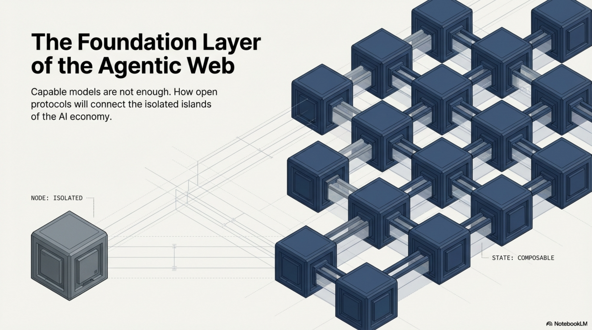
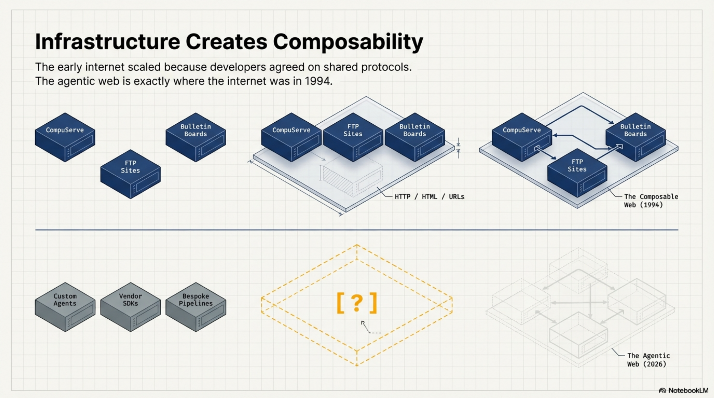
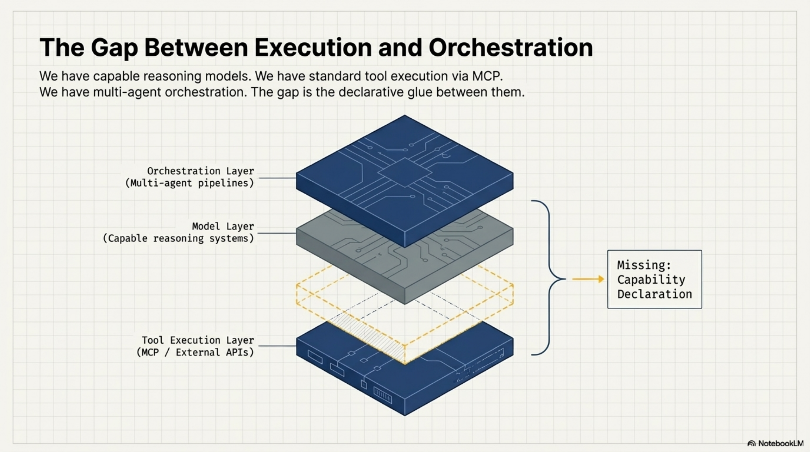
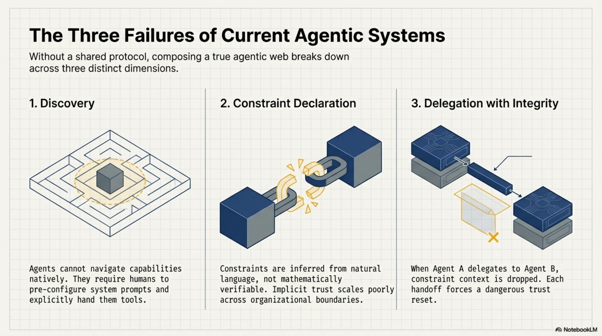
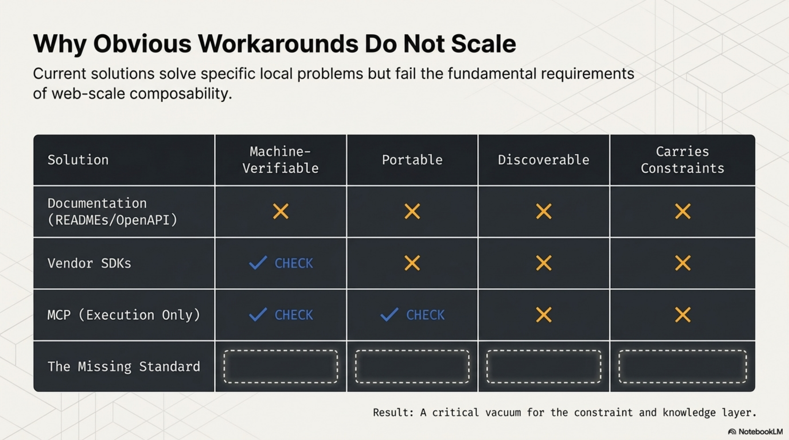
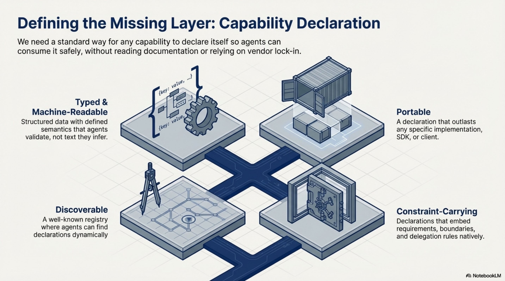
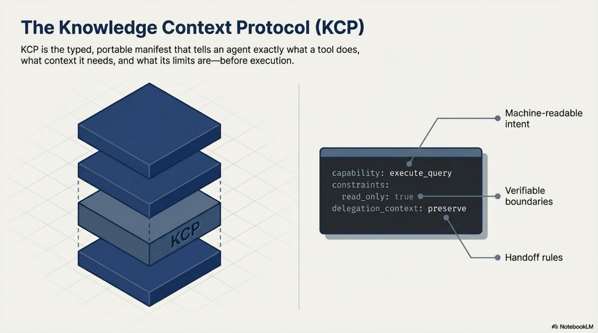
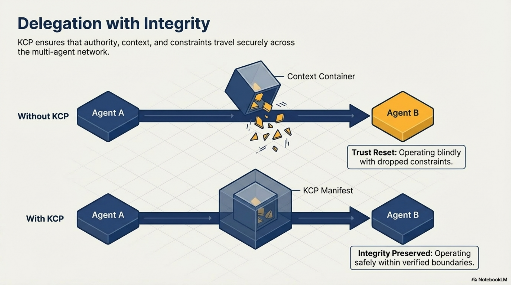
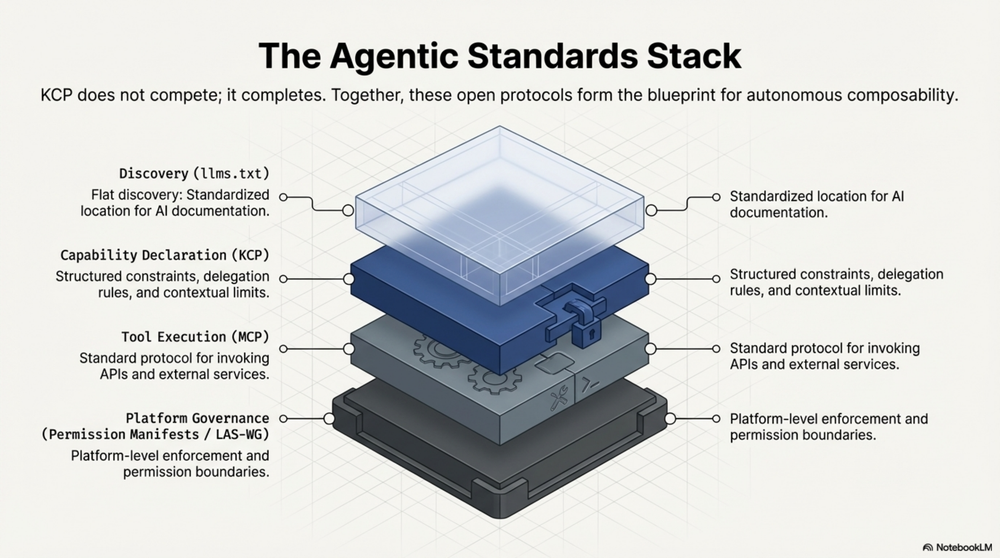
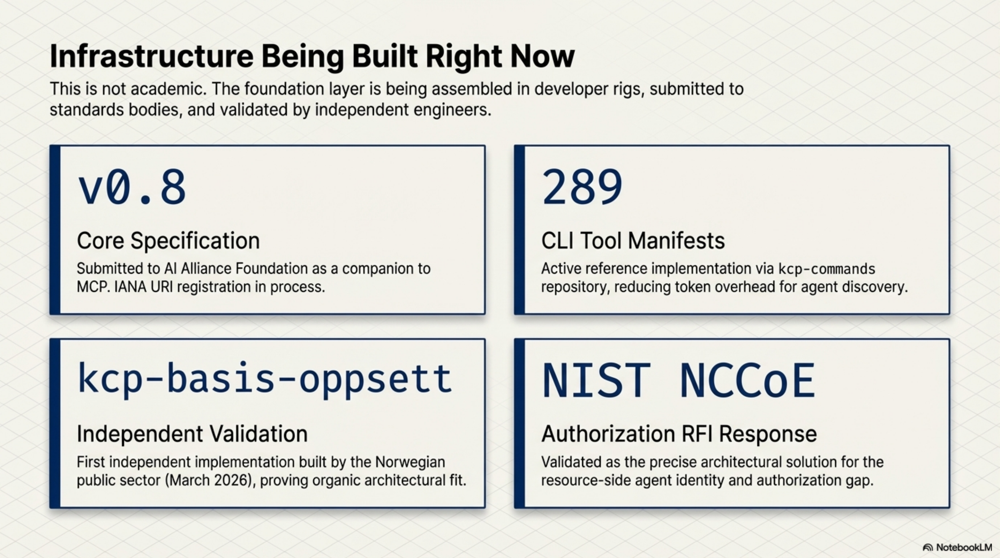

# The Autonomous Agentic Web Needs a Foundation Layer

Something is being assembled right now, mostly without a name for it.

Production pipelines where agents write code, run tests, and open pull requests.
Compliance workflows where agents check controls, gather evidence, and escalate to humans
when something needs a decision. Developer rigs where an agent calls a tool, the tool
delegates to a sub-agent, the sub-agent calls an API, and the result flows back up the chain.

The models are capable. The tooling is solid. The use cases are real.

What we are building — collectively, across hundreds of teams and projects — is an autonomous
agentic web. And like the original web, it will only become useful when the pieces can talk
to each other reliably. We are not there yet. The reason is interesting.

<!-- more -->

## How the web actually got composable

The early internet was full of capable, isolated systems. CompuServe had millions of users.
FTP sites had enormous stores of content. Bulletin boards ran active communities. Each one
worked well on its own terms. None of them could talk to each other without bespoke integration
work that had to be repeated for every new connection.

Then HTTP, HTML, and URLs arrived. Not because servers got smarter — the servers of 1994 were
not more capable than the FTP servers of 1991. What changed was that developers agreed on a
small set of shared protocols for how things connect. Not what they contain. Not what they
do. Just how they link.

A browser built in 2026 can navigate a site built in 1996. A search engine can index any page
without a partnership agreement. A link from one document to another works without either
author knowing the other exists.

That composability was not magic. It was infrastructure. And it came from standards, not from
making individual pieces smarter.

The agentic web is at exactly the point the internet was before HTTP. We have capable pieces.
We do not yet have agreed protocols for how they connect.

## What is actually being built

To understand the gap, it helps to be concrete about what the agentic web consists of today.

At the model layer, we have genuinely capable systems that can reason, plan, write code, and
navigate complex tasks across long contexts. This problem is largely solved for most practical
purposes.

At the tool integration layer, the Model Context Protocol (MCP) has become the dominant
standard for connecting agents to APIs, databases, and external services. An agent using
MCP can interact with GitHub, Slack, databases, and hundreds of other services through a
consistent interface. This is the agentic equivalent of the API economy — well-defined
interfaces for services that agents can call.

At the developer workflow layer, tools like Claude Code have made it possible for agents
to work directly inside codebases, with full context about the project structure, history,
and conventions. The Knowledge Context Protocol emerged from this layer — I will come
back to that.

At the orchestration layer, frameworks for multi-agent coordination are proliferating.
Agents that spawn sub-agents. Pipelines that pass work between specialized models.
Approval workflows that route decisions to humans when confidence is low.

Each of these layers works. The gap is between them.

## The three things a composable agentic web requires

When I think about what is missing, three problems keep coming back. They are distinct but
related.

**Discovery.** How does an agent know what capabilities exist without reading documentation?

Right now, the answer is usually: it does not. A human integrates the tools, writes the
system prompt, and the agent operates within whatever has been pre-configured. This works
for single-agent systems with known toolsets. It does not work for an agentic web where
agents need to discover and compose capabilities they have not been explicitly given.

The web solved this with hyperlinks and search. A browser does not need to know in advance
what resources exist — it can follow links and discover. The agentic web has no equivalent.
Agents cannot yet navigate a landscape of capabilities the way a browser navigates a
landscape of documents.

**Constraint declaration.** How does an agent know what it is allowed to do?

This is subtler than it sounds. Most current systems handle this through system prompts:
"You are a helpful assistant. Do not delete files. Always ask before sending external
communications." These constraints work in controlled single-agent settings. They fail
in two common ways.

First, they are fragile across handoffs. When agent A delegates to agent B, the constraint
context gets paraphrased, summarized, or dropped entirely. The delegated agent has no reliable
way to know what constraints were in scope for the original invocation.

Second, they are not verifiable. There is no way for a calling agent to inspect what
constraints apply to a capability before invoking it. Trust is implicit. In a web of
agents operating across organizational boundaries, implicit trust does not scale.

**Delegation with integrity.** How does authority travel across agent-to-agent handoffs?

When a senior developer delegates a task to a junior, the delegation carries context: what
the task is, what decisions have already been made, what is off-limits, what requires
escalation. Good delegation is not just task transfer — it is context transfer.

Agent delegation today is mostly task transfer. The sub-agent receives instructions but not
the constraint context that shaped them. It does not know the original requester's intent,
what approvals have already been obtained, or what authority it is operating under. Each
handoff is a trust reset, which forces either over-permission (give the sub-agent everything)
or under-permission (give it so little it cannot complete the task).

## Why the obvious solutions do not close the gaps

These three problems are real, and there are obvious-seeming solutions to each. The problem
is that the obvious solutions do not actually work at web scale.

**Documentation** is the most common answer to the discovery problem. Publish a README.
Write an OpenAPI spec. The agent reads the docs and knows what to call.

Documentation has two fatal flaws for agents. First, it does not travel — it lives at a URL
that the agent may or may not have access to at the moment it needs the information. Second,
it is not typed or machine-verifiable. The agent reads natural language and infers the
constraints; it cannot validate them. Documentation that is accurate when written drifts
from reality, and the agent has no way to detect the drift.

**Vendor SDKs** solve the integration problem for specific platforms but create lock-in and
fragmentation. Every platform provides its own SDK with its own model of what capabilities
look like, what constraints mean, and how delegation works. These models are not compatible.
An agent built for one SDK's model of the world cannot natively compose with capabilities
from another.

**MCP** is genuinely excellent at what it does — connecting agents to APIs and external
services. But MCP addresses the tool execution layer, not the knowledge and constraint layer.
An agent using an MCP server knows how to call the tool. It does not necessarily know what
the tool is optimally used for, what context it needs to perform well, what constraints
apply to its invocation, or what happens to delegation context when it fires.

These are different problems. MCP solves one of them very well. The others remain open.

## What the foundation layer looks like

The agentic web needs what I would call a capability declaration layer — a standard way
for any capability (a CLI tool, an API, an agent, a service) to declare itself in a form
that other agents can consume without reading documentation, without a vendor SDK, and
without a system prompt that might get paraphrased.

The properties this layer needs:

- **Typed and machine-readable.** Not natural language that agents infer — structured data
  that agents validate. Fields with defined semantics. Schemas that can be checked.

- **Portable across clients and models.** A declaration that works with Claude Code today
  should work with whatever comes next. The value of a standard is that it outlasts any
  specific implementation.

- **Discoverable.** Agents should be able to find declarations without being handed them
  explicitly. A well-known location. A registry. A search interface.

- **Constraint-carrying.** The declaration should include not just what the capability does,
  but what it requires for approval, what actions are off-limits, what context it expects,
  and how delegation works when it is invoked from another agent.

This is what we built KCP — the Knowledge Context Protocol — to address.

A KCP manifest is a typed YAML file that describes a capability: what it does, what context
it works best with, what requires human approval, what constraints apply, and how authority
should be handled in delegation chains. An agent can read a manifest and know, without
calling the capability or reading external documentation, whether it is appropriate to invoke
and under what conditions.

The manifests are portable. A manifest written for one agent or tool works across any
client that understands the spec. They are open — the spec is public, Apache 2.0 for the
reference implementations, submitted to the AI Alliance Foundation as a companion to MCP.

We started building this for our own development rig. As the toolset grew — more CLI tools,
more agents, more inter-agent delegation — the absence of a structured capability declaration
layer became the bottleneck. We had capable pieces. We had no agreed way for them to discover
each other and understand what the other was allowed to do.

The first concrete implementation is kcp-commands: 289 manifests for common CLI tools, each
describing the tool's capabilities, typical context requirements, and appropriate delegation
behaviour. The manifests are used to build structured context for agents working with these
tools — reducing the token overhead of capability discovery while making the context richer
and more reliable.

The delegation problem in particular is one that typed manifests address in a way system
prompts cannot. Without a manifest, constraint context breaks in transit. With one, it
travels intact.

## Where the standards stack fits together

KCP does not exist in isolation. The agentic standards ecosystem is assembling from multiple
directions, and understanding how the pieces fit together matters.

**llms.txt** (Answer.AI) solves the flat discovery problem: a standardized location for
documentation that AI systems can find. It is a table of contents — excellent for what it
does, but flat. It tells an agent that content exists and points to it; it does not describe
capabilities in a structured, typed form that agents can validate against.

**MCP** (Anthropic, now AAIF/Linux Foundation) solves the tool integration problem: a
standard protocol for agents to call external tools and services. MCP is the execution
layer — how agents invoke capabilities.

**KCP** addresses the space between discovery and execution: structured declaration of
what capabilities exist, what they do, what constraints apply, and how delegation works.
The three layers are complementary, not competing.

**Permission Manifests** (LAS-WG) address the governance layer: how agent permissions are
declared and enforced at the platform level. KCP and Permission Manifests are designed
as complementary — KCP declares capability-level constraints, Permission Manifests govern
platform-level permissions.

The vision is a stack where an agent can navigate from "what capabilities exist in this
environment" (discovery, llms.txt + KCP) through "how do I call this capability" (execution,
MCP) within a governance framework that defines what the agent is permitted to do at all
(governance, Permission Manifests).

## Where this stands

I want to be honest about where this is.

KCP is early. The spec is at v0.8. It has been submitted to the AI Alliance Foundation as
a companion spec to MCP. A well-known URI registration is in process with IANA. The first
independent implementation — kcp-basis-oppsett, built by a Norwegian public sector developer
who arrived at the same pattern independently — appeared in March 2026, which was the first
real signal that the approach resonates beyond the original team.

There are 289 CLI tool manifests published, a TypeScript and Java validator, a Python bridge,
and an MCP server that allows any agent with MCP support to query the manifest index. The
NIST NCCoE received a response to their AI identity and authorization RFI pointing to the
resource-side gap that KCP addresses.

This is not a finished product. It is the beginning of an infrastructure layer that the
agentic web will need as it scales. The question is not whether this layer will exist —
it will, because the web without it will remain a collection of capable but isolated pieces.
The question is what form it takes and who shapes that form.

## What needs to happen

The web got composable because a large number of developers decided that the cost of agreeing
on shared protocols was lower than the cost of bespoke integration for every connection.
That decision was not obvious at the time. There were competing proposals. There were
arguments that each platform's approach was better optimised for its specific use case.
The people who insisted on open standards over optimised proprietary systems were right.

The agentic web is at that decision point now.

The right outcome is an open, portable capability declaration layer that any agent, any
tool, and any platform can implement without vendor lock-in. One where the constraints
travel with the capability, the delegation context survives handoffs, and agents can
discover what is available without being pre-configured by a human for every possible
composition.

This is what we are trying to build with KCP. The repos are open. The spec is public. The
conversation is at the AI Alliance Foundation and at standards bodies. The first independent
implementations are appearing.

If you are building multi-agent systems, thinking about how agents should discover and
compose capabilities, or working on the infrastructure layer of the agentic web —
I would like to hear how you are thinking about this.

---

*KCP spec and reference implementations: [github.com/Cantara/knowledge-context-protocol](https://github.com/Cantara/knowledge-context-protocol)*

*kcp-commands (289 CLI tool manifests, Apache 2.0): [github.com/Cantara/kcp-commands](https://github.com/Cantara/kcp-commands)*

*Full presentation: [Architecting the Agentic Web (PDF)](../../assets/Architecting_the_Agentic_Web.pdf)*
