# From Capable to Trustworthy: How KCP Evolved from Discovery to Governance

AI agents are getting remarkably good at doing things. They read code, traverse APIs, generate summaries, and execute multi-step plans across sprawling codebases. What they are still bad at is knowing what they should *not* do.

Today, an agent dropped into a new repository does the equivalent of walking into a library and reading every book on every shelf before deciding which one is relevant. This is expensive, slow, and -- in environments where some shelves contain confidential material -- genuinely dangerous.

<!-- more -->

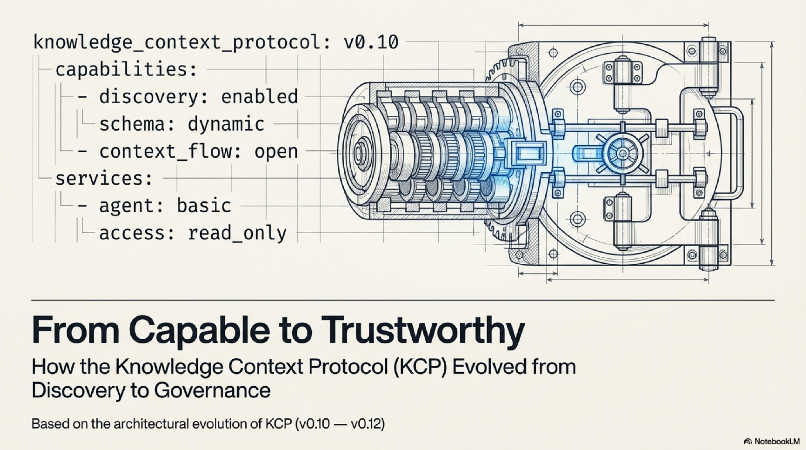

The problem is not intelligence. It is the absence of a shared contract between the knowledge and the agent consuming it. That is what KCP -- the Knowledge Context Protocol -- tries to address: a simple YAML manifest (`knowledge.yaml`) that sits in a repository and tells agents what is here, what it is for, and how to navigate it before they start loading everything.

Over the past few months the spec has evolved through three releases. The trajectory tells a story worth examining -- from capability declaration to governance.

---

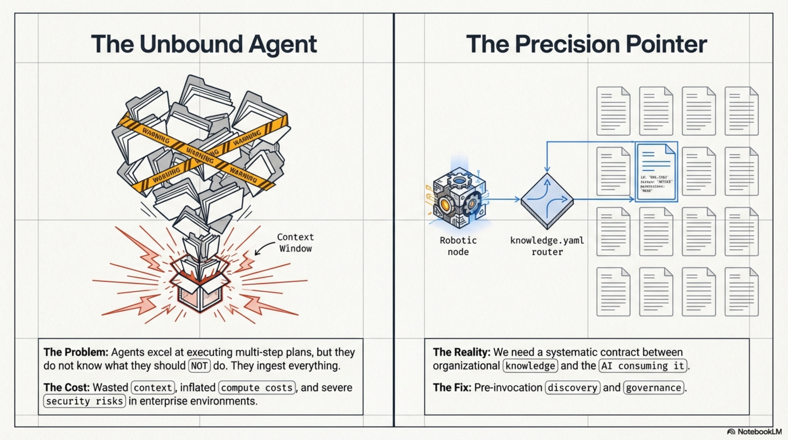

---

## The Systemic Contract

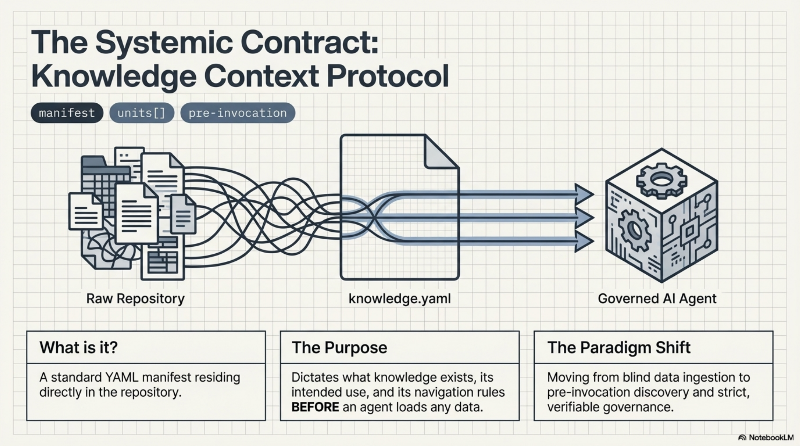

`knowledge.yaml` is a standard YAML manifest sitting directly in the repository. It dictates what knowledge exists, its intended use, and its navigation rules **before** an agent loads any data. The paradigm shift: from blind data ingestion to pre-invocation discovery and strict, verifiable governance.

---

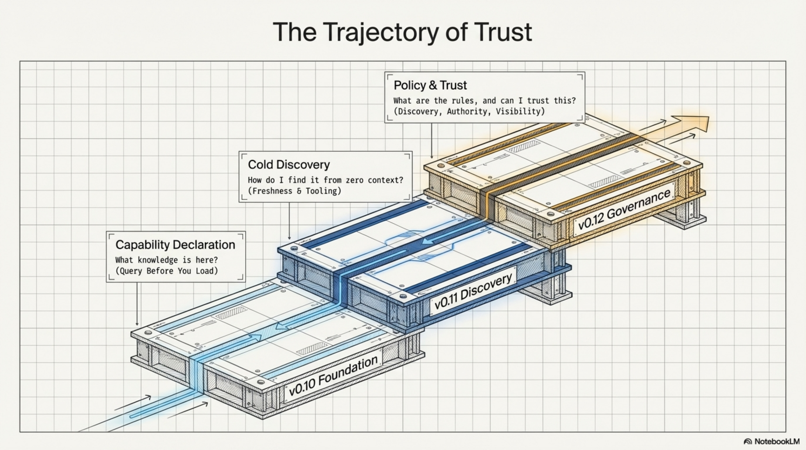

---

## v0.10: The Foundation -- Query Before You Load

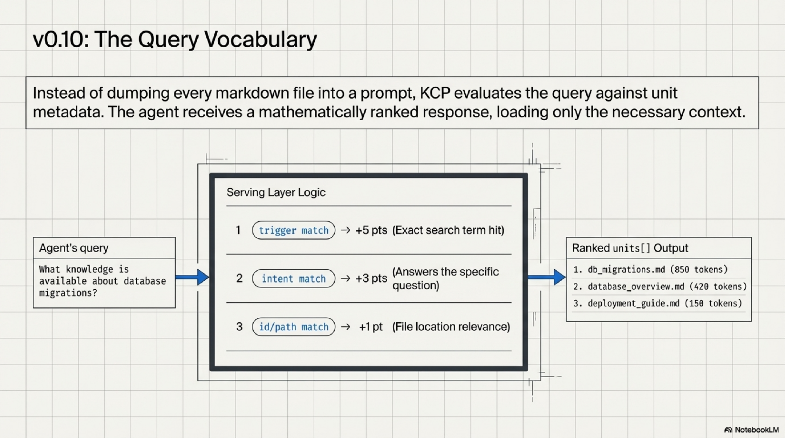

KCP v0.10 introduced the core manifest format: a `knowledge.yaml` file containing `units[]`, where each unit describes a piece of knowledge with an `id`, a `path`, an `intent` (what question does this unit answer?), `triggers` (what search terms should surface it), `audience`, `scope`, and `depends_on`.

The key idea was the **query vocabulary**. Instead of an agent loading every markdown file in a repository and hoping its context window can hold them all, the manifest enables pre-invocation discovery. The agent asks: *"What knowledge is available about database migrations?"* The serving layer scores units by trigger match (+5 pts), intent match (+3 pts), and id/path match (+1 pt), returning ranked results with token estimates. The agent loads only what it needs.

Federation support (`manifests[]` pointing to other `knowledge.yaml` files) and version pinning (`kcp_version` for parsers to validate against) rounded out the release.

---

## v0.11: Cold Discovery -- Finding Knowledge from Nothing

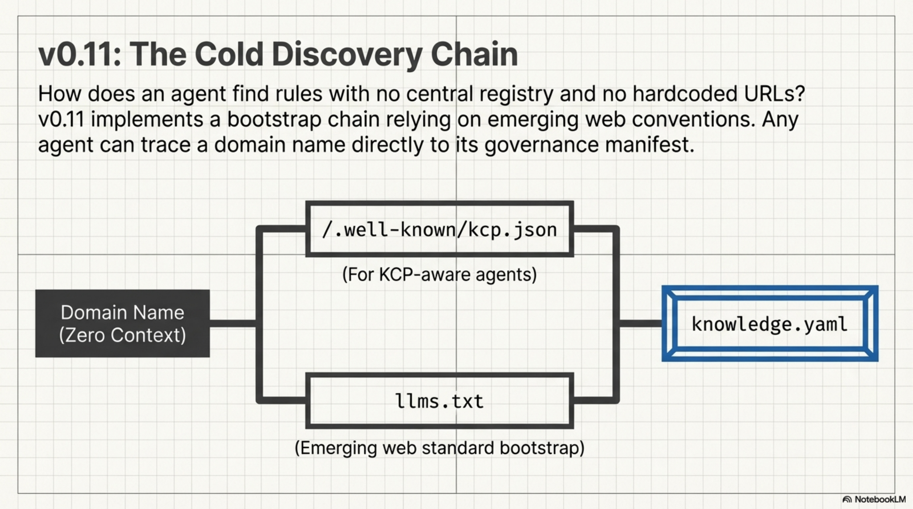

v0.11 tackled a gap that any practitioner deploying KCP across an organisation would immediately hit: how does an agent find the manifest in the first place?

The solution was an `llms.txt` bootstrap chain. An agent visiting a domain follows a standard path: check for `/.well-known/kcp.json` or parse `llms.txt` for a pointer to `knowledge.yaml`. No central registry, no hardcoded URLs -- just a chain of well-known locations that any agent can follow from zero context.

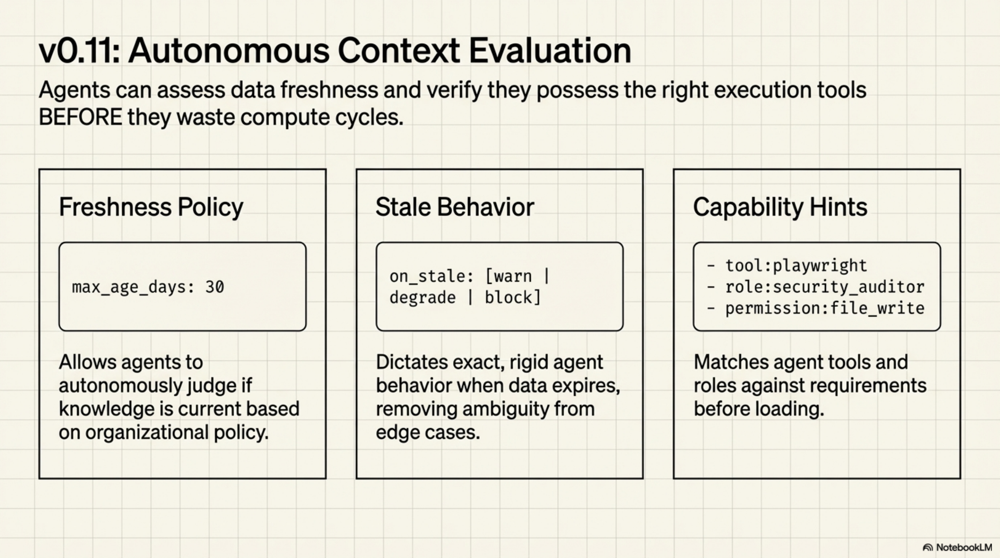

v0.11 also added `freshness_policy` hints -- `max_age_days`, `on_stale` behaviour (`warn`, `degrade`, or `block`), and a `review_contact` -- so agents could assess whether knowledge was current without a human in the loop. And `requires_capabilities` on individual units let manifest authors declare tool and role requirements before loading: `tool:playwright`, `permission:file_write`, `role:security_auditor`.

v0.11.1 followed with housekeeping: validation fixes, schema tightening, version corrections. The kind of cleanup that says the spec is being used in anger.

---

## v0.12: The Pivot from Capability to Governance

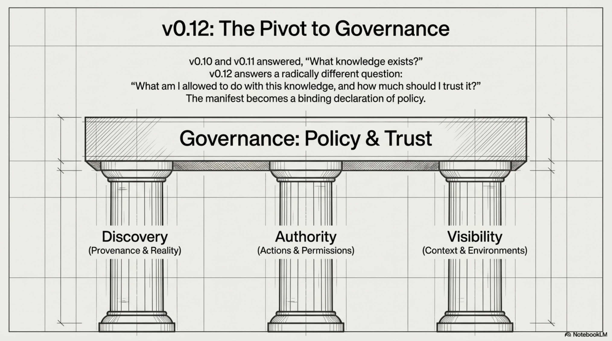

v0.10 and v0.11 answered: *"What knowledge exists and how do I find it?"* v0.12 answers a different question entirely: *"What am I allowed to do with this knowledge, and how much should I trust it?"*

The release introduces three new blocks -- `discovery`, `authority`, and `visibility` -- that work together as a governance layer. Together, they transform the manifest from a catalogue of knowledge into a declaration of policy.

---

### Pillar 1: Discovery -- How Do We Know This Is Real?

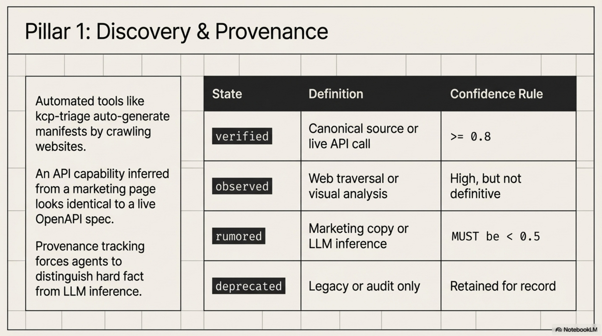

The `discovery` block (RFC-0012) adds provenance tracking to knowledge units. This matters because KCP manifests are increasingly generated by automated tooling, not hand-authored by developers.

Consider [kcp-triage](https://github.com/StigLau/kcp-triage), built by Stig Lau at Skatteetaten (the Norwegian Tax Authority). It is a 7-step LLM pipeline that crawls a website and generates a KCP manifest from what it finds. It has already generated manifests for multiple Norwegian public services.

But a capability inferred from a marketing page is not the same as a capability confirmed against a live API. Without provenance, both look identical in the manifest. The `discovery` block fixes this with four verification states:

- **`verified`**: confirmed against a canonical source -- an OpenAPI spec, official docs, a successful live API call (confidence ≥ 0.8)
- **`observed`**: found via direct technical observation (web traversal, screenshot analysis) -- high confidence, not yet definitive
- **`rumored`**: inferred from indirect sources -- marketing copy, LLM inference. The spec enforces a normative rule: rumored units **MUST** declare `confidence < 0.5`
- **`deprecated`**: was previously verified but is no longer present. Retained for audit, not live operation

---

### Pillar 2: Authority -- What May an Agent Do?

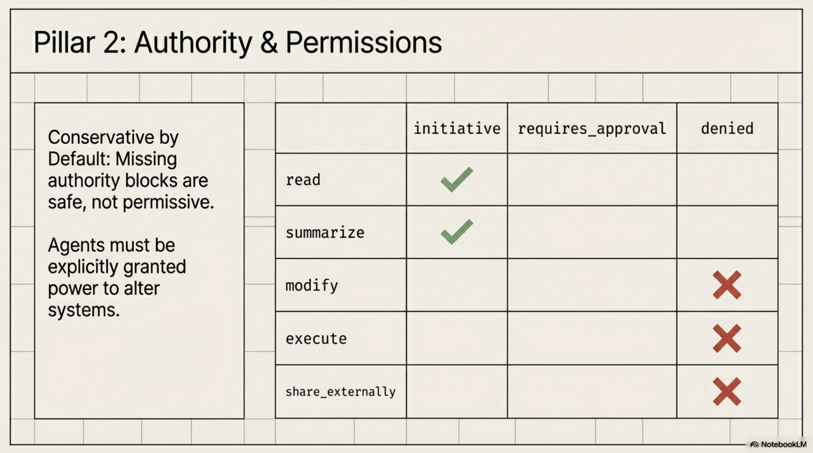

The `authority` block (RFC-0009) provides fine-grained action permissions. Three permission values:

- **`initiative`**: the agent may proceed on its own
- **`requires_approval`**: the agent must ask a human first
- **`denied`**: the agent must not perform this action

These apply to five standard actions: `read`, `summarize`, `modify`, `execute`, and `share_externally`. Custom domain-specific actions are also supported.

The defaults are intentionally conservative: `read` and `summarize` default to `initiative`; everything else defaults to `denied`. A missing `authority` block is safe, not permissive.

---

### Pillar 3: Visibility -- Context-Aware Access

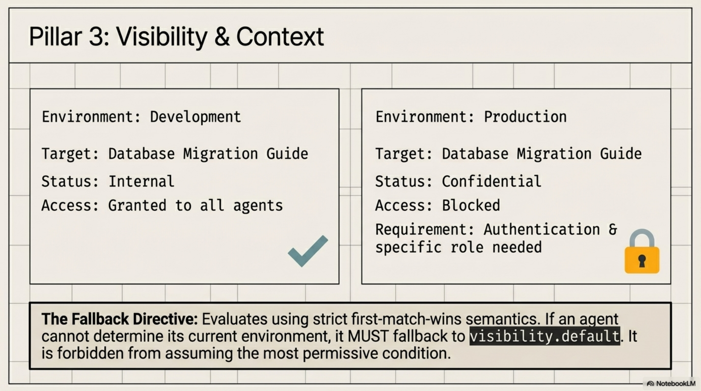

The `visibility` block makes access declarations conditional on environment and role. The same database migration guide is `internal` in development and `confidential` in production.

Conditions evaluate with **first-match-wins** semantics. The spec is strict about the fallback: when the agent cannot determine its environment, it MUST use `visibility.default`. It must not assume the most permissive condition.

---

## Putting It Together: The Nova Corp Payments API

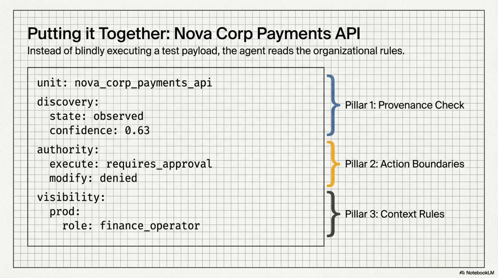

The value of these three blocks becomes clear when they work together:

```yaml
units:
  - id: payments-api
    path: docs/api/payments-v2.md
    intent: "How do I submit a payment via the Nova Corp payments API?"
    triggers: [payment, invoice, billing, submit-payment]

    discovery:
      source: web_traversal
      verification_status: observed
      confidence: 0.63
      observed_at: "2026-03-19T10:02:00Z"

    authority:
      read: initiative
      summarize: initiative
      modify: denied
      execute: requires_approval
      share_externally: denied

    visibility:
      default: internal
      conditions:
        - when:
            environment: [production]
            agent_role: [finance_operator]
          then:
            sensitivity: confidential
            requires_auth: true
        - when:
            environment: [development, local]
          then:
            sensitivity: internal
            requires_auth: false
```

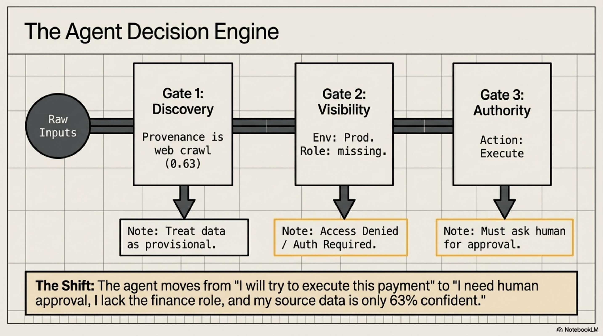

The agent moves from *"I will try to execute this payment"* to *"I need human approval, I lack the finance role, and my source data is only 63% confident."*

---

## State of the Ecosystem

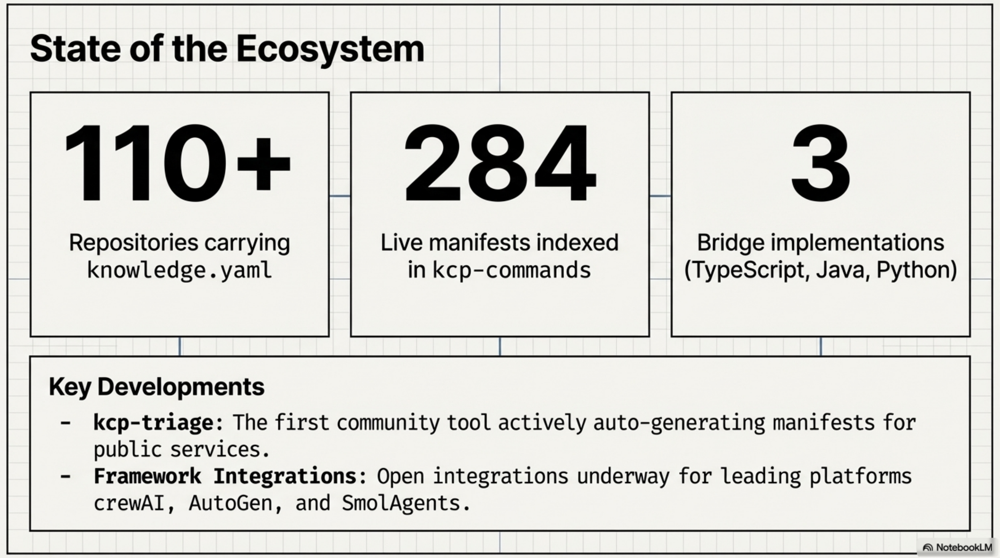

Some numbers, without embellishment:

- **110+ repositories** across the Cantara, Quadim, and eXOReaction ecosystems carry `knowledge.yaml` manifests
- **284 live manifests** indexed by [kcp-commands](https://github.com/Cantara/kcp-commands)
- **3 bridge implementations** (TypeScript, Java, Python) at full query parity
- **kcp-triage** -- the first community-built tool that produces KCP manifests automatically -- is exactly the use case the `discovery` block was designed for
- Open framework integrations underway for crewAI, AutoGen, and SmolAgents

---

## The Path Forward

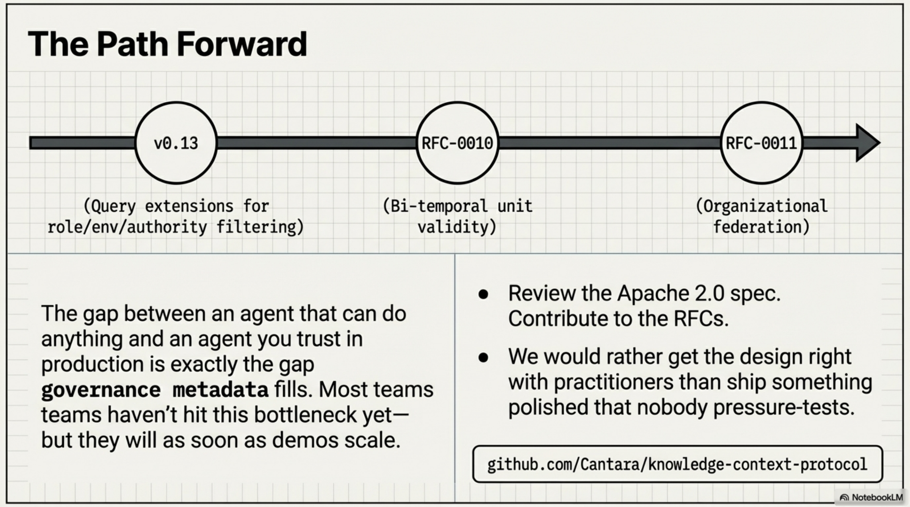

v0.12 deferred query extensions for `agent_role`, `environment`, and `authority_filter` to v0.13 -- the schema is there, but the serving layer does not filter on these dimensions yet. RFC-0010 (bi-temporal unit validity) and RFC-0011 (organisational federation) are in discussion.

The honest reflection: KCP is a small spec with a small community solving a problem that most teams have not yet hit -- but will, as agent deployments move from demos to production. The gap between "an agent that can do anything" and "an agent I trust to operate in my production environment" is exactly the gap that governance metadata fills.

If you are building agentic systems and running into the question of how your agents know what they should and should not do, the spec is there. Contributions, feedback, and hard questions are welcome.

---

The spec is open source under Apache 2.0:
[github.com/Cantara/knowledge-context-protocol](https://github.com/Cantara/knowledge-context-protocol)

CLI tooling:
[github.com/Cantara/kcp-commands](https://github.com/Cantara/kcp-commands)
