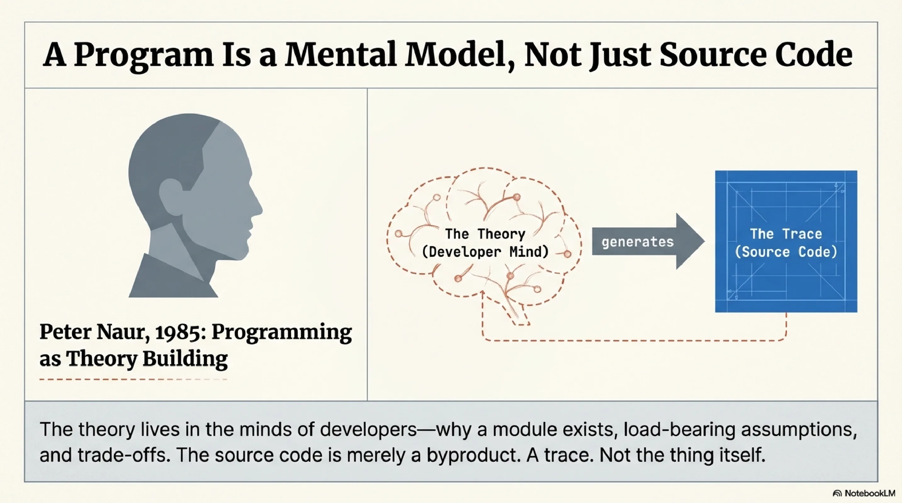
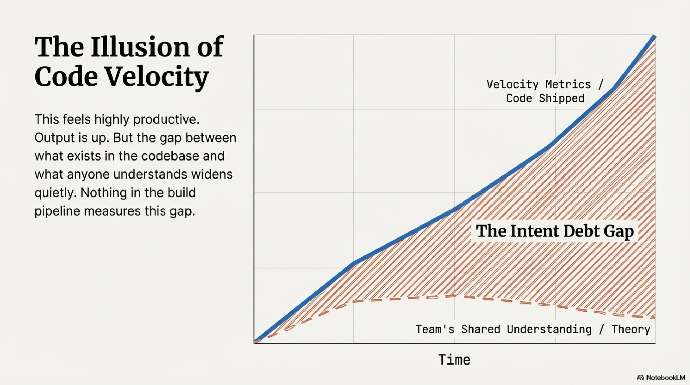
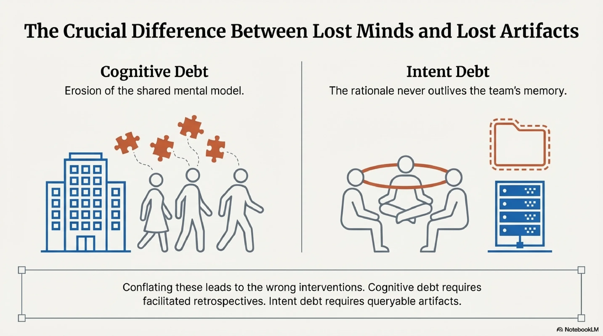
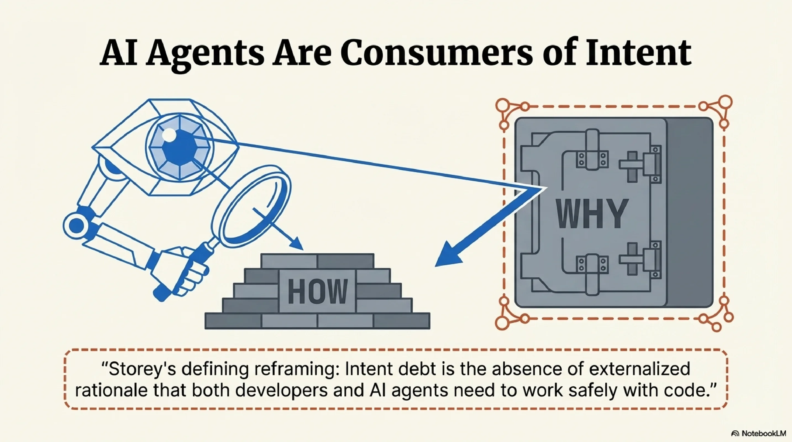
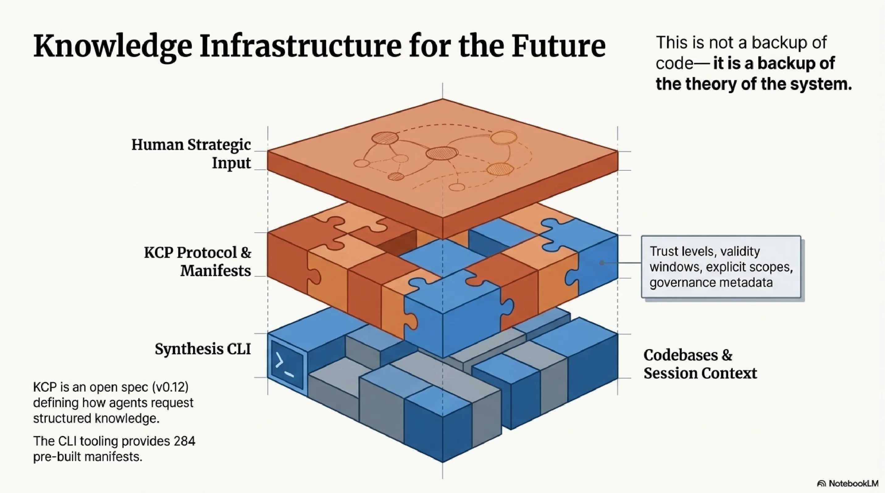
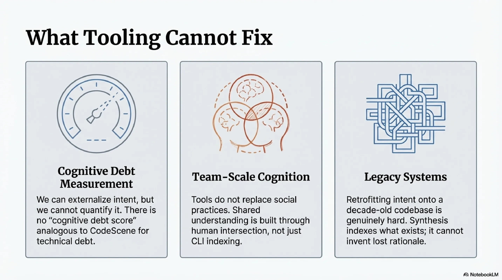
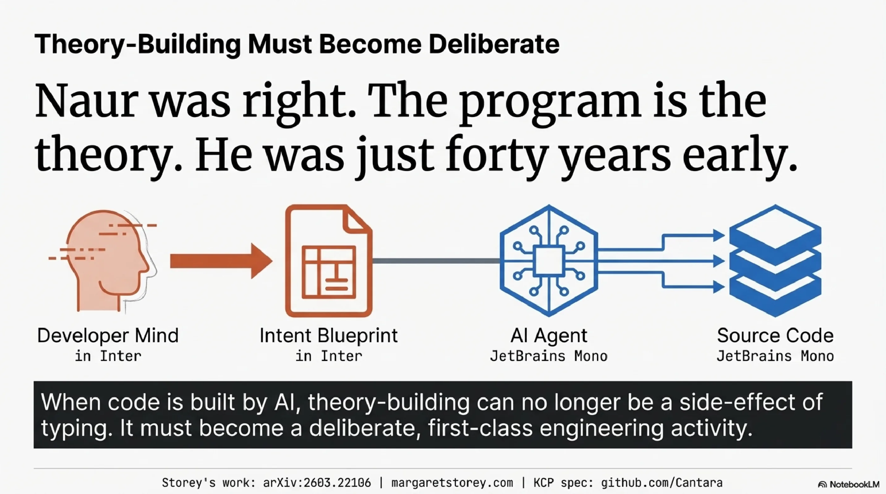

# Peter Naur Was Right in 1985, and AI Just Proved It

In 1985, the Danish computer scientist Peter Naur published a short paper called "Programming as Theory Building." His argument was simple and radical: a program is not its source code. A program is a theory — a coherent mental model of what the system does, how its parts relate to each other, and why it was built the way it was. The source code is a byproduct of that theory. A trace. Not the thing itself.

<!-- more -->

The theory, Naur argued, lives in the minds of the developers who built the system. It is what lets them answer questions no documentation covers: why this module exists, what happens if you change that interface, which assumptions are load-bearing and which are incidental. When the original team leaves, the theory leaves with them. What remains is code that can be read but not fully understood — because understanding was never in the code.

For forty years this was a beautiful philosophical observation that practitioners mostly filed away. We had other problems. Code was hard enough to write. Frameworks kept changing. The theory-building happened as a side effect of building the system, and that seemed sufficient. Writing the code *was* building the theory. The two activities were fused.

They are no longer fused.

---

Generative AI severs the connection between code-building and theory-building. For the first time in the history of software, code can exist in abundance without anyone having built the theory behind it.

This is not a hypothetical concern. I have seen it in my own work and in the work of teams I advise. An agent generates a module. The team reviews it — does it compile, do the tests pass, does the output look right. They ship it. But nobody worked through the design decisions. Nobody wrestled with the trade-offs that shaped the implementation. Nobody built the mental model of how this module relates to the rest of the system. The code is there. The theory is not.

The uncomfortable part is that this feels productive. Output is up. Velocity metrics look excellent. The gap between what exists in the codebase and what anyone understands about it widens quietly, and nothing in the build pipeline measures that gap.

---

Margaret-Anne Storey, a researcher at the University of Victoria and Canada Research Chair in Human and Social Aspects of Software Engineering, recently published work that formalises exactly this problem. Her framing has been discussed at a Future of Software Engineering Retreat organised by Martin Fowler and Thoughtworks, and her blog posts on the topic have drawn responses from Simon Willison, Martin Fowler, and a wide community of practitioners. The intellectual roots connect to Kent Beck's observations about refactoring as sensemaking, and to Adam Tornhill's work at CodeScene on technical debt quantification.

Storey's contribution is a model that distinguishes three kinds of debt. Technical debt is familiar: the code is hard to change because of structural compromises. Cognitive debt is less familiar but immediately recognisable: the team's shared understanding of the system has eroded. They have lost the theory. They can read the code but they cannot confidently reason about what it does, how their intentions were implemented, or how it can safely be changed.

The distinction that elevates this beyond taxonomy is between cognitive debt and intent debt — the absence of externalised rationale. These are not the same thing, and conflating them leads to the wrong interventions.

Cognitive debt lives in people's heads. It is the erosion of the shared mental model. Intent debt lives in artifacts — or rather, in the absence of them. It is the missing "why" that was never written down. A team can deeply understand their system and still have massive intent debt if none of that understanding has been externalised in a form that persists when they leave. The interventions are different. Cognitive debt responds to social practices: pair programming, code reviews, facilitated retrospectives. Intent debt responds to artifacts: structured documentation, typed manifests, externalised rationale that both humans and machines can query.

---

The most important aspect of this work, to my reading, is the explicit naming of AI agents as *consumers* of intent. Storey defines intent debt as "the absence of externalised rationale that both developers and AI agents need to work safely with code." This reframes the problem entirely.

An AI agent modifying a codebase with high intent debt is operating blind. It can analyse what exists. It can reduce technical debt by refactoring messy code. But it cannot reason about whether its changes align with the system's purpose, because the purpose was never captured. This is not a problem that better models solve. It is a structural problem: the information was never recorded.

---

For the past year, I have been building tooling that turns out to address exactly the problem Storey formalises. Not because I read her work first — her blog posts appeared in February, and the tooling predates them by months — but because I kept running into the same wall from the practitioner side.

The design principle I arrived at: the "why" must be machine-readable, not just human-readable. Intent debt reduction must be made concrete — not as a practice aspiration, but as an engineering constraint. If a rationale exists only in someone's head, it is unavailable to every agent that touches the code. If it exists as prose in a wiki, it drifts from reality within weeks. The only form that survives is a declaration checked into the repository alongside the code, evolving with the system. Not documentation. Infrastructure.

This points to a specific structural problem. There is a chasm between human cognition and machine execution. Humans hold the theory — the purpose, the trade-offs, the load-bearing assumptions. Machines hold the code — the syntax, the dependency graph, the test results. Neither side can reach the other without something spanning the gap. The artifacts that span it are intent artifacts: skills files that encode workflow knowledge, CLAUDE.md files that capture project-level rationale, typed manifests that declare what a system is for and how its parts relate. These are not static documents. They are the bridge.

The methodology I call Spec-Driven Development builds on this premise. The practice is to write the intent artifact first — before the code, not after — so that the agent generating the code has access to the same rationale a human developer would have built by working through the problem.

The stack that supports this has three layers. At the base, KCP — the Knowledge Context Protocol — is an open spec (v0.12) for how AI agents request and receive structured knowledge. A KCP manifest describes what knowledge exists, what it is for, how to navigate it, who may access it, and how much to trust it. Trust levels, validity windows, explicit scope declarations, governance metadata. The CLI tooling at [kcp-commands](https://github.com/Cantara/kcp-commands) provides 284 pre-built manifests. Above KCP, Synthesis indexes codebases and session context against those manifests, maintaining a queryable record of understanding as it is built.

These are not three separate tools. They are layers of one argument: that the gap between human cognition and machine execution can only be bridged by intent artifacts with real structure — and that maintaining those artifacts is not a backup of code, but a backup of the theory of the system.

---

I want to be honest about what this does not yet address.

Cognitive debt measurement: I can reduce cognitive debt by externalising intent, but I cannot quantify it. There is no "cognitive debt score" analogous to what CodeScene provides for technical debt.

Team-scale cognitive debt: the tooling I have built is oriented toward an individual practitioner working with AI agents. Storey's framework emphasises *shared* understanding — the intersection of what a team collectively knows. The social practices that build shared understanding are not things tooling replaces.

Legacy systems: spec-driven development works well when you start with specs. Retrofitting intent onto a codebase that accumulated over a decade without it is genuinely hard. Synthesis can index what exists; it cannot reconstruct the rationale that was never captured.

---

Naur's 1985 paper was largely ignored in practice because the cost of theory capture seemed to exceed the benefit. Humans built the theory and the code simultaneously. The theory lived in the team as a side effect of building the system.

AI decouples those activities. Code arrives without theory attached. The cost of not capturing theory — not externalising intent — is no longer "extra work for diminishing returns." It is intent debt that compounds silently until neither humans nor agents can reason safely about the system.

Naur was right. The program is the theory, not the code. He was just forty years early. It took AI-generated code — code that arrives without theory, at scale, every day — to make the cost of that insight's absence impossible to ignore.

The question I am sitting with, and do not have a clean answer to: what does theory-building even look like when the code is not built by the people who need to understand it? The old answer was "you build the theory by building the code." That path is closing. The new practices — whatever they turn out to be — will need to construct understanding deliberately, as a first-class activity, not as a side effect of typing.

---

*Storey's work: [arXiv:2603.22106](https://arxiv.org/abs/2603.22106). Her blog: [margaretstorey.com](https://margaretstorey.com).*
*KCP spec and tooling: [github.com/Cantara](https://github.com/Cantara).*
