# The Faster Pencil

*AI does not remove the hard part of any job. It moves it — and makes it harder to ignore.*

*Based on a conversation between two software developers, March 2026.*

---

Two developers were talking late one night about what AI had actually changed in their work. They had both been using it for years. They were good at it. And what they kept coming back to was something that surprised them: the more capable the tool got, the more it demanded of them — not less.

This essay is built on that conversation. But the idea they landed on has nothing to do with software. It applies to any job where thinking is the work.

<!-- more -->

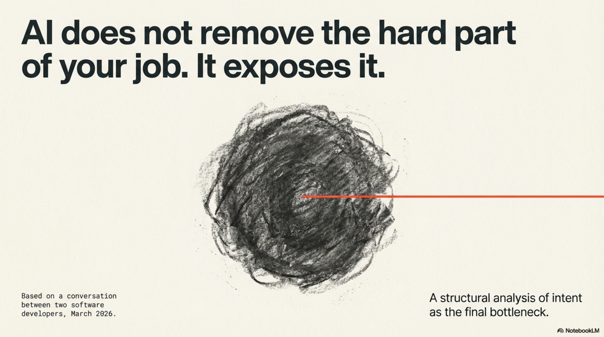

---

Here is the simplest way to say it: AI is a very fast pencil. It writes, draws, calculates, and composes at a speed no human can match. But a fast pencil still needs someone who knows what to write. And knowing what to write — really knowing, with enough clarity to say it precisely — turns out to be the hard part of most jobs. It always was. We just had somewhere to hide it before.

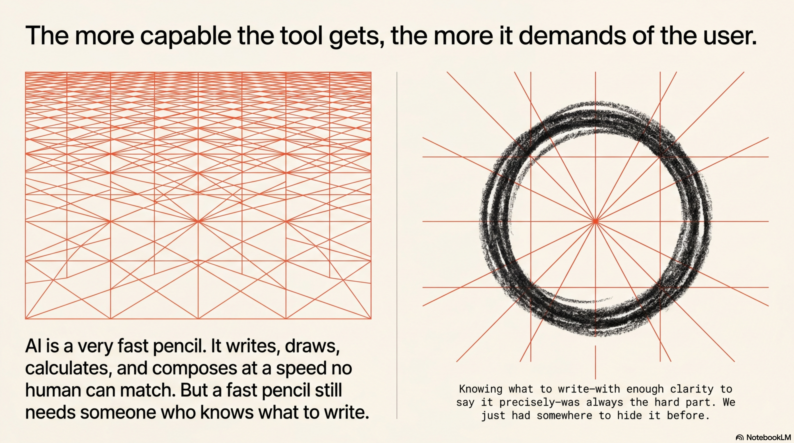

When the work was slow, vague thinking had time to become clearer. You figured out what you meant while you were doing it — drafting the report revealed what the argument actually was, building the prototype showed you what the design should be, writing the brief helped you understand the problem. The friction of making something was also the process of understanding it. AI removes that friction. Which means the understanding has to arrive before the work starts, not during it. It has to be explicit. It has to be declared.

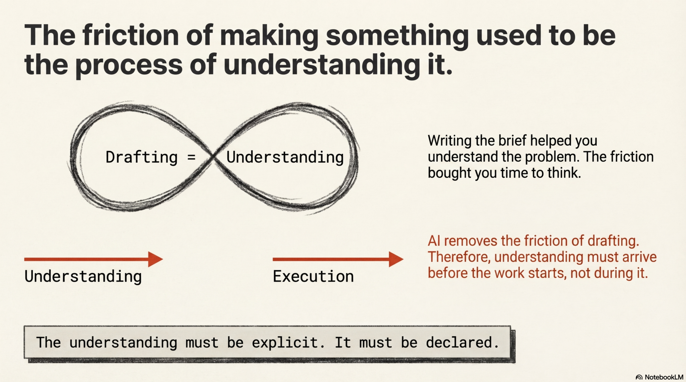

*You don't become an author by learning to spell.*

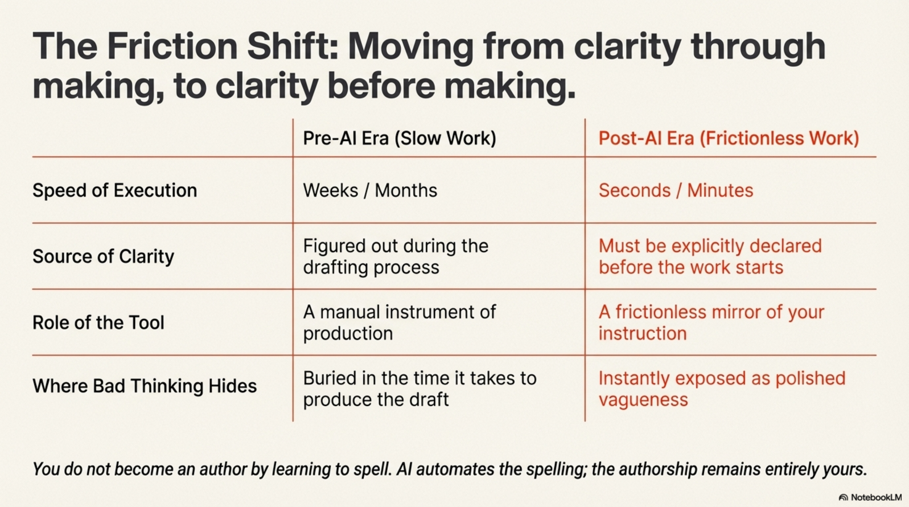

---

A lawyer who can file a perfect brief but cannot identify which facts matter will lose. A doctor who can recite every guideline but cannot listen to a patient will misdiagnose. A manager who can produce a flawless strategy deck but has no real model of how their organisation works will watch it fail. In each case, the technical skill — the spelling, so to speak — was never the point. It was just the means of expressing the point. AI takes over the means. The point is still yours.

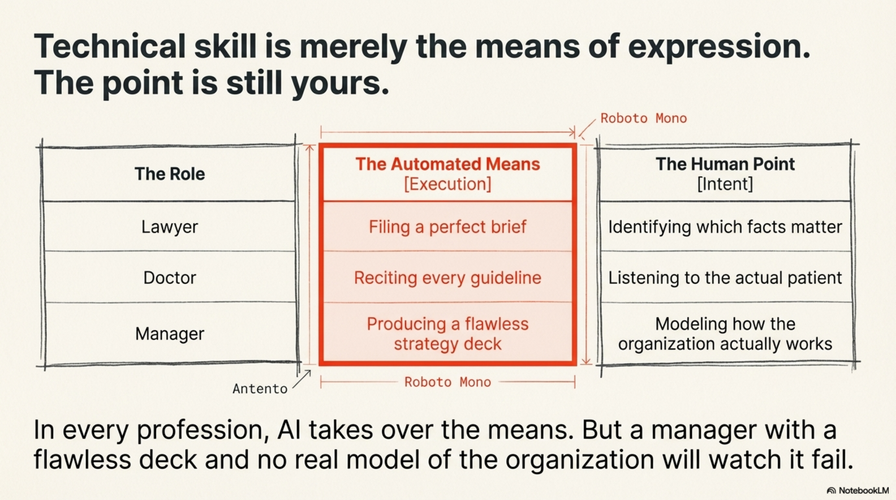

---

Build a chess algorithm and forget to tell it the goal is to win. It will still move pieces correctly — and on pure statistics, white will capture a pawn more often than black. Now tell it to win. Set it against itself. You get the same results, but something completely different happens: you get chess. An actual game, not random legal moves. The difference is not in the algorithm. It is in the declared intent. Without a goal, the system optimises for whatever it can measure. With one, it plays to win. Every AI system works this way. The quality of what it produces is bounded, always, by the quality of what you wanted.

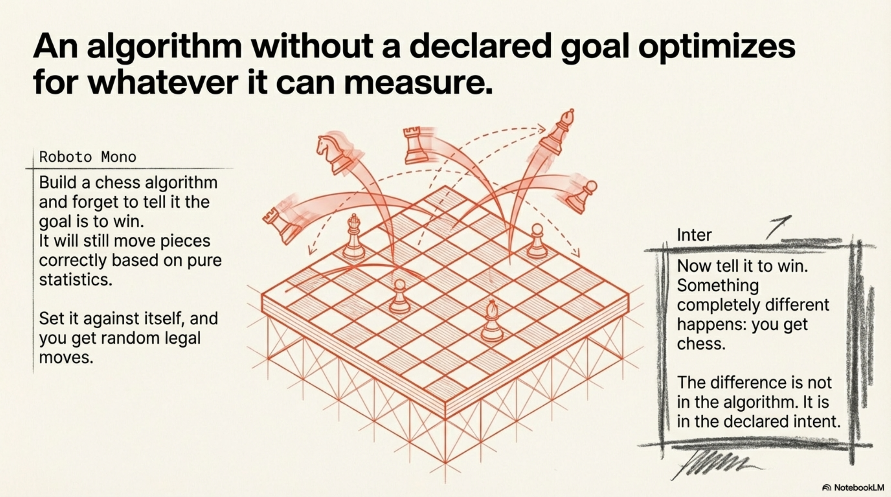

Gödel showed that every formal system — every set of rules, including every algorithm — has at least one truth it cannot reach from within itself.[^godel] Something from outside must supply it. In chess without a declared goal, that missing truth is the point of the game. The algorithm cannot invent it. Only a person can bring it. Output is a crystallisation of thought, not a replacement for it.[^naur] Consciousness is what fills the gap that no formal system can close on its own.[^penrose]

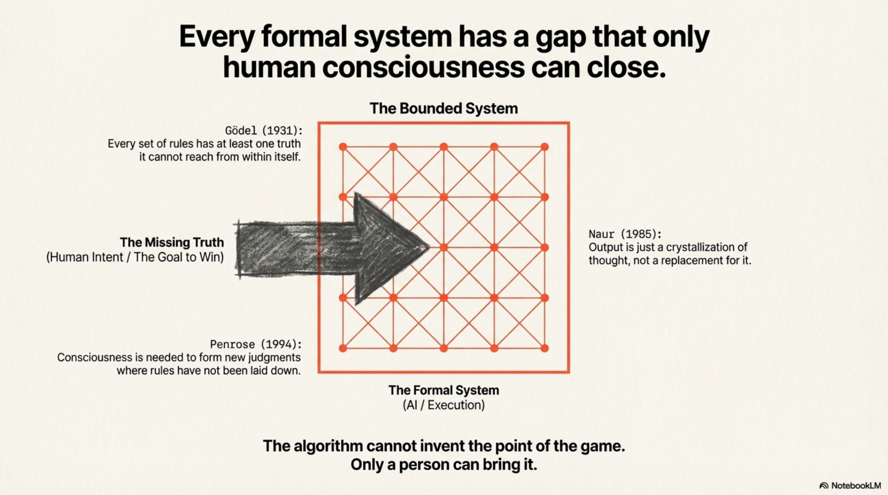

---

This is the part that is being missed in almost every conversation about AI and work. The assumption — stated or not — is that the difficult part of most jobs was always the execution: producing the document, writing the code, generating the analysis. Master the tool, and the problem is solved. But execution was never where the difficulty lived. It was where the difficulty showed up. The difficulty itself was always earlier: deciding what the work was actually for, what good would look like, what the real problem was beneath the stated one. That part has not been automated. It has been exposed.

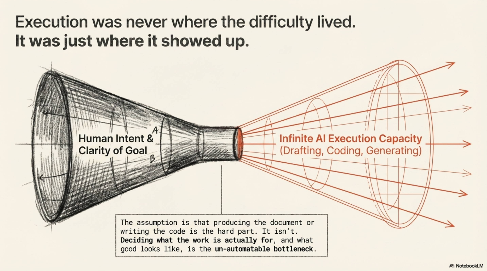

When you hand a task to AI without knowing exactly what you want, the system does not hesitate or push back. It produces something — fast, confident, and shaped entirely by whatever intention it could infer from what you said. If your intention was clear, the output is useful. If it was vague, the output is polished vagueness. The tool is a mirror for the quality of your thinking, and it shows you the reflection very quickly.

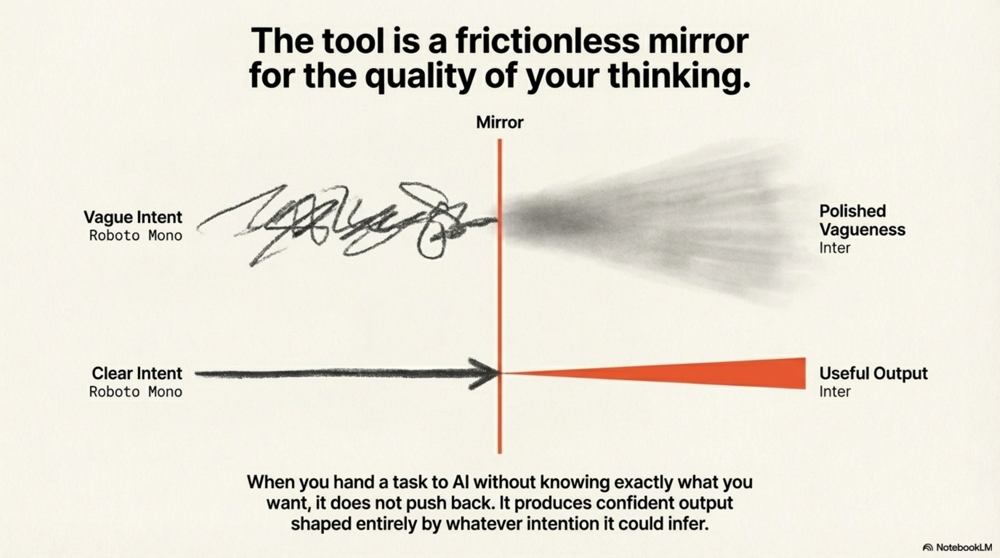

If clarity does not start high, the result is an instant flatline. Execution is immediate. The ceiling is wherever your intent was when you started.

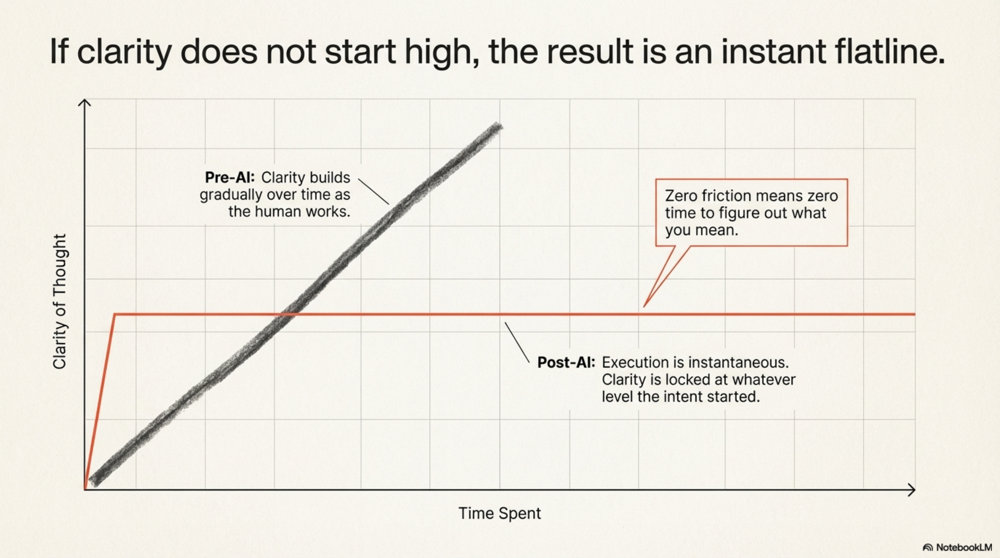

*The requirement to understand what you want goes up, not down.*

---

The people who will use AI well are the ones who understand this. They will get sharper about what they are trying to achieve, not looser. They will ask harder questions before starting, not fewer. They will invest more in the clarity of their goals, because they will understand that goals are now the bottleneck — the one thing that does not happen automatically, and the one thing that determines whether all the speed and capability of the tool produces anything worth having.

The people who will struggle are the ones who took the promise literally — that the hard part has been automated, that you can hand the problem to the machine and collect the answer. They will produce faster, more polished versions of whatever they were already producing. If the thinking behind it was good, the results will be better. If the thinking was not there, they will discover that very quickly too.

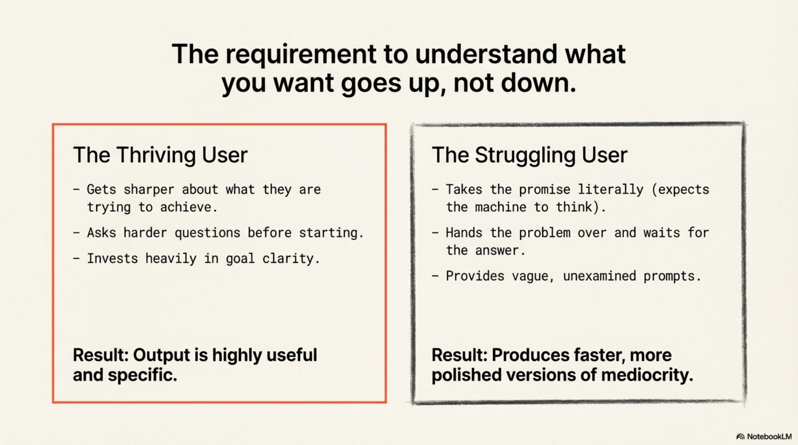

---

The two developers talking late at night had already figured this out — not as a theory, but as a practical fact they had both run into independently. AI made them faster at the parts of their job that were always mechanical. It made them more exposed on the parts that were never mechanical. And over time, it made them better at the thing that had always mattered most: being precise about what they actually wanted before they started.

That is the real shift. Not that the tool is powerful — it is — but that its power flows entirely through whoever is using it, and only as far as their understanding reaches. The pencil got faster. Whether you have something to write is still entirely up to you.

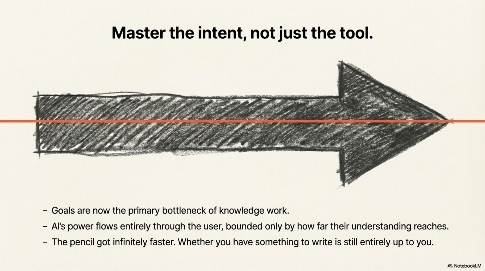

---

## What the Infrastructure Made Possible

*A note from Thor Henning Hetland*

I was the other developer in that conversation.

Leif had the thesis. His AI built the slides and the prose. My contribution was arguing with it — and then going away and thinking about what was missing.

The deck identifies the bottleneck precisely. What it doesn't fully address is how intent develops in the first place.

I've written about Naur's 1985 insight [elsewhere](./2026-03-25-naur-was-right.md). His claim: a program is not its source code, it's a theory — a mental model of what the system does and why. The source code is a trace. The theory lives in people. When they leave, the theory leaves with them.

The judgment to bring good intent — to know what can't be specified, which assumption is load-bearing, where the system will break — is earned through execution. Through being wrong. Through building something and discovering that the assumption you never articulated was the one everything was balanced on.

The friction that used to develop clarity also developed *practitioners*. Remove it entirely and you get fast, confident specifiers who've never been proven wrong by their own implementation. The pencil is faster. The hand holding it has less scar tissue.

This is the development gap the current wave is quietly opening. Not immediately. Over years.

---

The conversation itself was possible because of infrastructure. It drew on Naur, Penrose, Searle's Chinese Room, six months of KCP development, and work done that same morning on German regulatory architecture for a client — all while ExoCortex handled three other simultaneous workstreams.

ExoCortex is the infrastructure I've been building — together with Claude Code — for the past year. Skills that encode practitioner judgment. Manifests that persist intent across sessions. A synthesis layer that makes prior context queryable, so the next session starts where the last one ended.

The conversation "shouldn't have been possible" — it drew on too much dispersed context for any single human working session. It was possible because the knowledge had been made explicit. Encoded. Persistent.

That's what I mean by knowledge infrastructure. Not documentation. The encoded theory that makes the next conversation richer than the one before.

Leif's authorship disclosure is the point of his essay. Building the infrastructure that makes those conversations possible is mine.

---

[^naur]: Peter Naur, "Programming as Theory Building," 1985 — the idea that the output of any knowledge work is a crystallisation of the thinking behind it, not a replacement for it.
[^penrose]: Roger Penrose, *Shadows of the Mind*, 1994 — "Somehow, consciousness is needed in order to handle situations where we have to form new judgements, and where the rules have not been laid down beforehand."
[^godel]: Kurt Gödel, *On Formally Undecidable Propositions*, 1931 — Gödel proved that in any logical system powerful enough to describe basic arithmetic, there will always be true statements that the system itself cannot prove. In other words: every set of rules has at least one question it cannot answer from within itself. Something from outside the system is always needed. Penrose used this to argue that human understanding works differently from any algorithm — and that consciousness is precisely what fills those gaps that no formal system can close on its own.

---

*The text of "The Faster Pencil" was written by Claude AI under instruction from Leif Auke — the party that had the intent. The ideas are his. The words are the machine's. Which is, more or less, the point of the article.*
