# The Squash Merge Murders

**Six PRs. Two TypeScript felonies. One rebase cascade that broke the laws of git. And then the twist.**

*Case file opened: Week 14, April 2026*

---

There is a week every year when Norway simply stops. The parliament empties. The highways fill with Volvos heading north. The cabin doors open to air that hasn't been breathed since February. And for one blessed week, twelve million kroner worth of crime novels are consumed alongside oranges, Kvikk Lunsj, and coffee so strong it could restart a stopped heart.

Påskekrim — Easter crime. It's a national tradition. You're supposed to read about murders. You're not supposed to commit them.

The Investigator had other plans.

<!-- more -->

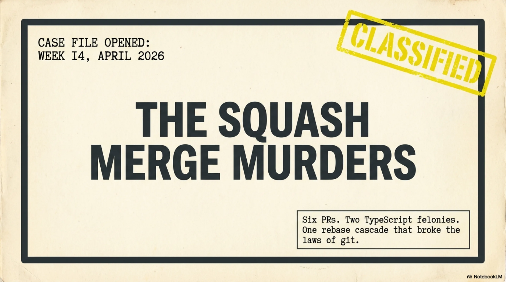

---

## The Tradition of Påskekrim

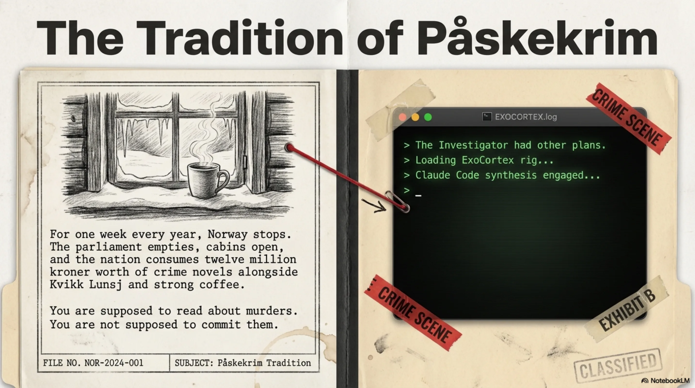

The first case was supposed to be routine. A race timing platform — call it HoldTid AS — needed menus wired up, race bib management, and a discount CRUD that had been on the backlog since February. The kind of work that smells like Monday morning and tastes like reheated oatmeal.

The ExoCortex rig hummed. Claude Code fed context through Synthesis. The implementation moved with the eerie fluidity that still, even after months of working this way, felt like it should trigger some alarm somewhere. Frontend. Backend. Business logic. Tests.

Three pull requests. Clean CI on all three. Merged before the first cup of coffee had cooled.

The Investigator stood at the window, watching late-season snow cling to birch branches like a deployment that refuses to leave staging. Something about the morning felt wrong. Not the code — the code was fine. The *ease* was wrong. In påskekrim, the first chapter is never where the real crime happens. The first chapter is where the author establishes trust so they can betray it later.

The second browser tab was already open.

---

## The Deceptive Calm of HoldTid AS

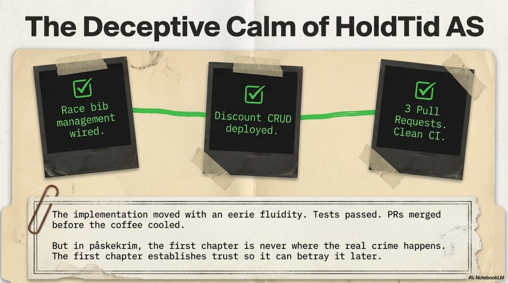

---

## Dead on Arrival at TillitNett

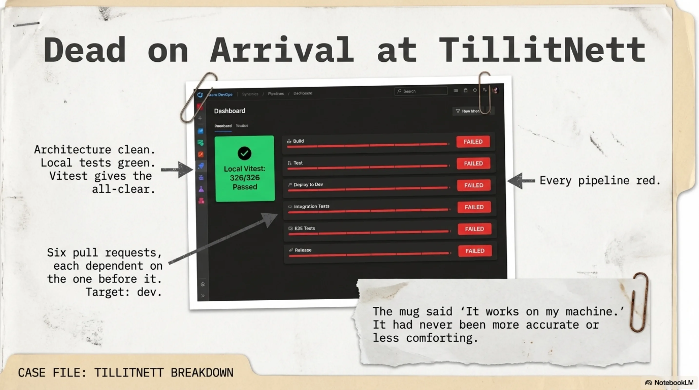

Six pull requests sat in Azure DevOps, stacked like a column of suspects in an interrogation room. All targeting `dev`. All part of a simulator system for a B2B trust-scoring platform — call it TillitNett — built across six branches, each one dependent on the one before it. The architecture was clean. The local tests were green. Vitest had given the all-clear: 326 tests, every one of them passing.

The Investigator pushed to ADO, opened the CI dashboard, and went to refill the coffee.

When the Investigator returned, every pipeline was red. All six. Dead on arrival.

The mug said "It works on my machine." It had never been more accurate or less comforting.

---

## The Accomplice Matrix: Runtime vs. Forensics

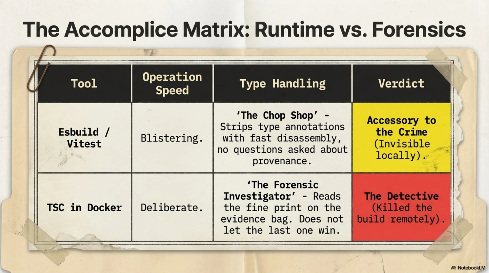

---

## Murder Weapon #1: The Subtle Assassin

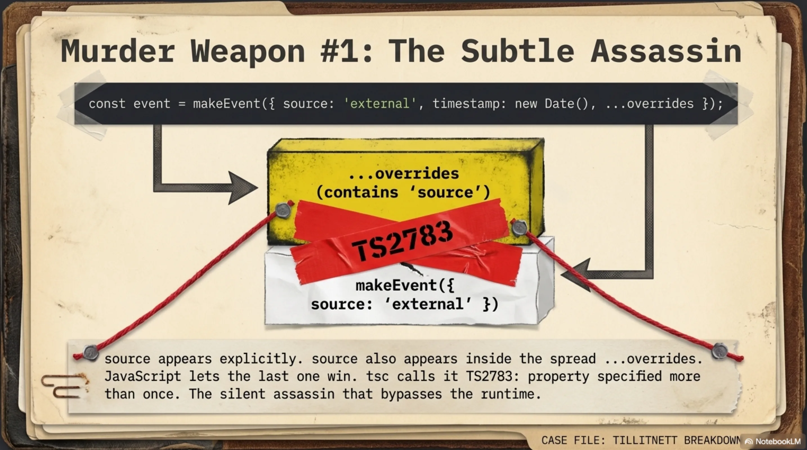

The first murder weapon was subtle — the kind of crime that only a certain type of detective would even recognize as violence.

In a test helper function called `makeEvent`, properties were being specified explicitly:

```typescript
const event = makeEvent({
  source: "external",
  timestamp: new Date(),
  ...overrides
});
```

`source` appears in the object literal. `source` also appears in `overrides`, which gets spread on top. TypeScript error TS2783: property specified more than once when using a spread. Seems pedantic. Seems like the kind of thing a reasonable language would quietly resolve by letting the last one win.

And here's the thing — a reasonable runtime *does* quietly resolve it. JavaScript doesn't care. Esbuild doesn't care. Vitest, which uses esbuild under the hood to strip type annotations at the speed of indifference, ran every test without blinking. Esbuild treats TypeScript the way a chop shop treats a stolen car: fast disassembly, no questions about provenance.

326 tests. All green. The crime was invisible at the scene.

But the CI pipeline doesn't use esbuild. The CI pipeline runs `tsc` inside a Docker container, and `tsc` is a different kind of detective entirely. `tsc` is the forensic investigator who reads the fine print on the evidence bag. `tsc` does not let the last one win. `tsc` calls it what it is — and kills the build.

Six pipelines. Same error. The silent assassin.

---

## Murder Weapon #2: Identity Fraud at Velocity

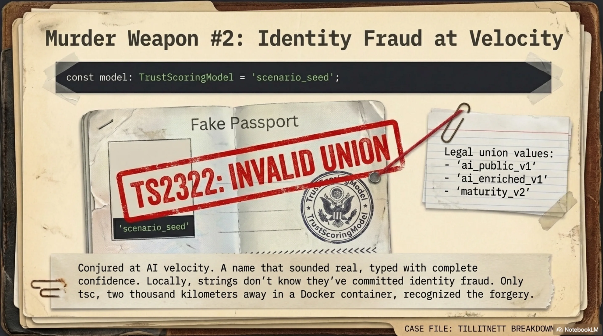

The second murder weapon was bolder and, in its own way, more disturbing.

Deep in `orgSeeder.ts`, a seeder file for populating test organizations with realistic data, a single line:

```typescript
const model: TrustScoringModel = "scenario_seed";
```

`TrustScoringModel` is a union type. Three legal values: `'ai_public_v1' | 'ai_enriched_v1' | 'maturity_v2'`. The value `"scenario_seed"` does not exist in that union. It has never existed. It was conjured at velocity — a name that *sounded* like it should be a thing, typed with complete confidence into a file where confidence is not a substitute for type safety.

TS2322.

If TS2783 was the subtle assassin, TS2322 was the suspect who walks into the police station with a passport that has someone else's photo and their own name, and is genuinely surprised when this doesn't work.

And again — esbuild didn't catch it. Vitest didn't catch it. Locally, the code ran perfectly, because at runtime, `"scenario_seed"` is just a string, and strings don't know they've committed identity fraud. Only `tsc` knew. And `tsc` only ran in Docker. Two thousand kilometers away, in a data center that has never seen an orange or a Kvikk Lunsj.

---

## The Setup for a Massacre

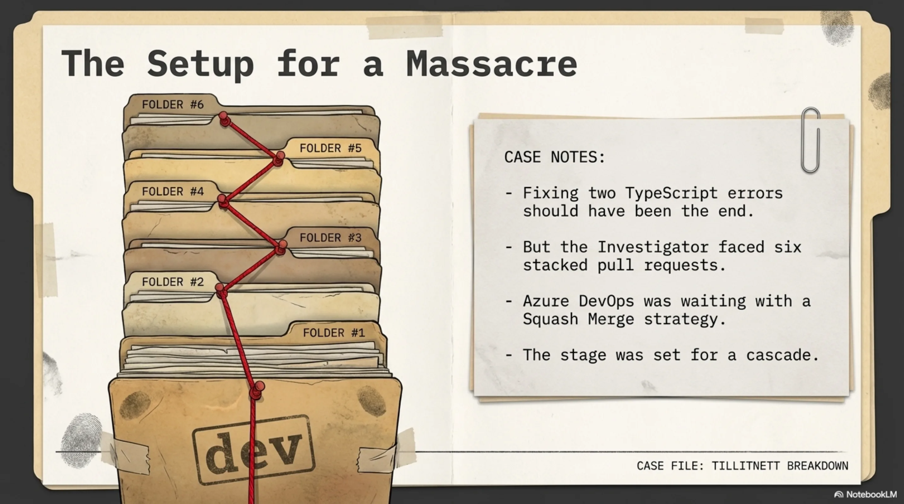

---

## The Squash Merge Cascade

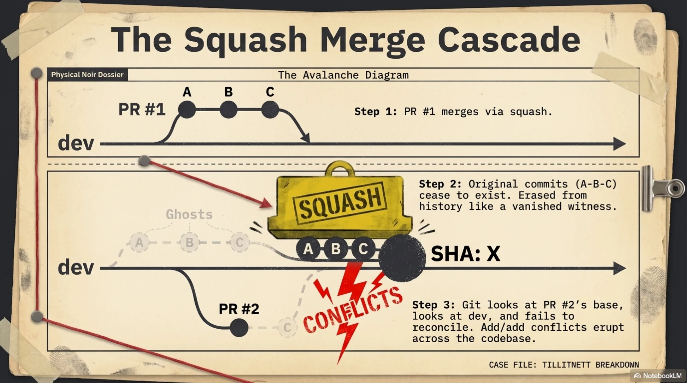

Fixing two TypeScript errors should have been the end of it. Two fixes, push, move on, pour more coffee. But the Investigator was not dealing with two errors in isolation. The Investigator was dealing with six stacked pull requests and Azure DevOps's squash merge strategy, and this is where the påskekrim takes its darkest turn.

When PR #1 merged via squash, ADO did what squash merges do: it took the entire commit history of the branch — five, six, maybe eight commits of careful incremental work — and crushed them into a single new commit with a new SHA. The original commits ceased to exist in the target branch's history. Erased. Like a witness who testifies and then vanishes from the court records.

PR #2 was built on PR #1's original commits. Those commits were now ghosts. Git looked at PR #2's base, looked at `dev`, and could not reconcile the two histories. Add/add conflicts erupted across every file that both branches had touched.

The fix:

```bash
git rebase dev
git rebase --skip   # for commits already squash-merged upstream
git push --force-with-lease
```

Then do it again for PR #3. And #4. And #5. And #6. Each rebase peeling back the layers of a cascade that the squash merge had set in motion like an avalanche triggered by a single misplaced footstep.

---

## The Grind

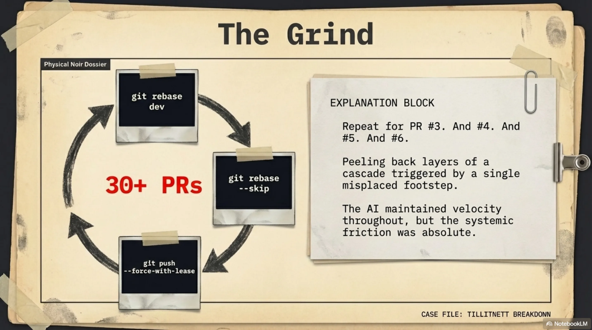

By the time all six branches were rebased, force-pushed with lease, re-reviewed, and merged, the sprint counter read thirty-plus PRs. The ExoCortex maintained velocity throughout. But the friction was real.

*`tsc --noEmit` in the pre-push hook. Let the forensic investigator work at the scene, not at the lab two hours later.*

---

## The Cold Case: Knowledge Control Protocol

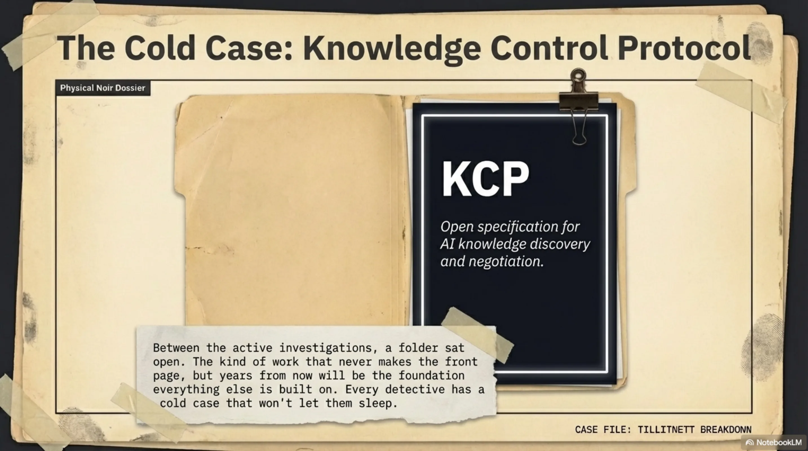

Between the active investigations, a folder sat open on the desk. It was always open. The Knowledge Control Protocol — KCP — an open specification for how AI systems discover, negotiate, and serve structured knowledge. The kind of work that never makes the front page. The kind of work that, years from now, will be the thing everything else was built on.

Every detective has a cold case. The one that doesn't close but won't let you sleep.

---

## Vendepunktet: The Twist

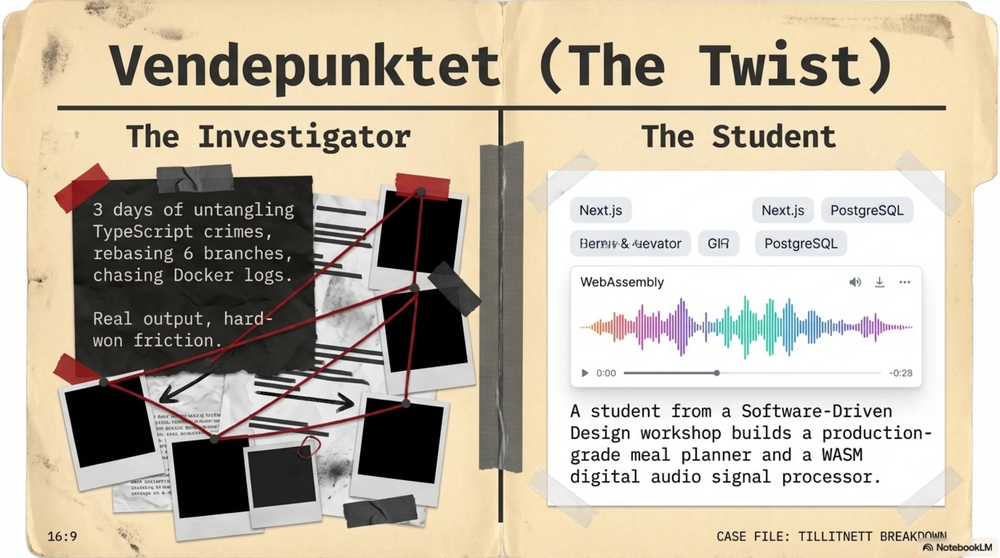

The Investigator runs workshops. Software-Driven Design — the methodology. How to think architecturally, how to decompose problems, how to let AI-augmented tooling handle implementation velocity while the human handles intent. Mid-week, snow still falling, a group of young developers gathered to learn.

One of them went home and built a meal-planning application.

This requires context to understand why the Investigator stared at the screen for a long time afterward.

The application generates meal plans and automatically produces Norwegian grocery shopping lists using a real Norwegian grocery API. Full-stack, production-grade: Next.js, TypeScript, PostgreSQL on Neon, deployed on Vercel. Live. Working. You can use it to plan your dinners and it will tell you what to buy at the store and what it costs.

---

## The Greenfield Evidence

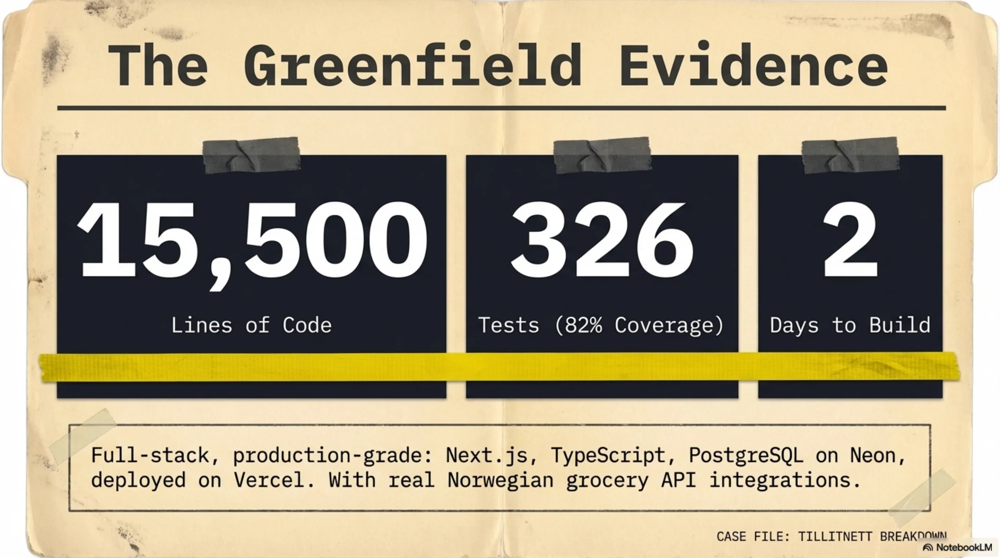

Fifteen thousand five hundred lines of code. Three hundred and twenty-six tests. Eighty-two percent test coverage. Built in two days.

A second student built a digital audio simulator running in the browser via WebAssembly — real DSP signal chain processing, not a wrapped library, but actual signal processing computed in WASM and rendered through the Web Audio API. The kind of project that, even with AI augmentation, requires the developer to genuinely understand what a signal chain is.

---

## The Synthesis: Evidence of Scale

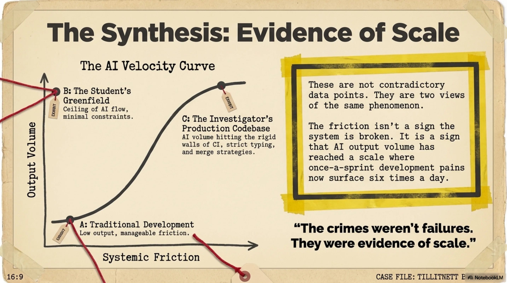

Here is the twist — the one the påskekrim saves for the last pages:

**The crimes were the evidence that the system works.**

The CI failures, the merge conflict cascades, the type errors hiding behind esbuild's type-stripping — none of these are symptoms of dysfunction. They're symptoms of *scale.* When you push 30+ PRs in a sprint, when you build simulator systems across six stacked branches, when a student ships 15,500 lines in a weekend — the normal friction points don't disappear. They multiply.

The TS2783 errors existed because the Investigator was moving fast enough to generate code patterns where property duplication through spread operators became a statistical inevitability. The rebase cascade existed because output volume made stacked PRs necessary. The TS2322 invented-identity error existed because at high velocity, the boundary between "values that exist" and "values that should exist" gets blurry.

The solution was never to slow down. The solution was what it always is in detective work: better forensics at the scene. A `tsc --noEmit` pre-push hook. Let the type checker run locally before the evidence ships to CI.

These are not contradictory data points. They are two views of the same phenomenon. The student's numbers are what the ceiling looks like — greenfield, minimal friction, methodology clicking cleanly. The Investigator's week is what it looks like inside a production codebase with real CI, real type checking, real merge strategies, and six branches that all need to land in the right order.

The friction isn't a sign that something is broken. The friction is a sign that the output volume has reached a level where once-a-sprint development pain points now surface six times a day.

---

## Etterskrift: April 1st

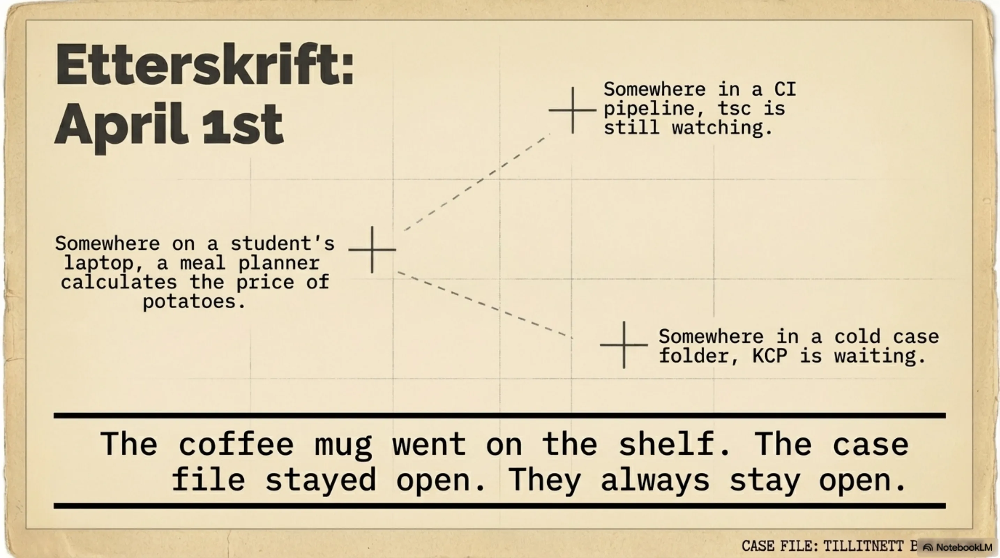

It was April 1st when the last PR merged. Nobody laughed.

The snow had stopped. The cabin was quiet. The oranges were eaten and the crime novels were finished — the fictional ones, anyway.

The Investigator rinsed the coffee mug, closed the laptop, and looked out at the birches. Somewhere in a CI pipeline, `tsc` was still watching. Somewhere on a student's laptop, a meal planner was calculating the price of potatoes at KIWI. Somewhere in a cold case folder, KCP was waiting.

The mug went on the shelf. The case file stayed open.

They always stay open.

---

*Filed under: Week 14, 2026. Case status: Resolved, pending new evidence. Method: Augmented.*

*No TypeScript types were permanently harmed in the making of this blog post.*
