# The Tool I Didn't Plan to Build: Synthesis, Ten Weeks Later

In late January 2026, I had a problem I hadn't anticipated. I had just finished building lib-pcb — a Java library for parsing eight proprietary PCB binary formats. 197,831 lines of code. 7,461 tests. Eleven calendar days. The AI agent (Claude Code) wrote most of it. The methodology worked exactly as designed.

And then I couldn't navigate any of it.

<!-- more -->

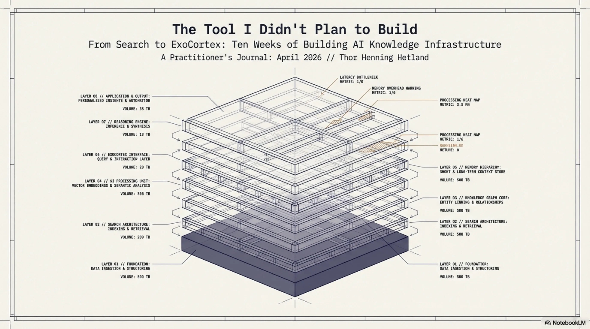

Not because the code was bad. It was well-structured. Good test coverage. Clean packages. But 691 new files per day — nearly 18,000 files across the project when you include tests and tooling — and I was spending more time *finding things* than understanding them. The AI could generate code faster than I could locate the output. This is a stupid problem. It is also, if you think about it for thirty seconds, the *inevitable* problem.

Every jump in creation speed eventually produces a navigation crisis. When monks hand-copied books, nobody needed a library catalog. When the printing press arrived, catalogs became essential. When digital publishing exploded, search engines became infrastructure. I had given myself a personal printing press for code, and I was drowning in the output.

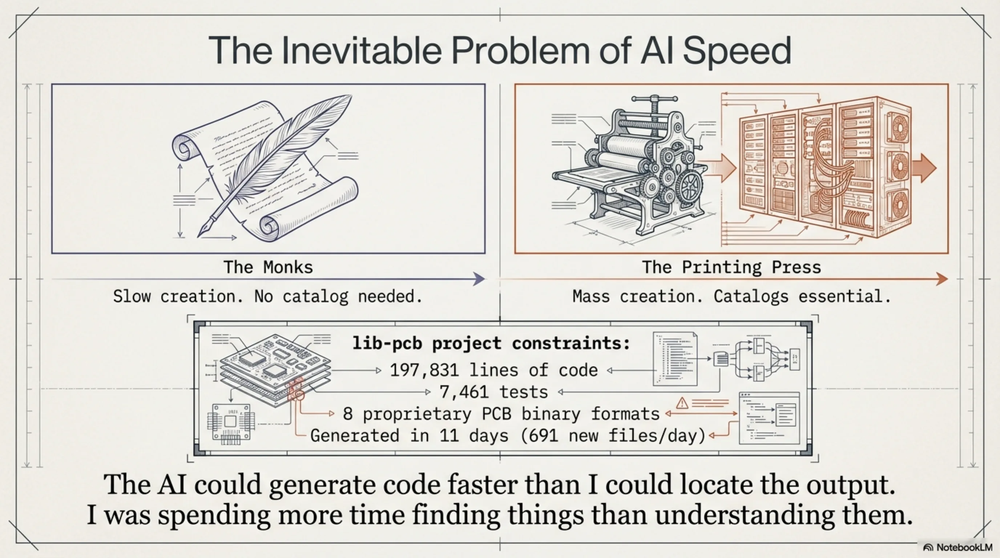

Synthesis started as search. Here is what it became, and why each step was forced by a failure of the previous one.

---

## The Obvious Solution: Full-Text Search

The first version was simple. Index everything — code, docs, PDFs — with Apache Lucene. Make it searchable in under a second. Java 21, picocli for the CLI, SQLite for persistence, Flyway for schema migrations. Fat JAR, runs from a launcher script. Standard engineering for a standard problem.

It worked. 200-300 files per second indexing speed. Sub-second search across the full workspace. Eleven workspaces eventually, 65,905 files total at last count. The core tech was solid from day one. Lucene is a well-understood library, and I wasn't trying to be clever with the indexing.

I called it Synthesis because the goal wasn't raw search — it was synthesizing understanding from a codebase too large to hold in your head. The name turned out to be more accurate than I knew, but in ways I didn't expect.

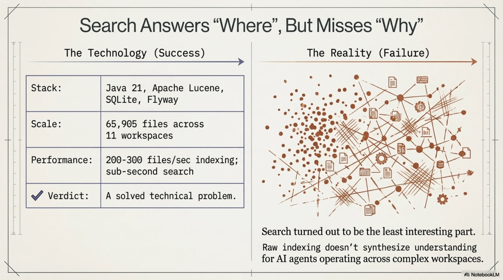

Within two weeks I had a working CLI. Within four weeks I had 50+ subcommands. Today, v1.27.0, 82 command classes in the CLI package, 267 test files, 4,200+ unit tests. Three fat JARs: `synthesis.jar` (CLI), `synthesis-mcp-server.jar` (MCP integration for Claude Code), `synthesis-lsp-server.jar`.

But the search — the reason I built this thing — turned out to be the least interesting part.

---

## The Benchmark That Changed Everything

I am an architect by training. Thirty-plus years of enterprise systems. When I build something, I want to know if it actually works, not whether it *feels* like it works. So I benchmarked Synthesis against itself.

Phase 3 ran in late January and February 2026. Simple setup: give Claude Code tasks of varying difficulty, measure tool calls (a proxy for how much work the agent has to do to find what it needs). Three conditions:

- **Baseline** (no Synthesis): 14.2 tool calls average.
- **Full** (Synthesis CLI + knowledge files): 9.8 tool calls. That's -31%.
- **Skills-only** (context files loaded, no search at all): 7.5 tool calls. That's **-47%**.

Skills-only — which doesn't even use Synthesis for search — beat the full setup. By a lot.

I stared at this for a while. The explanation, once you see it, is obvious: when a CLAUDE.md file or a skill YAML file *names* the relevant files and their locations, the agent doesn't search. It teleports. It reads the context, sees "the Jenkins config is at `ci/Jenkinsfile`", and goes straight there. Search adds overhead when you already know where to look.

I called this "the warm task problem." For tasks where the answer is already referenced in your context files, search is not just unnecessary — it's actively slower than having the agent read a well-organized skill file.

### The Reversal

Phase 4 tested what happens when the answer is *not* in any skill file. Cold tasks — where the relevant class names don't appear in any context document.

Skills-only became the *worst* performer. Worse than Baseline. Worse than having no help at all.

Here's why: skill files don't just give the agent information. They give it *confidence*. When a skill file says "the authentication logic is in `auth/SecurityManager.java`", the agent trusts that. It goes there. If the actual answer is in `util/TokenValidator.java` — a file no skill mentions — the agent will spend extra cycles looking in the wrong place, guided by its own context files, before eventually broadening its search. The skill files become a trap.

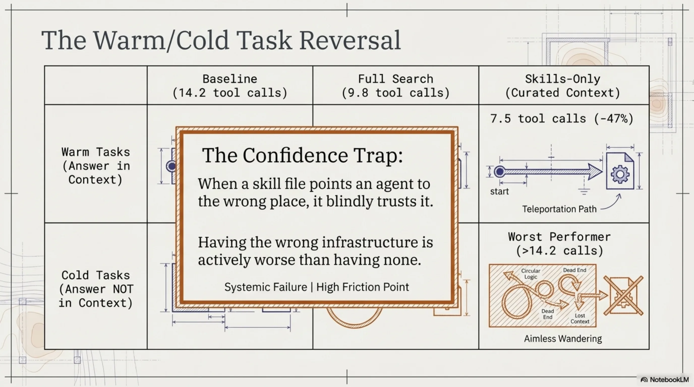

This was genuinely humbling. I had built a knowledge infrastructure system, benchmarked it, and discovered that for a meaningful category of tasks, having *no* knowledge infrastructure was better than having the wrong knowledge infrastructure. The skills didn't just fail to help — they actively hurt.

### Phase 5: MCP Changes the Game

Phase 5 ran in February 2026. By this point I had built a Model Context Protocol (MCP) server for Synthesis — a way for Claude Code to call Synthesis tools directly, without going through the CLI. Six conditions, systematically harder tasks:

| Condition | Avg tool calls | vs Baseline |
|---|---|---|
| Baseline | 8.9 | -- |
| Knowledge files only | 7.6 | -15% |
| CLI (guide skills, no MCP) | 9.9 | +11% |
| MCP (old descriptions) | 5.8 | -35% |
| **MCP + system prompt hint** | **5.3** | **-40%** |
| MCP + rewritten descriptions | 7.6 | -15% |

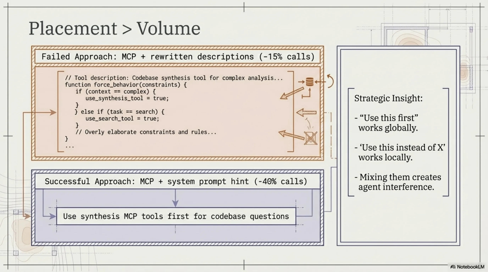

Two findings stood out.

First: a one-line system prompt hint — literally just "Use synthesis MCP tools first for codebase questions" — beat elaborate description rewrites as a global policy. A single line in the right place outperformed carefully crafted tool descriptions. This is context engineering in miniature: placement matters more than volume.

Second: description rewrites for specific tools *did* work when applied surgically. Rewriting the `relate` and `code-graph` tool descriptions to say "Use INSTEAD OF Grep" produced zero competing grep calls across two consecutive runs. But applying the same aggressive phrasing to `search` caused over-invocation — the agent searched even when the answer was already in its loaded context. The lesson: "use this first" works as a global hint; "use this instead of X" works per-tool; mixing them creates interference.

The net result: -40% tool calls with the right MCP configuration. Real, measured, reproducible. Not 10x. Not 100x. Forty percent. For a knowledge infrastructure tool, that's meaningful.

---

## What Got Built (And Why Each Layer Exists)

Synthesis is not a search tool anymore. It is a layered system, and each layer exists because the previous one had a failure mode that forced the next one into existence. Here is the stack, in roughly the order it was built:

### Layer 1: Indexing + Search (January 2026)

The foundation. Lucene indexes, sub-second search, workspace management. This is the boring part, and it works reliably. `synthesis search "TokenValidator"` returns results in under a second across 65,905 files.

### Layer 2: Document Knowledge Graph (February 2026)

Search tells you *where* something is. It does not tell you what a directory *is* — its purpose, its health, whether it's drifting from its intended function.

The knowledge graph introduced directory centroids: computed descriptions of what a directory contains versus what it *wants* to become, based on a bidding model. Directories bid for files using Jaccard similarity across topics, entities, file types, and timeframes. Six archetypes emerged: client-opportunity, project, methodology, marketing-campaign, product, archive.

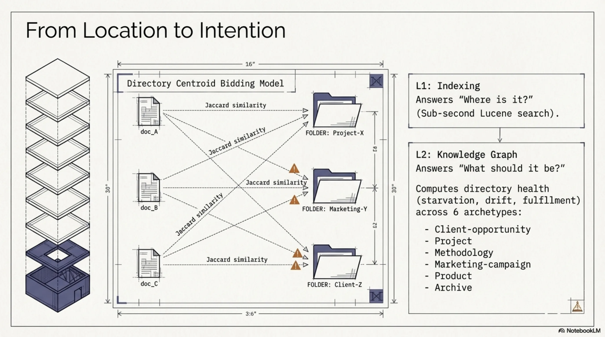

This gave me health signals I didn't have before. Starvation (a directory that should have content but doesn't), drift (content that doesn't match the directory's archetype), fulfillment (a well-organized directory), conflict (competing classifications). Commands: `synthesis describe`, `synthesis knowledge-graph`, `synthesis structure`, `synthesis evolution`.

The knowledge graph also enabled cross-workspace edges. My Documents workspace references code in `/src/exoreaction/`. Client docs reference source repos. These are explicit links now, with confidence scores, rendered as double arrows in Mermaid diagrams.

### Layer 3: Sessions — Episodic Memory (February–March 2026)

Search and the knowledge graph cover the codebase. They do not cover what happened *in* the codebase — the decisions made, the debugging sessions, the dead ends explored.

Claude Code stores session history in `~/.claude/projects/`. Synthesis now indexes this with SQLite FTS5. `synthesis sessions scan` does incremental indexing. `synthesis sessions search "Jenkins pipeline fix"` returns relevant past sessions.

This is episodic memory for an AI practitioner rig. When I start a new session and ask "what was the fix for the cross-workspace edge deduplication bug?", the answer is there — not because I documented it, but because the session where I fixed it is indexed.

### Layer 4: Security Analysis (February 2026)

Once you have a code knowledge graph, scanning for security issues is a natural extension. Twenty-one signal types: traditional (SQL injection, hardcoded secrets, path traversal, XXE) and agentic AI-specific (prompt injection, missing trust boundaries, RAG poisoning).

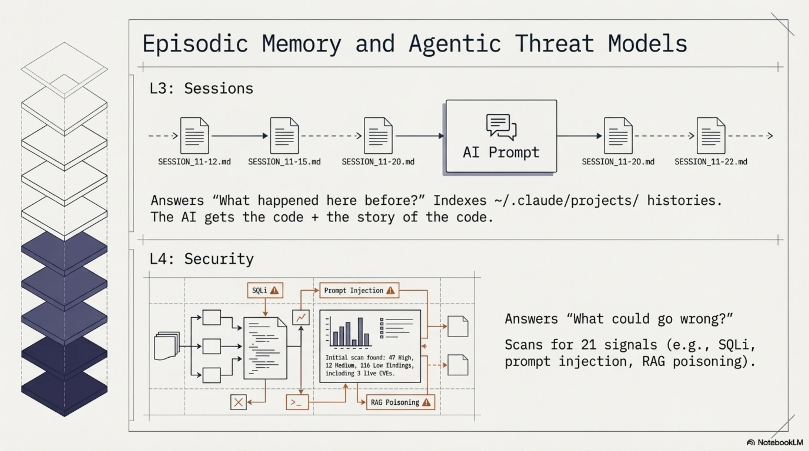

First run across five workspaces: 47 HIGH, 12 MEDIUM, 116 LOW findings. Three real CVEs found in the Cantara workspace — a Text4Shell RCE in commons-text 1.9 and two outdated Jackson versions. The Text4Shell turned out to be a false positive (the dependency was inside an XML comment block), which led to fixing the POM parser to strip comments before matching. The Jackson CVEs were real and got fixed via PRs.

False positive reduction was its own project. S001 (SQL injection) was flagging log statements and HTML strings. S002 (hardcoded secrets) was flagging property key constants and the string "changeit". S007 (path traversal) was flagging JSON-P's `JsonReader.readObject()`. Each false positive fix got its own test. The security scanner now runs as Phase 11 of `synthesis maintain`, showing the security posture after every maintenance run.

### Layer 5: KCP Export (February–March 2026)

Knowledge Context Protocol (KCP) is a structured manifest — `knowledge.yaml` — that tells AI agents what knowledge is available, in what order to load it, what it depends on, and how fresh it is. I designed it as a separate open specification, but Synthesis is the primary tool that generates KCP manifests.

`synthesis export --format kcp` takes the Lucene index and produces a manifest with units, relationships, scope, audience, and triggers. The knowledge graph renders KCP units as first-class nodes. This bridges the gap between "files exist" and "agents know which files matter."

### Layer 6: Skill Synthesis — Reflect (March 2026)

Here is where the feedback loop starts to close.

`synthesis reflect` analyzes recent sessions and auto-creates or updates YAML skill files in `~/.claude/skills/`. What gets learned in sessions becomes structured knowledge. The practitioner works, the sessions get indexed, `reflect` extracts patterns, and those patterns become skills that inform future sessions.

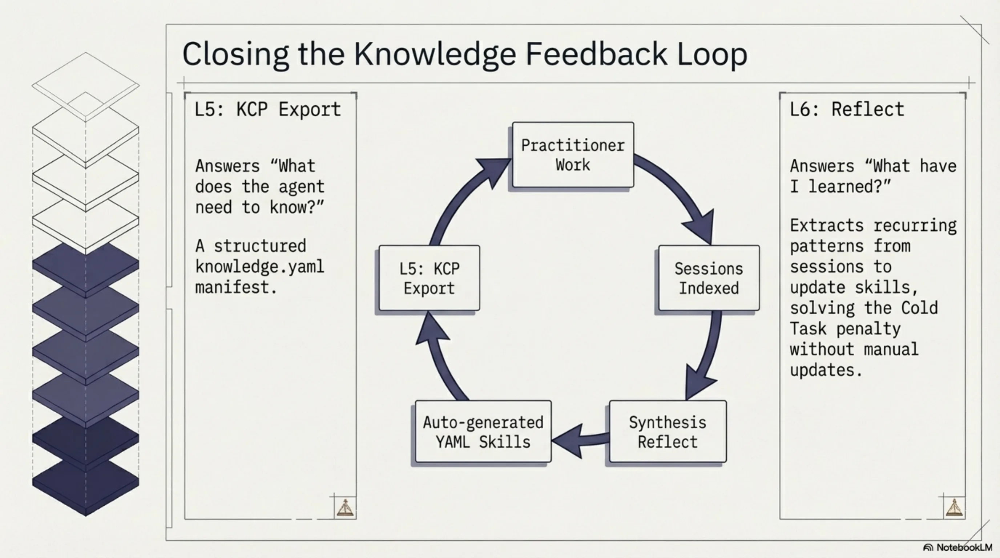

`--dry-run --compact` for preview. `--since 7d --max-new 5` for tuning. The output is conservative — it creates skills from recurring patterns, not from every one-off session.

This is the layer that addresses the Phase 4 reversal. Skills beat everything for warm tasks but hurt for cold tasks. The solution is not to stop using skills — it is to make skills that are accurate, current, and automatically maintained. If a skill file says "the authentication logic is in `auth/SecurityManager.java`" and that is true because `reflect` derived it from actual session data, the warm-task advantage holds without the cold-task penalty.

In theory. In practice, this is still early. The accuracy of auto-generated skills is reasonable but not perfect, and there's no good automated way to detect when a skill becomes stale enough to mislead.

### Layer 7: Agent Dispatch (March 2026)

`synthesis team-context` generates codebase-aware briefings for agent teams. `synthesis dispatch "task"` produces an agent dispatch plan: which skills to load, which files are relevant, what team conflicts exist, and a token estimate.

This exists because I started running multiple Claude Code agents in parallel, and they needed different subsets of context. Dispatch is the routing layer — it decides what each agent needs to know based on the task description and the knowledge graph.

### Layer 8: Topic Triage (April 2026 — today)

The newest layer, and the one that made me want to write this post.

Memory topic files (`.md` files in `~/.claude/projects/*/memory/`) accumulate. Some stay relevant. Some go stale. Some were never useful. Without maintenance, the memory system degrades — agents load outdated context, which is worse than loading no context (the Phase 4 lesson again).

`synthesis topic-health` scans memory topic files, queries FTS5 session hits per keyword, and prints a HOT/WARM/COLD table. Hotness = `0.6 * (hits/maxHits) + 0.4 * (1 - min(ageDays, 60) / 60)`. Simple, interpretable, wrong in interesting ways (more on that below).

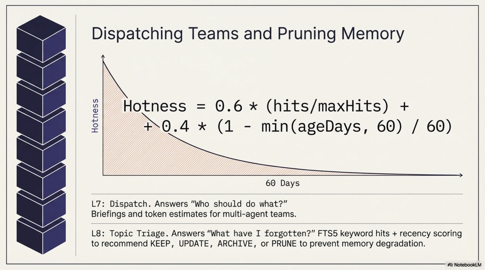

`synthesis topic-triage` scores across four dimensions: Recency, Recurrence, Actionability, Staleness. Outputs a recommendation for the top-5 files needing attention: ARCHIVE, PRUNE, UPDATE, or KEEP. Advisory only — it doesn't modify anything. `--auto` uses a dual threshold (24h since last run AND 5+ new sessions) to prevent premature consolidation. Nightly cron at 02:45.

Twenty-nine new unit tests in today's PR. Atomic JSON state persistence via `ConsolidateState`.

---

## What the Layers Actually Are

Looking at the stack from a distance, a pattern becomes visible:

1. **Indexing** answers "where is it?"
2. **Knowledge graph** answers "what is it and what should it be?"
3. **Sessions** answer "what happened here before?"
4. **Security** answers "what could go wrong?"
5. **KCP** answers "what does the agent need to know?"
6. **Reflect** answers "what have I learned?"
7. **Dispatch** answers "who should do what?"
8. **Topic triage** answers "what do I still know, and what have I forgotten?"

Each layer's question only becomes askable after the previous layers exist. You can't triage memory topics without sessions. You can't synthesize skills without session search. You can't do session search without indexing. The stack is not designed — it is discovered, one failure mode at a time.

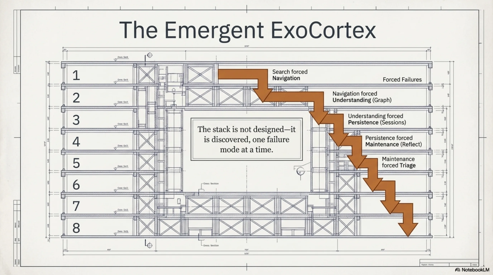

This is the part I didn't plan. Synthesis was supposed to be a search tool. Ten weeks later it is a memory system with a feedback loop: sessions feed reflect, reflect generates skills, skills inform agents, agents create sessions, sessions feed triage, triage prunes memory, pruned memory improves the next session. The loop closes.

Whether it closes *well* is a different question.

---

## Honest Limitations

### The False-Hot Problem

Topic triage's hotness formula uses FTS5 keyword hits from topic filenames. A topic file named `java-refactoring.md` generates keywords like "java" and "refactoring." If I have 40 sessions that mention "Java" for completely unrelated reasons (I write a lot of Java), `java-refactoring.md` shows as HOT even if nobody has thought about Java refactoring patterns in weeks.

Short filenames are worse. `ironclaw-infrastructure.md` has distinctive keywords. `mistakes-to-avoid.md` does not — every session where someone discusses avoiding a mistake triggers a false hit.

The fix is probably embedding-based similarity rather than keyword matching, or at minimum a TF-IDF weighting that penalizes common terms. I haven't built that yet. The current hotness score is useful but noisy, and I know exactly where the noise comes from.

### The Warm/Cold Tension Is Not Resolved

The Phase 3/4 discovery — skills help for warm tasks, hurt for cold tasks — is a *structural* tension, not a bug to fix. Every piece of context you load is a bet that the agent will need it. Load too much and you waste tokens and create noise. Load too little and the agent searches blind. Load the *wrong* things and you actively mislead.

`reflect` helps by generating skills from real sessions, but it doesn't solve the underlying problem: you cannot know in advance whether the next task will be warm or cold. The MCP approach (Phase 5) partially addresses this by letting the agent *pull* context on demand rather than having it pre-loaded, but MCP tool calls have their own overhead.

The right long-term architecture might be a hybrid: a small set of high-confidence skills always loaded (routing-level context), with MCP tools available for on-demand deep dives. But the optimal split between pre-loaded and on-demand context is task-dependent, and I don't have a principled way to determine it.

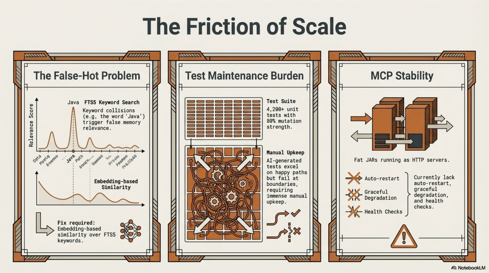

### The Test Maintenance Cost

4,200+ tests sounds great. And the test suite catches real regressions — I've been saved by it dozens of times. But each new feature adds tests, each refactoring breaks tests, and the maintenance cost scales. Today's 29-test PR for topic triage is typical: the feature itself was maybe 400 lines of production code, and the tests were another 300+ lines. This is fine for a solo project. At team scale, the test maintenance burden of a tool this heavily tested would be significant.

I am honest about this because the AI-generated-tests discussion is real. Mutation testing on lib-pcb (a related project) showed 80% test strength — meaning 80% of mutations to the code were caught by the tests. That's good. But it also means 20% of mutations survived, and the surviving ones cluster in boundary conditions and mathematical edge cases where writing precise tests is hardest. AI-generated tests are strong on happy paths and weak on boundaries. Synthesis's test suite has the same profile.

### MCP Server Stability

The MCP server works. But it's a fat JAR running as an HTTP server, and it needs to be started manually. There's no health check, no auto-restart, no graceful degradation if it crashes. For my personal setup, this is fine — I start it once and it runs until I reboot. For anyone else, the operational story is incomplete.

### The Numbers Are Real But Context-Dependent

-40% tool calls is a real measurement from a real benchmark. But it was measured on tasks I designed, against a codebase I know well, with context files I wrote. The improvement for a stranger working on an unfamiliar codebase would likely be different — possibly better (the navigation benefit is greatest when you're lost), possibly worse (my context files are tuned for my workflows).

I don't have external validation yet. The tool is MIT-licensed but the repository is still private while I figure out the release strategy. Nobody else has benchmarked it.

---

## The Productivity Shift

I track retrieval time as a fraction of active working time. This is not a precise measurement — it's an estimate based on what I actually do in a working day.

**Without the ExoCortex stack:** 40-55% of active working time is retrieval. Finding the right file. Loading the right document. Cross-referencing regulatory texts. Reconstructing what I decided last Tuesday. This is consistent with published knowledge work studies — information foraging consumes 30-50% of knowledge work time, and more in multi-source environments.

**With the full stack (Synthesis + KCP + skills + sessions):** ~10-15% retrieval. The rest shifts to reasoning.

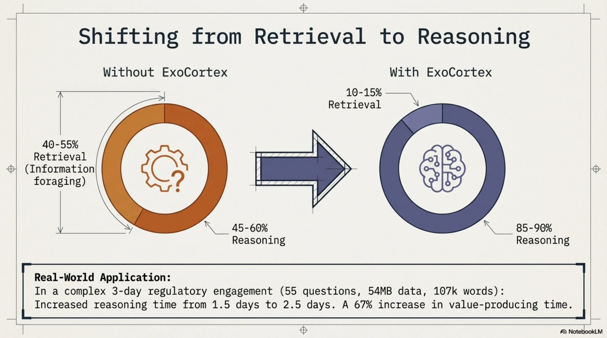

In a 3-day engagement, that means roughly 1.5 days of reasoning time (without the stack) versus 2.5 days (with it). A 67% increase in time available for the work that actually produces value.

One engagement made this concrete. Fifty-five directed regulatory verification questions. Twenty-three regulatory source documents, forty-seven knowledge units, fifty-four megabytes loaded into NotebookLM. Approximately 107,000 words across delivery documents in three days. With traceable provenance chains per regulatory claim — each conclusion could be walked back to a specific article in a specific regulatory text.

I frame this conservatively: "10-30x typical" on complex regulated-domain work. I have seen larger multipliers in specific situations, but presenting them without context would be dishonest. The multiplier depends heavily on the domain, the task complexity, the quality of the knowledge infrastructure, and the practitioner's existing expertise.

---

## What Synthesis Is Part Of

Synthesis does not exist alone. It is the backbone of what I call the ExoCortex — my AI practitioner rig:

- **Synthesis** — knowledge infrastructure. Everything described above.
- **KCP** — Knowledge Context Protocol. The structured manifest format.
- **Claude Code** — the AI agent that uses the infrastructure.
- **IronClaw** — an EC2 instance running Mimir, a Slack bridge for async queries.
- **RTK** — token optimization at the CLI level.

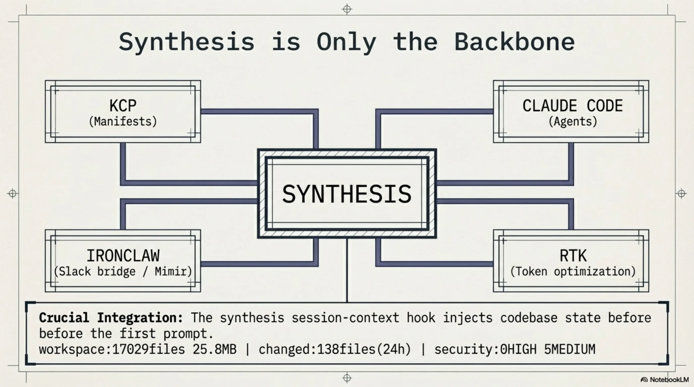

The integration points matter as much as the individual tools. `synthesis session-context --compact` injects a one-line workspace freshness snapshot into every Claude Code session via a `UserPromptSubmit` hook. Every session starts with: `workspace:17029files 25.8MB | changed:138files(24h) | security:0HIGH 5MEDIUM`. The agent knows the codebase state before the first prompt.

`synthesis hooks generate` merges Claude Code hook configuration into `~/.claude/settings.json`. Idempotent, dry-run capable, aborts on malformed JSON. The infrastructure configures the agent that uses the infrastructure. Another loop.

---

## The Shape of It

I didn't set out to build a memory system. I set out to build search. But search forced navigation, navigation forced understanding, understanding forced persistence, persistence forced maintenance, and maintenance forced triage. Each step was the smallest tool that solved the problem in front of me.

Ten weeks. Eight layers. 82 command classes. 4,200+ tests. 65,905 indexed files. Eleven workspaces. One developer who builds tools because the alternative is drowning in output he generated himself.

The feedback loop that matters most is the one I didn't design: work creates sessions, sessions become skills, skills shape future work, future work creates sessions. Whether this loop converges — whether the knowledge infrastructure gets *better* over time rather than just *bigger* — is the open question. Topic triage is my current answer: automated, scored, advisory-only pruning recommendations with dual thresholds to prevent premature consolidation.

It is probably not the final answer.

The repository is MIT-licensed. It is still private. I am not sure when it will be public — partly because the release strategy isn't figured out, partly because there's a difference between "this works for me" and "this is ready for other people." A solo tool that assumes my directory structure, my workflows, my naming conventions is not the same thing as infrastructure. Making it general is a different kind of work than making it good.

For now, this is a practitioner's journal entry. I built a thing. I benchmarked it honestly. Some results surprised me. The tool became something I didn't plan. The feedback loop is closing. The limitations are real and known.

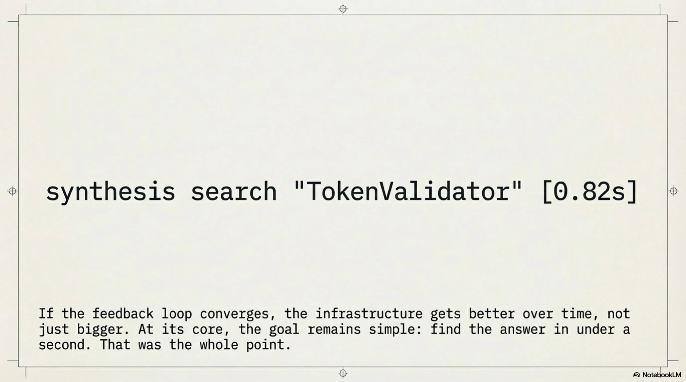

If any of this is useful to someone else, that's enough. If not, it still solved my navigation problem, and I can find `TokenValidator.java` in under a second. That was the whole point.

---

*Totto is the founder of eXOReaction, an enterprise architecture consultancy in Oslo. He has been building enterprise systems for over 30 years, most recently with AI-augmented development methodologies. Synthesis is open source (MIT) and under active development.*
