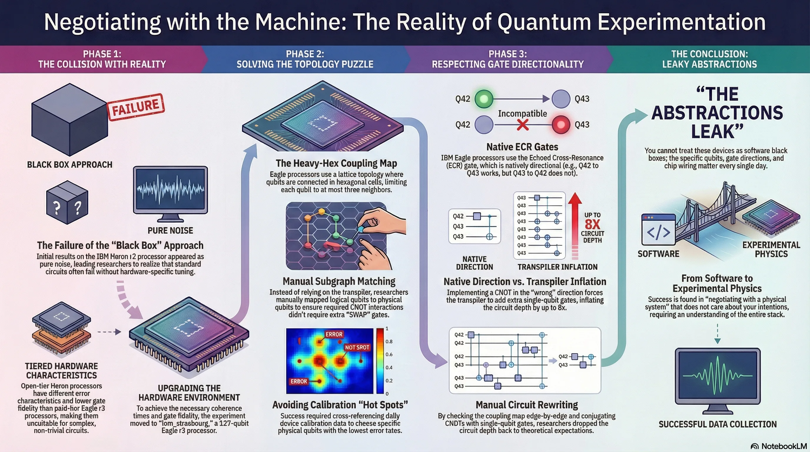
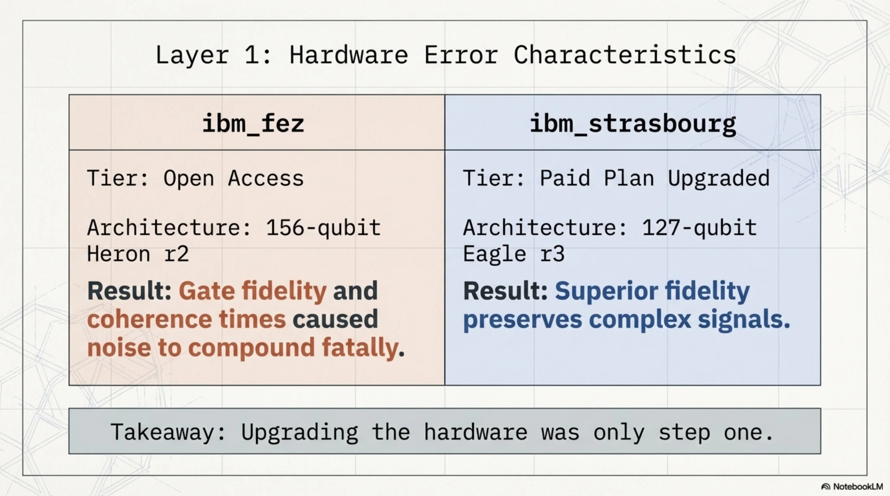
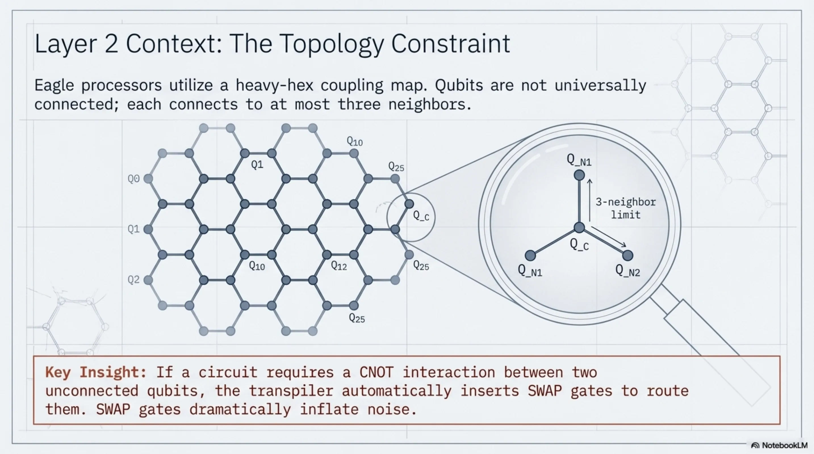
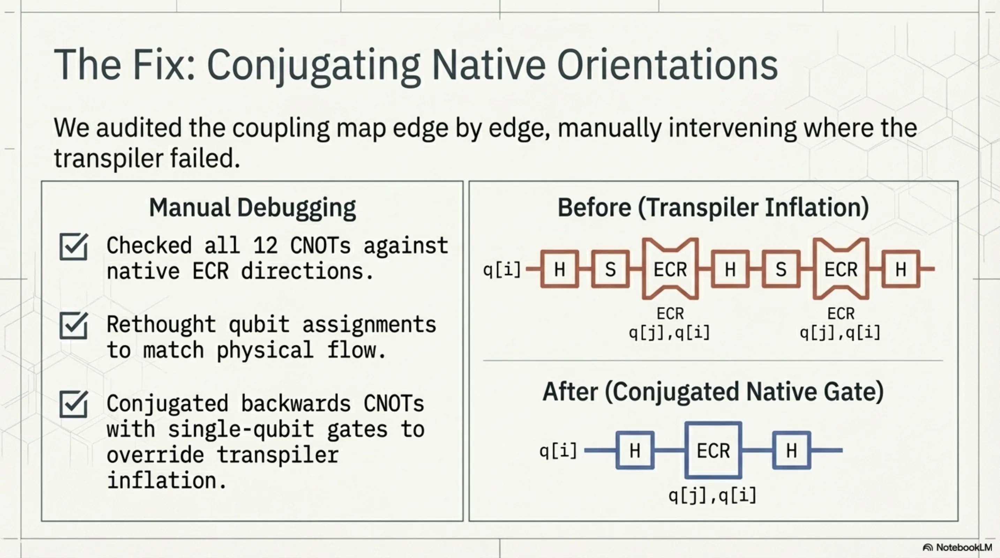
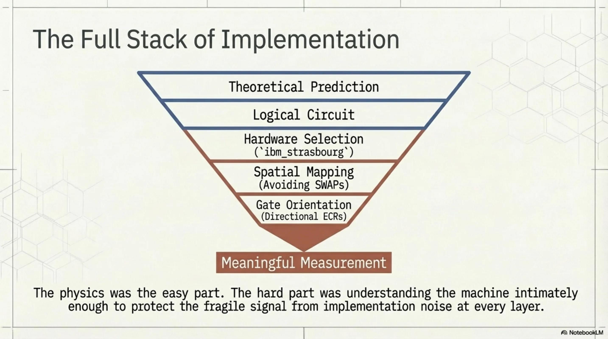
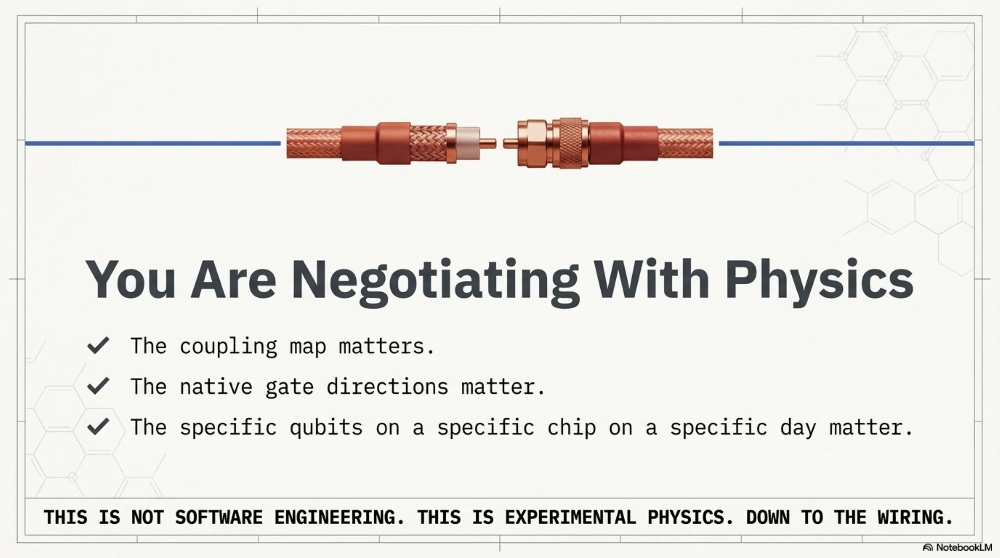

# The abstractions leak: a day with IBM quantum hardware

I spent Easter Monday doing something I hadn't done before: running a quantum physics experiment on real hardware. Not a textbook exercise, not a tutorial circuit — an actual measurement designed to test a specific theoretical prediction. I won't go into what we were testing or whose work it relates to, but I want to share what the experience was like, because it was more instructive than I expected.

<!-- more -->

It started with confusion. We had a circuit, we had a hypothesis about what the output statistics should look like, and we had access to IBM's quantum platform through their open tier. We ran the job on `ibm_fez`, which is one of their 156-qubit Heron r2 processors. The results came back and they were, to put it mildly, not what we were looking for. The key metric we were tracking was far too high — not slightly off, but off by a factor that made the whole thing look like noise. My first thought was that we had a bug in the circuit. My second thought was that maybe the theory was just wrong.

Neither turned out to be the case.

What we eventually figured out was that we were on the wrong hardware. IBM's open access plan routes you to their Heron r2 processors, which are their newer architecture but — and this is the part that tripped us up — have different error characteristics than the Eagle r3 processors available on paid plans. For what we were doing, gate fidelity and coherence times mattered a great deal. The circuit wasn't trivial, and every bit of noise was compounding. We needed cleaner hardware.

So we upgraded the account and got access to `ibm_strasbourg`, a 127-qubit Eagle r3 processor. That was step one. Step two was figuring out where on the chip to actually place our qubits.

Eagle processors use IBM's heavy-hex coupling map — a lattice topology where each qubit connects to at most three neighbors, with extra "flag" qubits bridging the hexagonal cells. Our circuit needed a specific connectivity pattern: a set of qubits where the CNOT interactions we required could be executed without the transpiler inserting SWAP gates to route around missing connections. This meant sitting down with the coupling map and finding a physical qubit layout that matched our logical circuit. It took some time. You're essentially solving a subgraph matching problem by hand, cross-referencing the device's calibration data to avoid the worst-performing qubits.

We found a layout, ran the circuit, and the results were better — but still not right. Closer, but with a transpiled circuit depth that was roughly eight times what we expected. Something was wrong with the compilation.

This is where it got interesting. IBM's Eagle processors use the ECR gate (echoed cross-resonance) as their native two-qubit gate, and critically, these gates are directional. An ECR between qubit 42 and qubit 43 is a native operation, but the reverse — qubit 43 to qubit 42 — is not. When you write a CNOT in the "wrong" direction relative to the hardware's native gate orientation, the transpiler has to decompose it using additional gates to reverse the interaction. For a single CNOT, this adds overhead. For twelve of them, which is what our circuit had, you end up with a massively inflated circuit that burns through coherence time before it even finishes executing.

We went through the coupling map edge by edge, checked which of our twelve CNOTs were backwards relative to the native ECR directions, and rewrote the circuit to use only natively-supported orientations. In some cases this meant rethinking the qubit assignment. In others it meant conjugating the CNOT with single-qubit gates on our side rather than letting the transpiler do it blindly.

We ran the rewritten circuit. The depth dropped to something reasonable. And the result landed quietly, precisely, where the theory said it should.

There was no dramatic moment. No champagne. Just a number on a screen that matched a prediction, and the knowledge that we had earned it through two hours of debugging hardware constraints. The physics was almost the easy part. The hard part was understanding the machine well enough to not destroy the signal with implementation noise.

I think this is something worth reflecting on if you work in or around quantum computing. The abstractions leak. They leak constantly. You cannot treat these devices as black boxes and expect meaningful results. The coupling map matters, the gate directions matter, the specific qubits you choose on a specific chip on a specific day matter. It is, in a way, closer to experimental physics than to software engineering. You are negotiating with a physical system, and it does not care about your intentions.

I found the whole afternoon genuinely satisfying. Not because the result was spectacular — it was one number — but because getting there required understanding every layer of the stack, from theory down to the wiring of a particular chip in Strasbourg. That felt like honest work.

---

*The full slide deck for this post is available here: [Quantum Hardware Realities (PDF)](../../assets/2026-04-06-quantum-hardware-realities.pdf)*
