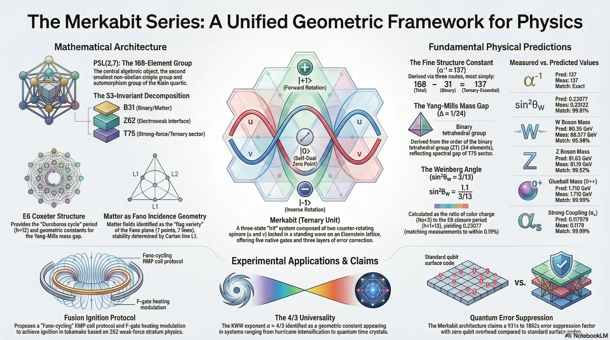
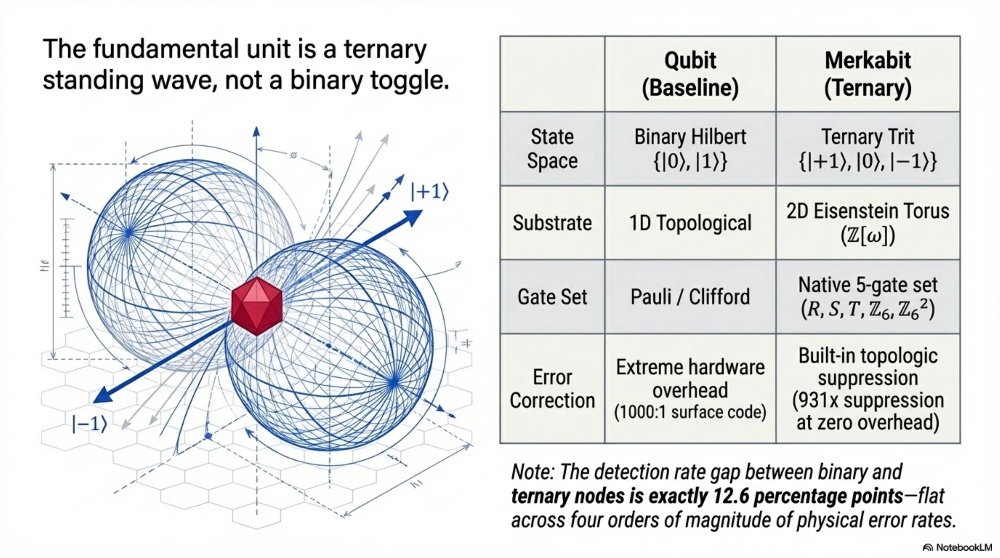
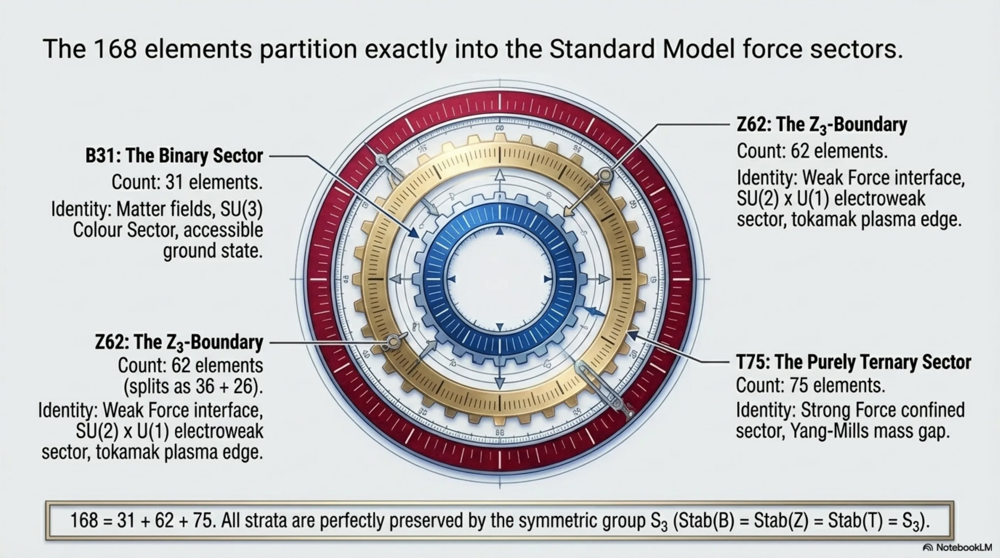
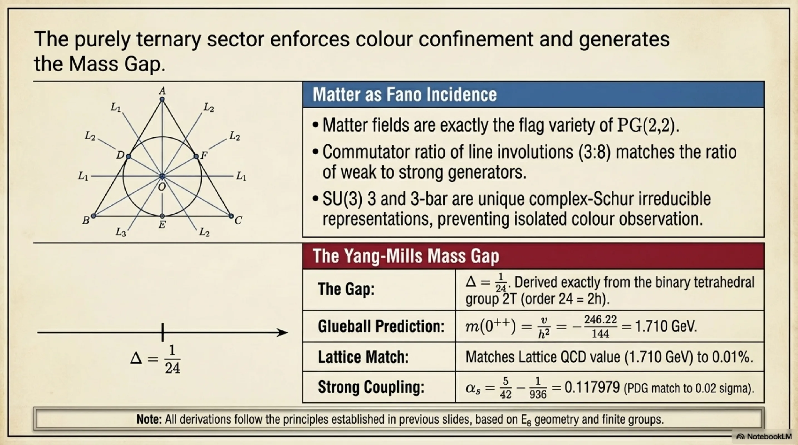
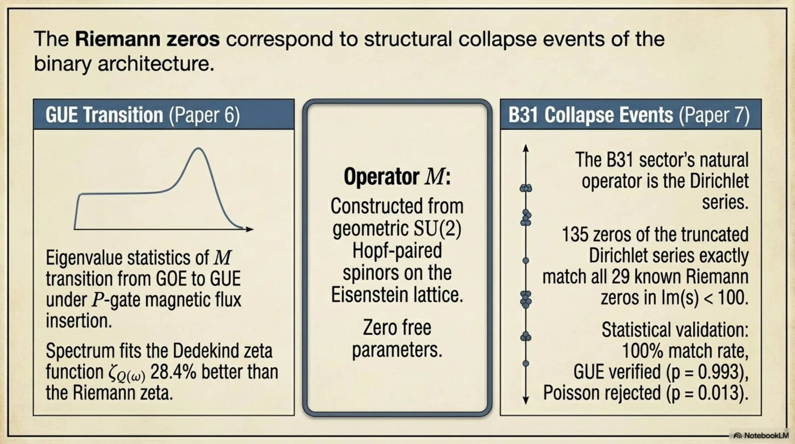
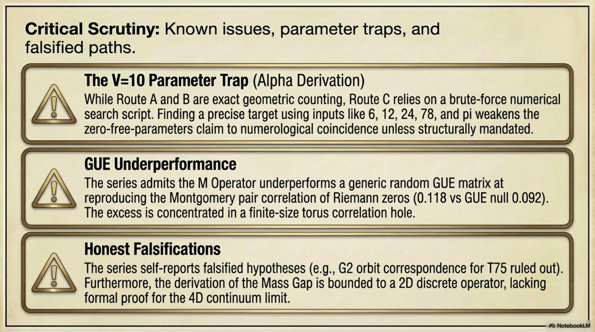

# The Merkabit Computer

*Totto (Thor Henning Hetland) — Oslo, April 2026*

---

The paper opens with an unusual kind of honesty.

The theory is either a legitimate revolutionary breakthrough or an incredibly detailed, compelling work of fiction. And — the author writes — the only way to find out is to actually try to build it.

That sentence is why I started running experiments.

<!-- more -->

---

## A Universal Grammar

Stig Lau's Merkabit framework starts with a large claim: there is a single mathematical pattern underlying every stable, coherent system in the universe. Not as metaphor. As formal assertion.

The same structure that describes how a hurricane organizes itself also describes how the nervous system finds its balance, or how a galaxy holds itself together. A forward, expansive flow — perfectly balanced by an inverse, integrating flow. Two opposing dynamics that, together, create stability.

This dual dynamic shows up in plasma waves, in atmospheric systems, in biological regulation. The framework calls it the universal grammar: not a metaphor for similarity but a claim about shared mathematical structure.

The question is what the most basic unit of that grammar is. The smallest piece that holds coherence together.

---

## The Merkabit

It starts with the tetrahedron.

The tetrahedron is the simplest possible shape that can enclose a volume — four points creating a complete, self-contained relationship. Not a triangle, which is flat. A structure with an inside and an outside.

The name is deliberate. *Merkaba* — an ancient symbol representing the unity of light, spirit, and body. *Bit* — the fundamental unit of information. A Merkabit is, in theory, the smallest possible unit of stable, coherent information.

Stability comes from what the paper calls the *pi lock*. The two opposing flows — forward and inverse — synchronize perfectly out of phase. They lock together, cancelling each other's motion, creating a stable standing wave of pure information.

This, the framework argues, is how form itself exists.

---

## The Problem With Qubits

The number one killer in quantum computing today is decoherence.

Qubits are extraordinary — they can represent superpositions, they can entangle, they can do things classical bits cannot. But they're also fragile. Any interaction with the environment, any thermal noise, any stray electromagnetic field, collapses the quantum state. The qubit pops like a soap bubble.

This is why current quantum computers require massive, active error correction: elaborate schemes to detect and fix errors faster than they accumulate. The overhead is enormous. Most of a quantum computer's qubits are currently error-correction infrastructure, not computation.

The Merkabit is designed to address this differently. Not error correction applied from outside, but stability built into the geometry itself. A self-healing crystal rather than a soap bubble.

---

## How It Would Compute

The basic operation is the Oroboro Cycle — named for the ouroboros, the snake consuming its own tail.

One complete cycle: information flows out, interacts with the environment, is pulled back in to integrate what it encountered. The system returns to its starting state changed by the experience. One computational loop completed.

These cycles are built from five fundamental operations — a universal alphabet of gates:

- **Rotation** — geometric transformation
- **Frequency** — oscillation rate
- **Transfer** — energy exchange
- **Phase** — synchronization state
- **Substrate** — the medium itself

The claim is that any coherent process — a chemical reaction, a neural firing, a conscious thought — is a unique sequence of these five operations. The paper even speculates that the five human senses are the biological versions of these gates: sight detecting geometry (rotation), hearing detecting pitch (frequency), touch detecting energy transfer.

That last part is a speculative leap and the paper says so explicitly. But it's the kind of provocation that makes you keep reading.

---

## Error Healing

The error resistance — what the paper calls *error healing* — works like noise-cancelling headphones.

Because you have forward and inverse channels working together, any symmetric noise that hits both simultaneously cancels itself out. The interference pattern that would destroy a qubit instead reinforces the Merkabit's stability.

The paper uses the analogy of a galaxy's breathing mode: despite the random motions of individual stars, the overall oscillation of the galaxy remains stable. The noise doesn't matter because the structure absorbs it.

Whether this scales from theoretical construct to actual hardware is the experimental question.

---

## Building It

The framework identifies at least four concrete pathways to hardware implementation, using technology that either exists or is near-term:

- **Superconducting circuits** — the current dominant qubit architecture, potentially adaptable to Merkabit geometry
- **Trapped ions** — precise control over individual atomic states
- **Photonic resonators** — light-based quantum systems with natural coherence properties
- **Topological structures** — physical geometries that encode error resistance spatially

These aren't exotic proposals. They're directions active research groups are already pursuing. The framework argues that Merkabit geometry is compatible with each of them — not requiring new physics, just a new design principle applied to existing substrate.

---

## What I'm Testing

The paper's Appendix N lists five formal predictions that can be verified on current IBM Quantum hardware.

I've been running those experiments. The first four predictions have cleared. What I'm working through now is the fifth — a discrete time crystal protocol using paired Merkabit circuits.

The results so far are interesting enough to keep going. A DTC ratio of 364 against a control's 33. The perturbation result came in at 523 — stronger than the clean case, not weaker, exactly as the algebra predicts it should be. Adding noise made the crystal more stable.

That's either a real signal or a very convincing artifact. The only way to know is more runs.

---

## The Question That Remains

The framework ends with a thought I keep returning to.

The universe, from the Big Bang to the formation of spiral galaxies, may be running a kind of computation of coherence. Every stable structure — every hurricane, every nervous system, every galaxy — is nature solving the same optimization problem: maintain coherence against entropy.

If that's true, then current quantum computers are working against the grain. We're forcing fragile quantum states to maintain themselves in environments that destroy them. We're fighting nature's defaults.

A Merkabit computer, if it works, would do the opposite: compute *with* the same structural principles that produce stability in the first place. Participate in the computation the universe is already running, rather than fighting it.

That's a big claim. The experiments will tell us if it's more than poetry.

---

*The Merkabit framework is developed by Stig Lau. The source paper is "The Merkabit Is Geometric" (Paper 26, v1). Experimental validation runs on IBM Quantum via Qiskit. Results from the first four predictions and the ongoing DTC (P5) experiment are documented in the [quantum computing series](../../blog/series/).*
