# Two Architectures for Claude Code: What 19,700 Stars Got Right and What They Missed

A repository called `claude-code-best-practice` hit #1 trending on GitHub this week. 19,700 stars in days. Eighty-four tips from Boris Cherny, who created Claude Code, along with contributions from Thariq, Cat Wu, and the broader Anthropic team. It is the most comprehensive public document on how to get serious results from Claude Code, and it deserves the attention it is getting.

The reason it caught my eye is that the ExoCortex -- the eight-layer stack running my Claude Code setup for ten-plus weeks now -- solves many of the same problems from a fundamentally different direction. Same tool, same class of problem, different architectural assumptions. Comparing the two reveals something neither setup has articulated on its own: there are two distinct philosophies for extending Claude Code, and both have blind spots the other has solved.

<!-- more -->

This is not a scorecard. Boris Cherny's work is good. Several of the patterns in his repository are things the ExoCortex should adopt. But the reverse is also true. The comparison is useful because two practitioners working independently on the same problem -- making Claude Code reliable at scale -- arrived at different answers, and the gap between those answers is where the next generation of tooling lives.

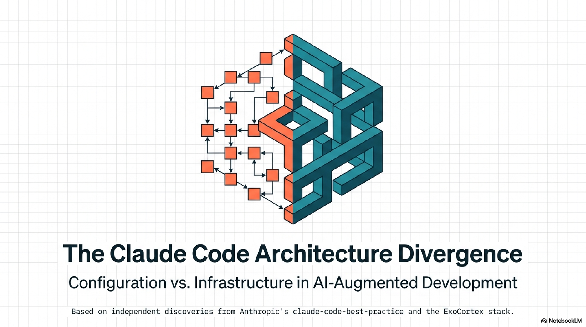

---

## The Shared Baseline

Both setups start from the same observation: Claude Code out of the box is capable but amnesiac. It forgets everything between sessions. It wastes tokens rediscovering context. It makes the same mistakes repeatedly.

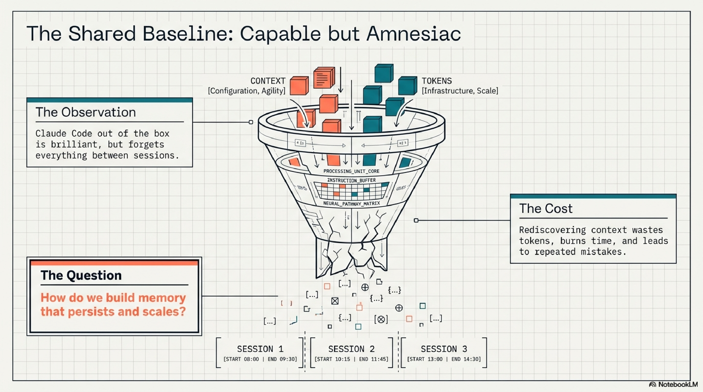

---

## What claude-code-best-practice Built

The repository is organized around operational patterns. Eighty-four concrete tips spanning subagents, slash commands, skills, hooks, MCP server integration, and orchestration workflows. The strongest contributions are structural, not cosmetic.

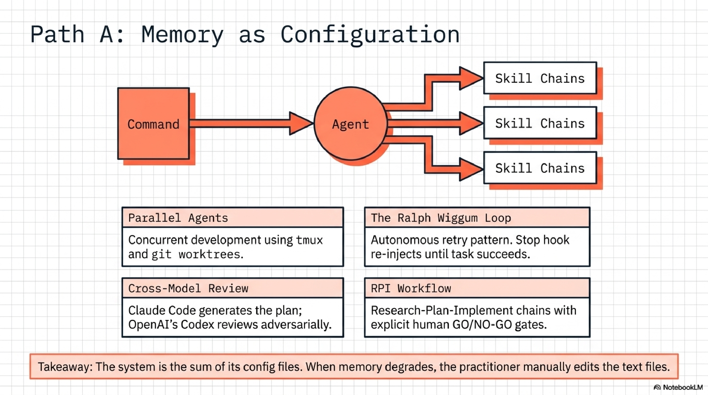

**Orchestration grammar.** A formalized Command-Agent-Skill pattern where a command triggers an agent, which invokes a skill chain. The `/weather-orchestrator` demo is small but demonstrates the principle: reusable, version-controlled chains that compose. Eight different development workflows are compared side by side -- Superpowers, Spec Kit, BMAD, Get Shit Done, OpenSpec, HumanLayer, and more. That comparative work alone is worth the read.

**Parallel agents.** Agent teams using tmux and git worktrees for concurrent development across branches. Shared task coordination so multiple Claude instances can work on different parts of a codebase simultaneously without stepping on each other.

**The Ralph Wiggum loop.** An autonomous retry pattern using Stop hook re-injection. When a task fails, the hook intercepts the stop signal and re-injects the task, looping until completion. Named, presumably, for persistence in the face of repeated failure.

**Cross-model review.** A workflow where Claude Code generates a plan and OpenAI's Codex reviews it adversarially. The adversarial tension catches assumptions that a single model misses.

**RPI workflow.** Research, Plan, Implement with explicit GO/NO-GO gates between phases. The gates are the interesting part -- they create decision points where a human (or a second model) can halt the chain before implementation begins.

The repository also includes honest reporting on CLAUDE.md best practices, memory patterns, skills in monorepos, and LLM degradation over time. The degradation section is particularly candid.

---

## What the ExoCortex Built

The ExoCortex is eight layers. Each solves a specific failure mode that the layer below cannot address alone.

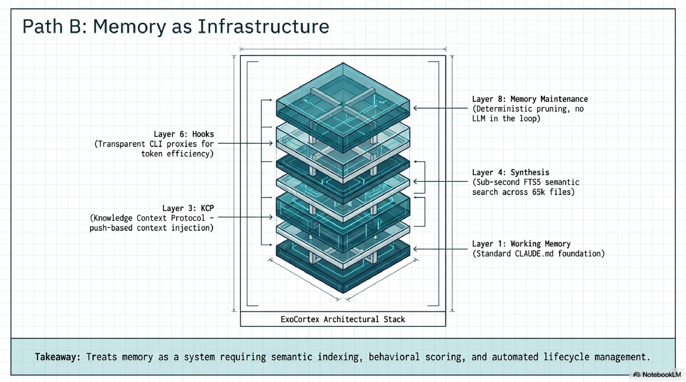

**Layer 1 -- Working Memory.** Claude Code plus a CLAUDE.md hierarchy. Standard, and the foundation everything else builds on.

**Layer 2 -- Skills.** 476 YAML skills across 15+ client engagements. But there are two categories that matter more than the count. ACTION skills do things: deploy a service, track a LinkedIn post, run a release. LENS skills change how Claude thinks. A Rich Hickey lens makes Claude reason about simplicity vs. complexity before proposing solutions. An Eric Evans lens activates domain-driven design reasoning. Martin Fowler, Kent Beck, Michael Feathers, Uncle Bob, Dan Creswell, Rickard Oberg -- each lens encodes an expert's epistemology, not their procedures. The distinction between "do this" and "think like this" is the sharpest design decision in the stack.

**Layer 3 -- KCP (Knowledge Context Protocol).** An open specification where each repository declares its intent, dependencies (typed), API contracts (versioned), domain boundaries, and authority levels (initiative, requires_approval, denied). 289+ repos use it. The kcp-commands npm package and kcp-mcp MCP server provide tooling. The key architectural choice: push-based context injection. KCP loads what the agent needs before it asks, rather than waiting for the agent to pull context via tool calls. Benchmarks: 53-80% fewer tool calls, 33% faster context recovery.

**Layer 4 -- Synthesis.** Java-based semantic memory. Sub-second FTS5 queries across 65,905 files in 58+ repos. `synthesis search` finds anything instantly. `synthesis reflect` generates skills from session transcripts. `synthesis topic-health` scores knowledge as HOT, WARM, or COLD based on behavioural engagement. `synthesis topic-triage` recommends ARCHIVE, PRUNE, UPDATE, or KEEP. Version 1.27.0.

**Layer 5 -- Episodic Memory.** 3,000+ indexed sessions searchable via `synthesis sessions search`. The full history of what happened, when, and in what context.

**Layer 6 -- Hooks.** Auto-loads KCP manifests and skills at session start. RTK (Rust Token Killer) is a transparent CLI proxy that intercepts common operations and filters output, achieving 60-90% token savings on git status, git diff, and similar high-volume commands. The agent never notices. The token bill does.

**Layer 7 -- IronClaw/Mimir.** Agent session management, decision tracking, Claude queue. The operational layer that keeps multiple agent instances coordinated.

**Layer 8 -- Memory Maintenance.** Deterministic, no LLM in the loop. topic-health plus topic-triage plus ConsolidateState with dual thresholds (24 hours and 5 sessions). Runs nightly at 02:45 Oslo time. Advisory only -- the system surfaces what needs attention, the human authorizes cuts. The operating principle: freshness beats completeness.

Validated production benchmarks: 197,831 lines of Java in 11 days (lib-pcb), 35-40% fewer tool calls with proper knowledge infrastructure, session context retrieval down from 40-55% to 10-15% of session time.

---

## The Divergence Point

Both setups start from the same observation: Claude Code out of the box is capable but amnesiac. It forgets everything between sessions. It wastes tokens rediscovering context. It makes the same mistakes repeatedly.

The responses diverge at one architectural question: **is memory a configuration problem or an infrastructure problem?**

claude-code-best-practice treats memory as configuration. CLAUDE.md files, skill definitions, hook scripts. All version-controlled, all text files, all managed by the practitioner who writes them. The system is the sum of its config files. When memory degrades, you edit the files.

The ExoCortex treats memory as infrastructure. Synthesis indexes 65,905 files and scores their relevance behaviourally. topic-health detects when knowledge goes cold. topic-triage recommends lifecycle actions. ConsolidateState prevents redundant maintenance runs. A nightly cron cycle keeps the system from rotting while the practitioner sleeps.

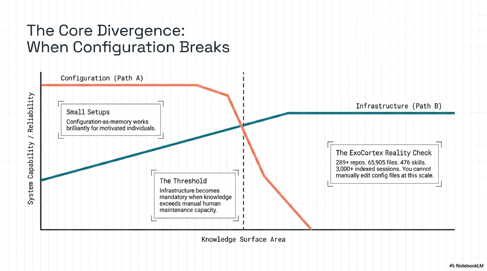

This is not a difference of degree. It is a difference of kind. Configuration-as-memory works for small setups and motivated individuals. Infrastructure-as-memory works when the knowledge surface area exceeds what any individual can manually maintain. 289 repos is past that threshold. So is 65,905 files.

The claude-code-best-practice repository documents LLM degradation as a known problem. Models get worse at certain tasks over time. Their response is candid about the problem but stops at documentation. The connection they do not make: their own memory model degrades identically. CLAUDE.md files go stale. Skill definitions drift from reality. Topic knowledge accumulates without pruning. The degradation they observe in models is mirrored in their own knowledge layer, and they have no maintenance story for it.

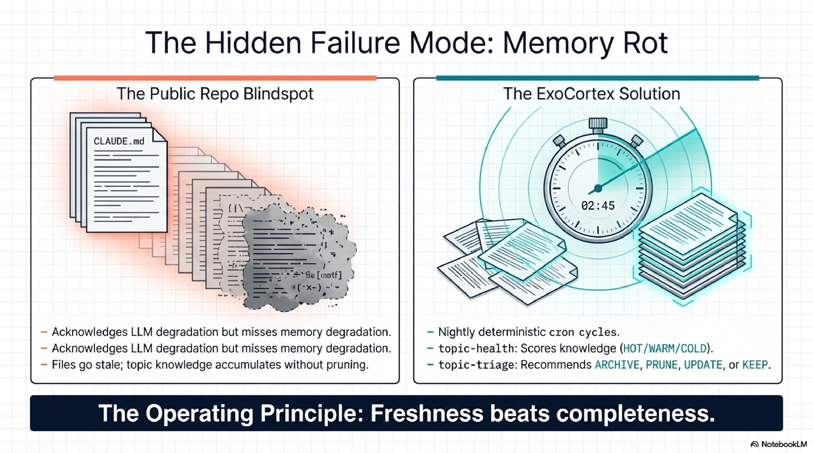

The ExoCortex is the only setup I have seen that treats knowledge as infrastructure requiring lifecycle management -- creation, scoring, maintenance, and retirement. Not because the idea is novel. Because the implementation is hard, and most practitioners stop at creation.

---

## What I Learned from Theirs

Honesty requires listing the concrete gaps the ExoCortex has that claude-code-best-practice solved.

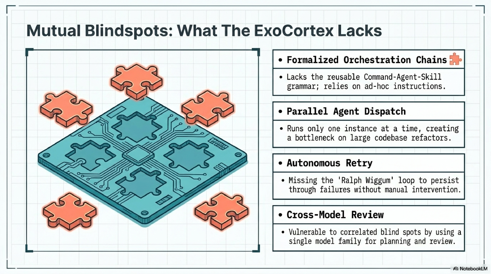

**Formalized orchestration chains.** The Command-Agent-Skill grammar is something the ExoCortex lacks entirely. Skills exist. Hooks exist. But there is no reusable, version-controlled chain that composes them into multi-step workflows. Every orchestration in my setup is ad hoc -- a CLAUDE.md instruction that says "first do X, then do Y." That works for simple sequences. It breaks for anything with branching logic or conditional execution.

**Parallel agent dispatch.** tmux plus git worktrees for concurrent development is a solved problem in their setup. The ExoCortex runs one Claude Code instance at a time. IronClaw/Mimir handles some agent coordination, but not parallel development across branches of the same codebase. On a large refactoring, this is a real bottleneck.

**Autonomous retry.** The Ralph Wiggum loop -- Stop hook re-injection until task completion -- is elegant. The ExoCortex has nothing equivalent. When a task fails, I intervene manually. For well-defined tasks with clear success criteria, the retry loop would save significant practitioner attention.

**Cross-model adversarial review.** Using Codex to review Claude's plans is a pattern I had not considered. The adversarial tension between two different model architectures catches a class of errors that self-review misses. My current workflow uses a single model family for both planning and review, which means the blind spots are correlated.

**RPI with GO/NO-GO gates.** Research-Plan-Implement with explicit decision points between phases. The ExoCortex does something similar informally -- the Directed Synthesis pillar from the lib-pcb build -- but the formal gates with explicit GO/NO-GO criteria are more rigorous and more repeatable.

These are not theoretical gaps. Each one has cost me time in the past ten weeks.

---

## What They Are Missing

The reverse list is equally concrete.

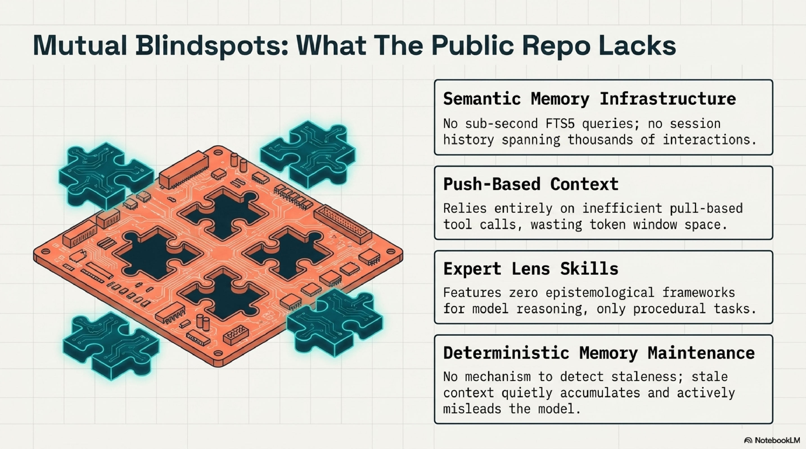

**Semantic memory infrastructure.** Synthesis is not an incremental improvement over CLAUDE.md files. It is a different category of tool. 65,905 files indexed with sub-second FTS5 queries, behavioural scoring via topic-health, automated triage recommendations, session history spanning 3,000+ interactions. claude-code-best-practice has no equivalent and no path to one within their current architecture. The gap is not a missing feature. It is a missing layer.

**Push-based context injection.** KCP injects context before the agent asks for it. claude-code-best-practice relies on pull-based context -- the agent decides what to look for, searches for it, and loads it. The benchmarks on this are clear: push-based injection produces 53-80% fewer tool calls because the agent does not waste turns discovering what it needs. Every tool call the agent does not make is context window space preserved for actual work.

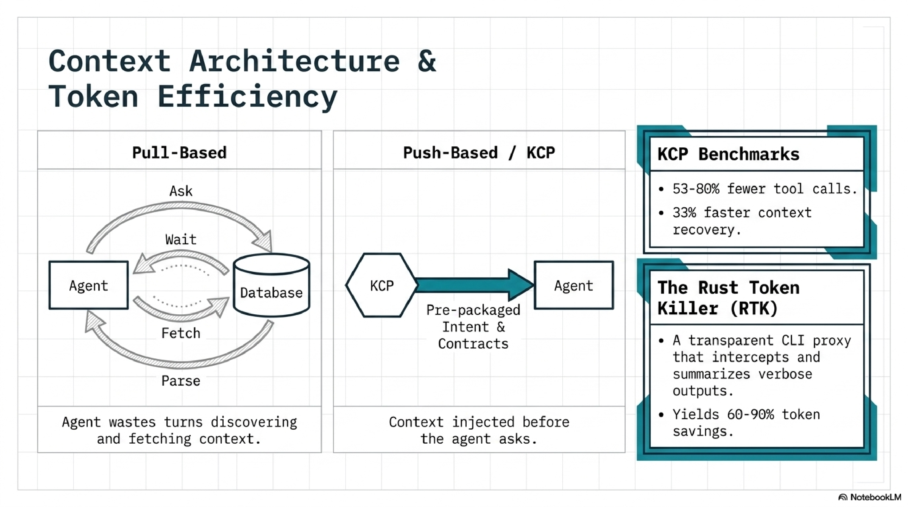

**Expert lens skills.** This is the sharpest distinction. claude-code-best-practice skills are procedural -- they tell Claude what to do. ExoCortex lens skills are epistemological -- they change how Claude reasons. A Kent Beck lens does not say "write tests first." It says "think about design as the activity that testing enables. Coupling is a design smell. Simplicity is achieved through small steps with continuous feedback." The lens shifts the reasoning frame, not the action list. claude-code-best-practice has nothing in this category.

**RTK (Rust Token Killer).** A transparent CLI proxy that filters verbose tool output. `git status` on a large repo produces hundreds of lines. RTK intercepts the output and returns a compressed summary. 60-90% token savings on common operations, zero configuration, the agent never knows it is running. claude-code-best-practice has no token efficiency story at all. Their setup consumes full-verbosity output on every tool call.

**Deterministic memory maintenance.** topic-health, topic-triage, ConsolidateState. No LLM in the maintenance loop. Behavioural scoring that runs in milliseconds. Advisory recommendations that surface what needs human attention. claude-code-best-practice has no freshness or staleness detection. Knowledge accumulates. Nothing retires. Over weeks, this produces the quiet misdirection I described in the [memory rot post](/blog/2026/04/06/agent-memory-rots-heres-how-we-stopped-it/) -- stale context that does not crash, but actively misleads.

---

## The Skills Revelation

Both setups use skills. Both consider skills important. Neither has named what is actually happening: the word "skill" refers to two fundamentally different concepts.

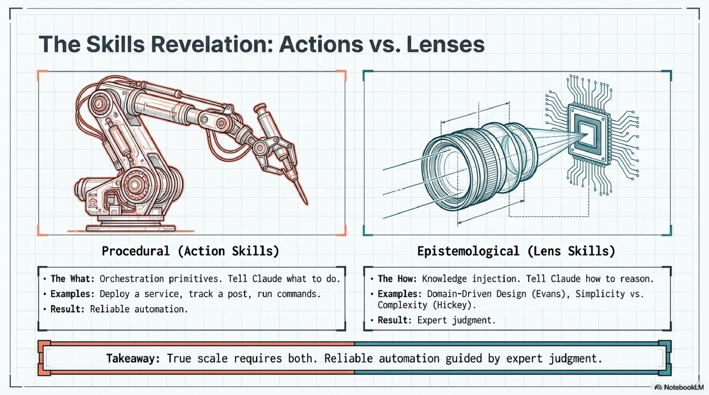

In claude-code-best-practice, a skill is an **orchestration primitive**. It encodes a procedure: steps to follow, tools to invoke, output formats to produce. The `/weather-orchestrator` skill chains API calls. The deployment skill runs commands in sequence. Skills are verbs. They do things.

In the ExoCortex, skills split into two categories. ACTION skills are orchestration primitives -- identical in concept to claude-code-best-practice skills. LENS skills are something else entirely. They are **knowledge injection**. A Rich Hickey lens does not tell Claude to do anything. It tells Claude how to evaluate what it is about to do. It encodes judgment criteria, not procedures.

The industry uses one word for both concepts. That ambiguity hides a design decision that matters enormously. A team that builds only procedural skills gets reliable automation. A team that builds only lens skills gets better reasoning but no automation. A team that builds both -- and understands the distinction -- gets reliable automation guided by expert judgment.

Neither setup has formalized this split. The ExoCortex has it in practice (the ACTION/LENS file naming convention) but not in theory. claude-code-best-practice has not arrived at the distinction at all. Naming it is the first step toward designing for it deliberately.

---

## The Architectural Matrix

The comparison produces a clean matrix. Neither setup dominates. The ideal merge is column three.

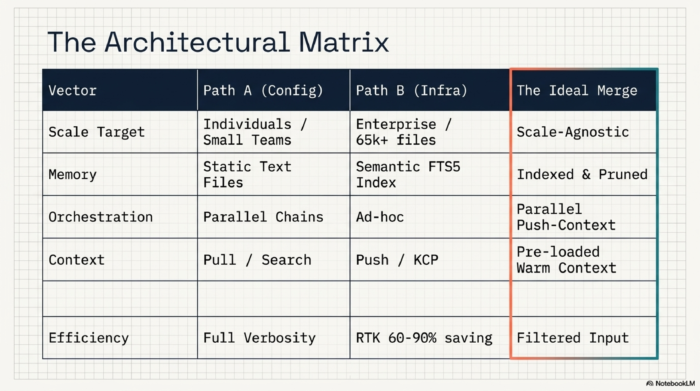

---

## What Is Next

The comparison produced a concrete list.

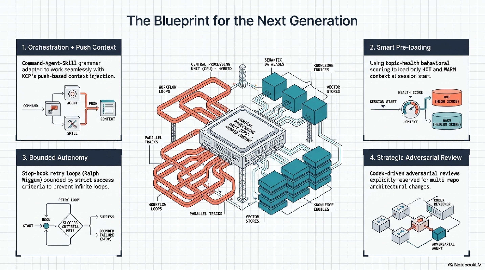

**Orchestration chains.** Adopting the Command-Agent-Skill grammar from claude-code-best-practice, adapted to work with KCP's push-based context injection. The chain definition becomes a YAML file alongside the skills it invokes. Version-controlled, composable, testable.

**Stop hook retry.** Implementing the Ralph Wiggum pattern for well-defined tasks with clear success criteria. The hook intercepts a Stop signal, checks whether the success condition is met, and re-injects the task if not. Bounded by a maximum retry count to prevent infinite loops.

**Warm/cold classification at session start.** topic-health already scores knowledge as HOT, WARM, or COLD. The missing step is using that classification to pre-load only warm and hot context at session start, rather than loading everything in the routing index. This addresses the Phase 3/4 finding that skills help on warm tasks and hurt on cold ones.

**Cross-model review.** Adding a Codex review step for architecture decisions. Not for every task -- the overhead is not justified for routine work. But for structural changes that affect multiple repositories, the adversarial review catches correlated blind spots that single-model review misses.

**Parallel worktrees.** Adopting tmux-based parallel agent dispatch for large refactorings. The ExoCortex already has the KCP infrastructure to coordinate context across branches. The missing piece is the agent dispatch layer.

---

## The Honest Verdict

Both setups independently discovered that hooks are the highest-leverage primitive in Claude Code. Not the model, not the prompts, not even the skills -- the hooks. What you inject before the agent thinks and what you intercept after it acts. That convergence from independent practitioners is a strong signal about where the tool's real extension points live.

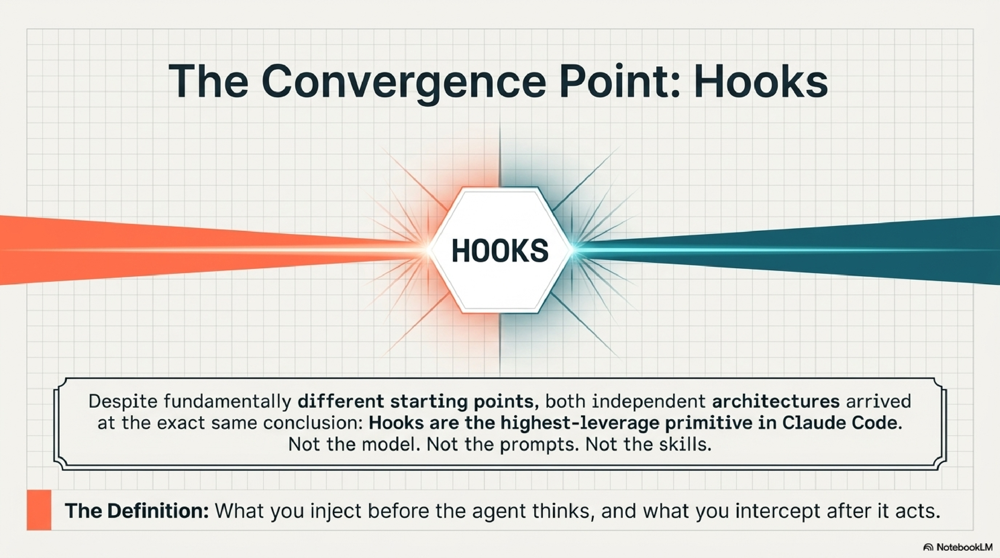

claude-code-best-practice is the best public resource on Claude Code workflows that exists. The orchestration patterns, the parallel agent model, the autonomous retry loop, the cross-model review -- these are production-grade ideas backed by the team that built the tool. Any practitioner using Claude Code should read it.

The ExoCortex solves a different problem. Not "how do I use Claude Code effectively" but "how do I keep an AI-augmented development practice coherent across 289 repos, 65,905 files, 476 skills, and 3,000+ sessions over months of continuous use." The answer turned out to be infrastructure: semantic memory, push-based context, behavioural scoring, deterministic maintenance. None of those are visible in a tips-and-tricks format because they are not tips. They are systems.

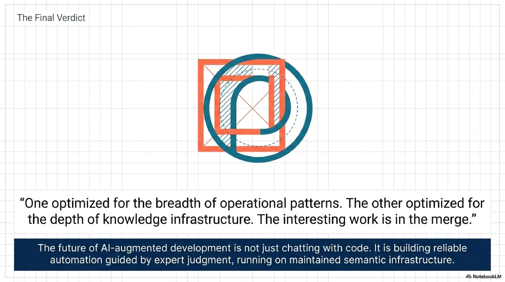

Two architects solved the same class of problem from different starting points. One optimised for breadth of patterns. The other optimised for depth of infrastructure. Both have something the other needs. The interesting work is in the merge.

---

*Totto is the founder of eXOReaction, an enterprise architecture consultancy in Oslo. He builds Synthesis, the ExoCortex, and the KCP specification. Thirty-plus years of enterprise systems. Currently comparing notes with people who build things that work.*
