# Recovering the Early History of javaBin

The jubileum is coming, and the requests for early facts have been piling up. When did javaBin
start? Who was at the founding meeting? How many people came to the first JavaZone? I have been
meaning to document this properly for years. The requests finally gave me the push.

The problem is that I used to have all of it. Every meeting announcement, every board document,
every version of java.no. It lived on my NAS drives at home. And then those drives died. This was
before we had good, free cloud storage — there was no obvious place to put a backup. So the archive
was just gone. Years of community history, vanished because of spinning disks and bad luck.

That gap has bothered me for a long time. javaBin was not just another user group. We built
something that measurably changed the Norwegian software industry, and the primary sources were
sitting in a landfill somewhere.

<!-- more -->

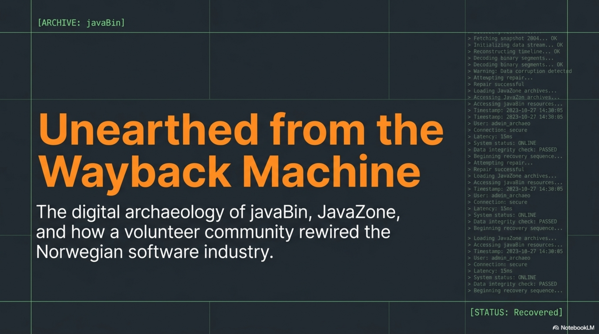

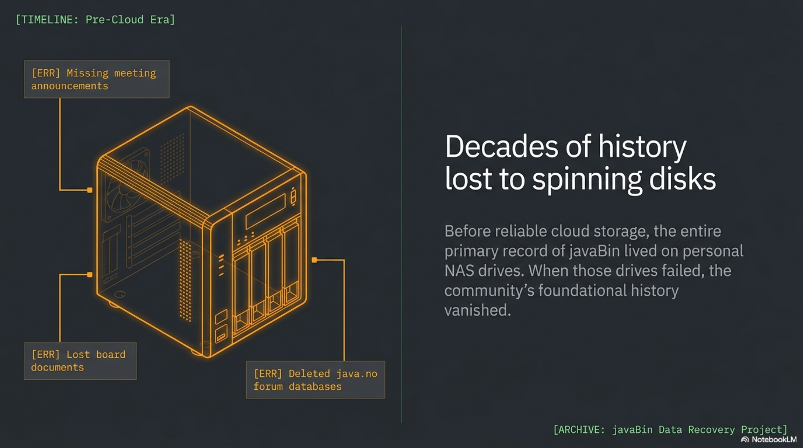

So in April 2026, I sat down and started recovering what I could. The Wayback Machine turned out
to be the archaeologist's tool. I wrote Python scripts against their CDX API, pulling snapshots of
java.no from 1997 through 2006. The encoding was a headache — the original site used ISO-8859-1,
which matters when your language has ø, æ, and å in half the words. But the snapshots came
through. I could see the site evolving: the sparse 1999 version with its forum and chat links, the
2001 portal announcing Ed Roman speaking about MessageDriven Beans, the 2003 golden era, the 2005
expansion with job listings and a proper blog section.

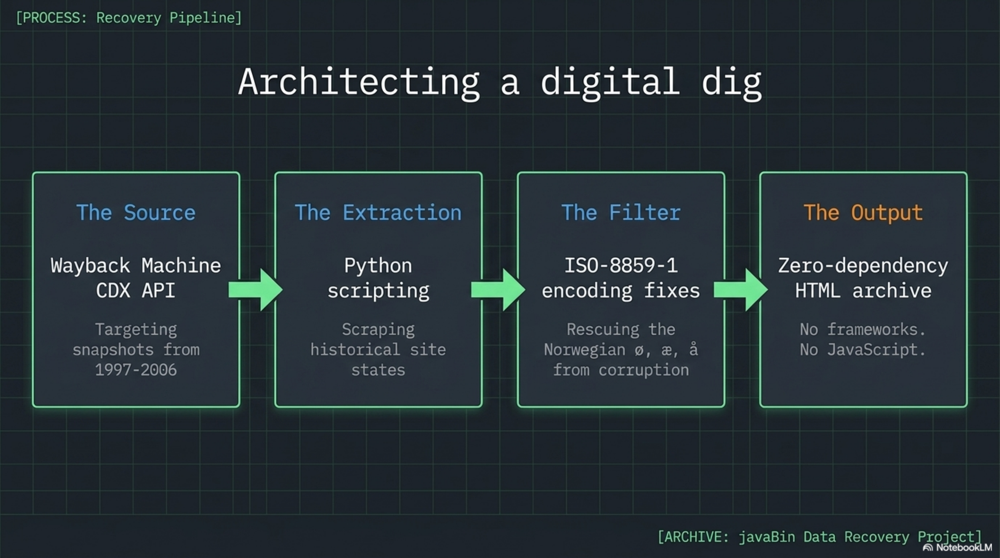

One moment in particular hit me. I pulled a 2004 Wayback snapshot and the original javaBin favicon
appeared. The actual logo, the one I had not seen in years, rendered from a GIF file that had been
sitting in the Wayback Machine's storage the whole time. A small thing, but it made the project
feel real.

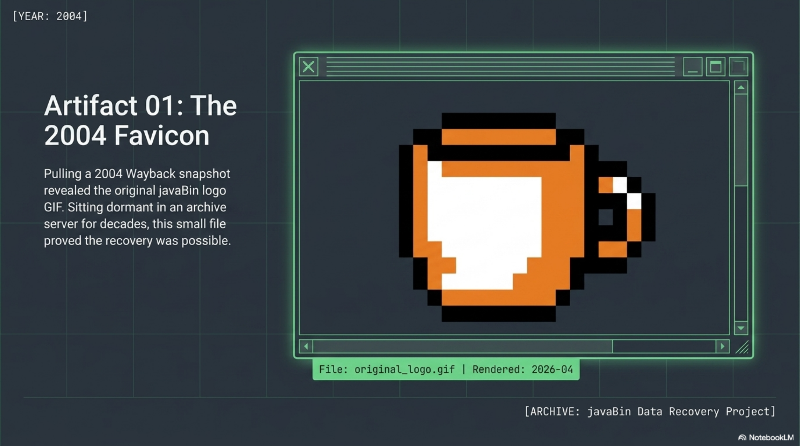

I also went back to the primary written sources. Olve Maudal wrote a tribute in September 2007,
the day after JavaZone 2007, when Stein Grimstad and I stepped down after six years of running the
conference together. Olve named the three main reasons JavaZone worked: Totto, Stein Grimstad, and
Carl Onstad. That is generous of him — there were many more people who made it happen. But Olve
was there, on the inside, and he saw it clearly. The official JavaZone 2009 backstory confirmed the
founding date: April 23, 1998.

That founding meeting, I should clarify, I was not at. Markus Harboe organized it, at Institutt
for Informatikk at the University of Oslo. I showed up at the second meeting and was elected
president there. I stayed for ten years.

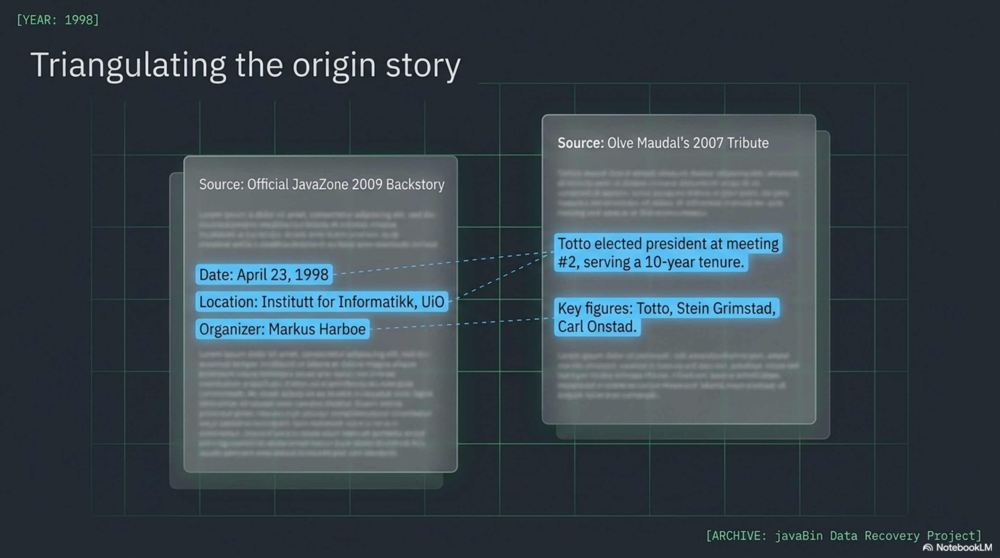

Why did I say yes? Because I had just come out of NTH/NTNU into the Norwegian consulting world —
I started at Taskon — and I was shocked by how little programming knowledge there was in the
businesses. I had been programming and getting paid for it since I was ten years old. The gap
between what I knew was possible and what Norwegian companies were actually doing with software was
enormous. javaBin was not an interest group. It was a reaction to that gap.

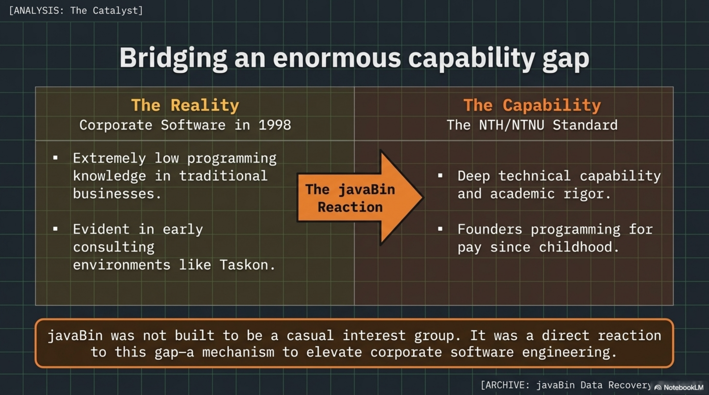

And it worked. We ran monthly meetings with real technical depth — 100 to 140 people showing up,
even on short notice. The java.no forum, which I built and maintained on JForum, became the place
where Norwegian developers discussed whether to use EJB or Spring, in Norwegian, using their real
names because they would see each other at the next meetup. We had 1–2 million hits per month at
peak. Trygve Reenskaug, the inventor of MVC, was a javaBin hero from the founding era. The
community had serious depth from the very beginning.

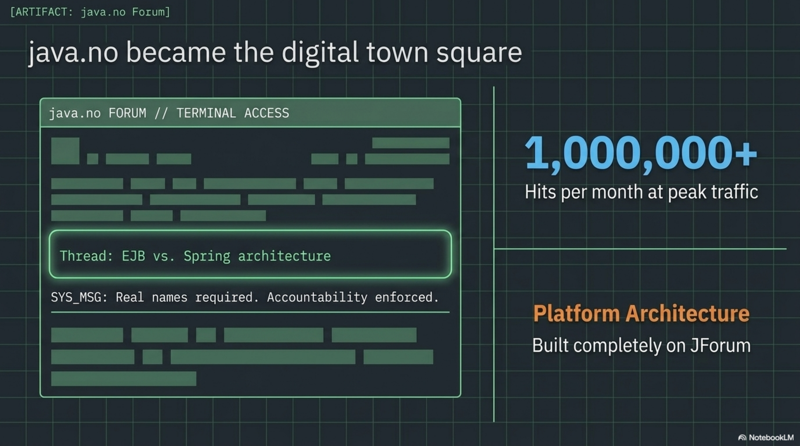

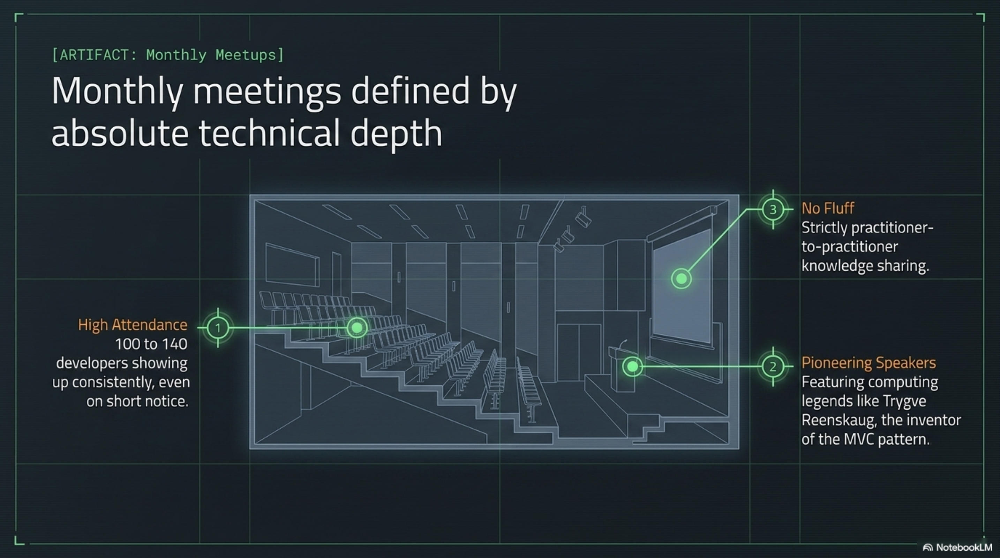

JavaZone started in 2002 with 350 people in the basement of Chateau Neuf. By 2007 it was 2,300
people at Oslo Spektrum with six tracks and two full days. In 2019 it won the Duke's Choice Award.
Last year it had 3,600 attendees. All of it organized by volunteers — no professional event
company, unpaid speakers, hand-picked talks. You could see the effect on the market: Oslo became
much more Java than cities like Copenhagen and Stockholm. That was not an accident. That was the
result of years of practitioners teaching practitioners.

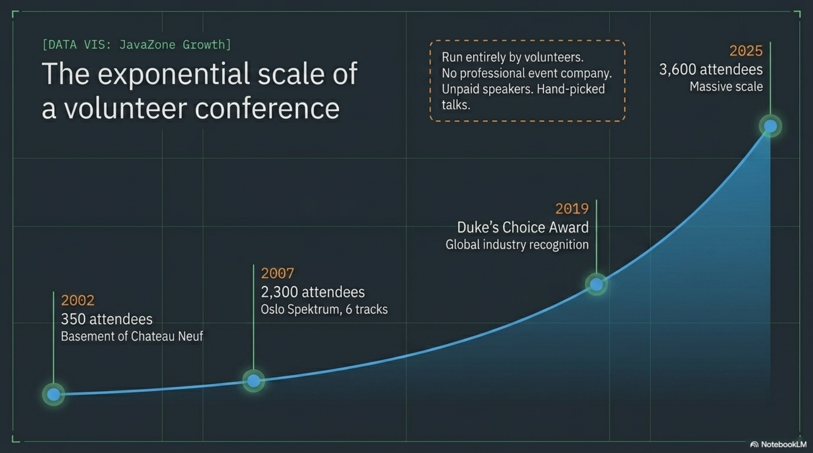

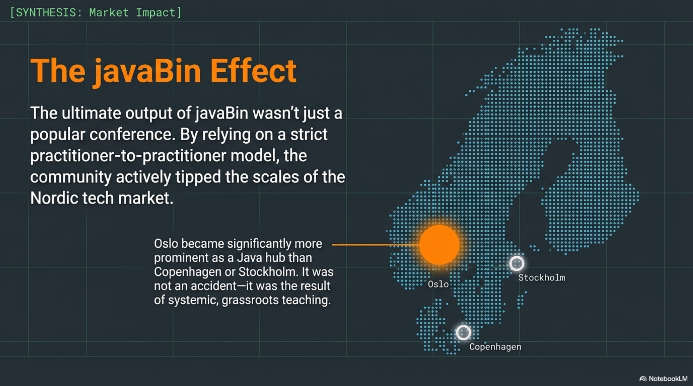

The Oslo effect extended beyond Java. javaBin's model — practitioners organizing for practitioners,
in Norwegian, with real technical depth and no vendor agenda — became a template. It directly
inspired the creation of other Norwegian user groups and meetup communities: agile practitioners,
.NET developers, IASA Norway (later OSWA), and others. A generation of Norwegian tech communities
grew up watching how javaBin did it, and built something similar in their own domain.

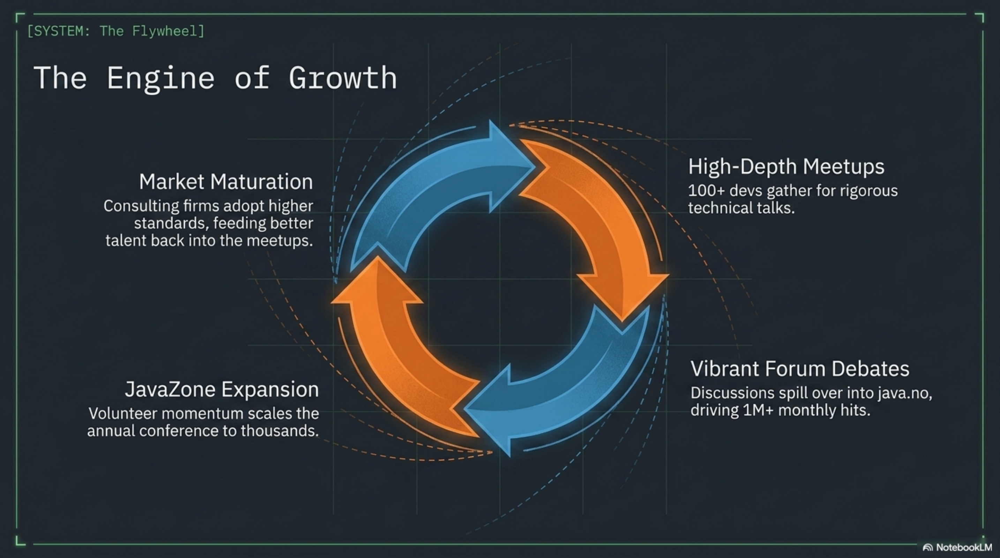

There are many more stories that could be added to make this more people-oriented. The board
members who showed up year after year. The consulting firms that shaped the community: ObjectWare,
ObjectNet, Mesan, WM-Data, Bekk. The later generation — Dervis Mansuroglu, Rustam Mehmandarov —
who took it forward and earned their own Java Champion titles. Those stories deserve to be told
properly, and they will be. But that is for another day.

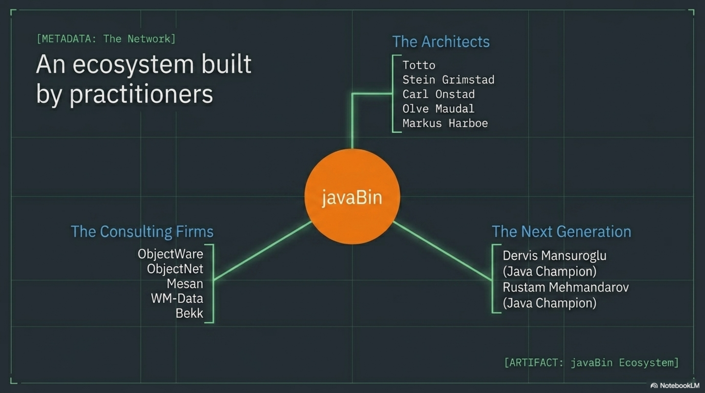

For now, the recovered archive is live. It is a plain HTML site with no frameworks, no build step,
no JavaScript dependencies. It opens in any browser. The sources — Wayback Machine snapshots,
Olve's tribute, the official JavaZone backstory, and my own firsthand memories — are all included
in the repository alongside the site.

You can find it here: [https://totto.github.io/javabin-archieve/](https://totto.github.io/javabin-archieve/)

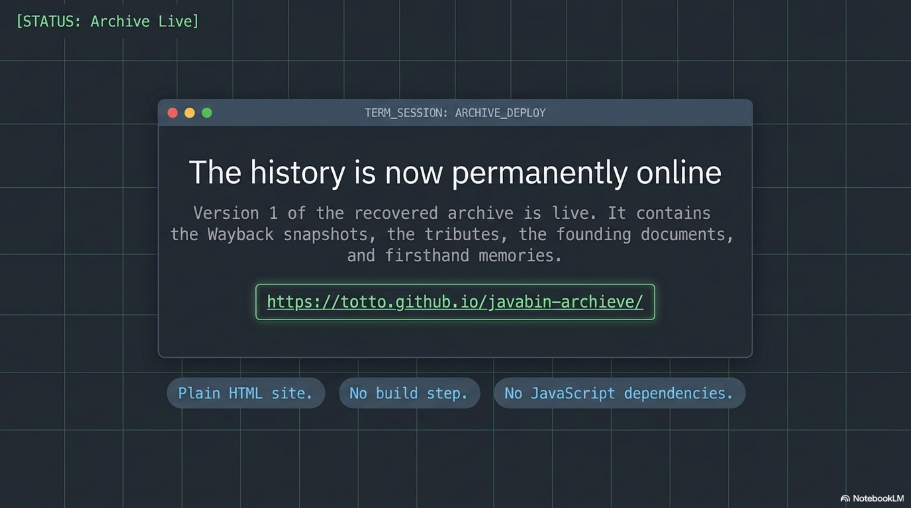

This is version one. It covers the founding, the people, the platform, and the growth of JavaZone.
It is not the final word. But the story exists now, and the next person who asks about the early
days will have something to point to.

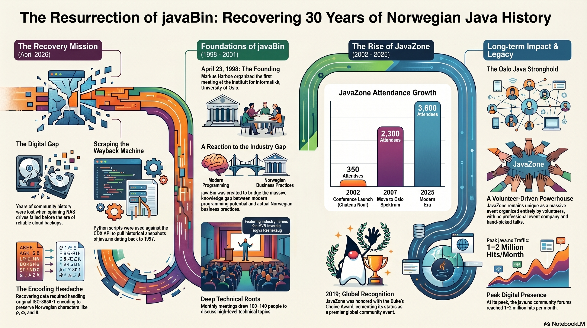

---

## Podcast

*NotebookLM Audio Overview — "The forensic recovery of javaBin history"*

<audio controls style="width:100%">
  <source src="/assets/javabin-history/podcast.m4a" type="audio/mp4">
</audio>

---

## Video

<video controls style="width:100%;border-radius:4px">
  <source src="/assets/javabin-history/recovering-javabin-history.mp4" type="video/mp4">
</video>
