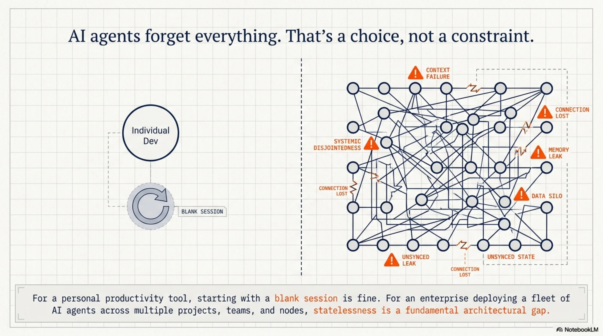
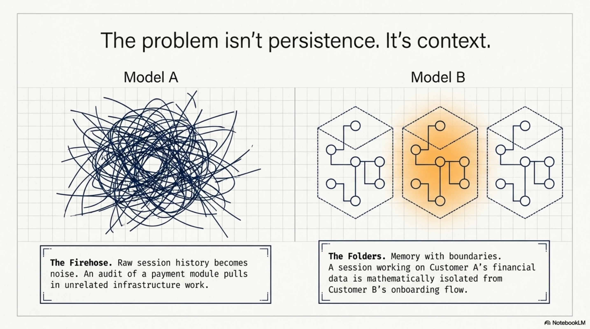
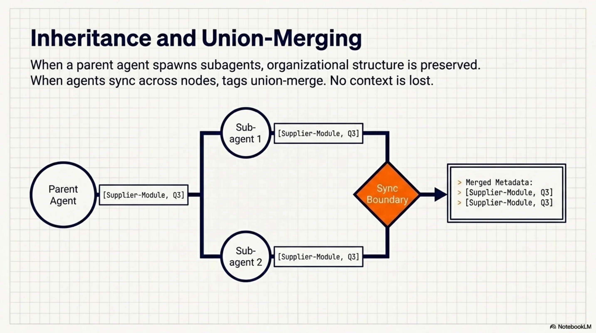
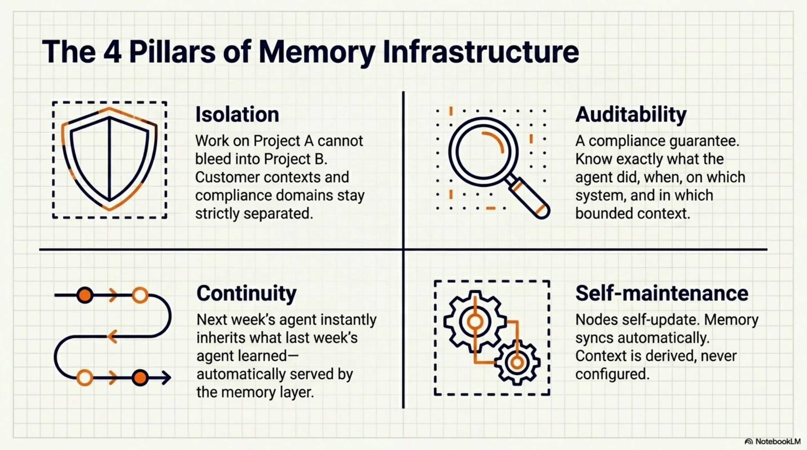
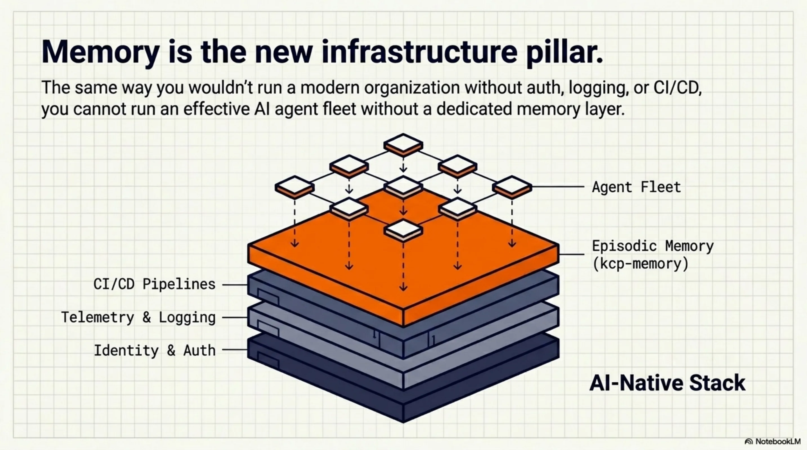

# AI agents forget everything. That's a choice, not a constraint.

Every session with Claude Code starts blank. No memory of last week's refactor, no awareness of which team worked on this module, no continuity between the agent you ran on Tuesday and the one running today.

For a personal productivity tool, that's fine. For an enterprise deploying a fleet of AI agents, it's a fundamental architectural gap.

<!-- more -->

The question we've been working on: what does memory infrastructure look like for AI agents at organizational scale?

<video controls style="width:100%;border-radius:8px;margin:1.5rem 0">
  <source src="https://github.com/totto/wiki/releases/download/media/distributed-memory-agent-fleets.mp4" type="video/mp4">
</video>

---

## The problem isn't just persistence

The obvious answer is "store the session history." We did that. But persistence alone doesn't solve the harder problem, which is *context*.

When you have agents running across multiple projects, teams, nodes, and compliance scopes, raw history becomes noise. What you need is memory that understands *where it belongs* — memory with boundaries.

A session working on customer A's financial data shouldn't surface when an agent is working on customer B's onboarding flow. An audit of the payment module shouldn't pull in unrelated infrastructure work. A compliance query should stay within its regulatory scope.

This is the gap between "we stored some session history" and "we have a memory layer."

---

## What we're building

Episodic memory for AI agent fleets — distributed, tagged, and context-aware.

Each session is indexed automatically: what project, which branch, which node, what stack, which agent in which hierarchy. Context is derived from the environment without requiring the agent to think about it. A `.kcp-tags` file in a project root is enough to define membership — all sessions in that directory tree belong to that context.

When agents sync across nodes, tags union-merge. No context gets lost at sync boundaries. When a parent agent spawns subagents, they inherit the parent's context tags. The organizational structure of the work is preserved in the memory layer.

The result: you can ask "what did the agents working on the supplier module do this week?" and get a coherent answer. You can scope queries by project, node, branch, regulatory domain. Memory becomes a queryable, bounded resource — not a firehose.

---

## Why this matters for enterprises

The enterprises deploying AI agent fleets at scale need the same properties from memory that they need from every other piece of infrastructure:

**Isolation.** Work on project A doesn't bleed into project B. Compliance domains stay separated. Customer contexts stay separated.

**Auditability.** What did the agent do, when, on which system, in which context? This is a compliance question, not just a developer convenience question.

**Continuity.** The agent that picks up a task next week can know what the agent last week tried and learned. Not because it was explicitly told — because the memory layer makes it available.

**Self-maintenance.** The infrastructure manages itself. Nodes self-update. Memory syncs automatically. Context is derived, not configured.

---

## The bigger picture

We're building infrastructure for the AI-native enterprise — the organizational layer below the agents themselves. The same way you wouldn't run a modern org without auth infrastructure, logging, or CI/CD, you won't run an effective AI agent fleet without memory infrastructure.

The interesting design challenges aren't technical. They're organizational: What are the right context boundaries? Who owns them? How do you express "this session belongs to this customer context" in a way that's both automatic and auditable?

Those are the questions we're working on. The open source foundation is at [github.com/Cantara/kcp-memory](https://github.com/Cantara/kcp-memory).

---

*Thor Henning Hetland (Totto) is founder of eXOReaction and Interim CTO at Mynder.*
