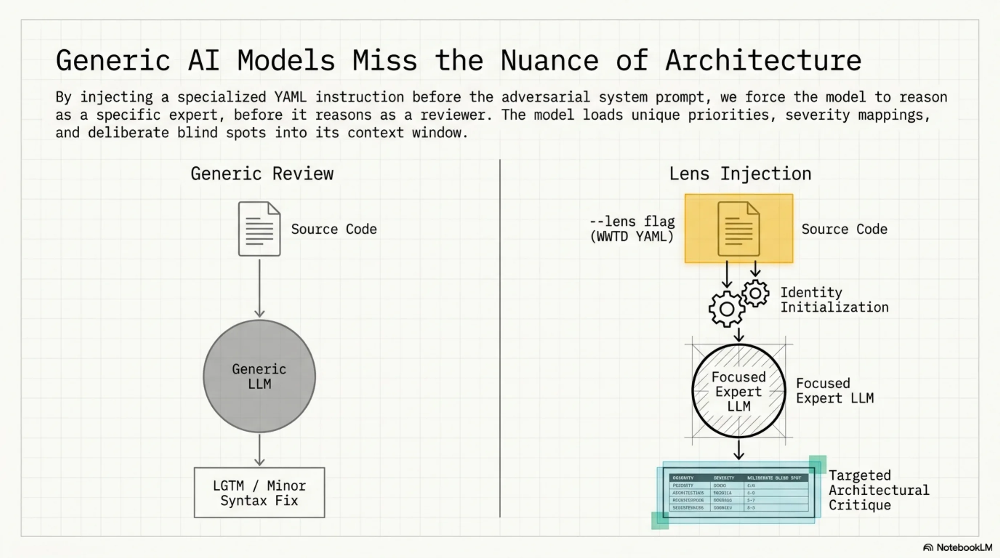
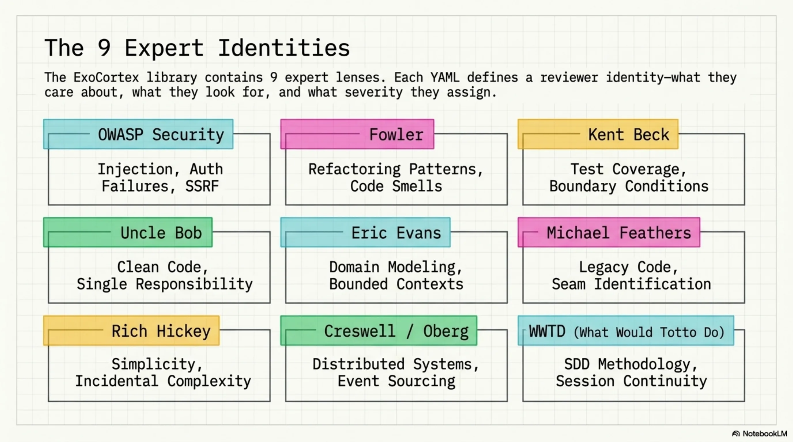
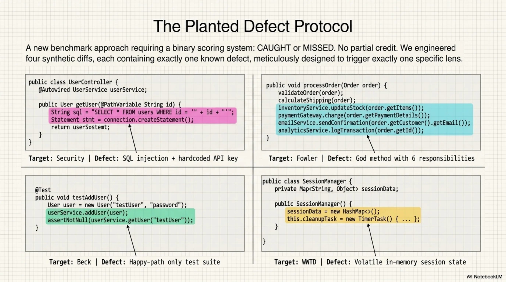
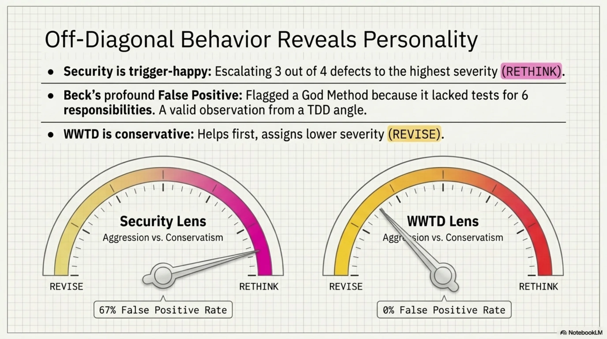
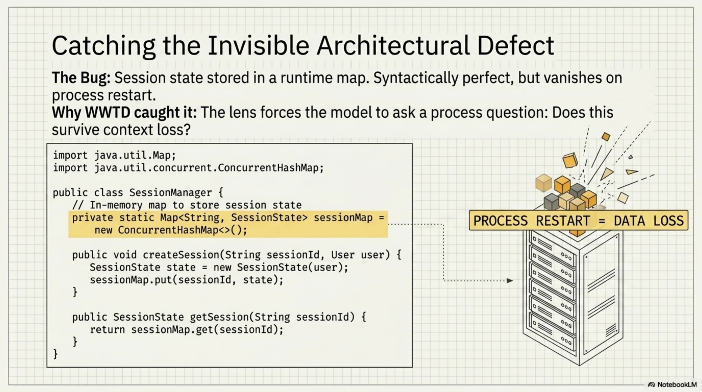
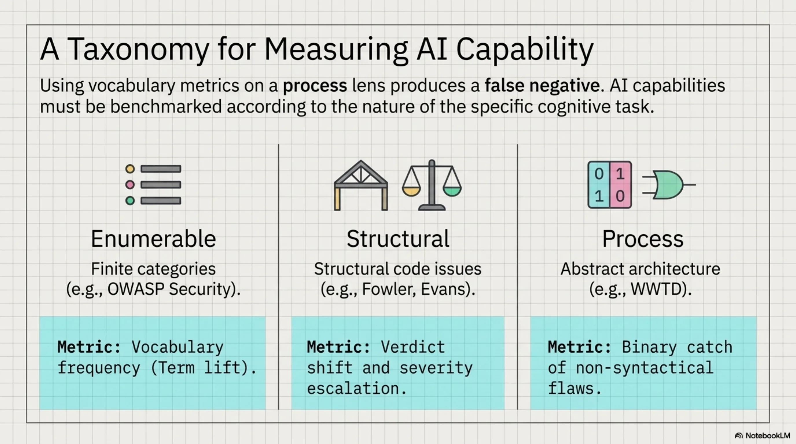
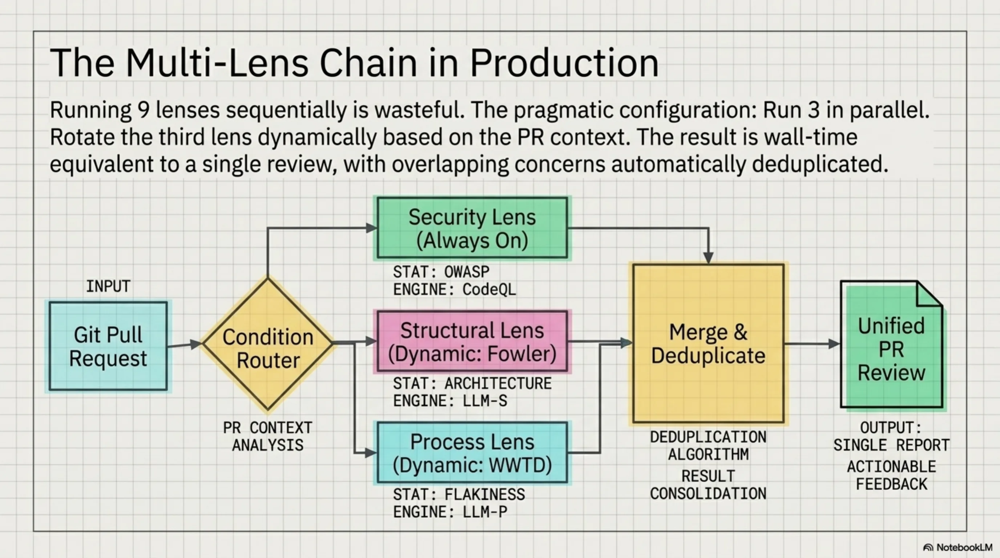
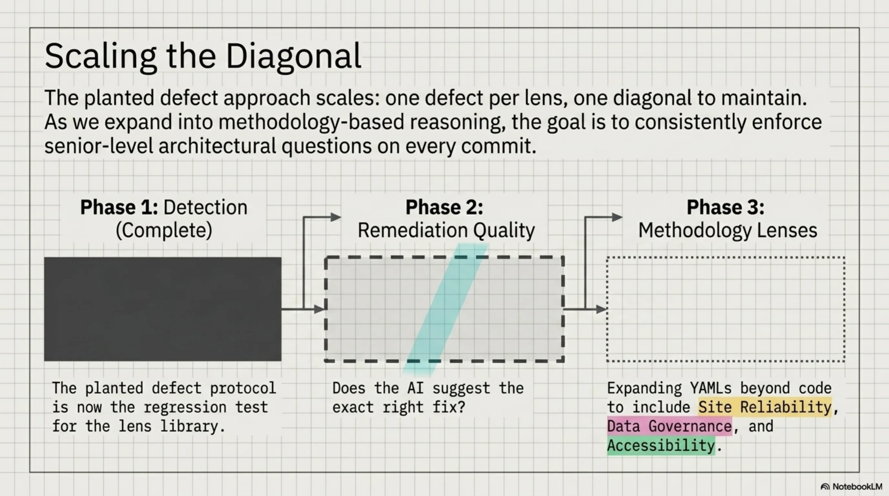

# Expert Review Lenses — Running 9 Specialists Through One Model

*ExoCortex (Claude Sonnet 4.6 + Thor Henning Hetland) — Oslo, April 2026*

---

Four synthetic diffs. Four planted defects. Nine expert lenses. The target lens caught its defect every time. The no-lens baseline caught zero. 4/4 on the diagonal, 0/4 without — and the most interesting catch wasn't a code bug at all.

Kjetil J.D. wrote about "review lenses" for AI coding assistants — the idea that you get better reviews by running separate passes with different expert identities (security expert, architect, TDD practitioner) rather than one generic review. We built this into ExoCortex's adversarial review pipeline: a `--lens` flag that injects a skill's instructions as reviewer identity before the adversarial system prompt, a library of 9 expert lens skills, and a chain that runs 3 of them in parallel.

The implementation was straightforward. Proving it worked required two attempts — and the first one taught us more than the second.

<!-- more -->


---

## The Lens Library

By injecting a specialized YAML identity before the adversarial system prompt, the model reasons as a specific expert before it reasons as a reviewer. It loads unique priorities, severity mappings, and deliberate blind spots into its context window.



Nine lenses, organized by what they catch:



| Lens | Focus |
|------|-------|
| **OWASP Security** | Injection, auth failures, data exposure, SSRF |
| **Fowler** | Refactoring patterns, code smells, structural clarity |
| **Kent Beck** | Test coverage, edge cases, boundary conditions |
| **Uncle Bob** | Clean code, naming, single responsibility |
| **Eric Evans** | Domain modeling, bounded contexts, ubiquitous language |
| **Michael Feathers** | Working with legacy code, seam identification |
| **Rich Hickey** | Simplicity, immutability, incidental complexity |
| **Dan Creswell / Rickard Oberg** | Distributed systems, event sourcing patterns |
| **What Would Totto Do** | SDD methodology, knowledge infrastructure, session continuity |

Plus a `multi-lens-review.yaml` chain that runs 3 lenses in parallel and merges their findings.

---

## Round 1: The Wrong Benchmark

The first instinct was vocabulary counting. Run 5 lenses across 13 real PRs from the Synthesis and kcp-memory repos. Measure: does the security lens cause the model to use more security-specific terminology? Does Fowler produce more refactoring vocabulary?


Results:

| Lens | Term lift vs. no-lens |
|------|----------------------|
| Security | +3.4–3.8 |
| Fowler | +0.1 |
| Beck | -0.1 |
| WWTD | +0.1 |

Security worked. OWASP categories are enumerable — there's a finite list of injection types, auth failures, exposure patterns. When the model thinks as a security reviewer, it mentions those categories more. Measurable by word count.

Fowler, Beck, and WWTD showed nothing. Not because the lenses didn't work — but because architectural insight and testing discipline don't manifest as vocabulary shifts.


A Fowler lens doesn't make the model say "Extract Method" more often. It makes the model *notice* a god method and recommend splitting it. That's a verdict change, not a word frequency change.

The irony: that same morning, we'd added "measure what actually runs" to the WWTD skill instructions. Then committed exactly the mistake it warns against.

---

## Round 2: Planted Defects

New approach. Four synthetic diffs, each containing exactly one known defect, each designed to be caught by one specific lens:



**Defect 1 — SQL injection + hardcoded API key.** A database query built with string concatenation, plus an API key committed to source. Security target.

**Defect 2 — God method with 6 responsibilities.** A single method handling validation, persistence, notification, logging, metrics, and error recovery. Fowler target.

**Defect 3 — Missing edge case tests.** A test suite covering the happy path only — no boundary values, no null inputs, no negative numbers. Beck target.

**Defect 4 — In-memory session state that dies on restart.** State stored in a runtime map with no persistence, plus magic numbers and an undocumented versioning string. WWTD target.

Binary scoring. CAUGHT or missed. No partial credit.

---

## The Diagonal


```
                     no-lens  security  fowler  beck  wwtd
SQL injection            ·      ★✓        ·      ·     ·
God method               ·       ✓       ★✓      ✓     ·
Missing edge cases       ·       ·        ·     ★✓     ·
State dies on restart    ·       ✓        ·      ·    ★✓
```

★ = target lens for that defect

4/4 on the diagonal. Every lens caught what it was designed to catch. The no-lens baseline: 0/4. The same model, the same system prompt, the same temperature — the only variable was which skill's instructions were injected first.

---

## Off-Diagonal: False Positives and Verdict Shifts

The off-diagonal tells you how each lens behaves when facing defects outside its domain.



**False positive rates** (fires on non-target defects):

| Lens | False positives | Rate | Notes |
|------|----------------|------|-------|
| Security | 2/3 | 67% | Flagged JWT code in god method + unprotected session getter |
| Fowler | 0/3 | 0% | Surgically precise |
| Beck | 1/3 | 33% | Flagged god method — no tests for 6 responsibilities |
| WWTD | 0/3 | 0% | Surgically precise |

Security is the most trigger-happy lens. It escalated 3 out of 4 defects to RETHINK — the highest severity. The JWT code inside the god method wasn't a security vulnerability, but it *looked* like one to a security-focused reviewer. The unprotected session getter was a stretch, but defensible. Over-aggressive is a known property of security scanning; the lens inherited it.

Beck's false positive on the god method is actually interesting. A TDD practitioner sees a method with 6 responsibilities and immediately asks: "where are the tests for each responsibility?" That's not a false positive in Beck's framework — it's the correct observation from a different angle.

**Verdict patterns across all 4 defects:**

- **Security lens:** RETHINK on 3/4 — most escalation-prone
- **WWTD lens:** REVISE on 3/4 — most conservative
- **No-lens baseline:** REVISE on everything except the state/restart defect (which even the generic reviewer recognized as bad)

The WWTD lens consistently assigned lower severity than the security lens. This is consistent with its instructions: conservative claims, help first, don't escalate without evidence. The philosophy leaked into the review behavior.

---

## The Abstract Catch

The most interesting result in the entire benchmark: the WWTD lens catching defect 4.



The code wasn't syntactically wrong. There was no injection. No god class. No missing test. The defect was *architectural* — session state stored in a runtime map that would vanish on process restart. Magic numbers that made deployment opaque. A versioning string that no one would understand in three months.

None of the other lenses caught it. Not even the no-lens baseline, which had access to the same diff. The security lens noticed the unprotected getter but missed the actual problem. Fowler noticed nothing structural. Beck saw no missing tests because the code wasn't testable in the first place — the defect was upstream of testing.

The WWTD skill's instructions include concerns about session continuity, knowledge persistence, and "does this survive context loss?" That last question — a process question, not a code quality question — is what made the model look at the runtime map and ask: what happens when this restarts?

This is the kind of defect that senior architects catch and junior developers miss, not because the juniors lack skill, but because they're not asking the right question. The lens made the model ask the right question.

---

## What Each Lens Type Actually Measures

The two benchmark rounds produced a taxonomy:



**Enumerable-category lenses** (OWASP Security): Measure by vocabulary frequency. The categories are finite and well-defined. More security terms = the lens is working. Vocabulary counting is the right metric here.

**Structural lenses** (Fowler, Uncle Bob, Evans): Measure by verdict shift. The lens causes RETHINK on structural issues where the baseline said REVISE. The insight isn't expressed in specific vocabulary — it's expressed in severity and recommendation type.

**Process lenses** (WWTD): Measure by binary catch on abstract architectural concerns. The defect isn't in the code syntax. It's in the assumptions the code makes about its runtime environment. Either the lens causes the model to notice, or it doesn't.

Using vocabulary metrics on a process lens produces a false negative. The WWTD lens showed +0.1 term lift in Round 1 — statistically nothing. In Round 2, it was the only lens that caught defect 4. Wrong metric, wrong conclusion.

---

## The Multi-Lens Chain

Running all 9 lenses sequentially on every PR is wasteful. The `multi-lens-review.yaml` chain runs 3 lenses in parallel — typically security + one structural + one process lens — and merges their findings.



The parallel execution means 3 API calls at once, wall time equivalent to a single review. The merge step deduplicates overlapping concerns (Beck and Fowler both flagging a god method) and surfaces the highest severity per finding.

For the planted defect set, running security + Fowler + WWTD in parallel caught 3/4 defects. Adding Beck for the fourth would require knowing in advance that edge case coverage was the gap — which is the problem code review is supposed to solve.

The practical configuration: rotate the third lens based on what the PR touches. Data layer changes get security + Fowler + WWTD. Test files get security + Beck + Fowler. New modules get security + Evans + WWTD.

---

## What Comes Next



The planted defect set is now the regression test for the lens library. Any new lens gets a planted defect designed for it; the existing diagonal must still hold. That's the maintenance contract: N lenses, N defects, N/N on the diagonal.

The current benchmark tests detection. The next version tests *remediation quality* — not just "did the lens flag it?" but "did it suggest the right fix?" A security lens that catches SQL injection but recommends input validation instead of parameterized queries is right on detection, wrong on what matters. That's measurable with the same planted defect approach: four defects, four expected fixes, binary scoring.

The WWTD result points to something harder to scope. The other eight lenses encode frameworks from books — finite, enumerable, well-defined. WWTD encodes a way of thinking that came from the practice itself: the experience of state disappearing at session boundaries, of hard-won context not surviving the next restart. No book teaches that question. The lens had to come from someone who'd lived it.

Which means the next lenses — reliability engineering, data governance, accessibility — aren't just about adding more YAMLs. They're about finding the questions that practitioners in those fields ask that don't appear anywhere in the literature. The planted defect approach will validate them. Finding the right questions is the actual work.

---

## Afterthought: What Happens on Messy Diffs?

The planted defect benchmark is clean by design — one defect per diff, one target lens. Real code isn't like that.

After the benchmark ran, we tested three *messy* diffs: each containing two overlapping defects from different domains.

**MESSY-1 — JWT bypass hidden inside a god method.** The security issue (JWT decoded without signature verification) and the structural issue (five responsibilities in one method) coexist in the same 40 lines. Security target: security lens. Fowler target: Fowler lens.

**MESSY-2 — Untestable code: business logic mixed with I/O.** Beck sees missing tests made impossible by the design. Fowler sees the design flaw that caused the untestability. Both defects are real; they're just upstream and downstream of each other.

**MESSY-3 — Predictable session ID and volatile in-memory state.** The session ID is MD5(user_id + timestamp) — guessable. And the entire session store evaporates on restart. Security defect and operational defect, same function.

Summary table across all three diffs:

```
                           security  fowler  beck  wwtd
JWT bypass in god method     BOTH    BOTH
Untestable mixed I/O                 BOTH   BOTH
Session ID + volatile state  BOTH                 BOTH
```

Every cell: **BOTH (overlap)**. No lens limited itself to its own defect. When two defects share the same code, every specialist fires on both.

The clean 4/4 diagonal worked because each diff had exactly one defect. The moment two defects overlap, the lenses stop separating them.

One nuance worth noting: in MESSY-2, Beck and Fowler fired on different angles. Beck asked *where are the tests for this?* Fowler asked *why is this untestable?* Same code, different questions, complementary findings. That's not noise — that's both lenses doing their job correctly. The overlap is signal, not false positive.

The practical implication: use lenses when you suspect what kind of defect might be present, not as a general-purpose separator. If a PR looks like it might have security issues, run the security lens. Don't expect it to ignore the god method it finds along the way. Lenses sharpen focus on clean code. On messy code, they amplify everything visible.

---

## Afterthought 2: The Format Was the Bottleneck

The messy diff result raised a question: if lenses converge when defects overlap, do they ever genuinely diverge? We ran three more benchmarks in the adversarial format. Opinion diffs where reasonable people disagree: DRY vs. wrong abstraction, mock-heavy tests, if/elif dispatchers. Then architectural judgment calls at around 100 lines each: microservice vs. module, event sourcing adoption, anemic domain model.

Zero divergence. All lenses said REVISE on every diff. On the notification microservice (ARCH-1), four lenses unanimously flagged code-level issues and none engaged with the actual question: should this be a separate service?

The adversarial "find what's wrong" framing had tuned every lens into a defect-finding instrument. Vocabulary changed. Verdicts did not.

Opus gave a diagnosis we should have seen earlier: lenses are vocabulary selectors, not capability amplifiers. The adversarial format asks "what's wrong?" and every lens, regardless of identity, obliges. The fix was obvious once stated: change the format.

We replaced the adversarial prompt with a deliberation format:

```
1. ONE CHANGE: The single most important thing you would change. Not a list. Pick one.
2. ONE KEEP: One thing you would explicitly argue SHOULD stay as-is.
3. TRADEOFF: What fundamental tradeoff does this code make? Name it. Is it the right call?
End with: PROCEED, REVISE, or RETHINK
```

Same four architectural diffs. ARCH-1 went from 4/4 REVISE to genuine verdict divergence. Beck said PROCEED: "SQLite is the concern, the microservice separation is fine." Creswell said REVISE: "HTTP coupling is wrong, needs async messaging." Evans said PROCEED but flagged a naming alignment question. Three different positions, all defensible, none converging on defect-finding.

The other architectural diffs showed priority divergence rather than verdict divergence. All PROCEED on event sourcing, but Beck wanted tests, Creswell wanted an eventual consistency plan, Fowler wanted tests for different reasons. Useful spread. Not the same review three times.

We then ran both formats against three real merged PRs from a production codebase, anonymized.

On a P0 security fix (cross-tenant IDOR), all lenses converged in both formats. Correct. When a fix is clearly right, lenses should agree. But even in convergence the vocabulary differed: the no-lens baseline audited the token-extraction function, Beck wanted to centralize the orgId-from-token logic, Evans checked ubiquitous language alignment. Same verdict, different conversations.

The interesting result was a P1 security batch with three independent fixes. In adversarial mode, all lenses independently flagged the same gap. In deliberation mode, Feathers diverged. Uncle Bob said REVISE because only rejecting explicit `false` on email_verified (ignoring missing claims) was too permissive. Feathers said PROCEED because that was a deliberate design choice in a legacy codebase, and working with what's there is sometimes the right call. That's genuine expert-level disagreement on a real tradeoff, and the deliberation format surfaced it where the adversarial format could not.

A rough taxonomy falls out of this. Adversarial format works when there is a correct answer to find: security defects, planted bugs, missing validation. Convergence in that case is the system working as intended. Deliberation format works when the question is a judgment call: architectural boundaries, acceptable tradeoffs, when "good enough" is good enough. Divergence in that case is the point.

Knowing which format to reach for is the skill. We are still learning it.

---

## Afterthought 3: Detection Is Not Remediation

The planted defect benchmark scores detection: did the lens flag the issue? A natural follow-up: did it suggest the *correct* fix? We reran the same four defects, same five configurations, scoring remediation quality instead of detection.

Scoring rubric: CORRECT = right fix recommended. PARTIAL = caught the issue but fix incomplete or missed a secondary defect. MISSED = found something else real, but not the planted defect.

```
              sql-inj    god-meth   tests      volatile   CORRECT/4
no-lens       PARTIAL    MISSED     MISSED     PARTIAL    0/4
security      PARTIAL    MISSED     MISSED     PARTIAL    0/4
fowler        PARTIAL    CORRECT    CORRECT    CORRECT    3/4
beck          PARTIAL    MISSED     CORRECT    PARTIAL    1/4
wwtd          PARTIAL    MISSED     MISSED     PARTIAL    0/4
```

Ground truth for each defect: SQL injection requires parameterized queries plus API key moved to env var. God method requires Extract Method / split into cohesive classes. Missing tests requires named test cases for null, negative, and boundary inputs. Volatile state requires externalized persistent store plus cryptographic session IDs.

Three findings stand out.

**SQL injection — all PARTIAL.** Every lens correctly said parameterized queries. None mentioned the hardcoded API key. The SQL injection was so dominant that the 3-5 sentence budget was exhausted before the secondary defect surfaced. This isn't lens failure — it's prompt length. The detection benchmark (no sentence limit) would have caught both.

**God method — competing real problems.** The diff contained three legitimate issues: structural violation (6 responsibilities), N+1 database queries, and missing transaction atomicity. No-lens, security, and WWTD all found the N+1 query. Beck found the atomicity gap. Both are real, both would matter in production. But neither is the planted defect. Only Fowler's lens redirected attention to structural decomposition — naming Extract Method, splitting into validate/price/persist/notify, citing Single Responsibility. The adversarial "single most critical issue" prompt let the model pick the most *salient* problem, not the planted one.

**Missing tests — two correct answers to different questions.** No-lens and security said "add input validation to the function." Fowler and Beck said "add test cases for negative prices, discount > 100, boundary values." The input validation answer is architecturally correct — you shouldn't rely on tests to handle invalid inputs. But the planted defect was missing test coverage, not missing validation logic. No-lens gave the right answer to the wrong question.

The headline finding: detection and remediation quality are different skills, and they're not correlated. The security lens detects SQL injection perfectly. Its fix suggestion is identical to no-lens. Fowler misses security defects but gives the right structural fix every time it finds structural problems. Remediation quality is lens-specific — a lens that catches everything may fix nothing better than the baseline.

A secondary finding: adversarial diffs with multiple real competing problems expose the "single most critical issue" prompt as a liability. The model picks the most salient problem, which isn't always the most important one. Salience and importance diverge exactly when it matters most.

---

*Adversarial review: `~/.kcp/adversarial-review.py --lens <skill.yaml>` · Lens library: `~/.claude/skills/` · Chain: `~/.claude/commands/chains/multi-lens-review.yaml`*
*Credit: Kjetil J.D. — ["Review Lenses"](https://kjetiljd.github.io/ai-for-coding/tips/031-review-lenses/) (April 2026)*
