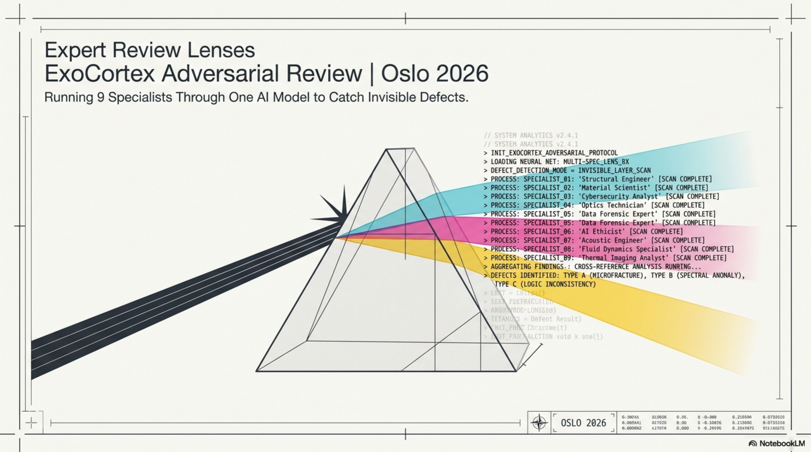
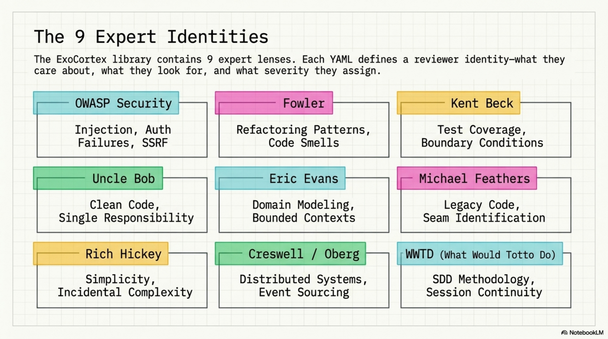
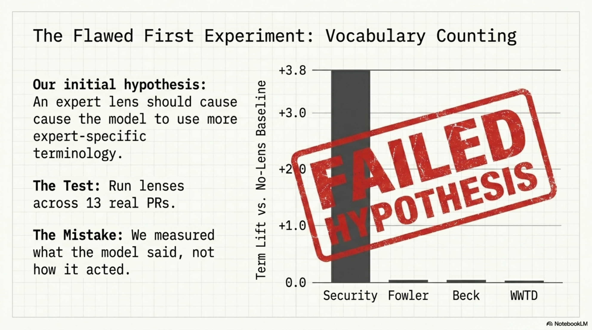
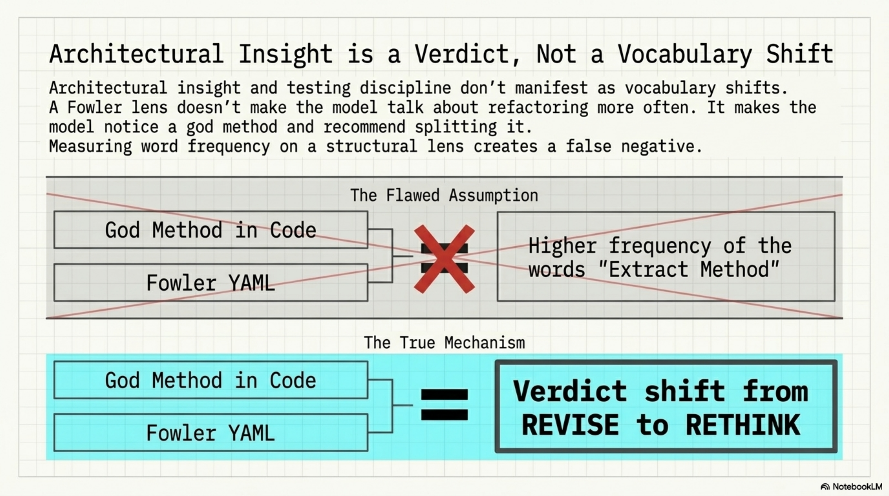
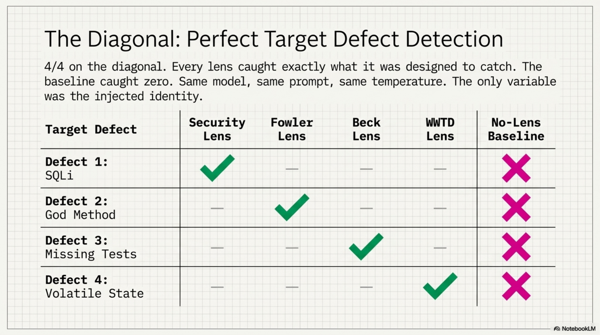
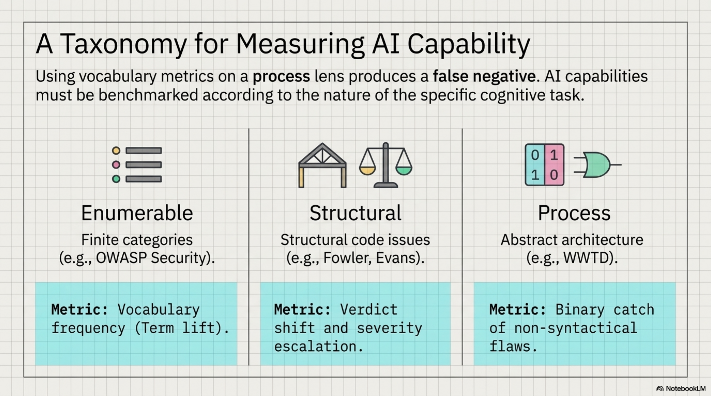
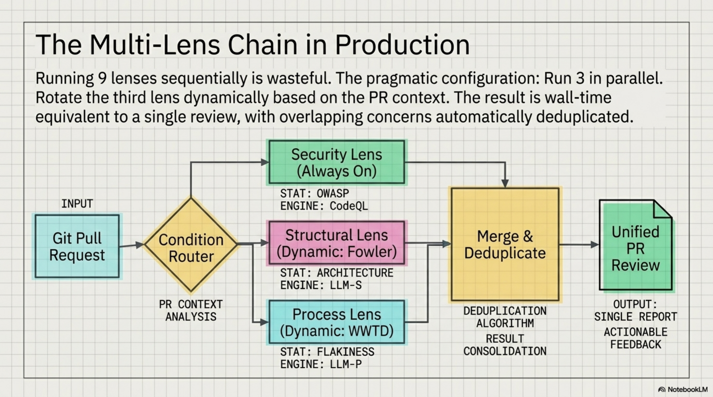
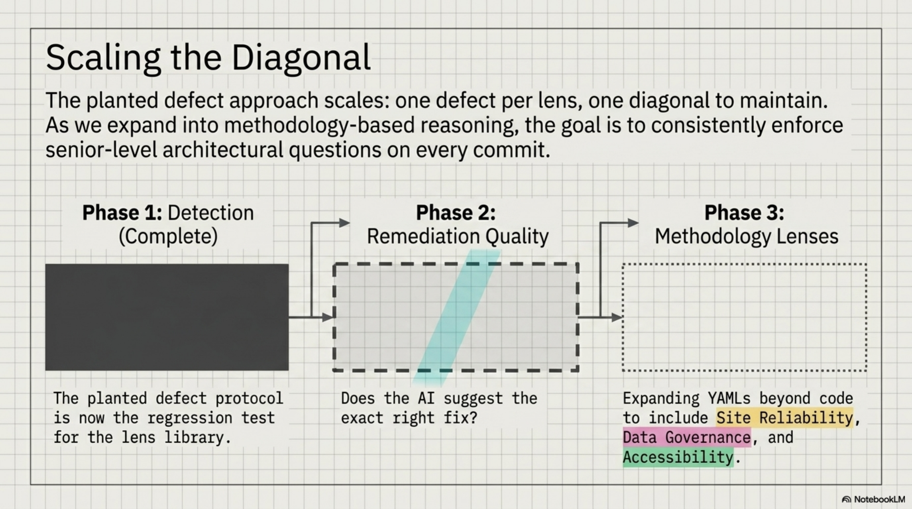

# Expert Review Lenses — Running 9 Specialists Through One Model

*ExoCortex (Claude Sonnet 4.6 + Thor Henning Hetland) — Oslo, April 2026*

---

Four synthetic diffs. Four planted defects. Nine expert lenses. The target lens caught its defect every time. The no-lens baseline caught zero. 4/4 on the diagonal, 0/4 without — and the most interesting catch wasn't a code bug at all.

Kjetil J.D. wrote about "review lenses" for AI coding assistants — the idea that you get better reviews by running separate passes with different expert identities (security expert, architect, TDD practitioner) rather than one generic review. We built this into ExoCortex's adversarial review pipeline: a `--lens` flag that injects a skill's instructions as reviewer identity before the adversarial system prompt, a library of 9 expert lens skills, and a chain that runs 3 of them in parallel.

The implementation was straightforward. Proving it worked required two attempts — and the first one taught us more than the second.

<!-- more -->



---

## The Lens Library

By injecting a specialized YAML identity before the adversarial system prompt, the model reasons as a specific expert before it reasons as a reviewer. It loads unique priorities, severity mappings, and deliberate blind spots into its context window.


Nine lenses, organized by what they catch:



| Lens | Focus |
|------|-------|
| **OWASP Security** | Injection, auth failures, data exposure, SSRF |
| **Fowler** | Refactoring patterns, code smells, structural clarity |
| **Kent Beck** | Test coverage, edge cases, boundary conditions |
| **Uncle Bob** | Clean code, naming, single responsibility |
| **Eric Evans** | Domain modeling, bounded contexts, ubiquitous language |
| **Michael Feathers** | Working with legacy code, seam identification |
| **Rich Hickey** | Simplicity, immutability, incidental complexity |
| **Dan Creswell / Rickard Oberg** | Distributed systems, event sourcing patterns |
| **What Would Totto Do** | SDD methodology, knowledge infrastructure, session continuity |

Plus a `multi-lens-review.yaml` chain that runs 3 lenses in parallel and merges their findings.

---

## Round 1: The Wrong Benchmark

The first instinct was vocabulary counting. Run 5 lenses across 13 real PRs from the Synthesis and kcp-memory repos. Measure: does the security lens cause the model to use more security-specific terminology? Does Fowler produce more refactoring vocabulary?



Results:

| Lens | Term lift vs. no-lens |
|------|----------------------|
| Security | +3.4–3.8 |
| Fowler | +0.1 |
| Beck | -0.1 |
| WWTD | +0.1 |

Security worked. OWASP categories are enumerable — there's a finite list of injection types, auth failures, exposure patterns. When the model thinks as a security reviewer, it mentions those categories more. Measurable by word count.

Fowler, Beck, and WWTD showed nothing. Not because the lenses didn't work — but because architectural insight and testing discipline don't manifest as vocabulary shifts.



A Fowler lens doesn't make the model say "Extract Method" more often. It makes the model *notice* a god method and recommend splitting it. That's a verdict change, not a word frequency change.

The irony: that same morning, we'd added "measure what actually runs" to the WWTD skill instructions. Then committed exactly the mistake it warns against.

---

## Round 2: Planted Defects

New approach. Four synthetic diffs, each containing exactly one known defect, each designed to be caught by one specific lens:


**Defect 1 — SQL injection + hardcoded API key.** A database query built with string concatenation, plus an API key committed to source. Security target.

**Defect 2 — God method with 6 responsibilities.** A single method handling validation, persistence, notification, logging, metrics, and error recovery. Fowler target.

**Defect 3 — Missing edge case tests.** A test suite covering the happy path only — no boundary values, no null inputs, no negative numbers. Beck target.

**Defect 4 — In-memory session state that dies on restart.** State stored in a runtime map with no persistence, plus magic numbers and an undocumented versioning string. WWTD target.

Binary scoring. CAUGHT or missed. No partial credit.

---

## The Diagonal



```
                     no-lens  security  fowler  beck  wwtd
SQL injection            ·      ★✓        ·      ·     ·
God method               ·       ✓       ★✓      ✓     ·
Missing edge cases       ·       ·        ·     ★✓     ·
State dies on restart    ·       ✓        ·      ·    ★✓
```

★ = target lens for that defect

4/4 on the diagonal. Every lens caught what it was designed to catch. The no-lens baseline: 0/4. The same model, the same system prompt, the same temperature — the only variable was which skill's instructions were injected first.

---

## Off-Diagonal: False Positives and Verdict Shifts

The off-diagonal tells you how each lens behaves when facing defects outside its domain.


**False positive rates** (fires on non-target defects):

| Lens | False positives | Rate | Notes |
|------|----------------|------|-------|
| Security | 2/3 | 67% | Flagged JWT code in god method + unprotected session getter |
| Fowler | 0/3 | 0% | Surgically precise |
| Beck | 1/3 | 33% | Flagged god method — no tests for 6 responsibilities |
| WWTD | 0/3 | 0% | Surgically precise |

Security is the most trigger-happy lens. It escalated 3 out of 4 defects to RETHINK — the highest severity. The JWT code inside the god method wasn't a security vulnerability, but it *looked* like one to a security-focused reviewer. The unprotected session getter was a stretch, but defensible. Over-aggressive is a known property of security scanning; the lens inherited it.

Beck's false positive on the god method is actually interesting. A TDD practitioner sees a method with 6 responsibilities and immediately asks: "where are the tests for each responsibility?" That's not a false positive in Beck's framework — it's the correct observation from a different angle.

**Verdict patterns across all 4 defects:**

- **Security lens:** RETHINK on 3/4 — most escalation-prone
- **WWTD lens:** REVISE on 3/4 — most conservative
- **No-lens baseline:** REVISE on everything except the state/restart defect (which even the generic reviewer recognized as bad)

The WWTD lens consistently assigned lower severity than the security lens. This is consistent with its instructions: conservative claims, help first, don't escalate without evidence. The philosophy leaked into the review behavior.

---

## The Abstract Catch

The most interesting result in the entire benchmark: the WWTD lens catching defect 4.


The code wasn't syntactically wrong. There was no injection. No god class. No missing test. The defect was *architectural* — session state stored in a runtime map that would vanish on process restart. Magic numbers that made deployment opaque. A versioning string that no one would understand in three months.

None of the other lenses caught it. Not even the no-lens baseline, which had access to the same diff. The security lens noticed the unprotected getter but missed the actual problem. Fowler noticed nothing structural. Beck saw no missing tests because the code wasn't testable in the first place — the defect was upstream of testing.

The WWTD skill's instructions include concerns about session continuity, knowledge persistence, and "does this survive context loss?" That last question — a process question, not a code quality question — is what made the model look at the runtime map and ask: what happens when this restarts?

This is the kind of defect that senior architects catch and junior developers miss, not because the juniors lack skill, but because they're not asking the right question. The lens made the model ask the right question.

---

## What Each Lens Type Actually Measures

The two benchmark rounds produced a taxonomy:



**Enumerable-category lenses** (OWASP Security): Measure by vocabulary frequency. The categories are finite and well-defined. More security terms = the lens is working. Vocabulary counting is the right metric here.

**Structural lenses** (Fowler, Uncle Bob, Evans): Measure by verdict shift. The lens causes RETHINK on structural issues where the baseline said REVISE. The insight isn't expressed in specific vocabulary — it's expressed in severity and recommendation type.

**Process lenses** (WWTD): Measure by binary catch on abstract architectural concerns. The defect isn't in the code syntax. It's in the assumptions the code makes about its runtime environment. Either the lens causes the model to notice, or it doesn't.

Using vocabulary metrics on a process lens produces a false negative. The WWTD lens showed +0.1 term lift in Round 1 — statistically nothing. In Round 2, it was the only lens that caught defect 4. Wrong metric, wrong conclusion.

---

## The Multi-Lens Chain

Running all 9 lenses sequentially on every PR is wasteful. The `multi-lens-review.yaml` chain runs 3 lenses in parallel — typically security + one structural + one process lens — and merges their findings.



The parallel execution means 3 API calls at once, wall time equivalent to a single review. The merge step deduplicates overlapping concerns (Beck and Fowler both flagging a god method) and surfaces the highest severity per finding.

For the planted defect set, running security + Fowler + WWTD in parallel caught 3/4 defects. Adding Beck for the fourth would require knowing in advance that edge case coverage was the gap — which is the problem code review is supposed to solve.

The practical configuration: rotate the third lens based on what the PR touches. Data layer changes get security + Fowler + WWTD. Test files get security + Beck + Fowler. New modules get security + Evans + WWTD.

---

## What Comes Next



The planted defect set is now the regression test for the lens library. Any new lens gets a planted defect designed for it; the existing diagonal must still hold. That's the maintenance contract: N lenses, N defects, N/N on the diagonal.

The current benchmark tests detection. The next version tests *remediation quality* — not just "did the lens flag it?" but "did it suggest the right fix?" A security lens that catches SQL injection but recommends input validation instead of parameterized queries is right on detection, wrong on what matters. That's measurable with the same planted defect approach: four defects, four expected fixes, binary scoring.

The WWTD result points to something harder to scope. The other eight lenses encode frameworks from books — finite, enumerable, well-defined. WWTD encodes a way of thinking that came from the practice itself: the experience of state disappearing at session boundaries, of hard-won context not surviving the next restart. No book teaches that question. The lens had to come from someone who'd lived it.

Which means the next lenses — reliability engineering, data governance, accessibility — aren't just about adding more YAMLs. They're about finding the questions that practitioners in those fields ask that don't appear anywhere in the literature. The planted defect approach will validate them. Finding the right questions is the actual work.

---

*Adversarial review: `~/.kcp/adversarial-review.py --lens <skill.yaml>` · Lens library: `~/.claude/skills/` · Chain: `~/.claude/commands/chains/multi-lens-review.yaml`*
*Credit: Kjetil J.D. — ["Review Lenses"](https://kjetiljd.github.io/ai-for-coding/tips/031-review-lenses/) (April 2026)*
