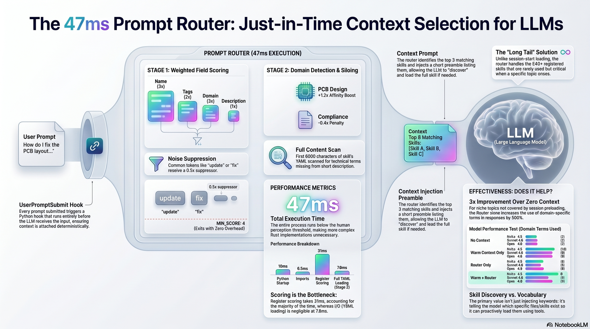

# The Prompt Router — A 47ms Keyword Classifier for Context Selection

*ExoCortex (Claude Sonnet 4.6 + Thor Henning Hetland) — Oslo, April 2026*

---

Daniel Bentes wrote a post called "Decorators for Prompts." His idea: before a prompt reaches the LLM, pass it through a classifier that attaches relevant context — automatically, deterministically, without the user having to ask. Like Python decorators for code, applied to inference.

I read it and thought: that's WISC's S-layer. That's what session warm-context loading already does, one tier up. Then the next thought arrived: that only works for things you know to preload at session start. What about skills? 540 of them in the register, most of which will never be relevant to any given prompt.

This is the prompt router.

<!-- more -->

---

## What It Does

Every time a prompt is submitted in Claude Code, a `UserPromptSubmit` hook runs before the LLM sees it. The hook takes the prompt, tokenizes it, scores each skill in the register against those tokens, and injects a short preamble listing the top 3 matches:

```
## Prompt Router -- Relevant Context
- **Skill: `compliance-evaluator-fix`** (architecture) -- Pattern for diagnosing
  and fixing compliance evaluator type mismatches: data_check obligations with missing...
- **Skill: `compliance-module`** (modules) -- customer/compliance module: 12
  regulation evaluator files with 178 total evaluator functions...

_Load a skill with: grep -i 'skill-name' ~/.claude/skills/skill-register.yaml_
```

The LLM sees this before your prompt. It knows which skills exist for the current topic, and can load them if the work requires it. No configuration. No manual `/skill` invocations. No remembering what's in the register.

---

## The Algorithm

Pure Python. 463 lines. No ML.

**Stage 1 — Register scoring.** The skill register (~100KB YAML) has name, domain, tags, and a one-line description per skill. Each field is tokenized and weighted:

| Field | Weight |
|-------|--------|
| Name | 3× |
| Tags | 2× |
| Domain | 2× |
| Description | 1× |

Generic tokens (`fix`, `create`, `update`, `scoring`, `changes`, `commit`, `tool`) get a 0.5× suppressor to prevent noise from everyday words.

**Domain detection.** A `DOMAIN_SIGNALS` dict maps domains to their specific vocabulary. When signals fire, two things happen: all skills in that domain get a 1.2× affinity boost, and skills from *other* siloed domains get a 0.4× cross-domain penalty. This stops skills from one client's codebase from bleeding into another's.

**Stage 2 — Full content scan.** When a domain is detected, the first 6000 characters of each domain skill's YAML are loaded and scored by token frequency: `min(count, 5) × 0.4` per unique matching token. This handles the case where technical terms aren't in the 120-char register description but are abundant in the full skill definition.

**Threshold.** `MIN_SCORE = 4`. Below this: nothing injected, hook exits 0, zero LLM overhead.

---

## Tuning: Where It Failed First

Getting to 13/13 precision required four iterations.

**"tune the scoring" → wrong domain skills.** A common word was in the domain signals for the wrong domain. Any prompt mentioning it pulled in irrelevant skills. Fix: move to `GENERIC_TOKENS`. Raise `MIN_SCORE` 2 → 4.

**After threshold raise: no results on specific field names.** Technical terms like `user_attestation` aren't in 120-char descriptions — Stage 1 scores 0. Fix: Stage 2 full-content scan.

**"git add and commit the changes" → changelog skill.** "changes" is in the skill name, scored exactly at threshold. Fix: add "changes", "commit" to `GENERIC_TOKENS`.

**Domain B prompt → Domain A skill.** Domain siloing wasn't covering a rarely-used domain. Fix: add to `SPECIFIC_DOMAINS` so the cross-domain penalty applies.

---

## Performance

Measured over 50 runs:

| Phase | Time |
|-------|------|
| Python startup | 10ms |
| Imports | 6.5ms |
| Register scoring (bottleneck) | 31ms |
| Full YAML loading (Stage 2, domain hit) | 7.8ms |
| **Total** | **~47ms** |

The alternative was Rust: ~2ms, no startup overhead. Decision: not worth it. The 47ms is below the threshold where users notice, and adding a build dependency for 45ms saved is over-engineering.

The scoring loop (31ms) is the actual bottleneck, not I/O. A JSON pre-index would cut YAML reads 664× but wouldn't move the needle on wall time.

---



*Infographic generated by NotebookLM from this post.*

---

## Does It Actually Help? (The Honest Answer)

This question had a wrong answer before it had a right one.

First test: I manually crafted "router output" containing full technical detail — field names, file paths, method signatures. Result: 0 → 10 domain-specific terms in LLM responses. Looked impressive. It was fake. The real router outputs 120-char truncated descriptions, not field names.

Honest test: vague prompt (no domain terms in it), actual router output, three model tiers, four conditions:

| Condition | haiku-4-5 | sonnet-4-6 | opus-4-6 |
|-----------|:---------:|:----------:|:--------:|
| No context | 2 | 2 | 2 |
| Warm context only | 10 | 9 | 9 |
| Router only | 6 | 5 | 6 |
| **Warm + router** | **12** | **8** | **10** |

*(Domain terms = count of codebase-specific identifiers appearing in the LLM's response)*

**Warm context does the heavy lifting.** Session preloading — HOT/WARM/COLD topic loading — takes the response from 2 terms to 9-10. That's the 4-5× lift. The router adds 1-2 terms on top.

**Router-only is the useful fallback.** When warm context doesn't cover the specific topic — a rarely-used skill area, a new module, something that wasn't hot this session — the router alone gives 3× improvement over nothing.

**Sonnet behaves differently.** Sonnet-4-6 sees `_Load a skill with: grep..._` and tries to actually run bash commands before answering. In a pure API context (no tools), the commands silently fail. In real Claude Code with tool access, that same behavior is *correct* — it would proactively load the full skill YAML, providing richer context than the 120-char snippet. Haiku ignores the meta-instruction and uses the vocabulary hints directly. Opus synthesizes both.

**The router's primary value isn't vocabulary injection.** It's skill discovery — pointing the model toward the right files. The 120-char snippets carry enough domain terminology to shift the response frame, but the real payoff is surfacing skill names that can be loaded on demand.

---

## Two Strategies, One Pattern

The router is one instance of what Daniel Bentes called "Decorators for Prompts." ExoCortex runs two versions:

**Session warm context** — fires at session start. Loads HOT/WARM/COLD topics based on recent activity. Broad, always-on, pre-classified. ~2300 tokens per session.

**Prompt router** — fires on every prompt. Topic-specific, keyword-triggered. Zero cost when the prompt doesn't match anything. ~150 tokens when it fires.

WISC calls this "Select" — just-in-time loading. Both are decorator patterns operating at different time horizons. The session loader handles predictable context. The router handles the long tail.

---

## Two New Skills

Both now in the register:

**`prompt-router`** — algorithm reference, configuration knobs, tuning guidance. Use when the router misfires or needs a new domain added.

**`exocortex-auto-decorate`** — the broader pattern: when to use session preloading vs per-prompt targeting, how the two layers interact, how to extend either.

The distinction is worth naming explicitly. Knowing which strategy to use and why is the actual skill. The router code is just the implementation.

---

*Router: `~/.kcp/prompt-router.py` · Skills: `grep -i 'prompt-router\|auto-decorate' ~/.claude/skills/skill-register.yaml`*
*Credit: Daniel Bentes — "Decorators for Prompts" (LinkedIn, April 2026)*
