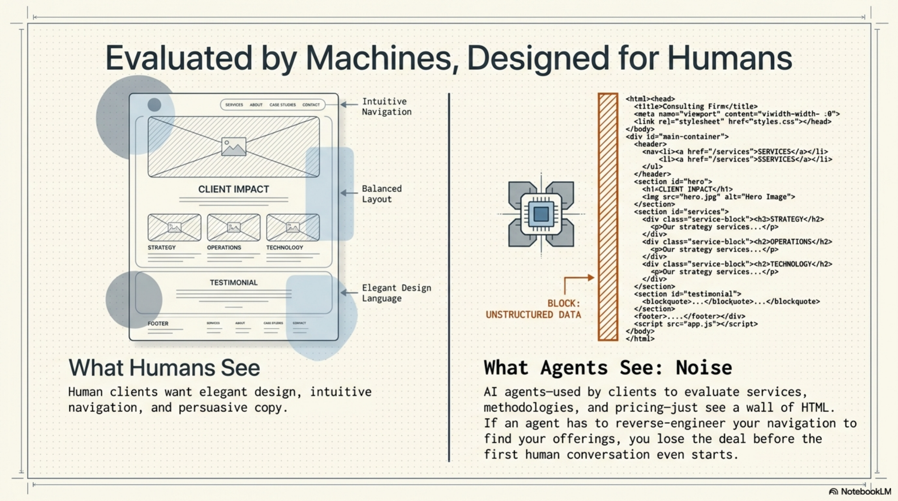
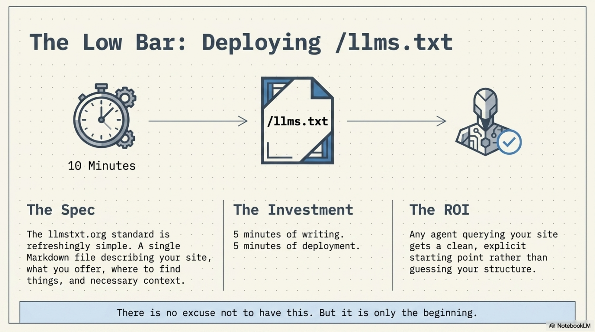
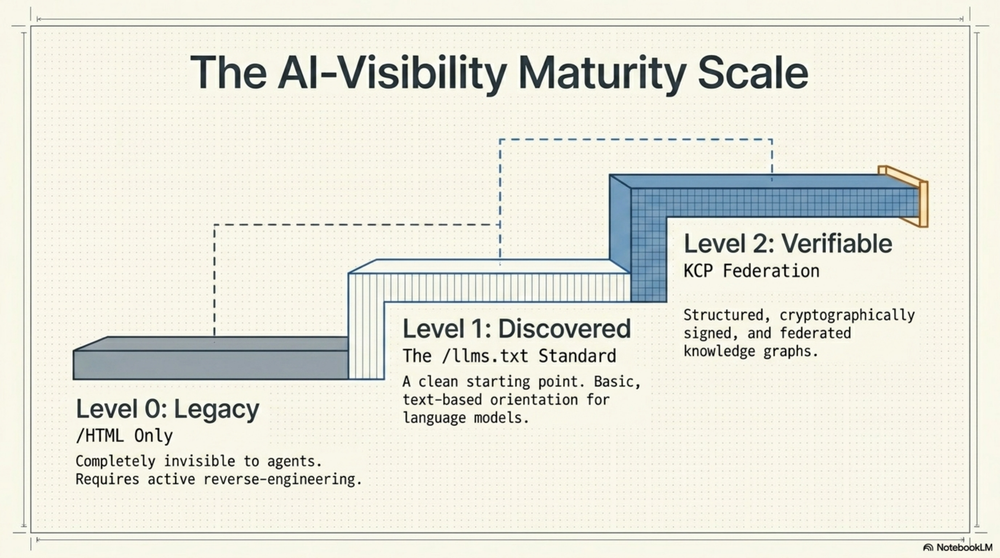
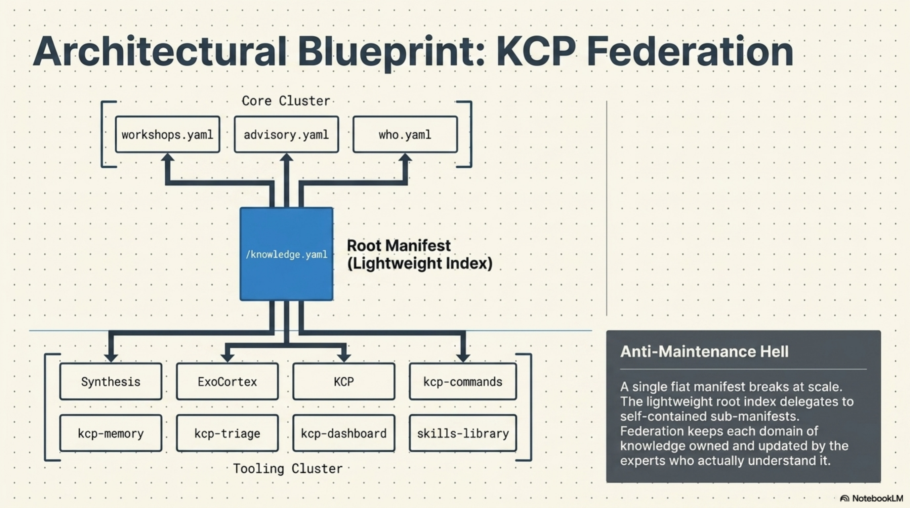
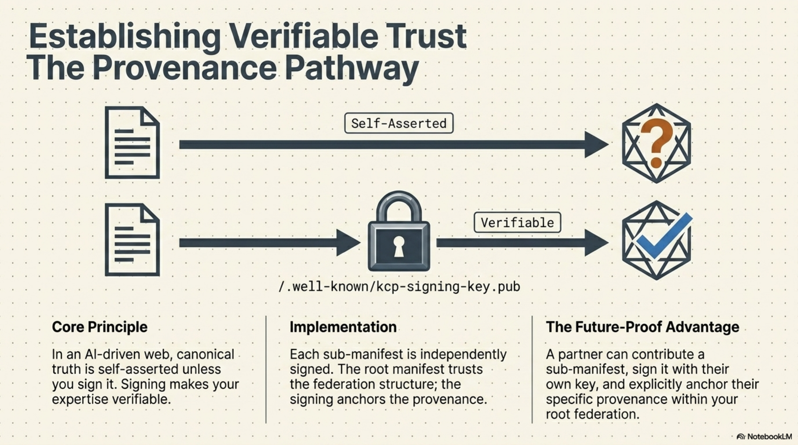
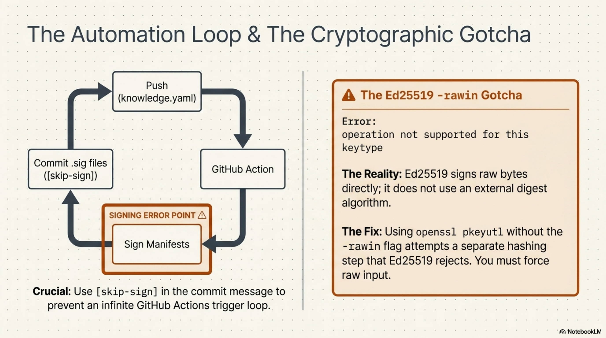
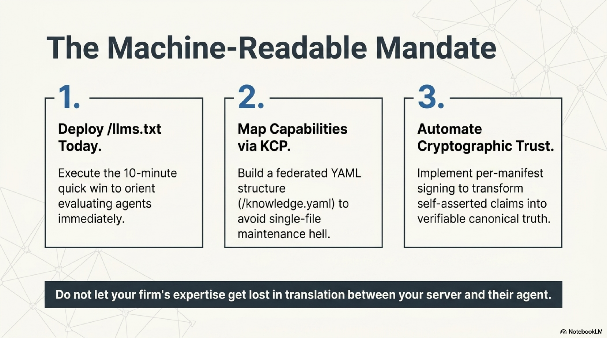
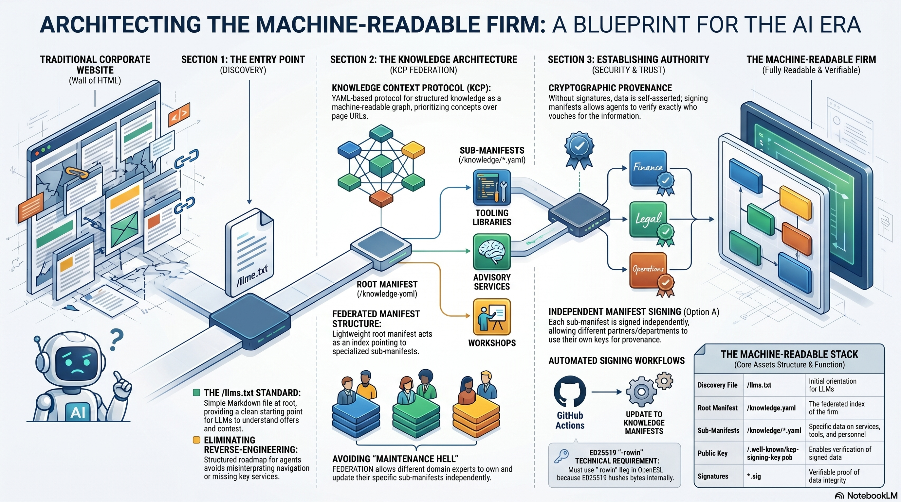

# Making Ægis Machine-Readable in One Session

An AI-era consulting company that isn't machine-readable is a contradiction.
Clients evaluating you will use AI to do it. Agents will look up your services,
your methodology, your pricing model. If the only thing they find is a wall of
HTML, you're invisible to half the evaluation pipeline before the first
conversation starts.

So I spent a session making [ægis.no](https://xn--gis-xla.no) properly
machine-readable. Not just an LLM-friendly page — actually structured,
federated, and cryptographically signed. Here's what I did and what I learned.

<!-- more -->



## Start with the obvious: `/llms.txt`

The [llmstxt.org](https://llmstxt.org) spec is refreshingly simple. One
Markdown file at `/llms.txt` describing your site for language models: what you
offer, where to find things, what context matters. Five minutes of writing, five
minutes of deployment. Done.

There's no reason not to have this. If your company has a website, it should
have an `llms.txt`. The bar is extremely low and the upside is that any agent
querying your site gets a clean starting point instead of reverse-engineering
your navigation structure.



That was the easy part.

## There are three levels, not two

Before going further it's worth naming the progression explicitly.



Most people stop at Level 1 and call it done. Level 2 is where the interesting
properties emerge: structured, federated, verifiable. That's what the rest of
this post is about.

## KCP federation: the interesting part

[KCP (Knowledge Context Protocol)](https://github.com/Cantara/kcp) is a
YAML-based protocol for publishing structured knowledge as a machine-readable
graph. Think of it as a sitemap, but for concepts and capabilities rather than
pages — with authority, provenance, and signing baked in.

The root manifest at `/knowledge.yaml` is deliberately lightweight. It's an
index that federates to eleven sub-manifests in `/knowledge/`:

- `workshops.yaml`, `advisory.yaml`, `who.yaml` — core offerings and context
- Seven tooling manifests under `knowledge/tooling/` — Synthesis, ExoCortex,
  KCP itself, kcp-commands, kcp-memory, kcp-triage, kcp-dashboard,
  skills-library



Each sub-manifest is self-contained. It has its own `discovery` block, its own
`authority` block, its own `signing` block. The root just knows where to find
them.

The design rationale: a flat single manifest becomes maintenance hell as a site
grows. Federation keeps each domain of knowledge owned by the people who
understand it. An agent that only needs workshop pricing loads
`knowledge/workshops.yaml` directly — it doesn't need to parse the whole graph.

## Option A signing: per-manifest, independent

KCP supports several signing models. I went with Option A: each sub-manifest is
independently signed.

The implication is that different manifests can eventually be signed by
different keys. A partner contributing a sub-manifest could sign it with their
own key. The root manifest trusts the federation structure; signing anchors the
provenance of each piece. You can verify who vouches for what.



For now, all eleven manifests are signed by the same key — a GitHub Actions
workflow that triggers on any push touching `knowledge.yaml` or `knowledge/**`.
The public key lives at `/.well-known/kcp-signing-key.pub`. The workflow signs
each manifest and commits the `.sig` files back with `[skip-sign]` in the
commit message to avoid triggering itself in a loop.

This matters because `provenance: canonical` in a KCP manifest is
self-asserted unless you sign it. Signing makes it verifiable.

## The `-rawin` gotcha

The first run of the signing action failed with:

```
Error: operation not supported for this keytype
```



The issue: Ed25519 doesn't use an external digest algorithm. The hash is
internal to the algorithm — you sign the raw bytes directly. `openssl pkeyutl`
without `-rawin` tries to do a separate hashing step that Ed25519 simply
doesn't support.

The fix:

```bash
openssl pkeyutl -sign -inkey private.pem -rawin -in manifest.yaml \
  | base64 -w0 > manifest.yaml.sig
```

One flag, problem solved — but it's the kind of thing you only discover by
hitting it.

## What this actually means

`ægis.no` is now a live reference implementation of KCP federation with
independent per-manifest signing. Any agent that understands KCP can traverse
the graph, verify provenance, and understand what Ægis offers —
programmatically, without scraping HTML.

Is this transformative? No. It's one session of work. The hard part isn't the
implementation — it's knowing what to build and why. Most companies don't do
this not because it's difficult, but because nobody has made it a priority.

In an AI-first world, that's a choice worth revisiting.





---

## Slide decks

Both NotebookLM presentations used to develop this post are available to browse:

- [Machine-Readable Consulting — Implementing KCP and LLM-Friendly Structures](../../assets/presentations/Machine_Readable_Consulting.pdf) (10 slides)
- [Architecting the Machine-Readable Firm](../../assets/presentations/Architecting_the_Machine_Readable_Firm.pdf) (12 slides)
