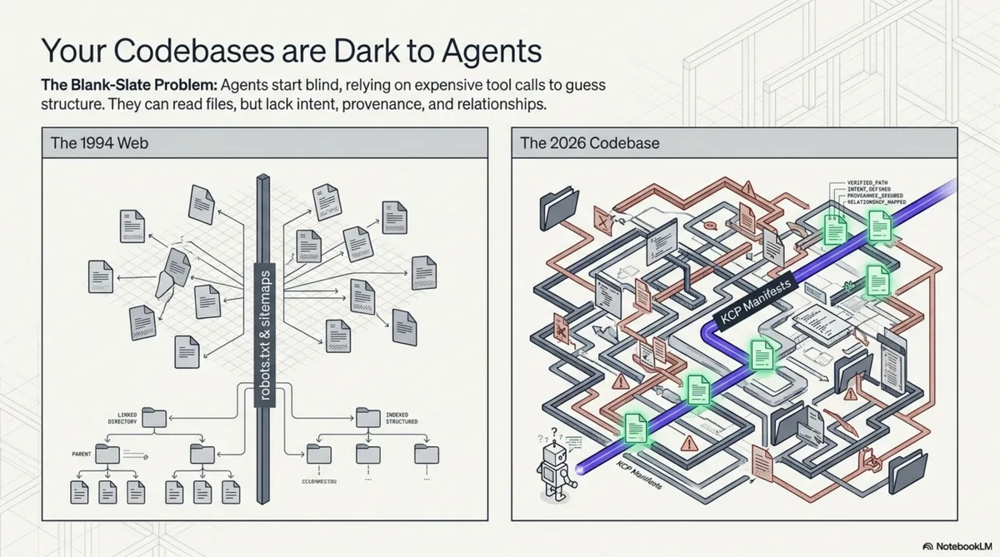
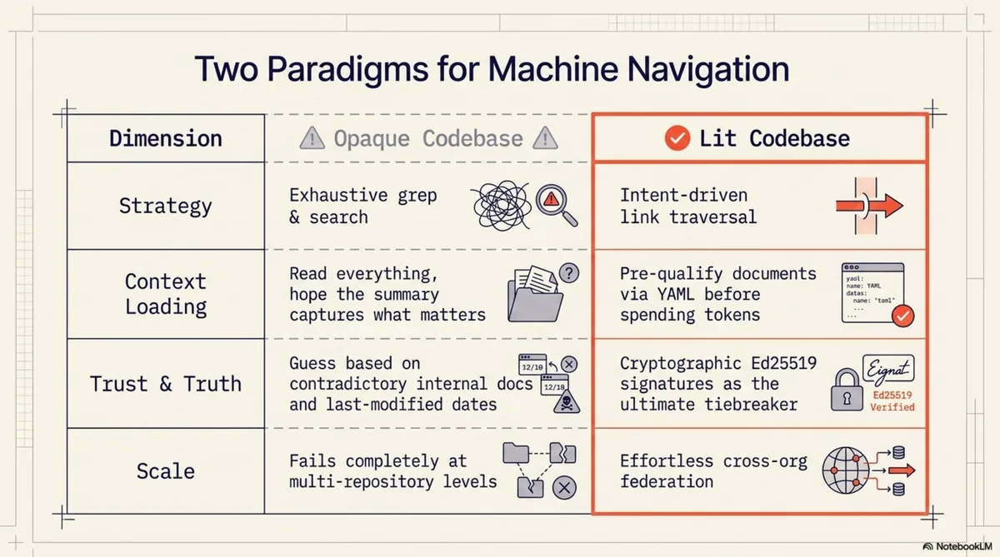
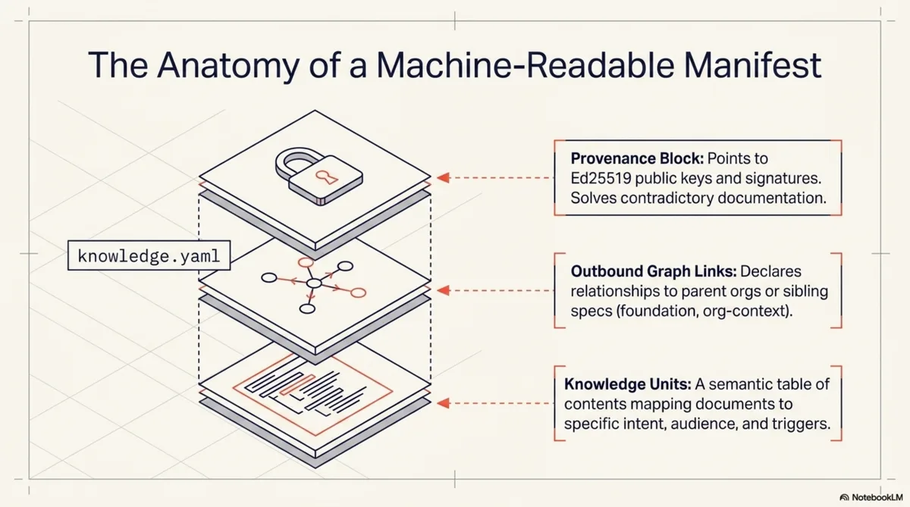
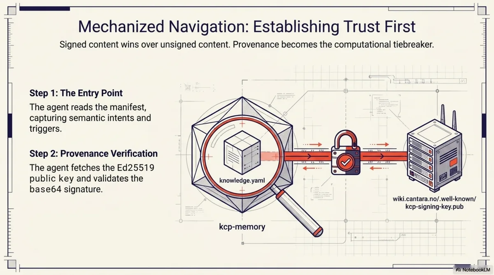
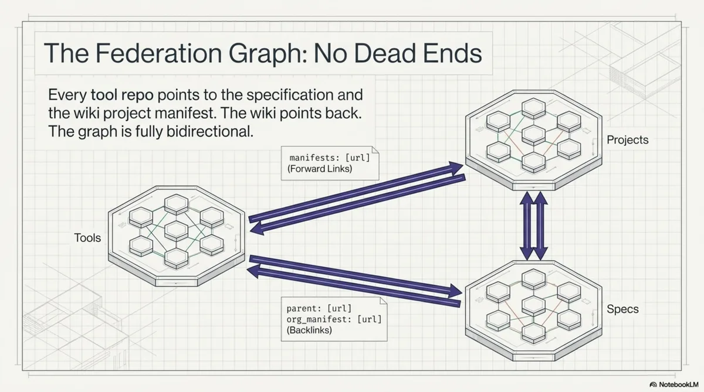
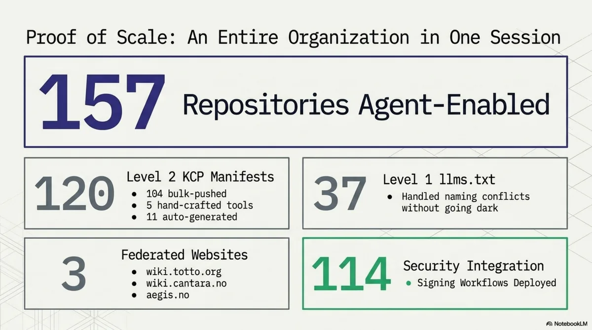

# How Agents Navigate the Agentic Web

Every agent session begins the same way. A process starts. A context window opens. And the agent looks around.

What happens next depends entirely on what is there to find.

<!-- more -->

## Two arrivals

Imagine an agent dropped into a codebase of 40,000 lines across 200 files. No manifest. No map. The agent's first move is to list the root directory. It sees `src/`, `tests/`, `docs/`, `config/`, a `README.md`, a `package.json`, maybe a `Makefile`. It reads the README. The README was last updated eight months ago and describes a feature that has since been removed. The agent does not know this. It reads `package.json` for dependencies, scans `src/` for structure, grep-searches for patterns related to whatever task it was given. It builds a mental model from fragments, each one costing tokens and time, each one potentially misleading.

This is what I call a *dark codebase*. Not broken. Not poorly maintained. Just opaque to machine navigation. The agent can read every file, but it cannot know which files matter, how they relate, who wrote them, whether they are current, or where this repository sits in the larger organisation. It works by exhaustive search. For a small repo, this is tolerable. For an organisation with 157 repositories, it is the difference between an agent that produces useful work and one that spends its entire context window orienting itself.

Now imagine the same agent, dropped into the same codebase, but this time there is a file at the root called `knowledge.yaml`. The agent reads it. In 30 lines of YAML, it learns:

- This is an episodic memory hub called `kcp-memory`, licensed Apache 2.0
- It is owned by the Cantara foundation
- The manifest was last validated 14 days ago and the declared staleness threshold is 14 days
- There are three knowledge units, each with an `intent` field describing what question it answers
- There is a cryptographic signature the agent can verify against a public key at a known URL
- There are two outbound links: one to the KCP specification (labelled `foundation`), one to the Cantara organisation's project manifest (labelled `org-context`)

The agent has not read a single source file yet. But it already knows what this repository is, where it sits in a larger graph, how to verify its authenticity, and which documents to read based on its current task. If its task is about MCP tools, it loads the unit with intent "What are the 8 MCP tools exposed by kcp-memory?" and skips the architecture overview. If its task is about memory models, it loads the unit about the three-layer model and skips the tool reference.

This is a *lit codebase*. Same files underneath. Radically different agent experience.





---

## The mechanics of navigation

The interesting part is not the manifest itself. It is what happens when the agent follows the links.

Let me walk through a concrete traversal that any agent capable of reading YAML and fetching URLs can perform right now against public infrastructure. The starting point is the `kcp-memory` repository on GitHub.



### Step 1: Read the entry point

The agent reads `knowledge.yaml` at the repository root. It gets:

```yaml
entity:
  name: kcp-memory
  type: episodic-memory-hub
  description: >
    Episodic memory for Claude Code. Indexes session transcripts,
    subagent transcripts, and tool-call events into a local
    SQLite+FTS5 database. Available as CLI, HTTP daemon, and MCP server.

signing:
  scheme: ed25519
  public_key: https://wiki.cantara.no/.well-known/kcp-signing-key.pub
  signature: https://raw.githubusercontent.com/Cantara/kcp-memory/main/knowledge.yaml.sig
```

Three knowledge units, each with an intent, an audience list, and a set of trigger keywords. The agent now has a table of contents with semantic annotations. Not just *what* documents exist, but *what questions they answer* and *who they are for*.

### Step 2: Verify provenance

The signing block gives the agent two URLs: a public key and a signature file. The agent fetches the Ed25519 public key from `wiki.cantara.no/.well-known/kcp-signing-key.pub`, fetches the base64-encoded signature from the `.sig` URL, and verifies the manifest content against the signature.

If the signature checks out, the agent knows this manifest was produced by someone holding the Cantara signing key. If it does not, the agent knows to treat the manifest with lower confidence. This matters more than it might seem. When an agent encounters contradictory information -- a README claiming one API and a manifest claiming another -- provenance is the tiebreaker. Signed content wins over unsigned content.



### Step 3: Follow the org-context link

The manifest's `manifests:` block contains:

```yaml
manifests:
  - url: https://wiki.cantara.no/knowledge/projects/kcp.yaml
    relationship: org-context
  - url: https://cantara.github.io/knowledge-context-protocol/knowledge.yaml
    relationship: foundation
```

The agent follows the `org-context` link and arrives at the KCP project manifest on the Cantara wiki. This manifest describes the entire KCP project -- its spec, its toolchain, its status. Critically, it lists all sibling tools:

```yaml
toolchain:
  kcp-commands:
    manifest: https://raw.githubusercontent.com/Cantara/kcp-commands/main/knowledge.yaml
  kcp-memory:
    manifest: https://raw.githubusercontent.com/Cantara/kcp-memory/main/knowledge.yaml
  kcp-triage:
    manifest: https://raw.githubusercontent.com/Cantara/kcp-triage/main/knowledge.yaml
  kcp-dashboard:
    manifest: https://raw.githubusercontent.com/Cantara/kcp-dashboard/main/knowledge.yaml
```

The agent has discovered four related tools without searching GitHub, without guessing repository names, without reading any documentation. It knows these tools exist, where their manifests live, and that they belong to the same project.

### Step 4: Navigate to the organisation root

The project manifest has a `parent:` field pointing to `https://wiki.cantara.no/knowledge.yaml`. The agent follows it and arrives at the Cantara root manifest. This is the top of the graph for this trust domain. The root manifest's `includes:` block lists 13 sub-manifests: seven project manifests, four knowledge-base domain manifests, a repository index covering 150 repos, and a community manifest.

The agent has now gone from a single repository to an overview of an entire organisation's knowledge structure. Three hops. No searching.

### Step 5: Follow the foundation link

Back at the kcp-memory manifest, the agent follows the `foundation` link to the KCP specification's own manifest. This manifest describes the specification repository itself -- 30+ knowledge units covering the core spec, eight RFCs, bridge implementations in Java, TypeScript, and Python, compliance examples, and a simulator. The specification manifest is self-signing: it has its own Ed25519 key hosted on GitHub Pages, independent of the Cantara organisation key.

### Step 6: Navigate back

Every sub-manifest has a `parent:` field. Every repository manifest has an `org_manifest` in its authority block. The graph is bidirectional. The agent can go from any node to any other node through a finite number of hops. No dead ends. No orphaned nodes.

This entire traversal -- from a single repository to the organisation root, to the spec, to sibling tools, and back -- touches six manifests and produces a complete map of the knowledge territory. The agent never searched. It never guessed. It followed links.



---

## Resonance: why intents change everything

The traversal mechanics are important, but the real shift in agent behaviour comes from something subtler: the `intent`, `audience`, and `triggers` fields on each knowledge unit.

Consider the three units in the kcp-memory manifest:

| Unit | Intent | Audience |
|------|--------|----------|
| `readme` | "What is kcp-memory, how do I install it, and how do I use the CLI, HTTP API, and MCP server?" | human, agent, developer |
| `mcp-tools` | "What are the 8 MCP tools exposed by kcp-memory and what does each do?" | agent, developer |
| `three-layer-model` | "How does the three-layer memory model work in kcp-memory?" | agent, architect |

An agent tasked with integrating kcp-memory as an MCP server reads the intents and loads only the `mcp-tools` unit. An agent tasked with understanding the memory architecture loads `three-layer-model`. An agent doing a general onboarding loads `readme` and skips the rest.

This is not just efficiency. It is a fundamentally different mode of operation.

Without intent fields, an agent's strategy for understanding a codebase is: read everything available, build a summary, hope the summary captures what matters. This works for small documents but scales badly. A 3,000-token README costs the agent nothing to read in full. An organisation with 157 repositories, each with multiple documents, presents tens of thousands of tokens of potential context. Reading all of it is wasteful. Reading none of it is blind. The agent needs a way to *pre-qualify* documents before committing context window to them.

That is what intents provide. They are not summaries. They are questions. The agent compares its current task against the intent questions and loads only the units whose questions are relevant. The `triggers` field makes this even more precise: a list of keywords that signal relevance. An agent searching for "MCP tools" will match the `mcp-tools` unit's trigger list and skip the memory architecture unit entirely.

I think of this as *resonance*. The agent's task resonates with certain knowledge units and not others. The manifest structure makes resonance computable rather than requiring the agent to read everything and decide after the fact.

This matters most at scale. For a single repository with three units, the savings are modest. For an organisation graph with hundreds of units across dozens of manifests, selective loading based on intent matching is the difference between an agent that fits its task into a context window and one that overflows.

---

## What changes when agents can navigate

Once an agent has a traversable graph, certain operations become deterministic that were previously impossible or required human intervention.

**Answering knowledge queries across an organisation.** An agent can be asked "what does Cantara know about authentication?" and produce a precise answer by traversing the graph root, scanning unit intents and triggers across all sub-manifests, and loading only the units that match. In the Cantara graph, this would surface the Whydah IAM project manifest, the security knowledge-base domain, and the authentication-related units within them. No grep across 157 repositories. No hallucinating answers from training data. A deterministic traversal with a verifiable result.

**Detecting staleness.** Every manifest declares a `staleness_days` threshold. An agent can walk the graph, compare each manifest's `validated` date against its staleness threshold, and report which knowledge is potentially outdated. For the Cantara ecosystem, this would flag any manifest whose validated date is more than 14 days old (the threshold used for tool repos) or 7 days old (the threshold for the wiki root). This is the knowledge-infrastructure equivalent of uptime monitoring, and it requires nothing beyond date arithmetic.

**Following supply chains of knowledge.** The `relationship` labels on manifest links -- `foundation`, `org-context`, `enables`, `context` -- let an agent trace how knowledge flows. If the KCP specification changes, an agent can follow the `foundation` backlinks to identify every tool that depends on it. If a project manifest changes, the agent can follow `org-context` backlinks to identify every repository that references it. These are dependency chains, but for knowledge rather than code.

**Cross-domain discovery.** The Cantara root manifest includes knowledge-base domains alongside project manifests: architecture, agile development, SOA, enterprise architecture. An agent working on a Whydah authentication issue can follow the relationship graph and discover that there is a security knowledge domain with relevant architectural context. The `relationships:` block in the root manifest explicitly connects the security domain to the Whydah project. The agent does not need to know this connection exists in advance; the graph declares it.

---

## The Cantara graph as proof

I am using the Cantara open source ecosystem as the concrete example throughout this post because it exists and is publicly traversable right now.



The numbers:

- 157 GitHub repositories with KCP manifests or llms.txt
- 104 repositories with full `knowledge.yaml` (Level 2)
- 37 repositories with `llms.txt` only (Level 1, due to filename conflicts with framework config)
- 3 federated websites: wiki.totto.org, wiki.cantara.no, aegis.no
- 5 hand-crafted tool manifests with deep knowledge units
- 114 Ed25519 signing workflows deployed via reusable GitHub Actions
- 3 signing keys, one per trust domain
- 13 sub-manifests on the Cantara wiki alone
- Bidirectional links throughout: every child has a parent, every repo has an org backlink

The graph root is at [wiki.cantara.no/knowledge.yaml](https://wiki.cantara.no/knowledge.yaml). The signing public key is at [wiki.cantara.no/.well-known/kcp-signing-key.pub](https://wiki.cantara.no/.well-known/kcp-signing-key.pub). The KCP specification is at [github.com/Cantara/knowledge-context-protocol](https://github.com/Cantara/knowledge-context-protocol). Everything is Apache 2.0 licensed.

This is not a demo. It is a production knowledge graph over a real open source ecosystem with 15 years of history. The repos range from actively maintained frameworks to archived experiments from 2010. The graph makes no claims about the quality of individual repositories. It makes their existence, relationships, and provenance machine-readable.

---

## What does not work yet

I want to be precise about the gaps, because they are significant.

**No agent runtime natively traverses KCP graphs.** Not Claude Code, not OpenAI's agents, not Cursor, not Copilot. An agent needs to be told -- via a system prompt, a skill file, a hook, or a tool -- how to follow manifest links. The manifests are plain YAML at known URLs. Any agent *can* traverse them. No agent *does* by default. This is the bootstrapping problem: the protocol is useful only if agents know about it.

**The `.sig` files for bulk repos are latent.** The signing workflows are deployed across 114 repositories, but signatures are only generated when `knowledge.yaml` is modified. For the 104 repos that received manifests via the GitHub API in a single push, no subsequent edit has triggered the workflow yet. The infrastructure is ready. The signatures are waiting for the first real edit.

**Deep unit coverage is manual work.** The 104 bulk-pushed repos each have one knowledge unit pointing at their README. Real value -- per-module intents, dependency chains, relationship types -- exists only in the five hand-crafted tool manifests. Scaling deep coverage to 104 repos is a content problem, not a tooling problem, and it is labour-intensive.

**The 37 repos with naming conflicts are Level 1.** They have `llms.txt` pointing to wiki-hosted manifests, but not `knowledge.yaml` at their repo root. For archived or dormant repos this is arguably sufficient. For active ones it is a compromise.

**There is no global registry.** Discovery starts at a known URL. An agent cannot ask "show me all KCP manifests in the world." This is by design -- DNS is the namespace, as it is for the web itself -- but it means discoverability depends on having the entry point. Search engines will eventually index these manifests. They do not yet.

---

## The shape of the agentic web

Step back from the implementation details and consider what it looks like when this pattern is adopted broadly.

Today, human knowledge on the web is navigable because we agreed on conventions: HTML for content, hyperlinks for connections, DNS for naming, TLS for trust. Search engines built on top of those conventions. The web did not need a central registry because links and DNS provided emergent discoverability.

The agentic web is the same pattern, one layer up. Instead of HTML pages linked by hyperlinks, you have knowledge manifests linked by manifest URLs. Instead of TLS certificates vouching for server identity, you have Ed25519 signatures vouching for manifest authenticity. Instead of `robots.txt` telling crawlers what to index, you have `knowledge.yaml` telling agents what to load, with intents and audience fields so they can decide before fetching.

What does this look like in practice?

**Supply-chain knowledge.** A company using an open source library points its manifest's `manifests:` block at the library's own manifest with `relationship: dependency`. An agent working on the company's code can follow that link and discover the library's architecture, known issues, and migration guides -- without the developer needing to find and paste documentation. When the library publishes a breaking change, an agent can trace the dependency backlinks and identify every downstream project that is affected.

**Cross-org knowledge sharing.** Two organisations collaborating on a standard can link their manifests with `relationship: peer`. An agent working in one organisation can discover the other's relevant knowledge and verify its provenance. This is federation in the original sense: independent authorities choosing to link, not a central platform aggregating everything.

**Agent-to-agent knowledge transfer.** When agents navigate a shared knowledge graph, the graph itself becomes a communication medium. Agent A, working on repository X, discovers a relevant unit in repository Y and loads it. Agent B, working on repository Y, discovers that its unit is referenced by a manifest in repository X. Neither agent talks to the other directly. They communicate through the structure of the graph. This is how the web works for humans, and there is no reason it cannot work for agents.

I do not know whether KCP will be the standard that emerges for this. The pattern is older than any particular implementation -- it is hypertext applied to machine-readable knowledge. What I do know is that the problem is real, the current state is inadequate, and the Cantara graph demonstrates that a working solution is not theoretical. You can traverse it today. It is YAML files at public URLs, signed with Ed25519 keys, linked bidirectionally.

The agentic web is not a future prediction. It is a directory structure, a YAML schema, a signing key, and a GitHub Action. Everything else -- the agents that learn to traverse it, the tooling that automates coverage, the conventions that emerge for cross-org federation -- is what comes next.

---

*The KCP specification is at [github.com/Cantara/knowledge-context-protocol](https://github.com/Cantara/knowledge-context-protocol). The Cantara graph root is at [wiki.cantara.no/knowledge.yaml](https://wiki.cantara.no/knowledge.yaml). All tooling is Apache 2.0 licensed.*
