# Why KCP Is Passive Data, Not Executable Config — And Why That Matters Now

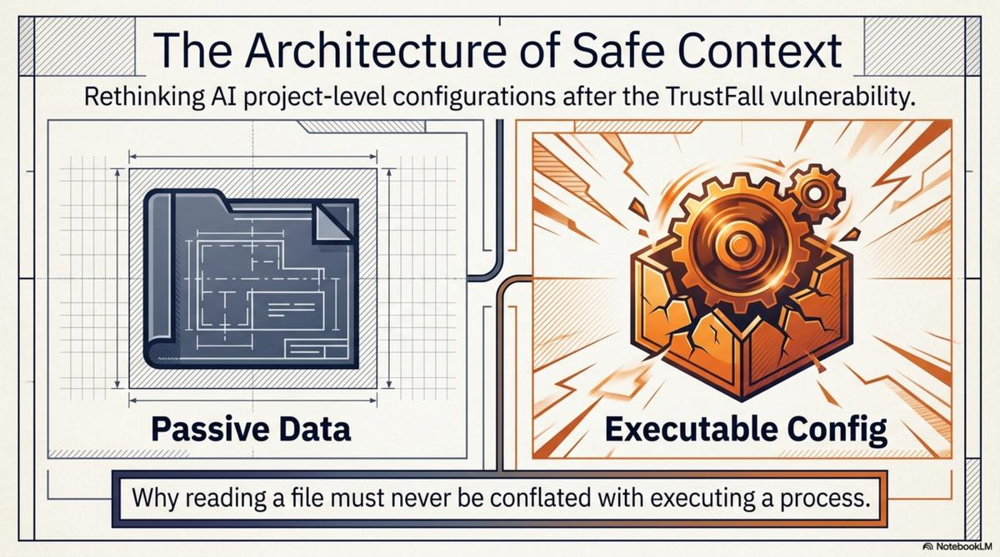

Yesterday, Adversa AI disclosed a vulnerability they call TrustFall. The mechanic is straightforward: a `.mcp.json` or `.claude/settings.json` file checked into a repository can silently configure and launch arbitrary MCP servers when a developer opens the project. The developer sees a trust dialog — "Trust this folder?" — clicks yes, and processes spawn with their full user privileges. Claude Code, Gemini CLI, Cursor CLI, and Copilot CLI are all affected. In CI/CD pipelines, where there is no human to click, the execution is zero-click.

<!-- more -->

This is Anthropic's third similar CVE in six months. The same root cause each time: project-level configuration files that translate a folder-trust decision into process execution.

The Register [covered TrustFall](https://www.theregister.com/security/2026/05/07/claude-code-trust-prompt-can-trigger-one-click-rce/5235319) the same day. The immediate response will be what it always is — patch the dialog, tighten the default, add a warning. Those are necessary fixes. They are not the interesting part.

The interesting part is the category error that makes these vulnerabilities keep recurring.

---

## The category error

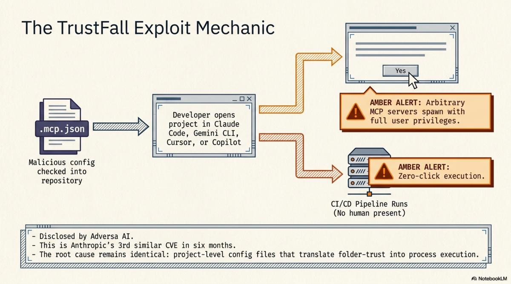

The trust dialog says "trust this folder." What the user understands: this folder's files are safe to read. What actually happens: configuration files in this folder are parsed, and the processes they specify are launched with your privileges.

Those are not the same thing.

Reading a file is a passive operation. Your text editor reads `package.json` every time you open a JavaScript project. Your IDE reads `.editorconfig`. Your shell reads `.envrc` (with explicit consent, if you use direnv correctly). None of these spawn arbitrary processes based on their contents. They are data files that configure behaviour within an application's existing capabilities.

`.mcp.json` is different. It is a configuration file that says "start this process, connect to it via stdio, and grant it tool-calling capabilities inside the AI agent's session." That is not configuration in the same sense as `.editorconfig`. It is capability delegation. The file says: run this binary, give it access to this context, let it do things.

The trust dialog conflates these two operations. "Trust this folder" covers both "read the config files" and "execute the processes they specify." The user consents to the first. The second rides along.

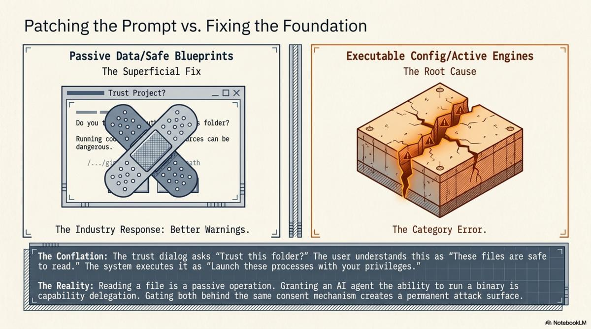

This is not a bug in the implementation. It is a design error in the abstraction. And it will keep producing vulnerabilities until the abstraction changes, because the attack surface is the conflation itself. As long as "reading project config" and "spawning processes with user privileges" are gated by the same consent mechanism, every project-level config file is a potential execution vector.

---

## Two kinds of project-level files

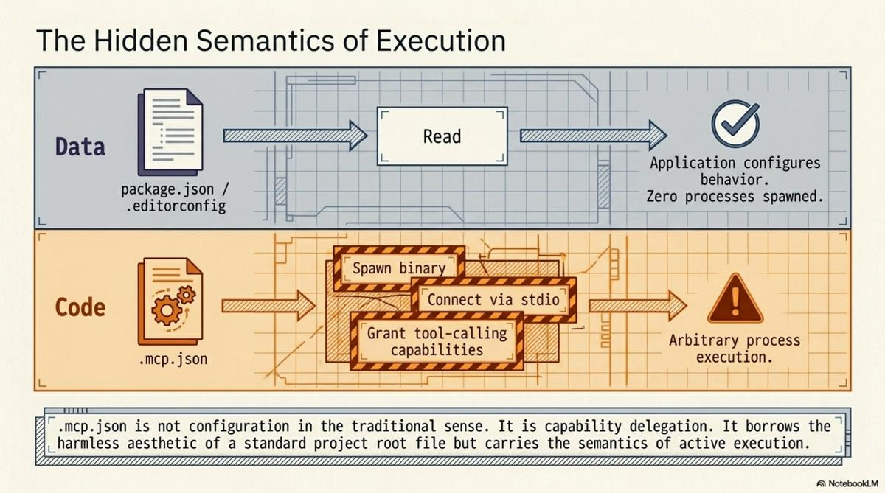

Once you see the conflation, the separation is obvious. Project-level files that AI tools consume fall into two categories:

**Executable config** grants capabilities. `.mcp.json` tells Claude Code to start an MCP server. The file's contents determine what binary runs, what arguments it receives, what environment variables it inherits. The consequence of reading this file is that a process starts. The attack surface is the full set of things that process can do.

**Passive data** provides context. `README.md` describes the project. `CLAUDE.md` gives the agent standing instructions. `knowledge.yaml` describes the repository's structure, its relationships, its knowledge units. `llms.txt` provides a machine-readable summary. The consequence of reading any of these files is that the agent has more information. No processes spawn. No capabilities are granted. No trust surface beyond what you would give any text file.

The distinction is not subtle. It is the difference between a document and a script. Between a map and a set of instructions that say "drive here." Between data and code.

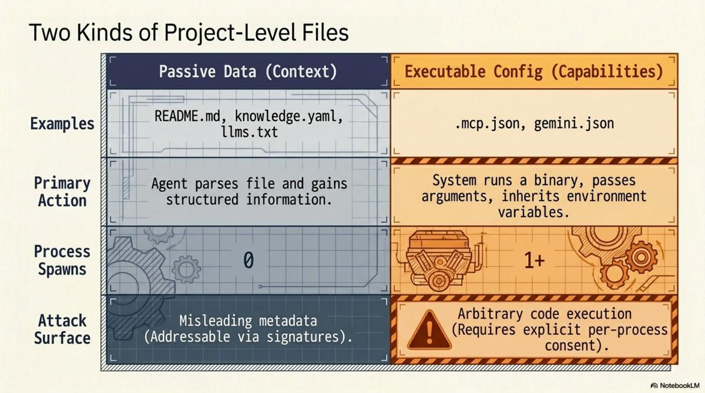

TrustFall exists because `.mcp.json` is code disguised as data. It sits in the project root alongside `package.json` and `.gitignore`, looking like configuration, but its semantics are execution.

---

## Where KCP sits

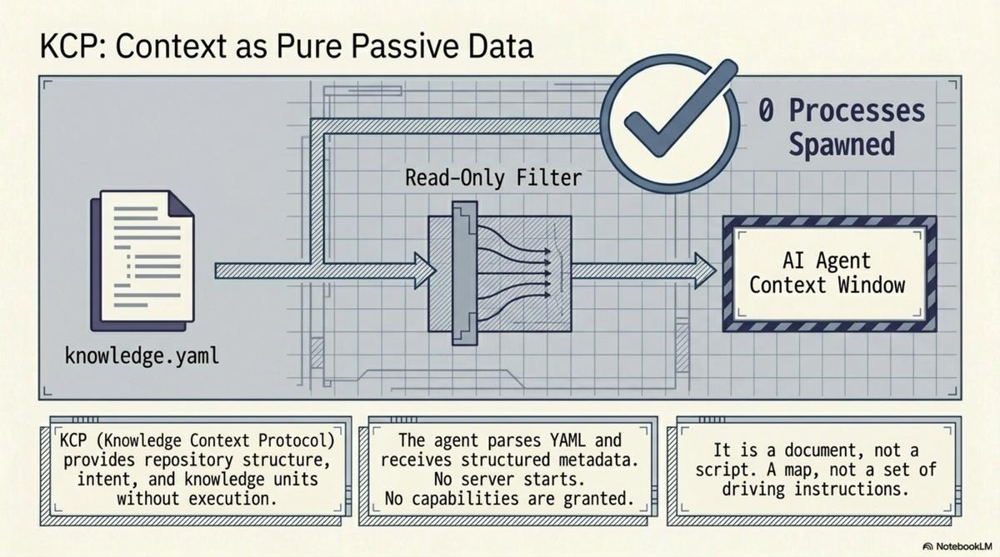

[KCP (Knowledge Context Protocol)](https://github.com/Cantara/knowledge-context-protocol) is firmly in the passive data category. This is deliberate, not a limitation.

A `knowledge.yaml` manifest is a YAML file. It declares what the repository contains, what questions each knowledge unit answers, who the intended audience is, where related manifests live, and how to verify the manifest's authenticity. Here is the complete set of things that happen when an agent reads it:

1. The agent parses YAML.
2. The agent now has structured metadata about the repository.

That is it. No process spawns. No server starts. No capabilities are granted. No binary is referenced, downloaded, or executed. The manifest is inert data, like a table of contents.

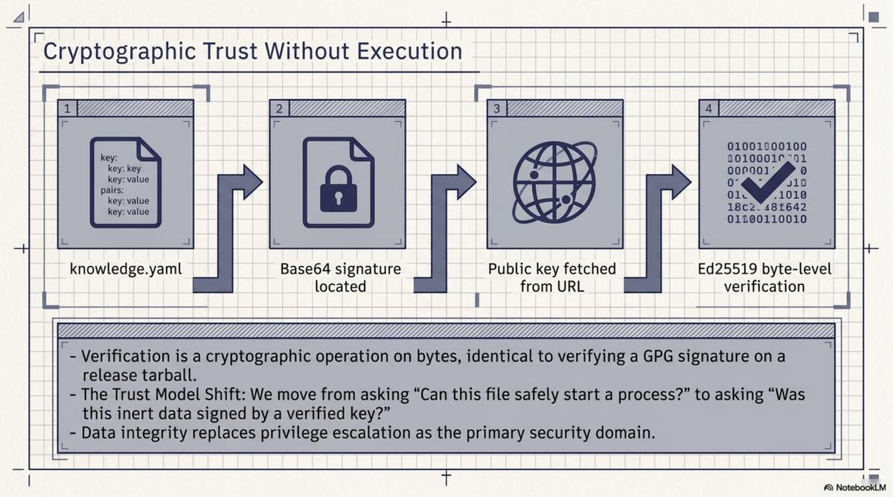

The Ed25519 signatures authenticate the data without requiring code execution. The signing key is a public key at a well-known URL. The signature is a base64 file. Verification is a cryptographic operation on bytes — no different from verifying a GPG signature on a release tarball. The trust model is: this manifest was signed by someone holding this key. Not: this manifest should be allowed to start processes on your machine.

This matters because the security properties of a knowledge protocol and a capability protocol are fundamentally different.

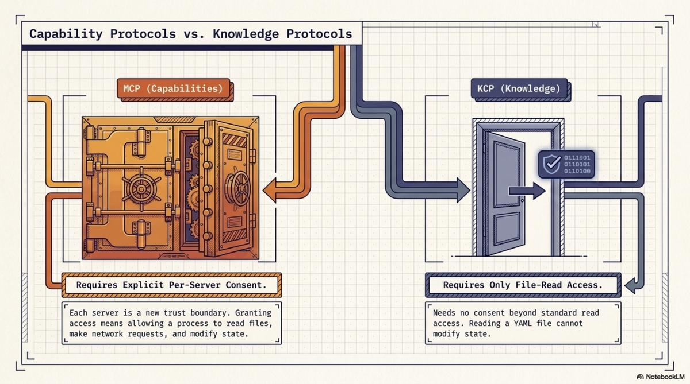

A capability protocol — MCP — needs per-server consent because each server is a new trust boundary. Granting an MCP server access is granting a process the ability to read files, make network requests, modify state. The consent must be specific: which server, what capabilities, under what constraints. Getting this wrong is how you get TrustFall.

A knowledge protocol — KCP — needs no consent beyond file-read access because reading YAML cannot modify state. The worst case of reading a malicious `knowledge.yaml` is that the agent receives misleading metadata. That is a data integrity problem, solved by signatures and provenance chains — not a privilege escalation problem.

---

## The bootstrapping problem and how we solved it safely

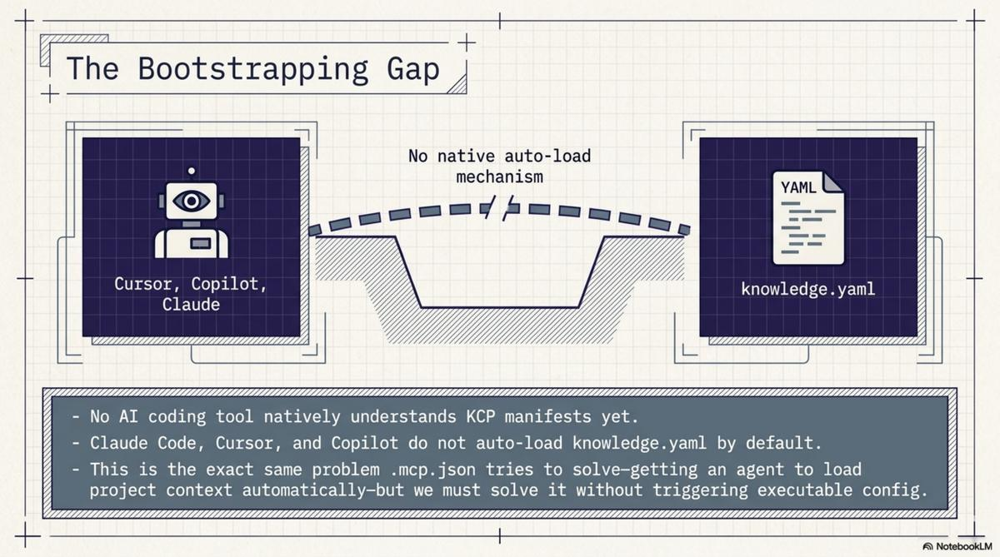

KCP has a known gap: no AI coding tool natively understands KCP manifests. Claude Code does not look for `knowledge.yaml` by default. Neither does Cursor, Copilot, or Gemini CLI. The manifests are plain YAML at standard locations, and any agent *can* read them. No agent *does* unless told.

This is the bootstrapping problem. The [previous post](/blog/2026/05/07/how-agents-navigate-the-agentic-web/) described it directly. The solution matters here because it is the exact same problem that `.mcp.json` tries to solve — getting an agent to load project-specific configuration when it enters a repository — and we solved it without any executable config.

Over two sessions this week, we pushed `CLAUDE.md` and `AGENTS.md` to 105 Cantara repositories. These are plain text instruction files. `CLAUDE.md` says:

```markdown
# Cantara / repo-name

Read `knowledge.yaml` before starting any task.
```

`AGENTS.md` says the same thing for non-Claude agents. Both are text. They contain no executable directives, no server configurations, no binary references. They are instructions in the same sense that a README is instructions: the agent reads them and decides what to do.

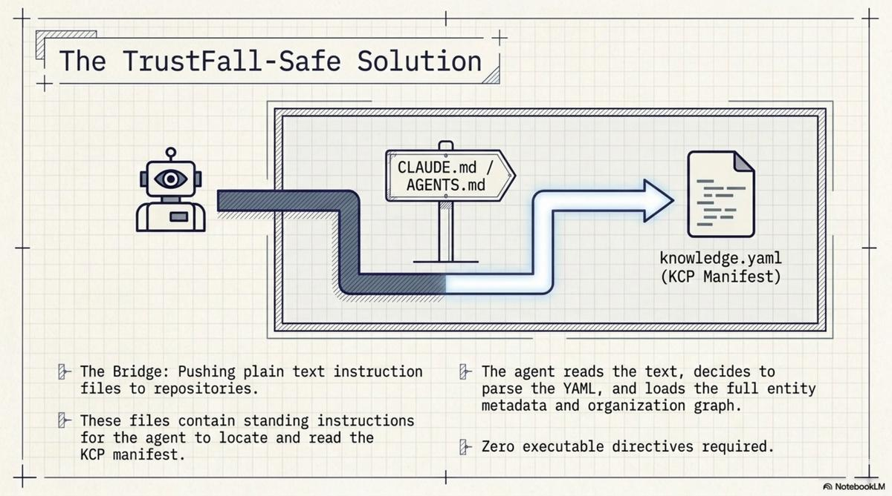

Claude Code reads `CLAUDE.md` at session start — that is its documented behaviour. When it finds the instruction to read `knowledge.yaml`, it does. At that point, the agent has the full KCP manifest: entity metadata, knowledge units with intents and triggers, outbound links to the organisation graph, signing information. The bootstrapping gap is closed.

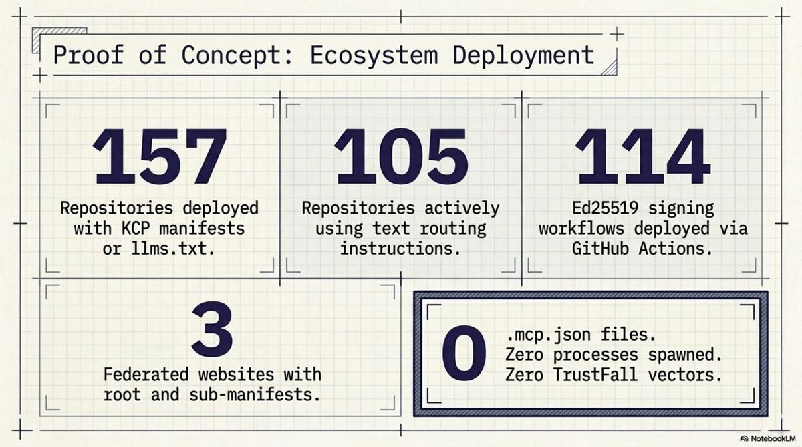

The total scope of what we deployed across the Cantara ecosystem:

- 157 repositories now have KCP manifests or `llms.txt`
- 105 repositories now have `CLAUDE.md` and `AGENTS.md` pointing to `knowledge.yaml`
- 114 Ed25519 signing workflows deployed via reusable GitHub Actions
- 3 federated websites with root manifests and sub-manifests
- Bidirectional links throughout: every child has a parent, every repo has an org backlink

None of this required a single MCP server. No `.mcp.json` files. No trust dialogs. No process execution. The entire knowledge infrastructure — 157 repos, three trust domains, a federated graph with cryptographic provenance — was deployed using text files.

This is the TrustFall-safe approach to the same problem.

---

## What this means going forward

AI coding tools are proliferating. Each one introduces project-level config files. `.mcp.json` for Claude Code. `gemini.json` for Gemini CLI. Cursor has its own settings. The pattern is converging: a JSON or YAML file in the repository root that tells the tool what to do.

The question is what "tells the tool what to do" means.

If it means "provides context" — here is the project structure, here are the conventions, here is where to find documentation — the file is passive data. Reading it is safe. The attack surface is misleading information, addressable through verification.

If it means "starts processes" — launch this MCP server, connect to this stdio binary, grant these tool capabilities — the file is executable config. Reading it has side effects. The attack surface is arbitrary code execution, addressable only through per-process consent that users actually understand.

These two categories need different trust models. Passive data can be auto-loaded. It is no more dangerous than auto-loading `README.md`, which every IDE already does. Executable config must require explicit, informed, per-server consent — and the consent mechanism must make the consequences clear. Not "trust this folder." Something more like "this repository wants to start a process called `evil-server` with access to your filesystem. Allow?"

Organisations that conflate the two will have TrustFall-class vulnerabilities on a recurring basis. The fix is not better trust dialogs. The fix is recognising that context injection and capability delegation are different operations with different threat models, and gating them differently.

---

## A note on MCP

I want to be precise here because this is not a critique of MCP.

MCP is useful. The ability for an agent to call tools, query databases, interact with APIs — that is genuine capability that passive data cannot provide. KCP and MCP serve different functions. KCP tells the agent what it needs to know. MCP lets the agent do things. A knowledge graph does not need to execute anything. A tool server does.

The problem is not MCP itself. The problem is deploying MCP servers via project-level config files that auto-execute on a folder-trust decision. That specific deployment mechanism is the attack surface.

The architecture I would advocate:

- **KCP manifests** (`knowledge.yaml`, `llms.txt`, `CLAUDE.md`, `AGENTS.md`): deployed in repositories, auto-loaded, no consent required beyond file-read access. These are context. Treat them like READMEs.
- **MCP server config**: deployed in user-level config (`~/.claude/mcp.json`, not `.mcp.json` in the project root), with explicit per-server consent that names the binary and describes what it can do. These are capabilities. Treat them like sudo.

KCP and MCP are complementary layers. They should be deployed differently because they carry different risks. The TrustFall vulnerability exists precisely at the point where this distinction was not made.

---

## What does not work yet

The bootstrapping solution — `CLAUDE.md` files telling agents to read manifests — depends on agents reading `CLAUDE.md`. Claude Code does this. Most other tools do not, or handle it inconsistently. There is no standard for agent instruction files. `AGENTS.md` is a convention we are establishing, not an industry standard.

Native manifest support — agents that look for `knowledge.yaml` the way they look for `package.json` — is a future state. It would eliminate the need for the instruction-file workaround entirely. Until then, the bootstrapping gap is closed for Claude Code and open for everything else.

The signing infrastructure is deployed but latent across most of the 114 repos. Signatures generate on manifest edits. For the bulk-pushed repos that have not been edited since the initial push, no signatures exist yet. The plumbing is ready. The signatures are waiting.

These are real gaps. But they are gaps in adoption and tooling, not gaps in the security model. The passive-data property holds regardless of whether agents know to look for the manifests.

---

## The design constraint that pays dividends

When we designed KCP, making it passive data was a constraint. We could have specified an executable format — something that could install dependencies, configure servers, set up environments. That would have been more powerful in the narrow sense of "things the manifest can cause to happen."

We chose not to, because the threat model for a knowledge protocol is "someone puts a manifest in a repo you clone." That threat model demands that reading the manifest is safe by construction. Not safe because a dialog asked permission. Not safe because the user reviewed the contents. Safe because the format cannot express executable operations.

TrustFall validates that constraint. When your config file format can express "start this process," you need a trust mechanism that users actually understand. The evidence from three CVEs in six months is that the trust mechanism does not work. The alternative is a format that does not need one.

A knowledge graph does not need to execute anything. It needs to be read.

---

*The KCP specification is at [github.com/Cantara/knowledge-context-protocol](https://github.com/Cantara/knowledge-context-protocol). The Cantara knowledge graph root is at [wiki.cantara.no/knowledge.yaml](https://wiki.cantara.no/knowledge.yaml). All tooling is Apache 2.0 licensed.*
