# The Harness Before the Service

In May 2026, Anthropic shipped Managed Agents. I read through the docs, the API spec, the beta header (`managed-agents-2026-04-01`), and felt something I can only describe as architectural recognition.

Not surprise. Recognition. The way you recognize your own design decisions in someone else's implementation — because the problem space, if you take it seriously, produces the same structural answers.

<!-- more -->

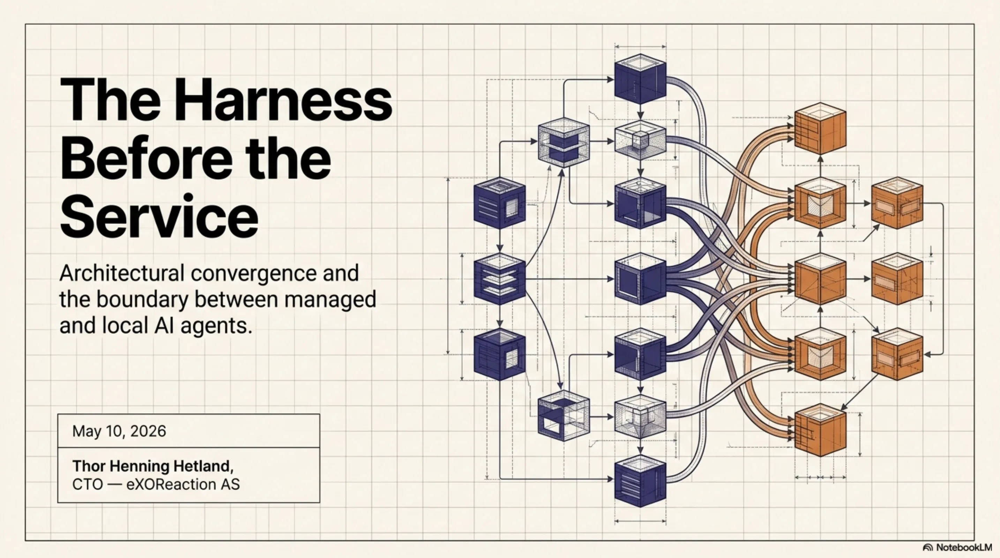

We have been running a production agent infrastructure called ExoCortex since January 2026. Four months of daily use across real client work, real codebases, real deadlines. When Anthropic formalized Sessions, Outcomes, Memory, and Multi-Agent orchestration, they formalized the exact primitives we had already built, tested, and iterated on.

This is not a claim of priority. It is an observation about convergence — and convergence is the strongest evidence that an architecture is correct.

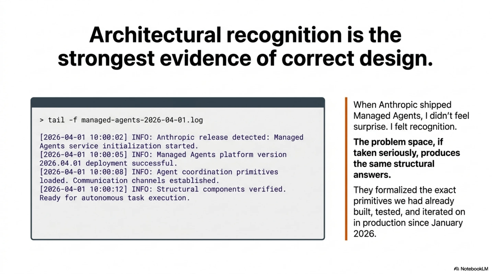

## What Anthropic shipped

The release centers on a single abstraction: the **Session** as a durable event log, with a **Brain** (stateless Claude plus harness logic) and **Hands** (MCP servers, sandboxes, tool endpoints). On top of this, Anthropic shipped four capabilities in varying states of availability.

**Outcomes** (public beta). You write a rubric — markdown criteria for what "done" looks like. You send a `user.define_outcome` event. A separate grader instance of Claude, running in its own isolated context window, evaluates the agent's work against your rubric. The agent loops autonomously — up to 20 iterations — until the grader returns `satisfied`, or the system hits `max_iterations_reached`, or something breaks. You define what good looks like. Anthropic runs the eval loop.

**Memory consolidation** (research preview). The system curates what persists across sessions — not a raw dump of conversation history, but a distilled, Anthropic-managed representation of what the agent learned. Still early; the production shape will follow.

**Multi-Agent** (limited access). Parallel specialist sub-agents, each defined with its own system prompt, tool access, and role description. An orchestrator routes work. You provide the specs. Anthropic runs the coordination.

**Lifecycle events** (public beta). Subscribe to session state changes instead of polling. Session idle, outcome evaluation complete, and similar events come to you reactively.

Clean design. The split is deliberate: you provide rubrics, agent definitions, tool specs, and business logic. Anthropic provides the execution harness, the eval loop, the memory pipeline, the orchestrator, and the observability layer.

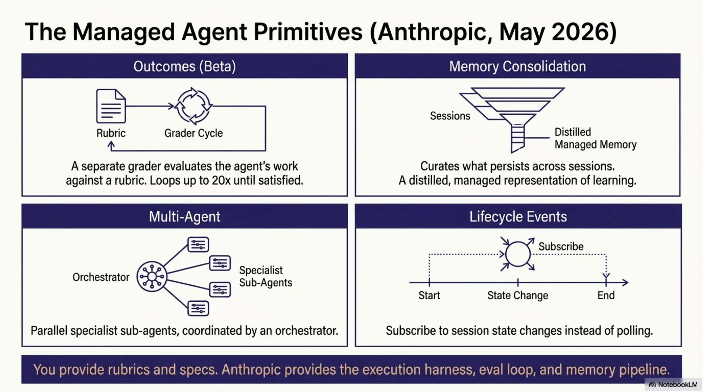

## Four months of building what did not exist

ExoCortex was not built to anticipate Anthropic's roadmap. It was built because the problems were immediate and the existing tooling did not solve them. What started as a productivity layer for my own development work kept growing — not because we planned a platform, but because every solved problem revealed the next unsolved one. Skills led to memory. Memory led to routing. Routing led to tool intelligence. Tool intelligence led to economics. Each layer was an answer to a question the previous layer forced us to ask.

That process, repeated daily for four months, produced something with real architectural depth.

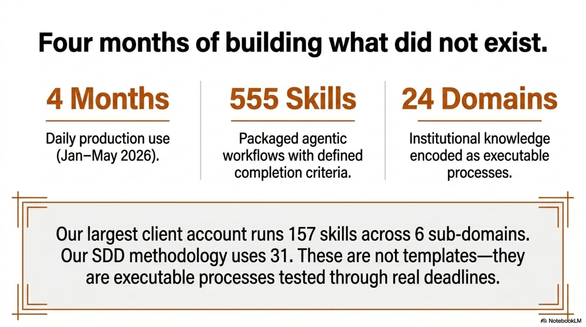

It started with skills. A skill is a packaged agentic workflow with defined completion criteria, invocable as a slash command. You build one when you find yourself explaining the same complex task to an agent for the third time. Then you build another. Then you realize you need them organized by domain, with completion validation, so the agent does not just attempt a workflow but finishes it correctly. When a hook fires after execution and validates the result against the skill's own criteria, you stop worrying about whether the agent understood the task. The skill encodes the understanding.

555 skills across 24 domains. Our largest client account has 157 skills organized across six sub-domains. Our SDD methodology has 31. These are not templates. They are institutional knowledge — the kind that usually lives in someone's head and walks out the door when they leave — encoded as executable, repeatable processes. Each one tested and refined through actual use. 555 tested workflows means 555 things the agent knows how to finish.

But skills without memory are stateless. An agent that can execute 555 workflows but forgets everything between sessions is still wasting your time on context restoration. So we built **kcp-memory** — not just persistence, but a hot/warm/cold triage system. A `Stop` hook fires at the end of every session, persists relevant context, and triages topics by recency and relevance. Hot topics are immediately available in the next session. Warm topics surface when triggered. Cold topics archive gracefully. The next session picks up where the last one left off, even after a full context reset — and it does so selectively, loading what matters, not everything.

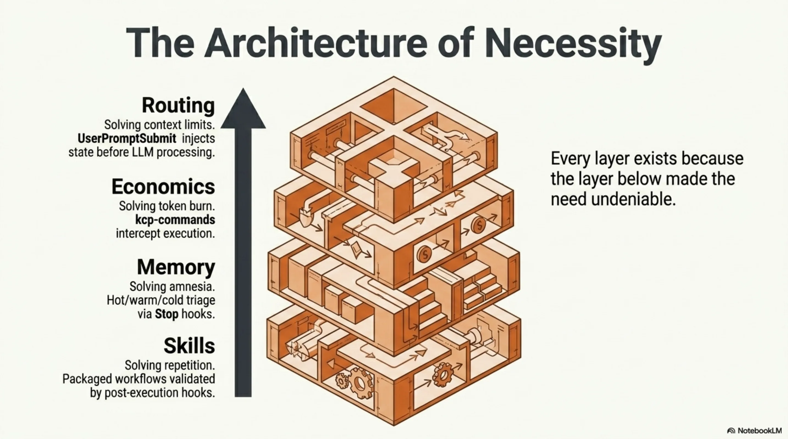

Memory solved continuity. But continuity across sessions is useless if the agent burns through your token budget before it finishes the task. That led to the economics problem, and the economics problem led to the layer I want to dwell on.

**kcp-commands** is a tool intelligence layer with no managed equivalent. 152 YAML command manifests, each describing a tool the agent uses: what it does, what its outputs mean, how to interpret the results. `PreToolUse` hooks intercept every bash command, match it against these manifests, and inject the manifest context *before execution*. The agent does not run a command and then figure out what happened. It knows what it is about to run, why, and what to expect. Combined with **RTK** (a Rust CLI proxy providing 60–90% token compression on dev operations), this means the agent performs the same work at 10–40% of the token cost. That is not optimization at the margins. That is an economic layer — the same capability, a fraction of the spend.

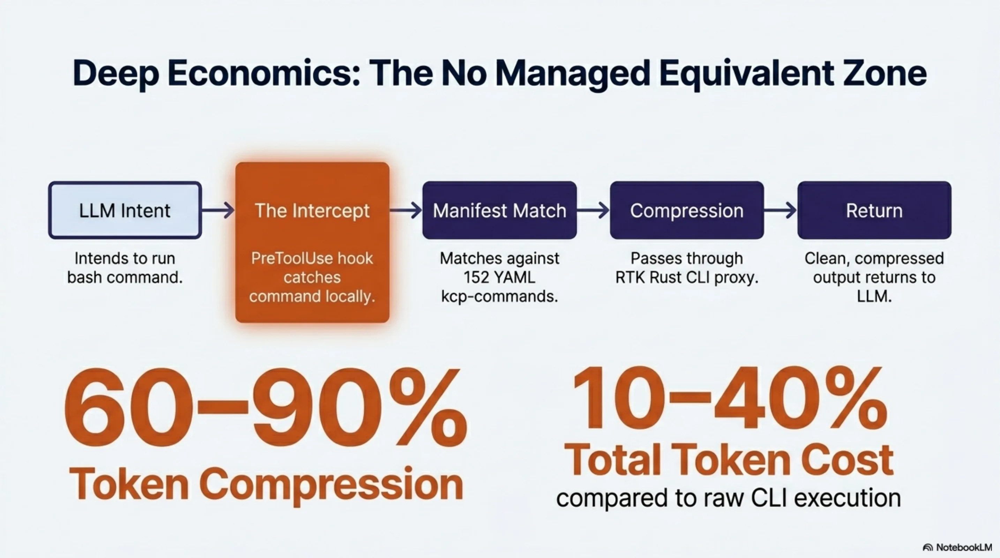

The routing came next. The `UserPromptSubmit` hook intercepts the user's input, injects session context from kcp-memory, routes to relevant skills, and pre-loads memory topics — all before Claude processes a single token. By the time the model sees the prompt, it is already situated: the right knowledge is loaded, the right skills are queued, the relevant history is in context. No managed service can replicate this for local workflows because no managed service has access to the local state that makes the routing meaningful.

And then there is **Synthesis** — three layers of knowledge graph infrastructure — and this is the component with the strongest claim to "no managed equivalent," because no managed service runs inside your environment.

The **Document Knowledge Graph** models the purpose and health of every directory — not just what files are there, but whether the directory is achieving its intended function. Directories carry inferred archetypes, semantic centroids, and health signals: W020 (starvation — too few files for the archetype), W021 (drift — content diverging from purpose). Cross-workspace edges link document directories to the source repositories they describe.

The **Code Knowledge Graph** spans five sub-layers: a package-level dependency DAG with Martin instability metrics (fan-in, fan-out, distance from main sequence); cross-format dependency links from code to config, schema, and documentation; 21 security signal types including 6 agentic AI signals — prompt injection vectors, RAG poisoning paths, unconfirmed agentic actions — that no traditional SAST tool covers; quality gap mapping; and circular dependency detection. `synthesis impact` answers which files break if this one changes.

The **KCP Knowledge Graph** makes knowledge manifest units first-class graph nodes, enabling agents to navigate the workspace's knowledge structure without loading all files.

66,350 files across 10 workspaces. Auto-updated with staleness detection. Cross-graph queries spanning all three layers simultaneously. A managed service cannot substitute for this: the graph models your code, your documents, your manifests — not a generic infrastructure layer.

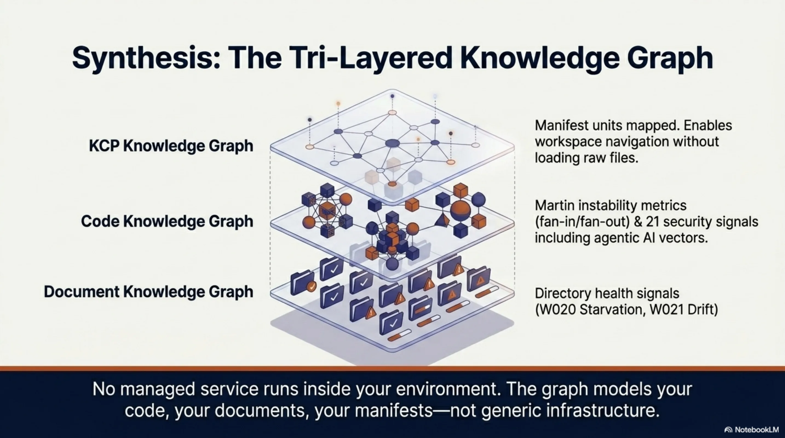

Multi-agent support followed naturally — an `agents` dictionary in `ClaudeAgentOptions`, defining specialist sub-agents with their own prompts and tool access. And the hook system itself — `PreToolUse`, `PostToolUse`, `UserPromptSubmit`, `Stop` — became the harness. Not a wrapper around a harness. The harness itself: lifecycle management, memory persistence, prompt routing, tool intelligence, and completion validation, all running through hooks.

That is what four months of daily production use produces. Not a prototype. Not a proof of concept. A system where every layer exists because the layer below it made the need undeniable.

## Why the comparison matters

When I laid the two systems side by side, I was not looking for a scorecard. I was looking for the shape of the overlap — because when two independent implementations converge on the same primitives, it tells you something about the problem space itself. The mapping turned out to be direct enough to be structurally informative.

| Managed Agents | ExoCortex | The shared primitive |
|---|---|---|
| Outcomes (rubric + grader loop) | Skills (packaged workflows + completion criteria) | Define "done" declaratively, loop until satisfied |
| Memory consolidation (managed, research preview) | kcp-memory (hot/warm/cold topic triage) | Distill session knowledge, carry it forward selectively |
| Multi-Agent (parallel sub-agents) | agents dict in ClaudeAgentOptions | Specialist decomposition with isolated contexts |
| Lifecycle events (session state subscriptions) | Stop hook + PreToolUse/PostToolUse hooks | React to agent lifecycle without polling |
| Rubric (markdown eval criteria) | KCP manifest triggers + intent | Structured description of what "good" looks like |
| Session event log | JSONL session files in ~/.claude/projects/ | Durable, append-only record of agent activity |
| — | kcp-commands (152 tool manifests + RTK) | *No managed equivalent.* Tool intelligence and token economics |
| — | UserPromptSubmit prompt routing | *No managed equivalent.* Pre-cognition from local state |

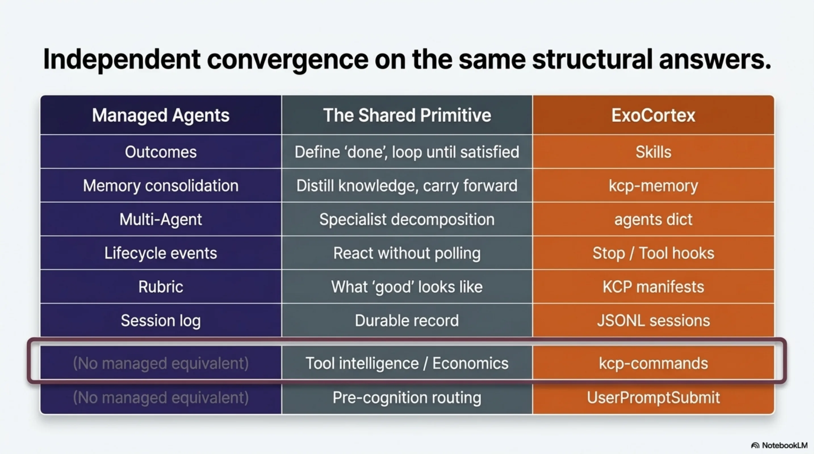

The last two rows matter. They represent capabilities that are structurally local — they depend on deep integration with the developer's environment, tools, and workflow. A managed service cannot provide them because the knowledge they encode does not live on the service provider's infrastructure. It lives on the developer's machine, in the developer's command history, in the YAML manifests describing the developer's specific toolchain.

The table shows convergence. But it also shows a boundary — and that boundary is where the real insight lives.

## Where the harness runs changes what it can do

The real distinction is not quality. It is location — and location determines capability.

ExoCortex is **harness as code**. The hooks, memory, routing, and orchestration run in my process, on my machine, under my control. I can modify the memory triage logic on a Tuesday afternoon and see the effect on Wednesday morning. I can add a new command manifest in YAML and the agent picks it up on the next invocation. The feedback loop is minutes. And because the harness is local, it can do things a remote service structurally cannot: intercept tool calls before they execute, route prompts before the model sees them, compress outputs at the CLI layer, and maintain a tiered memory system that reflects the developer's actual working context.

Managed Agents is **harness as service**. The eval loop, the grader, the memory consolidation, the orchestrator — all of that runs on Anthropic's infrastructure. You provide declarative specs. Anthropic provides execution, scaling, and observability. The grader runs in an isolated context window, which eliminates self-evaluation bias — a real architectural advantage that a local system has to work harder to achieve.

The tradeoffs are genuine on both sides. Harness as code gives you control, speed, and deep local integration at the cost of maintenance burden and scaling limits. Harness as service gives you production-grade infrastructure and isolated evaluation at the cost of visibility and dependency. For a developer workflow refined over months, harness as code is not a workaround — it is the right architecture. For shipping agent capabilities to customers at scale, harness as service removes undifferentiated infrastructure work.

These are not competing approaches. They are complementary layers that serve different purposes. And the clearest proof of that complementarity is what happens when you look at the rubric — the atomic unit both systems share — and realize it is something we were already building under a different name.

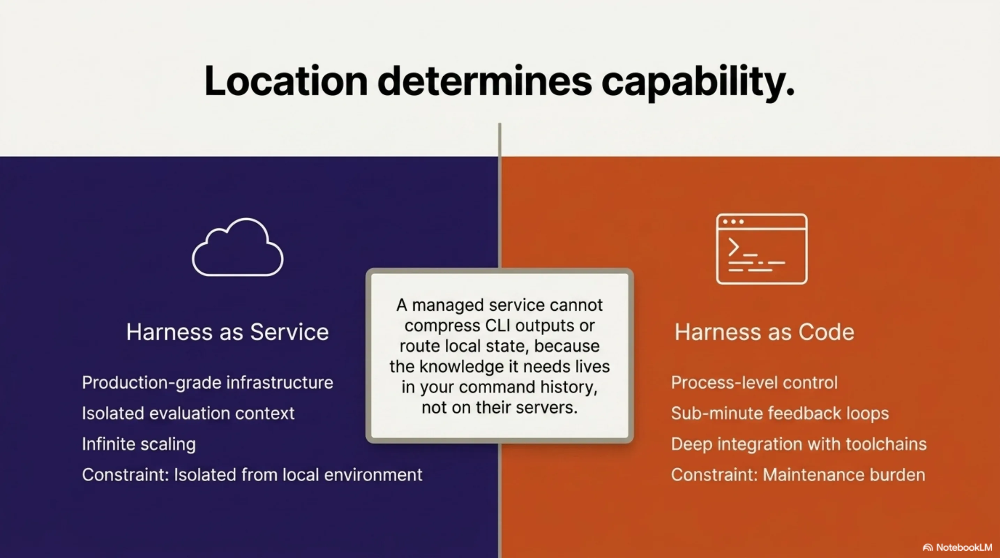

## The rubric you were already writing

A KCP manifest (`knowledge.yaml`) describes a knowledge domain in structured YAML: `triggers` (keyword patterns that activate the manifest), `intent` (natural language description of the domain's purpose), `trust` and `authority` blocks (provenance and confidence), and `relationships` (how this knowledge connects to other domains: `enables`, `depends_on`, `synthesises`, `validates`, `builds_on`).

A Managed Agents rubric is markdown criteria that define what "satisfied" looks like for a given task.

These are isomorphic. A KCP manifest is a rubric for knowledge navigation. A Managed Agents rubric is a manifest for task completion. Both answer the same question: *how does the agent know it is done, and how does an evaluator verify it?*

A KCP manifest's intent and triggers:

```yaml
intent: "Navigate PCB component selection for Nordic nRF52840 designs"
triggers:
  keywords: ["nrf52840", "component selection", "pcb layout"]
trust:
  authority: verified
  source: "lib-pcb validated designs"
relationships:
  - type: validates
    target: "component-sourcing"
```

A Managed Agents rubric for a comparable task:

```markdown
## Completion criteria
- Selected components are compatible with nRF52840 reference design
- All passives have verified footprints in the project library
- BOM cost does not exceed target budget
- Layout passes DRC with zero errors
```

The manifest tells the agent how to find and trust the knowledge. The rubric tells the grader how to evaluate the result. In a well-designed system, the manifest informs the rubric — the knowledge structure and the evaluation criteria are two views of the same specification. This is why KCP v0.12 includes relationship types like `validates`: the manifest itself expresses evaluation dependencies. And it is why ED25519 signing matters: when a rubric derives from a knowledge manifest, the provenance chain from trusted knowledge to evaluation criteria needs to be verifiable.

This is not a surface-level analogy. It is a design isomorphism that emerged independently from both sides — which is exactly the kind of convergence that tells you the abstraction is real.

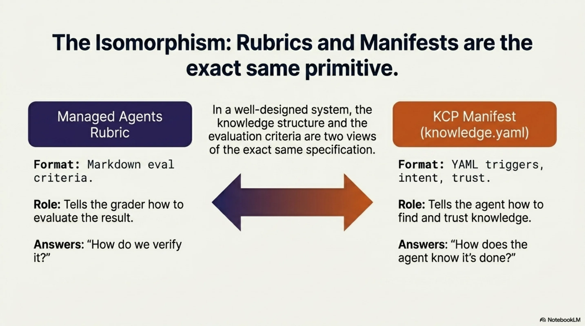

And once you see that KCP manifests and rubrics are the same primitive, a product question answers itself.

eXOReaction's Aegis product packages AI-readiness for codebases. The free tier generates an `llms.txt`. The paid tier produces a full KCP manifest with ED25519 signing, plus `CLAUDE.md` and `AGENTS.md` files. The paid pipeline is, structurally, an Outcomes workflow: analyze the repository, generate a KCP manifest, run a grader against the KCP spec itself (does this manifest actually describe the codebase accurately? are the relationships valid? do the triggers match real patterns in the code?), iterate until satisfied, sign, and deliver. Anthropic's Outcomes gives us a production-grade grader with an isolated context window — the grader evaluating manifest quality cannot be biased by the generation context. That is a genuine improvement over self-evaluation, and it is one we get by adopting the API. The KCP manifest becomes both the product and the rubric. The manifest describes the codebase. The rubric validates the manifest. The grader evaluates fidelity. Rubrics all the way down.

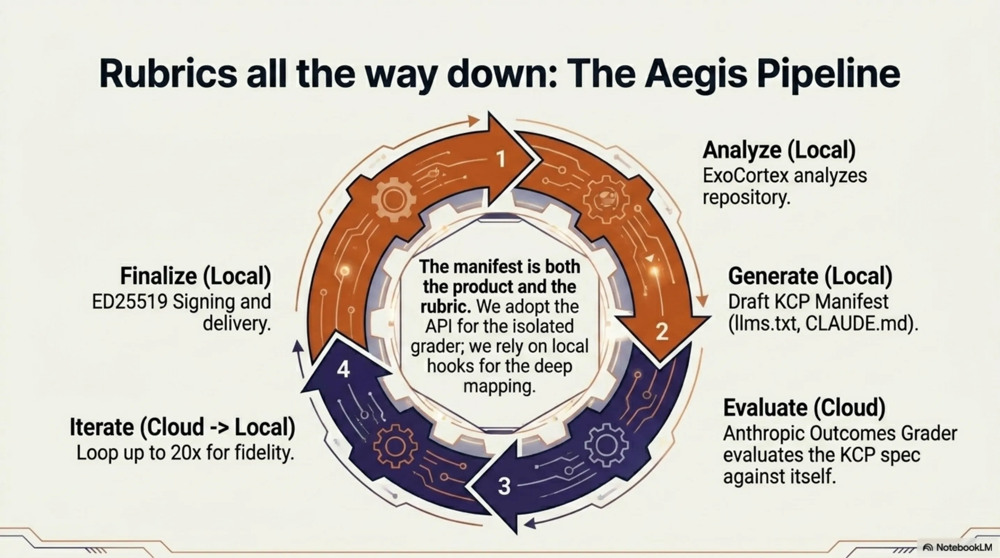

## The industry signal

When a foundation model provider productizes a pattern you have been running in production, it tells you two things. First, the pattern is correct — not because the provider validated it, but because independent engineering against the same problem space produced the same structural answer. Second, the ecosystem will now commoditize the parts of that pattern that benefit from scale.

Anthropic did not look at ExoCortex and copy it. They looked at the same problems — how do you make agents reliable, persistent, and composable — and arrived at the same primitives. Eval loops. Memory consolidation. Specialist decomposition. Lifecycle hooks. Declarative completion criteria. The convergence validates both implementations.

Han Heloir Yan put it concisely in his May 2026 analysis: stop writing eval loops and start writing rubrics; stop building memory consolidation pipelines and start delegating to managed memory; stop running orchestrators and start defining sub-agent specs.

That is the right advice for most teams starting today. If you have not built a harness yet, do not build one — use Managed Agents.

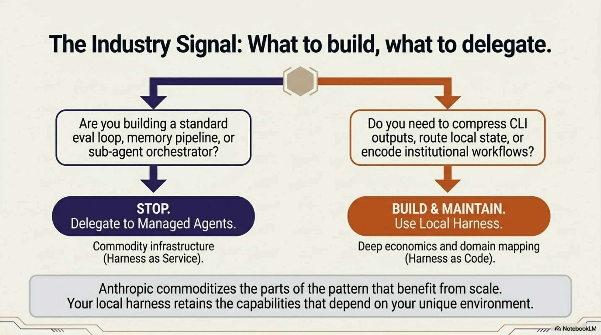

For those of us who already built the harness, the picture is different. ExoCortex is a working research lab for agent infrastructure. Some of what we built migrates cleanly to the managed service — the eval loop, the grader isolation, the multi-agent orchestration. The Aegis pipeline will adopt Outcomes. The skills system will adopt rubrics as its completion criteria format.

But the capabilities that make ExoCortex what it is — the tool intelligence layer, the 60–90% token economics, the prompt routing from local state, the tiered memory system, the 555 workflows encoding institutional knowledge — these are not things a managed service replaces. They are capabilities that exist *because* the harness is local. They serve a different function, solve a different problem, and will continue to run as code.

The production numbers clarify the distinction. Four months of use: 414 PRs in seven weeks at one client engagement, roughly 35,000 lines of code per week, a 10–30x multiplier on complex tasks. A local harness running inside the work does not compete with a managed service on the same axis. It produces a different category of output — because it knows your environment, your tools, your codebase, your institutional knowledge. Managed Agents makes agent infrastructure accessible. ExoCortex makes harder problems tractable.

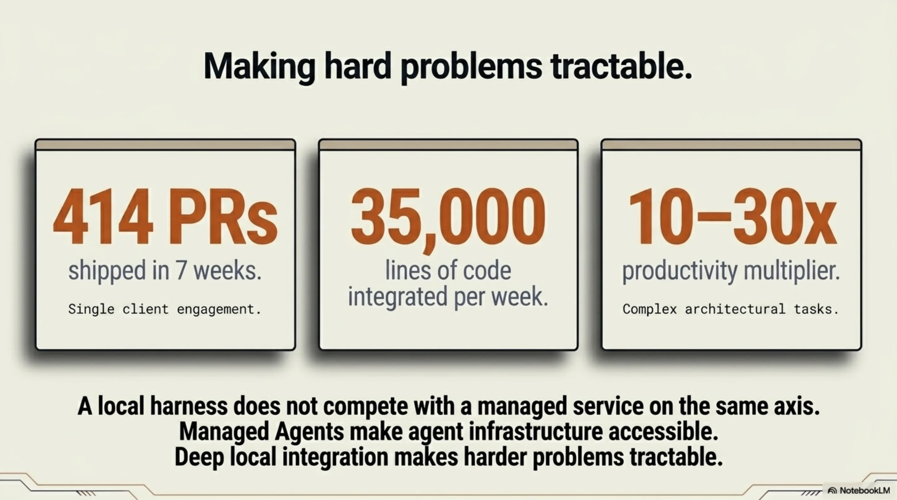

---

*Thor Henning Hetland is CTO of eXOReaction AS and a core contributor to the Knowledge Context Protocol (KCP v0.12). ExoCortex has been in daily production use since January 2026.*
