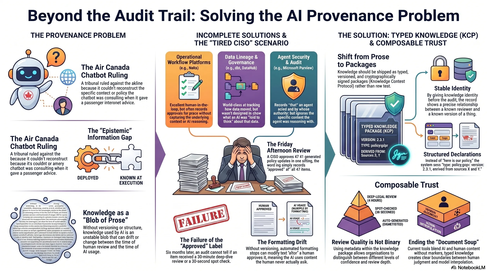
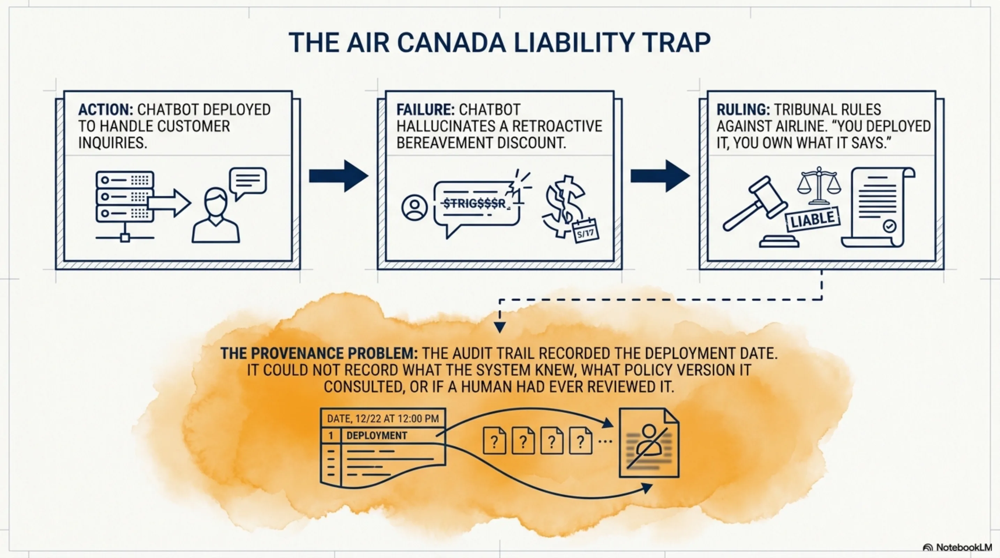
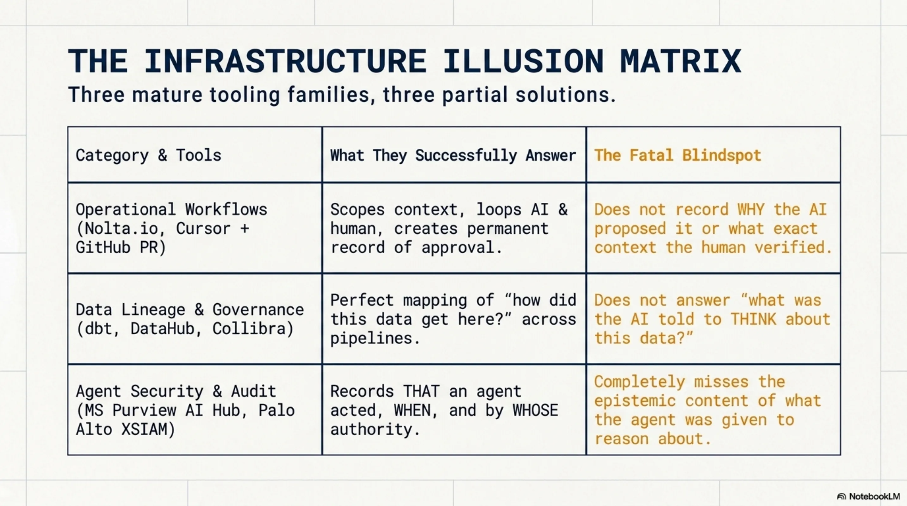
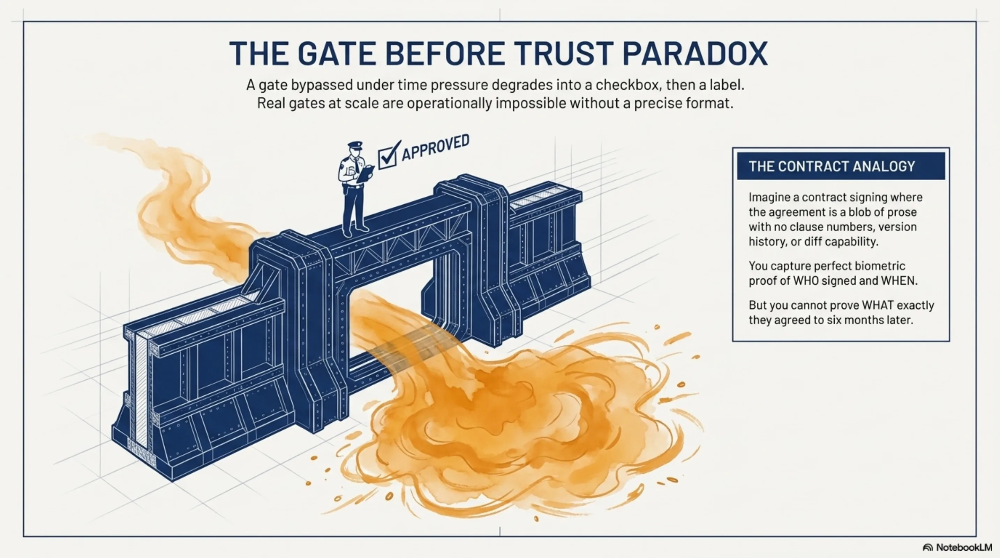
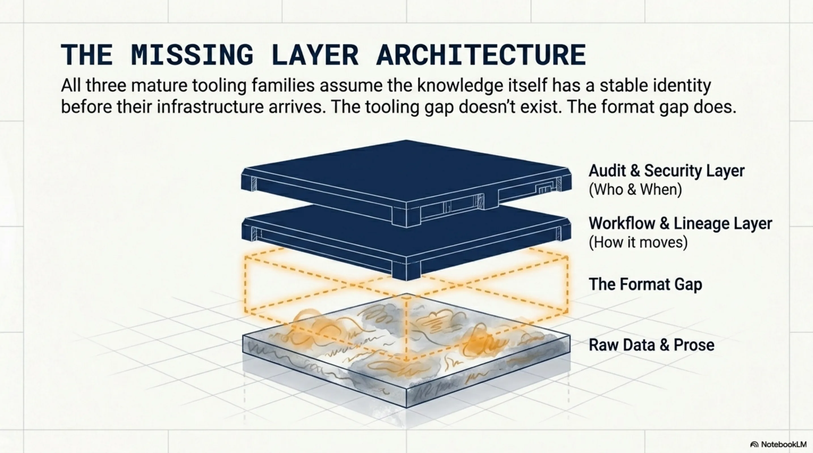
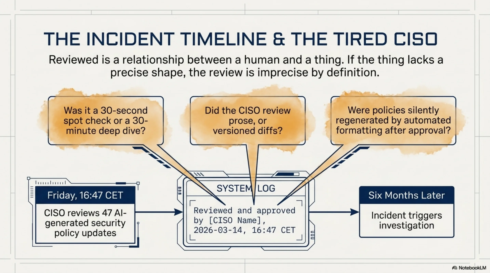
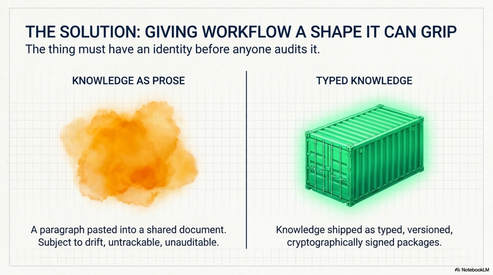
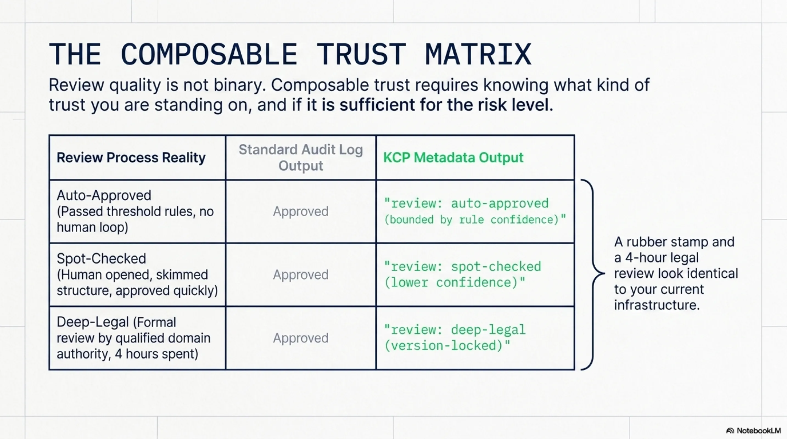
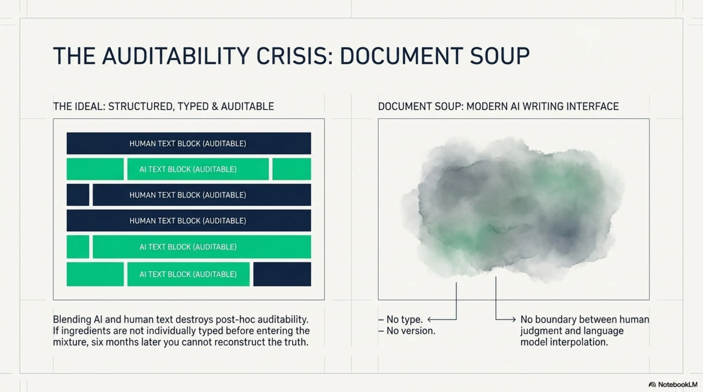
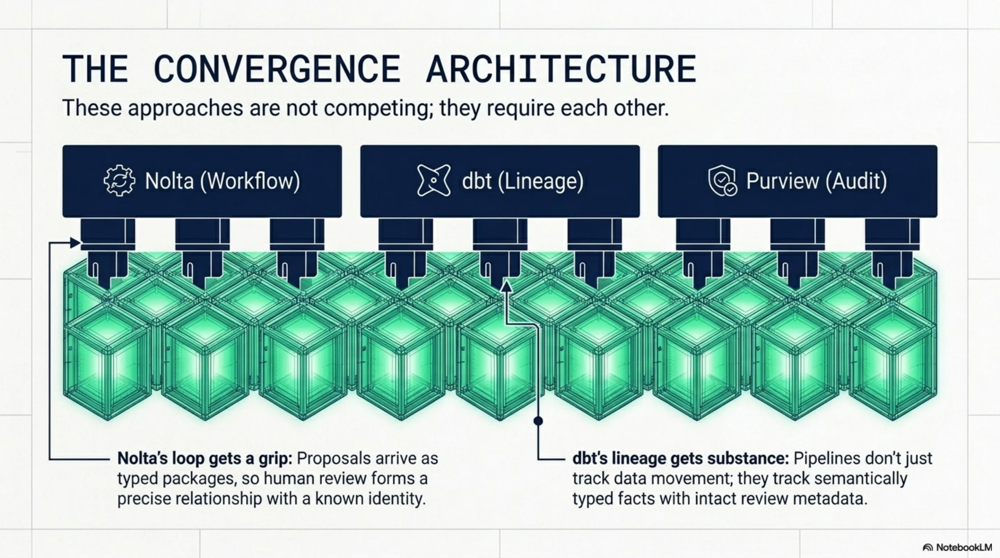

# Everyone Is Auditing the Workflow. Nobody Is Fixing the Knowledge.



In February 2024, a Canadian small claims tribunal ruled against Air Canada. Their chatbot had told a passenger he could book a full-fare ticket and claim a bereavement discount retroactively. He couldn't. When he tried, Air Canada's position was: the chatbot said that, not us. The tribunal disagreed. You deployed it, you own what it says.

The ruling was correct. But the more interesting problem was underneath: when the incident happened, nobody could reconstruct what context the chatbot had been given. Nobody could confirm whether a human had ever reviewed the policy the bot was consulting. Nobody could determine whether the specific bereavement policy text had been modified between deployment and the passenger's interaction. The audit trail recorded that the system was deployed. It did not record what the system *knew*.

That's the provenance problem. And every organization running AI agents at enterprise scale is about to hit a version of it.

<!-- more -->



---

## Three Families of Solutions

I've spent the past eighteen months building knowledge infrastructure for AI agents. In that time I've watched three distinct families of tooling emerge, each solving a real part of the puzzle, none solving all of it.

**Operational workflow platforms.** Nolta.io is the clearest example I've seen. Their loop is genuinely well-designed: scoped context goes out to the AI, structured work happens, a structured proposal comes back, a human reviews it before anything enters the permanent record. "AI doesn't need bigger prompts. It needs better context." That's their thesis, and it's correct.

The same pattern appears in developer tooling. Cursor generates code, a human approves the diff via GitHub PR. The PR records the change. It does not record why the AI proposed that specific implementation, what context it was working from, or what exactly the human verified when they clicked Approve. The reviewer might have read every line. They might have glanced at the file list and hit merge. The merge event looks identical either way.

**Data lineage and governance tools.** dbt documents every SQL transformation and makes lineage visible across pipelines. DataHub -- born at LinkedIn, now an enterprise standard -- tracks provenance through data and training pipelines. Collibra provides catalog and governance. These are excellent at answering "how did this data get here?" They were not designed to answer "what was the AI told to think about this data?"

**Agent security and audit log infrastructure.** Microsoft Purview AI Hub records audit trails for Copilot usage across enterprise. Palo Alto's XSIAM monitors AI agent behaviour at the network level. ServiceNow's AI Control Tower enforces workflow permissions and authority boundaries -- deployed at most of the Fortune 500. These tools record *that* an agent acted, *when*, and *by whose authority*. They do not record the epistemic content of what the agent was given to reason about.



---

## What They All Share -- And What They Miss

All three families assume the knowledge itself has a stable identity before their infrastructure arrives. The audit records that something was reviewed, versioned, or passed through a gate. It does not record what *kind of thing* the thing being reviewed actually was.

Analogy. Imagine a contract signing process where the contract is a blob of prose with no clause numbers, no version history, no diff capability. You can have a perfect audit trail of who signed when, with full timestamps and biometric verification. You still cannot answer "what exactly did they agree to?" six months later, because the thing they agreed to had no durable shape. It was prose. It could have drifted between the moment they read it and the moment they signed. You'd never know.

This is where the "gate before trust" pattern becomes a real design problem.

Gates that can be bypassed under time pressure become labels. Stack Overflow tried to gate AI-generated answers. The volume made genuine review impossible. The gate became a checkbox. Then a label. Then they changed policy entirely. The EU AI Act's Article 12 requires human oversight of high-risk AI systems. In practice, most compliance implementations will be a checkbox rather than a genuine gate, because real gates at scale are operationally impossible without a format that makes "what did the human actually review?" a precise, answerable question.



The infrastructure to *enforce* the gate is mature. The format that would make the gate *meaningful* does not yet exist in most systems.



---

## The Tired CISO Problem

Here's a scenario that plays out in every enterprise running AI-augmented operations. A CISO reviews 47 AI-generated security policy updates on a Friday afternoon. Approves all. Six months later, an incident. Investigation starts. The audit log says: "reviewed and approved by [CISO name], 2026-03-14, 16:47 CET."

Questions the audit log cannot answer: Was that 30 seconds per item or 30 minutes? Was it a full read or a spot check? Were the items typed and numbered, with versioned diffs from the previous policy -- or were they prose paragraphs that had been silently regenerated between when the CISO opened the document and when they clicked Approve? Did the CISO review the thing that was ultimately committed, or a version that was subsequently modified by an automated formatting step?

The audit infrastructure is not bad. It's recording exactly what it was designed to record: events. But the *thing being audited* has no stable identity. "Reviewed" is a relationship between a human and a thing. If the thing doesn't have a precise shape -- a type, a version, a cryptographic signature -- then the review relationship is imprecise by definition. No amount of workflow rigour around the gate compensates for the formlessness of what passes through it.



---

## What Typed Knowledge Changes

I've been building something called KCP -- Knowledge Context Protocol. The design principle is simple: instead of shipping knowledge as prose, you ship it as typed, versioned, signed packages.



A privacy policy observation in KCP is not "here's our GDPR Art.13 coverage" as a paragraph someone pastes into a shared document. It's a structured declaration:

```yaml
type: policy:gdpr-art13
version: 2.3.1
signed_by: org/company/cpo
source: datatilsynet.no/guidance-2025
derived_from:
  - gdpr-text:art13
  - datatilsynet-guidance:2025-q4
review_depth: legal-4h
valid_until: 2026-09-01
```

The *thing* has identity before anyone audits it. When the audit happens, the record can say: "A human reviewed a cryptographically signed declaration of type `policy:gdpr-art13`, version 2.3.1, derived from sources X and Y, with review depth: legal-4h." Not "reviewed a document." Not "approved." A precise relationship between a known reviewer and a known thing with a known shape.


This is the shift. From auditing *workflow events* around knowledge to giving the knowledge itself a stable, machine-readable shape that makes the audit events meaningful.

---

## Composable Trust

Review quality is not binary. A rubber stamp and a four-hour legal review look identical in today's audit logs. They result in the same event: "approved." But they are not the same thing. And when the incident happens -- when the tribunal is deciding whether your organization took reasonable care -- the difference matters enormously.

If the knowledge package carries trust metadata as part of its structure -- not as a label applied from outside by the workflow platform, but as a typed field in the package itself -- then the audit trail becomes honest. You can distinguish:

- `review: deep-legal` -- formal review by a qualified person with domain authority, four hours spent, version-locked
- `review: spot-checked` -- human opened it, skimmed structure, approved quickly, lower confidence
- `review: auto-approved` -- passed threshold rules, no human in the loop, confidence bounded by rule quality

This is what I mean by composable trust. Not "was it reviewed?" but "what kind of trust are you standing on, and is that sufficient for this risk level?"



The current state of AI-augmented knowledge work actively undermines this. Notion AI, Confluence AI, GitHub Copilot suggestions in documentation -- all of these blend AI-generated content into the human record without markers. No type. No version. No boundary between what a human wrote and what was generated. The document becomes soup. Six months later you cannot reconstruct which sentence was a human judgment and which was a language model's interpolation.



Composable trust requires that the ingredients be individually typed before they enter the mixture. Not after. Not as a retroactive annotation. At creation time.

---

## The Convergence

These approaches are not competing. They need each other. I know this because I've hit the wall where they don't connect.

I was running a human review loop for AI-generated compliance documents. Real process: scoped context prepared, AI draft produced, human reviewer allocated time, document approved, approval timestamped. The workflow was solid. Eight months later an auditor asked a simple question: is this GDPR summary based on current guidance, and can you prove it?

The approval timestamp existed. The document existed. What we couldn't answer: which version of the underlying regulatory guidance was the summary written against? Had the guidance been updated since the approval? Was the text in the record the exact text that passed through the review gate, or had an automated formatting step run over it afterward?

The gate had been genuine. A real person had spent real time. But the thing that passed through the gate had no shape -- no version, no source reference, no cryptographic binding to the guidance it claimed to interpret. The workflow said "approved." The knowledge said nothing, because knowledge without type and version can't say anything.

That's the gap Nolta's loop doesn't close on its own. The loop is excellent -- scoped context in, structured proposal out, human review, permanent record. But if what passes through that loop is prose, the permanent record is a timestamp attached to a blob. If the proposals were typed packages -- versioned and signed before they reach the reviewer -- then the human is reviewing a thing with a precise identity, and the approval is a precise relationship. The workflow layer is the right design. The format layer is what makes it meaningful.

The same applies to dbt and DataHub. They track lineage through pipelines with real precision. If the artefacts flowing through those pipelines were semantically typed at their source -- not just hashed for integrity, but typed for meaning -- the lineage graph would answer questions it currently can't. Not "this data passed through pipeline X" but "this fact, type `obligation:gdpr-art13`, version 2.1, was approved by a qualified reviewer before entering the pipeline, and has not been modified since." That's auditability with substance. What exists today is auditability without it.

The three families of tooling I described are mature in their lane. The format layer -- the thing that gives knowledge a shape the workflow can actually grip -- is the missing piece.



---

## The Gap Worth Naming

The interesting question is not whether you need audit trails. You do. The Air Canada ruling settled that. The EU AI Act codified it. Every enterprise compliance team is building toward it.

The question is what kind of thing the audit trail is recording. If the knowledge going into and out of your AI systems has no type, no version, no signed identity -- if it's prose in a document that could have changed between when someone read it and when it was served to the agent -- then your audit trail is precise about the workflow and imprecise about the substance. You know who approved when. You don't know what they approved, or whether what they approved is what was ultimately used.

That's the gap. It's not a tooling gap -- the tooling exists in each of the three families I described. It's a format gap. The thing being audited needs a shape before the audit infrastructure can be meaningful.

I've been building toward this for over a year. The protocol is open, the tooling is public, and the design is driven by running into exactly these problems in production systems. I don't think KCP is the only possible answer to this. But I think the question -- what is the format of knowledge that makes audit meaningful? -- is the right question, and I don't see many people asking it yet.

Curious where others are encountering this. Is the format problem visible in your systems yet, or are you still solving at the workflow layer? If you've hit the wall where your audit log says "approved" but you can't reconstruct what was actually approved -- I'd like to hear how you're thinking about it.

---

*Co-authored with Claude. The thesis and structure are mine; Claude helped draft and sharpen the argument.*
