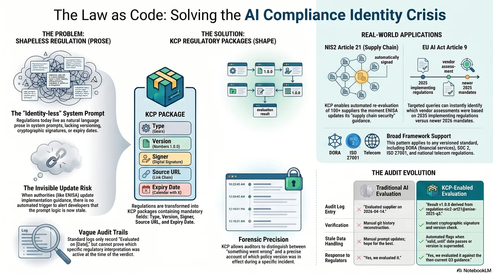
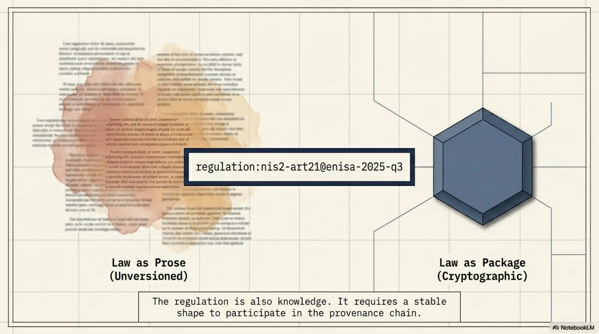
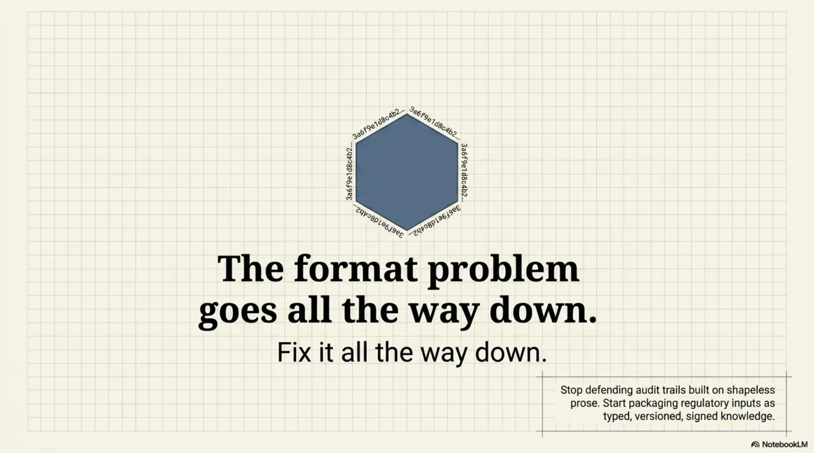

# The Law Is Also Knowledge. Package It.



In the [previous post](2026-06-01-auditing-workflow-fixing-knowledge.md), I argued that the AI provenance problem is a format problem. The knowledge going into and out of AI systems -- policies, observations, interpretations -- has no stable shape. No type, no version, no cryptographic binding. The audit trail records that something was reviewed. It cannot record what was reviewed, because the thing itself is prose that could have drifted between the moment of review and the moment of use.

KCP solves this by giving knowledge a shape: typed, versioned, signed packages. A compliance observation becomes a structured declaration with `type`, `version`, `signed_by`, `derived_from`, `review_depth`, `valid_until`. The audit trail becomes precise: "reviewed a cryptographically signed declaration of type `evaluation:nis2-art21-supply-chain` v1.2.0" -- not "reviewed a document."

But there is a gap I did not address. I gave shape to the **outputs** -- the policies, the observations, the interpretations. I left the **inputs** shapeless. The regulations and laws that AI agents evaluate against are still prose in the system prompt.

This post closes that gap.

<!-- more -->

---

## The Regulation Is Also Knowledge


When a compliance agent evaluates a supplier against NIS2 Article 21, it needs two things: the supplier's security documentation to evaluate, and the regulation to evaluate it against.

KCP, as described in the previous post, gives the supplier documentation a shape. The evaluation result gets a shape. But the regulation itself -- the specific requirements of Article 21(2), the interpretive guidance from ENISA, the national implementation notes -- lives where it has always lived: as prose in the system prompt.

This is the same problem, one layer deeper.


The regulation text in a system prompt has no version. It has no signature. It has no `valid_until`. If ENISA updates its implementation guidance on Article 21 -- tightening what "supply chain security measures" requires, or adding clarity on incident notification timelines -- someone has to remember to update the prompt. There is no mechanism to detect that the guidance has changed. There is no mechanism to identify which previous evaluations used the old guidance. When the evaluator says "Article 21(2)(d): partial" -- which version of the guidance is "partial" measured against?

The audit log says "evaluated 2026-04-14." It cannot say anything more precise, because the regulation against which the evaluation was performed has no identity.

The fix is straightforward: the regulation is also knowledge. Package it.

---

## Before and After: A NIS2 Supply Chain Evaluator



Imagine an enterprise security team -- any large organization in a regulated sector -- using an AI agent to evaluate their critical suppliers against NIS2 Article 21. NIS2 requires organizations to implement supply chain security measures. For each critical supplier, the team needs to determine whether the supplier's documented security controls satisfy the Article 21(2) requirements.

This is a plausible production system. The evaluations feed into a supplier risk register. When a supplier's assessment drops below threshold, procurement decisions change. The stakes are real.

**Today, without the regulation as a package:**

The Article 21(2) requirements are hardcoded in the system prompt as prose. The prompt references "NIS2 Article 21" but does not version it. The requirements are written in natural language, drawn from a specific interpretation of the directive that was current when the prompt was authored. That interpretation reflects ENISA's implementation guidance as of a particular quarter -- but the prompt does not record which quarter.

Member states implement NIS2 differently. ENISA publishes implementation guidelines that get refined. National competent authorities issue sector-specific interpretations. If any of these update -- a national authority publishes a new Q&A clarifying what "documented incident response procedures" requires from sub-contractors -- someone on the development team has to notice the update, interpret its implications for the prompt, edit the prompt, and redeploy. There is no automated trigger. There is no version comparison. The prompt is prose. Prose does not diff against a regulatory source.

When the evaluator produces a result -- "Article 21(2)(d) supply chain security: partial" -- the audit trail records the date, the model, and the verdict. It does not record which version of the regulatory guidance the verdict was measured against. Six months later, the organization's compliance officer asks: "Your system said our supplier partially covers the supply chain requirement. Partially according to what?" The honest answer today is: "According to whatever was in the system prompt on that date. We can check our git history for prompt changes, but we cannot tell you precisely which regulatory interpretation was active at evaluation time without manual reconstruction."

This is not a failure of engineering. The engineers built a working system. It is a failure of format. The regulation had no shape, so the evaluation result could not inherit provenance from it.

**With KCP -- the regulation as a package:**


```yaml
type: regulation:nis2-art21
version: enisa-2025-q3
signed_by: enisa.europa.eu/official
source: https://www.enisa.europa.eu/publications/nis2-implementation-guidance/2025-q3
valid_until: 2026-03-31
requirements:
  "2a": "Policies on risk analysis and information system security"
  "2b": "Incident handling procedures"
  "2c": "Business continuity and crisis management"
  "2d": "Supply chain security, including supplier relationships"
  "2e": "Security in network and information systems acquisition and development"
  "2f": "Policies to assess the effectiveness of cybersecurity measures"
  "2g": "Basic cyber hygiene practices and cybersecurity training"
  "2h": "Policies on use of cryptography and encryption"
  "2i": "Human resources security, access control, and asset management"
  "2j": "Use of multi-factor authentication or continuous authentication"
```

The regulation package has a type, a version, a signer, a source URL, and an expiry date. The requirements are structured data, not prose in a prompt. The package can be validated: does `enisa.europa.eu/official` correspond to a known authority? Is `enisa-2025-q3` the current version? Has `valid_until` passed?

Now the evaluation result is also a package:

```yaml
type: evaluation:nis2-art21-supply-chain
version: 1.0.0
derived_from:
  - regulation:nis2-art21@enisa-2025-q3
  - supplier-security-docs:acme-corp@fetched-2026-04-14
evaluated_by: gpt-4.1/compliance-deployment-prod
results:
  "2a": {covered: "yes", confidence: 0.91}
  "2b": {covered: "yes", confidence: 0.88}
  "2c": {covered: "partial", confidence: 0.74}
  "2d": {covered: "partial", confidence: 0.69}
  "2e": {covered: "no", confidence: 0.92}
  "2f": {covered: "no", confidence: 0.87}
gaps:
  - "No documented sub-processor incident notification timeline"
  - "Security effectiveness review cadence not specified"
risk_level: medium
valid_until: 2026-07-14
```


Look at `derived_from`. The evaluation result declares two parents: the regulation package at version `enisa-2025-q3`, and the supplier's security documentation as fetched on a specific date. The provenance is not reconstructed after the fact. It is declared at creation time. The result knows what it was measured against.


Now the audit trail says: "NIS2 Art.21 evaluation derived from `regulation:nis2-art21@enisa-2025-q3` (signed by ENISA) against `supplier-security-docs:acme-corp@fetched-2026-04-14`." Not "evaluated a supplier." The compliance officer asks "partially according to what?" and the answer is: "According to `regulation:nis2-art21@enisa-2025-q3`, ENISA's Q3 2025 implementation guidance, which was current on the evaluation date and valid until 2026-03-31."

---

## The Pattern Repeats: EU AI Act Article 9

The same structure applies to the EU AI Act. Article 9 requires providers of high-risk AI systems to implement a risk management system. Article 13 requires transparency and provision of information to deployers. These are requirements that AI system providers need to evaluate their own systems against -- and that procurement teams need to evaluate AI vendors against.

Today, a compliance team checking whether a vendor's AI system satisfies Article 9's risk management requirements has those requirements embedded in its review checklist as prose. The checklist references "EU AI Act Article 9" but does not version it. The EU AI Act has delegated acts, implementing regulations, and ENISA guidelines that will be published and updated after the base text. When the compliance team's assessment says "Article 9(2) risk management system: partial coverage" -- which interpretation of the delegated acts was that against?

With KCP:

```yaml
type: regulation:eu-ai-act-art9
version: 2025-implementing-regs-1.0
signed_by: ec.europa.eu/official
source: https://ec.europa.eu/ai-act/implementing-regulations/2025/art9
valid_until: 2026-12-31
requirements:
  "2a": "Risk identification and analysis throughout the lifecycle"
  "2b": "Estimation and evaluation of risks when used as intended"
  "2c": "Evaluation of risks in light of post-market monitoring data"
  "2d": "Adoption of residual risk management measures"
  "4":  "Risk management measures to be applied to each identified risk"
  "6":  "Testing throughout the development lifecycle"
  "9":  "Consideration of effects on persons particularly at risk"
```

An AI system assessment against a vendor's technical documentation produces:

```yaml
type: evaluation:eu-ai-act-art9-risk-mgmt
version: 1.0.0
derived_from:
  - regulation:eu-ai-act-art9@2025-implementing-regs-1.0
  - vendor-technical-docs:vendorcorp-ai-hiring-tool@submitted-2026-03-01
evaluated_by: claude-opus-4-6/procurement-compliance
results:
  "2a": {covered: "partial", confidence: 0.82}
  "2b": {covered: "yes", confidence: 0.91}
  "2c": {covered: "no", confidence: 0.88}
  "4":  {covered: "partial", confidence: 0.76}
  "6":  {covered: "yes", confidence: 0.85}
gaps:
  - "No documented post-market monitoring integration with risk update process"
  - "Residual risk thresholds not quantified"
```


When the European Commission publishes a second round of implementing regulations for Article 9 in 2026 -- adding requirements for post-market monitoring feedback loops, which was always implied but not specified -- the system can query: "Which AI vendor assessments used `regulation:eu-ai-act-art9@2025-implementing-regs-1.0`?" and flag them for re-evaluation against the new version. The re-evaluation is targeted, not blanket. You do not re-run every compliance check in the system. You re-run the ones whose regulatory input changed. The `derived_from` field makes this query trivial.

---

## The Loop Closes


Here is the key structural insight. When the regulation is a KCP package, the evaluation loop closes provenance automatically. No extra annotation. No retroactive tagging. No manual reconstruction.

The before state:

> Regulation prose in system prompt → GPT → verdict as text.
> Audit trail: "evaluated. Date: 2026-04-14."

The after state:

> `regulation:nis2-art21@enisa-2025-q3` → GPT → `evaluation:nis2-art21-supply-chain@1.0.0` with `derived_from: regulation:nis2-art21@enisa-2025-q3`.
> Audit trail: "evaluated NIS2 Art.21 enisa-2025-q3 → result v1.0.0 → risk level: medium."

The provenance propagates through the `derived_from` chain without any additional work by the developer. The evaluation result inherits its regulatory context the same way a software build inherits its dependency versions: by declaring them at build time, not by hoping someone wrote them down afterward.

This is what makes the pattern powerful at scale. In a system evaluating dozens of suppliers across multiple regulatory frameworks, each with their own versioning schedules and national implementation variants -- which is what enterprise compliance infrastructure looks like in practice -- manual provenance tracking is not feasible. You cannot ask a developer to annotate every evaluation with the regulation version it was checked against. But if the regulation is a typed package and the evaluation result declares `derived_from`, the provenance is automatic.

Six months later, when a competent authority asks: "Did your system evaluate this supplier's security posture against current NIS2 guidance?" -- you can answer precisely. Not "yes, we evaluated it." But: "Yes, we evaluated it against `regulation:nis2-art21@enisa-2025-q3`, signed by ENISA, which was current on 2026-04-14. The guidance was updated to `enisa-2025-q4` on 2026-01-15. Our system detected the version change and flagged 34 supplier evaluations for re-run against the new version. Re-evaluation completed 2026-01-18. Here are the assessments that changed."

That is an answer that survives regulatory scrutiny. The answer "yes, we evaluated it" does not.

---

## The Tired CISO, Revisited


In the previous post I introduced the Tired CISO: a security leader who reviews 47 AI-generated policy updates on a Friday afternoon. Approves all. Six months later, incident. The audit log says "approved" but cannot answer what was actually approved, or whether the underlying context has changed since.

Now extend the scenario. Those 47 policy updates were AI-evaluated compliance assessments -- the system had checked supplier security documentation against NIS2 Article 21. The CISO was reviewing the evaluations, not the raw documentation.

![Standard Logging vs KCP Logging: Standard — "[2026-03-14] CISO approved 47 evaluations." Investigator note: Were these run against the new Feb 15 guidance or the old prompt? Nobody knows. Weeks of forensic reconstruction required. KCP — "[2026-03-14] CISO approved evaluation:nis2-art21-supply-chain@1.0.0 derived_from regulation:nis2-art21@enisa-2025-q3." Investigator note: Instant discovery — enisa-2025-q3 was superseded on Feb 15. The evaluations were approved against stale guidance. Precise, actionable finding.](../../assets/images/kcp-laws-09-standard-vs-kcp-logging.webp)

Without KCP, the approval event says: "CISO approved 47 evaluations, 2026-03-14 16:47 CET." The incident investigation six months later reveals that ENISA updated its Article 21 implementation guidance on 2026-02-15 -- a month before the CISO's review. Were the evaluations she approved run against the old guidance or the new? Nobody knows. The regulation text in the system prompt might have been updated. It might not have been. There is no version to check. There is no `derived_from` to follow.

With KCP, the approval event says: "CISO approved `evaluation:nis2-art21-supply-chain@1.0.0` derived from `regulation:nis2-art21@enisa-2025-q3`." The incident investigation checks: was `enisa-2025-q3` current on 2026-03-14? Answer: no. `enisa-2025-q4` was published on 2026-02-15. The evaluations were approved against stale guidance.

That is a finding. It is precise. It is actionable. And it was discoverable in seconds, not weeks of forensic reconstruction. The CISO can explain exactly what happened and what was missed. More importantly, the system can be fixed: add a check that compares the regulation version in `derived_from` against the latest available version before presenting evaluations for human review. If the regulatory input has been superseded, flag the evaluation before it reaches the CISO's desk.


Compare this to the Air Canada scenario from the first post. The tribunal found liability because nobody could reconstruct what the chatbot knew. The chatbot's knowledge had no shape. If the bereavement policy the chatbot consulted had been a typed, versioned package -- and if the chatbot's response had declared `derived_from` pointing to that package -- the reconstruction would have been trivial. Not "the chatbot said something wrong." But: "The chatbot consulted `policy:bereavement@2.1`. That version contained an error in clause 3 regarding retroactive discounts. The error was introduced in version 2.1, not present in version 2.0, and was corrected in version 2.2 deployed three weeks after the incident."

The difference between "something went wrong" and a precise forensic account is not better workflow tooling. It is giving the knowledge -- including the regulatory knowledge -- a shape that supports forensic inquiry.

---

## The Broader Implication

![Framework table: DORA (Financial Services ICT Risk) — current state: PDFs of RTS standards updated dynamically → future: regulation:dora-ict-risk@esma-rts-v1.2. SOC 2 (Audit Framework) — current: typed controls (CC6.1) sitting in Confluence pages → future: framework:soc2-cc6.1@2017. ISO 27001 (InfoSec) — current: Annex A numbered controls as bullet points → future: framework:iso27001-annex-a-5.1@2022. These inform, but do not currently participate in the provenance chain. They are one step away from being typed packages.](../../assets/images/kcp-laws-12-frameworks-table.webp)

NIS2 Article 21 and EU AI Act Article 9 are two examples. The pattern applies everywhere a machine-readable regulation meets an AI evaluator:

- **DORA** -- the Digital Operational Resilience Act for financial services, with ICT risk management requirements that need to be evaluated per-vendor, per-contract, against RTS standards that will be updated.
- **SOC 2** -- not a regulation but an audit framework with typed controls (CC6.1, CC6.2, ...) that map naturally to structured packages with version history.
- **ISO 27001** -- Annex A controls are already numbered and categorized. They are one step away from being typed packages with versions and signatures.
- **Sector-specific frameworks** -- national implementations of NIS2 that vary by member state, EBA guidelines for banking, sector telecom requirements. Each is a versioned set of requirements. Each needs to be evaluated against. None currently has a stable machine-readable identity.

Every one of these frameworks has the same structural property: a set of requirements, issued by an authority, versioned over time, that AI agents need to evaluate against. Today, those requirements live as prose in prompts, PDFs on authority websites, or paragraphs in Confluence pages. They are consulted but not consumed as data. They inform but do not participate in the provenance chain.

The format problem at the regulation level is the same format problem as at the knowledge level. The knowledge has no shape, so the audit trail cannot grip it. The regulation has no shape, so the evaluation result cannot inherit provenance from it. The fix is the same: give it a shape. Type it. Version it. Sign it. Let the downstream artifacts declare `derived_from` and let the provenance propagate.

The organizations that figure this out first -- that start packaging their regulatory inputs as typed, versioned, signed knowledge rather than prose in prompts -- will have audit trails that answer questions their competitors cannot. Not because they built better workflow tooling. Because they solved the format problem at the input layer, not just the output layer.



The format problem goes all the way down. Fix it all the way down.

---

*Co-authored with Claude. The thesis and structure are mine; Claude helped draft and sharpen the argument.*
