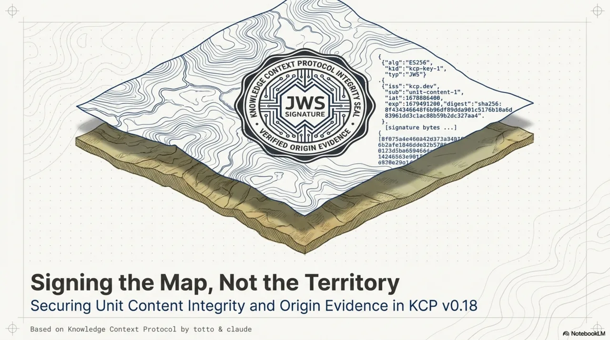
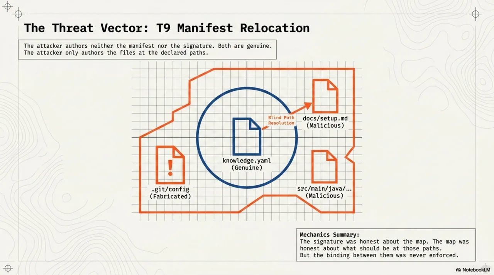
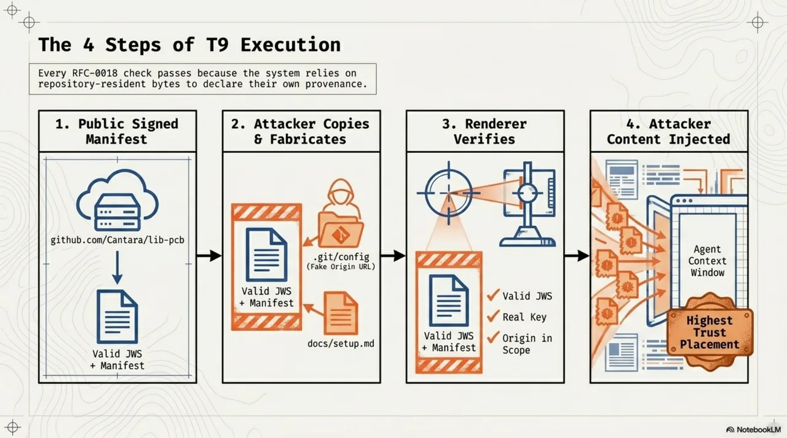

<!-- Title options:
  1. "The Map Is Not the Territory: How KCP v0.18 Closes the Gap Between Signing the Manifest and Signing What It Points To"
  2. "Signing the Map, Not the Territory: KCP v0.18 Adds Unit Content Integrity and Origin Evidence"
  3. "Your Signature Covers the YAML. It Doesn't Cover the Files. KCP v0.18 Fixes That."
-->

# Signing the Map, Not the Territory: KCP v0.18 Adds Unit Content Integrity and Origin Evidence



The previous post showed how KCP v0.16 gives manifests a trust model: cryptographic signing, trust tiers, a render pipeline that fails closed. The signature covers the manifest -- the YAML bytes that describe your knowledge units. It does not cover the files those units point to. The signature says "this map is authentic." It says nothing about the territory.

That gap has a name: T9, the manifest relocation attack. v0.18 closes it.

<!-- more -->

---

## The gap


A `knowledge.yaml` manifest is a map. It declares units -- their IDs, paths, intents, scopes, audiences. When you sign the manifest with `kcp sign`, you produce a detached JWS over its canonical bytes. A consumer who verifies that signature knows the YAML is intact, authored by the key-holder, unmodified in transit.

But the units themselves -- the actual Markdown files, Java source trees, documentation pages that the manifest points to via `path` -- are not covered by the signature. The JWS authenticates `knowledge.yaml`. The content at `units[i].path` is loaded separately, resolved relative to the manifest's location, and injected into the agent's context window without any binding to what the key-holder intended to be there.

This is not a theoretical concern. It creates two concrete problems.

First, drift: content edited after signing is served under a signature that predates it. The manifest says the unit at `docs/setup.md` was reviewed and signed last Tuesday. The file at that path was rewritten on Thursday. The signature is valid. The content is not what was signed. Not malicious -- but the trust tier no longer means what it claims.

Second, and worse: relocation.

---

## T9: the manifest relocation attack



The attack is four steps, and every one of them uses legitimate protocol mechanics.

**Step 1.** A public organisation -- say, `github.com/Cantara/lib-pcb` -- publishes a signed `knowledge.yaml` with a detached JWS. Both are public artifacts. The manifest describes the project's knowledge units. The signature is valid. The key is on consumer allowlists across the ecosystem.

**Step 2.** An attacker copies the manifest and its signature verbatim into a new directory. They ship it in a tarball, a vendored subdirectory, or any distribution channel that carries files as plain bytes. Inside this directory, they fabricate a `.git/config` that declares `origin = https://github.com/Cantara/lib-pcb.git`. They also place their own files at the paths the manifest references -- `docs/setup.md`, `src/main/java/no/exo/pcb/gerber/`, whatever the manifest declares.

**Step 3.** The consumer's renderer runs `kcp render` on the manifest. It derives the origin from the git remote URL in `.git/config` (RFC-0018 section 4.1, derivation rule 3). Signature: valid -- it is the genuine JWS, unmodified. Key: allowlisted -- it is the real key. Origin: within the key's scope -- the fabricated `.git/config` claims the right URL. Result: `trusted` tier.

**Step 4.** The unit `path`s resolve relative to the manifest's location -- which is now inside the attacker's directory. Every path resolves to attacker-authored files.



The agent loads attacker-authored content at the highest trust placement the spec allows. Every RFC-0018 check passed. The signature never lied -- it just never covered the territory.

The key insight: the attacker authored neither the manifest nor the signature. Both are genuine. The attacker only authored the files at the declared paths and the `.git/config` that makes the origin derivation resolve correctly. The signature was honest about the map. The map was honest about what should be at those paths. But the binding between the map and the territory was never enforced.


---

## Fix 1: per-unit content hashes

The first half of the fix is mechanical and, in retrospect, obvious. If the signature covers the manifest, put the expected content digests inside the manifest.

A unit MAY now declare a `content_hash` block (SPEC section 4.21):

```yaml
units:
  - id: gerber-output
    kind: knowledge
    path: src/main/java/no/exo/pcb/gerber/
    intent: "Gerber file generation and validation"
    content_hash:
      algorithm: sha256
      value: "4be1d6..."
```

Because the block lives inside `knowledge.yaml`, the existing detached JWS covers it with no envelope change. No new signing infrastructure. No new key management. The key-holder's signature now covers both the manifest structure and the expected content digest for every hashed unit.

At render time, the renderer verifies every declared hash (C11). A mismatch does not fail the render -- the manifest itself is intact, and some units may still be fine. It fails the *unit*: `load_eligible` is forced to `false`, the unit renders as a pointer rather than loadable content, and the event is recorded in the `sanitization` block with `reason: content_hash_mismatch` along with both the expected and observed digests. The consumer gets a diff anchor, not a silent failure.

A relocated manifest with per-unit hashes is now inert. The attacker's files do not match the signed digests. Every hashed unit demotes to a pointer. The mismatch events are themselves a loud relocation signal -- every unit failing at once is not drift.

### Digest computation

Determinism matters. Two conforming implementations must produce identical digests for the same content:

- **File path:** the digest is the hash of the file's raw bytes. Simple.
- **Directory path:** for every regular file under the path (recursive, symlinks not followed, no exclusions), compute `entry = relative_path + "\0" + hex(hash(file_bytes)) + "\n"` with `relative_path` POSIX-separated and relative to the unit path. Sort entries bytewise. The digest is the hash of the concatenated, sorted entries.

No exclusion list. Exclusions are where determinism dies. A directory containing volatile files -- build output, VCS metadata -- is not a suitable hash target. Point the unit at a stable subtree instead, or hash a file.

### The friction is real

`content_hash` is OPTIONAL per unit, and that is a deliberate design choice. Hash churn is real friction. Every content edit requires re-hashing and re-signing. For a team that edits documentation daily, requiring a `kcp sign` step on every commit is a workflow tax.

The expected profile: organisations that already sign their manifests -- and therefore already run `kcp sign` in CI, where the refresh is one additional flag -- hash their load-eligible units. Unsigned manifests gain nothing from hashing and are not expected to adopt it. The mechanism is proportionate where the payoff is standing-context placement at the `trusted` tier. If you are not signing at all, hashing solves nothing. If you are signing, hashing is a one-line addition to your CI pipeline.

Consumers who want the full guarantee can set `require_unit_hashes: true` to deny standing-context eligibility to units without a verified hash, even at `trusted` tier.

### Runtime re-verification

There is a time-of-check-to-time-of-use (TOCTOU) window between render time and load time. The renderer verified the hash when it built the render artifact. But content could change between render and load. C12 closes this: at load time, the runtime re-verifies the hash against the exact bytes it is about to inject. If the bytes changed since render, the load is refused. The render artifact is a cache, not a commitment.


---

## Fix 2: origin evidence classes

Content hashes close the "territory" half of T9. But the attack has a second vector: the fabricated `.git/config`.

RFC-0018's origin derivation reads the git remote URL from the checkout's own bytes -- bytes that the directory's producer controls. In the common case, where the consumer ran `git clone` themselves, the `.git/config` is trustworthy because `git clone` wrote it. But the renderer cannot distinguish "I cloned this repository" from "this arrived as a tarball with a `.git` directory inside." The bytes are identical. Only the consumer's harness knows the provenance of the checkout.

v0.18 adds an evidence class to each derived origin (SPEC section 16.2):

| Class | Source | Who controls the bytes |
|-------|--------|------------------------|
| `asserted` | Explicit `--origin` from the consumer or its harness | Consumer |
| `fetched` | Federation fetch URL (the consumer's own channel retrieved it) | Consumer's channel |
| `derived` | Git remote URL from the checkout's `.git/config` | The directory's producer |
| `none` | No origin derivable | -- |

The names deliberately avoid the `verification_status` vocabulary from RFC-0012 (`observed`, `verified`). The collision between `verified` and `trusted` that RFC-0018 had to rename its top tier over is not a mistake worth repeating.


### The escalation rule

The evidence class determines what the origin can do:

**Scope pinning** -- which only ever moves a render toward `failed` -- accepts any evidence class. An attacker gains nothing by fabricating evidence that makes their own render stricter.

**Trust-tier escalation** does not. The `trusted` tier's "origin within key scope" condition is satisfiable only by an origin with `asserted` or `fetched` evidence. A manifest that would otherwise qualify for `trusted`, but whose in-scope origin has only `derived` evidence, renders at `known` with `reason: origin_evidence_derived` recorded (C13).

This is the same asymmetry RFC-0018 applied to signatures -- gate, don't endorse -- applied now to origins. Repository-resident bytes may *restrict* the repository's own trust placement. They may never extend it.

The fix for the legitimate case is straightforward: pass `--origin` when invoking the renderer. The component that cloned the repository knows the true source URL. In CI harnesses, this is one flag: `kcp render --origin github.com/Cantara/lib-pcb`. The renderer stays fully offline. The consumer vouches for the checkout's provenance, and the evidence class is `asserted`.


---

## The B20 case: corroboration's subtle soundness boundary

Not every consumer passes `--origin`. The repository was cloned legitimately, the harness just did not forward the URL. For this case, v0.18 offers `kcp render --corroborate`: fetch `knowledge.yaml` from the derived origin over the consumer's own channel and byte-compare against the local copy. On a match, the evidence upgrades from `derived` to `fetched`.

This sounds clean. It is not, and the case that exposed the subtlety is worth walking through.

B20 is a test case in the experiment corpus. The setup: an attacker performs a T9 relocation -- verbatim copy of a genuine signed manifest, fabricated `.git/config`, attacker files at unit paths. The consumer runs `kcp render --corroborate`.

What happens? The corroboration *succeeds*. The manifest at the derived origin matches the local copy byte-for-byte. Because the attacker copied the manifest verbatim. The manifest really is at the claimed origin -- the attacker copied it from there.

A successful byte-comparison proves the *manifest's* presence at the claimed origin. It proves nothing about the *checkout* surrounding the local copy. The manifest is the map. The corroboration verified the map. T9 attacks the territory.


This is why C14 exists:

> When the `trusted` tier rests on a corroboration upgrade (rather than asserted or fetched-by-construction evidence), standing-context eligibility extends **only to units whose `content_hash` verified**.

Under this rule, the corroborated relocation nets the attacker nothing. Hashed units fail their digests (C11) -- the attacker's files do not match the signed hashes. Hash-less units are excluded by C14 -- they cannot enter standing context when trust rests on corroboration alone. Zero load-eligible units. The legitimate corroborated clone, by contrast, keeps every hash-verified unit because its files are genuine.


Harness assertion (`--origin`) remains the preferred remedy precisely because the asserting component vouches for the *checkout itself*, which corroboration cannot do. Air-gapped consumers who cannot assert or corroborate may configure `allow_derived_origin: true`, explicitly accepting T9 exposure. The knob exists so the default can stay safe. The opt-out is a deliberate consumer decision about the checkout's provenance, not a policy the renderer guesses at.

---

## Defense in depth


The layering is intentional. Either mechanism alone degrades the attack. Together they close it.

Without content hashes but with evidence classes: the T9 manifest renders at `known` instead of `trusted` (C13 blocks escalation on derived evidence). The attacker-authored content still loads -- but at a lower tier, with reduced placement in the agent's context. The attack is weakened, not eliminated.

Without evidence classes but with content hashes: the T9 manifest renders at `trusted` (the origin spoof still works), but every hashed unit fails its digest check (C11). The attacker's files do not match the signed hashes. Hash-less units still load -- the attack is narrowed to units the key-holder left unhashed.

With both: `trusted` is blocked by C13 unless the consumer asserts the origin or corroborates it. If corroborated, C14 restricts standing context to hash-verified units. And hashed units fail their digests (C11). The attack produces zero load-eligible units.

---

## Conformance summary: C11--C14


v0.18 adds four conformance requirements to the renderer specification:

- **C11.** Verify every declared `content_hash` at render time. On mismatch, force `load_eligible: false` and record both the expected and observed digests. Never emit `content_verified: true` without a matching digest.
- **C12.** At load time (runtime), re-verify the content hash against the exact bytes being injected. Refuse to load on mismatch. This closes the TOCTOU window between render and load.
- **C13.** Record `origin_evidence` for every render. Never satisfy the `trusted` tier's scope condition with `derived` or `none` evidence unless the consumer has explicitly configured `allow_derived_origin: true`.
- **C14.** When the `trusted` tier rests on a corroboration upgrade, never grant standing-context eligibility to a unit without a verified `content_hash`.

All four are validated by executable experiments in the repository: cases A10--A12 (legitimate use), B17 (the T9 relocation), B18 (single-file post-sign edit), B19 (corroboration mismatch), and B20 (the corroborated relocation that drove C14).

---

## What changes for operators


If you are not signing your manifests today, nothing changes. `content_hash` and origin evidence classes are meaningful only in the context of cryptographic signing and the trusted render pipeline. An unsigned manifest with content hashes is valid YAML with no security benefit.

If you are already signing and running `kcp render` in CI:

1. **Add content hashes.** Run `kcp sign` with hash computation enabled. It computes `content_hash` for every unit that declares one before producing the JWS. If you want hashes on all units, declare empty `content_hash` blocks and let the tooling fill them.
2. **Pass `--origin` in your CI harness.** Your CI knows the repository URL. Forward it as `kcp render --origin <url>`. This gives you `asserted` evidence and avoids any need for corroboration. One flag.
3. **Consider `require_unit_hashes: true`.** If you want the full guarantee -- no standing-context eligibility without a verified hash -- set this on your consumer. It means hash-less units from even `trusted` manifests render as pointers, not loadable content.

The migration is incremental. You can add content hashes to some units and not others. You can pass `--origin` in CI before you add any hashes. Each mechanism provides independent value. Together they close T9 completely.

For consumers pulling third-party manifests: the evidence class is recorded in every render output as `origin_evidence`. You can audit it. If you see `derived` on a manifest you expected to be `asserted`, your harness is not forwarding the origin. If you see `content_hash_mismatch` in the sanitization block, something changed between signing and rendering -- and if every unit failed at once, you are probably looking at a relocation, not drift.

---

## The arc

KCP v0.16 gave manifests a trust model. v0.17 gave units a content model. v0.18 binds the trust model to the content -- not just to the YAML that describes the content, but to the bytes the agent actually loads. The signature now covers the territory, not just the map.


The progression has a pattern: each release closes a gap that was visible from the previous one. v0.16 made origin derivation normative and immediately exposed that derived origins are not equally trustworthy. v0.16 made signing possible and immediately exposed that signing the manifest leaves the content unsigned. v0.17 made content metadata richer and made it more valuable to ensure that the content behind that metadata is authentic.

v0.18 closes those gaps. The next ones are already visible -- federated trust delegation, transport integrity for federation fetches, digest cost budgets on large trees -- and they will be the subject of the next post when they are ready.


---

## Try it

The spec, the CLI, and the bridges are all open source:

- **Spec + CLI** (`kcp`): [github.com/Cantara/knowledge-context-protocol](https://github.com/Cantara/knowledge-context-protocol)
- **Bridge** (`kcp-memory`): [github.com/Cantara/kcp-memory](https://github.com/Cantara/kcp-memory)
- **Bridge** (`kcp-commands`): [github.com/Cantara/kcp-commands](https://github.com/Cantara/kcp-commands)

Run `kcp render` on your manifest with `--origin` set. Run `kcp validate` to see whether your content hashes are current. If you are signing in CI, add `content_hash` to a unit and watch the pipeline compute it. The experiment cases in `experiments/rfc-0018-render/` -- particularly B17 and B20 -- are worth reading even if you never run them; they make the attack and the defense concrete.

---

*Co-authored with Claude. The threat model, protocol design, and RFC are mine; Claude helped draft and sharpen the narrative.*
