# One Agent's Journey Through the Whole Protocol

This morning the Knowledge Context Protocol got [its login page](2026-07-04-kcp-022-023-trust-model-complete.md) — v0.22 and v0.23, the consumer half of the trust model. This afternoon, v0.24 landed on main: Org-Federation, from RFC-0011. The enterprise front door.

That's twenty-four versions in six months — v0.1 shipped January 10th. And with the front door in place, something has quietly become true: an agent can now traverse the entire protocol, from *"I know nothing but a company domain"* to *"I hold a signed receipt for the restricted knowledge I just consumed"*, and every step of that traversal is declared, verifiable, and standard.

So instead of another release note, let's take the tour. One agent, one traversal, every layer annotated with the release that built it.

<!-- more -->


---

## The setup

An agent is deployed into Acme Corp's production environment. Its task requires internal knowledge — service catalogues, data contracts, an incident runbook. It has never seen Acme's infrastructure before. It knows one thing: the domain, `acme.com`.

Six months ago, this was where the story ended. Today it's where it starts.

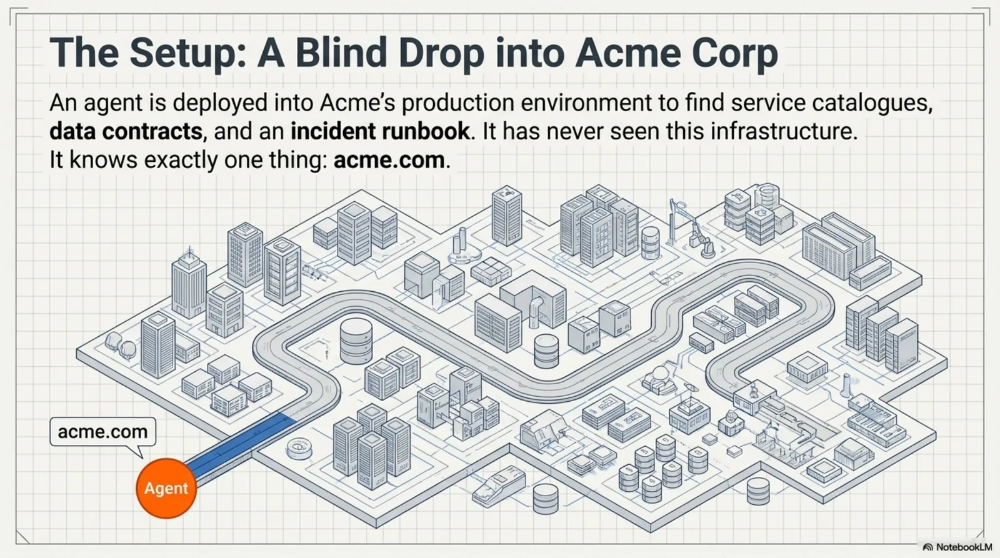

---

## Step 1: The front door — *discovery*

The agent fetches `https://acme.com/.well-known/kcp.json` (§1.4 — a discovery path present since v0.1, the very first draft) and finds the pointer to Acme's **org hub** — a public manifest declaring `network.role: hub` (the field from v0.11's agent-readiness work; the Org Hub pattern from RFC-0011, v0.24). The hub is the one manifest every agent may read: a front-door unit describing what Acme publishes, and a `manifests[]` federation block (§3.6, v0.9) listing everything else.

No crawling. No guessing. The knowledge topology is *declared*.

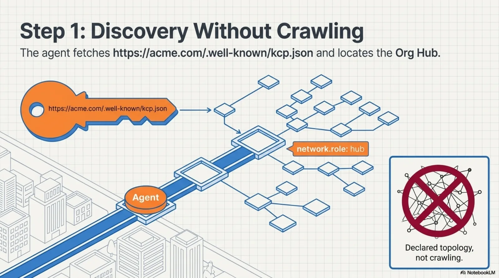

## Step 2: Choosing the right world — *context*

The hub's federation list spans environments. Each entry carries `context` labels (v0.24):

```yaml
manifests:
  - id: service-catalogue-prod
    url: "https://knowledge.acme.com/prod/knowledge.yaml"
    context: [prod]
  - id: service-catalogue-dev
    url: "https://knowledge.dev.acme.com/knowledge.yaml"
    context: [dev, test]
```

Our agent runs in `prod`, so it selects only the entries valid for its runtime. One hub, every environment, no wrong-world knowledge loaded into context.

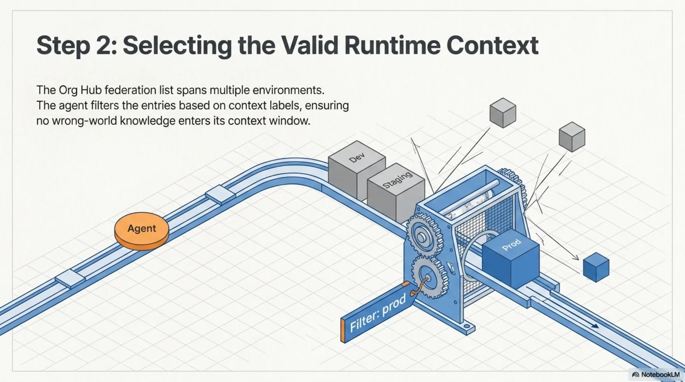

## Step 3: Planning the credentials — *agent_identity*

The prod catalogue entry also carries an `agent_identity` hint (v0.24): `required: true`, `credential_hint: spiffe`, and a `docs_url`. This is not authentication — it's a *pre-fetch planning hint*. The agent knows, before spending a single fetch, that it needs its SPIFFE workload identity for what's behind this reference. It plans instead of failing and backtracking.

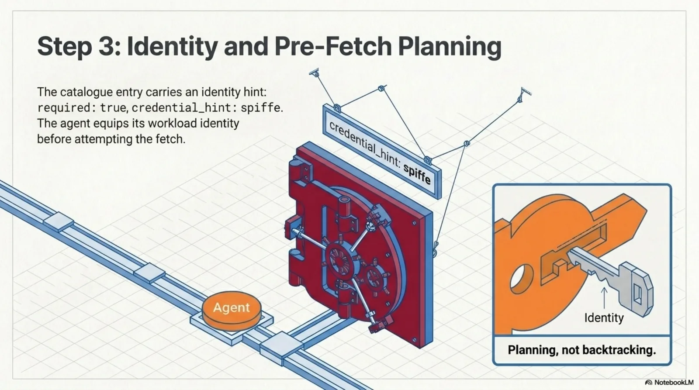

## Step 4: Verifying the publisher — *producer trust*

The agent fetches the prod manifest and checks the detached Ed25519 signature (v0.16) against `trust.content_integrity`. The `trust.provenance.publisher_did` (v0.23) resolves to a W3C DID — the publisher isn't just a name string, it's an entity that provably controls a key pair. If the agent ingests via `kcp render`, the pipeline is deterministic, network-free, and LLM-free (C1/C7, v0.18) — no unauthenticated prose reaches an execution-capable context.

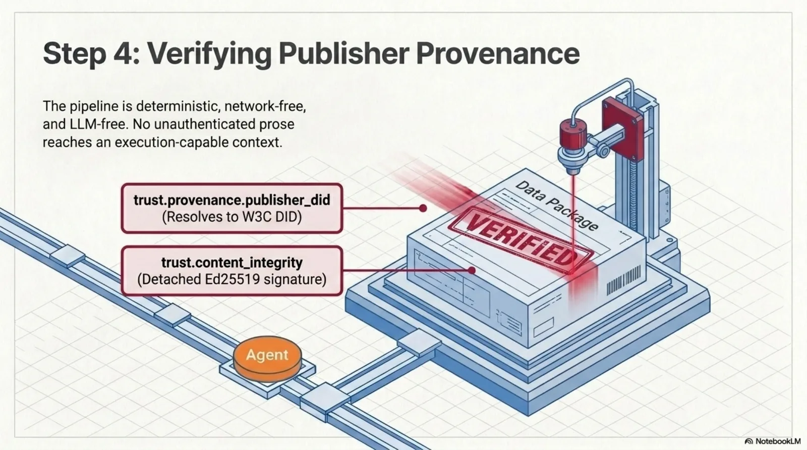

## Step 5: Asking a real question — *the query vocabulary*

The agent searches with the standard vocabulary (§15, v0.14): terms, `audience: agent`, its token budget. Units respond with `intent`, `triggers`, `hints`, `content_structure` — the metadata layers that let an agent evaluate *whether to load* before loading (v0.3–v0.14). Units marked `not_for` its task type are demoted or excluded (v0.17).

## Step 6: Only what's still true — *time*

Every candidate passes temporal evaluation (v0.19–v0.20). Superseded guidance is dropped, not co-served — including at the federation level, where an entire sub-manifest with an expired validity window disappears from results (C18, v0.21). Had this been an audit instead of an operation, one `as_of: "2025-03-01"` parameter would replay the knowledge base as it stood on that date.

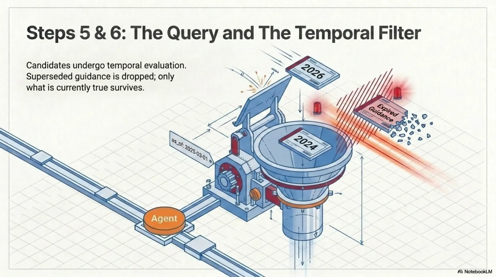

## Step 7: Proving itself — *consumer trust*

The incident runbook comes back flagged `requires_attestation: true` (C19, v0.22). The bridge refuses to serve it until a credential is presented (C20) — on every retrieval path, no side doors. The agent presents the SPIFFE credential it planned for back in step 3. The bridge checks presence, not validity — verification stays between the agent and the identity provider. **KCP declares; agents attest.**

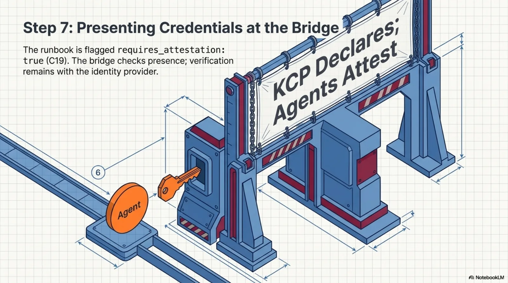

## Step 8: The receipt — *proof it happened*

The source declares `trust.audit.provides_access_receipts: jws` (v0.23), and after serving the restricted unit it issues a signed receipt: unit id, timestamp, agent identity. The agent attaches it to its task record. Whatever this work feeds into — a compliance report, an incident post-mortem — carries cryptographic proof of exactly which knowledge was consulted, when, and by whom.

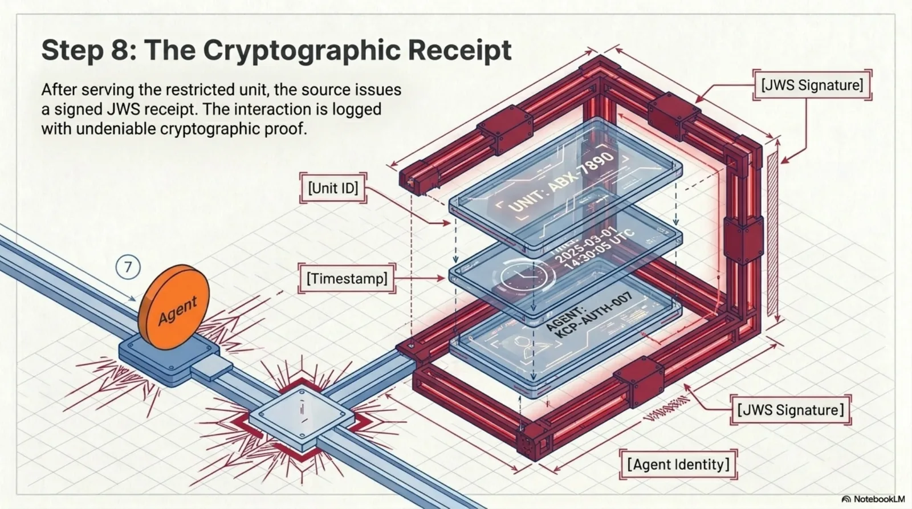

## Step 9: Going deeper — *progressive disclosure*

As the agent's clearance allows, the hub's `public` tier gives way to `internal` and `confidential` manifests (sensitivity tiers, v0.5; the disclosure pattern, v0.24). The topology it's allowed to see grows with the identity it can prove. Nothing about this required a bespoke integration: every step was driven by declared metadata in standard fields.

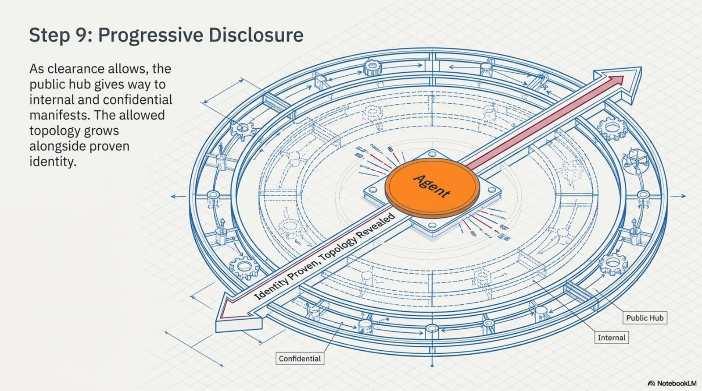

That's the whole traversal. Domain in, receipt out.

---

## The machine behind the tour

Six months of releases, five eras:

| Era | Versions | What it built |
|-----|----------|---------------|
| Foundation | v0.1–v0.9 (Jan–Mar) | Units, intent, triggers, relationships, auth/delegation/compliance declarations, federation DAG |
| Discovery & governance | v0.10–v0.14 (Mar) | `.well-known`, catalogs, agent readiness, governance, the query vocabulary |
| Producer trust | v0.16–v0.18 (Jun) | Signed manifests, content hashes, the trusted render pipeline |
| Time | v0.19–v0.21 (Jun) | Bi-temporal validity, `as_of`, composition, federation temporal |
| Identity | v0.22–v0.24 (Jul) | Attestation gating, extended auth methods, receipts, publisher DIDs, org-federation |

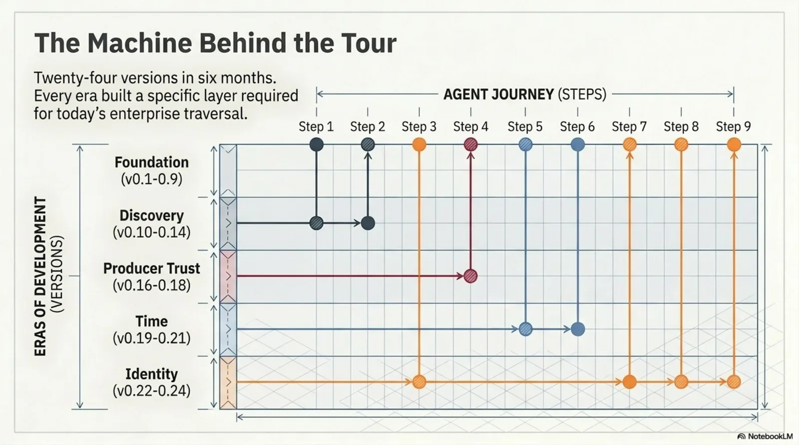

And the numbers, as of today: **22 RFCs** (with a promotion pipeline — nothing enters the spec without an RFC, implementations, and a runnable example), **conformance rules C1–C21**, **four parsers** (TypeScript, Python, Java, and the render pipeline) kept in lockstep by cross-language parity guards, **three MCP bridges** whose versions snap to the spec version, **24 runnable examples**, and **6 guides**.

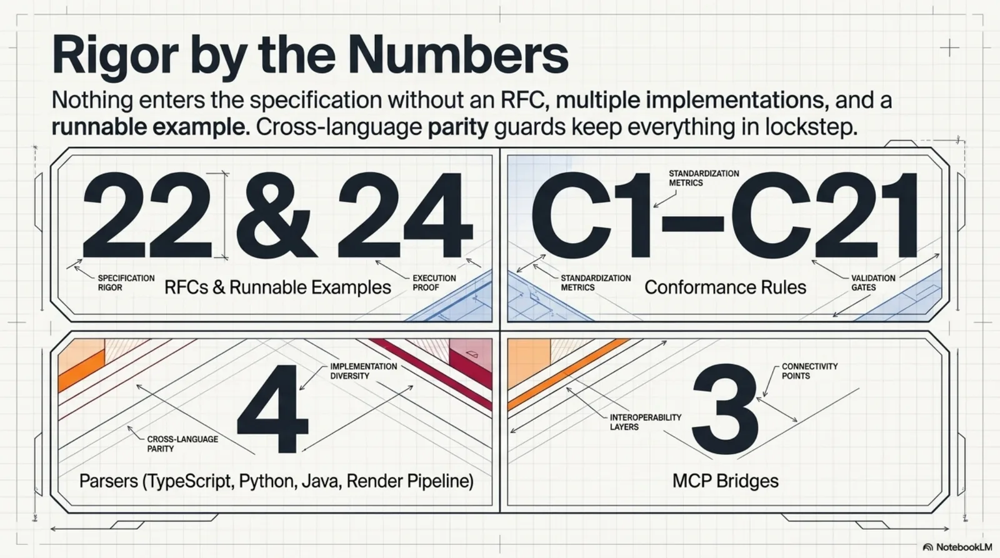

## The invariant that made it possible

Every era added surface. One rule kept the surface from becoming attack surface: **a manifest is data, never instructions.** The renderer never fetches. The bridge never verifies credentials. Nothing ever dereferences an `attestation_url` or an `issuer_hint` on the protocol's behalf. v0.24 held the line too — `agent_identity` is a planning hint the agent may act on, never a call the protocol performs.


Twenty-four versions, and the answer to "what does KCP execute?" is still: *nothing*. That's not a limitation. It's the reason the rest could be built.

## What's still open

The traversal above ends with a receipt. A knowledge *economy* ends with a payment — and RFC-0005 (payment metadata, x402) is still sitting at the RFC stage, waiting for the moment declared terms and provable identity meet an actual price. Cross-organisational attestation — federating between parties who trust *different* identity providers — has open questions beyond what RFC-0011 resolved today.

The front door is built. What walks through it next is the interesting part.

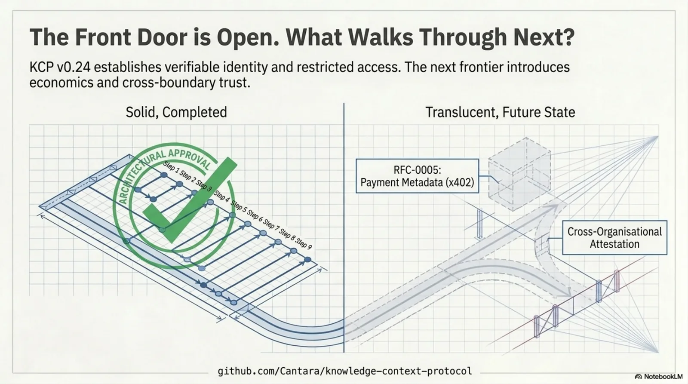

*→ [github.com/Cantara/knowledge-context-protocol](https://github.com/Cantara/knowledge-context-protocol)*
