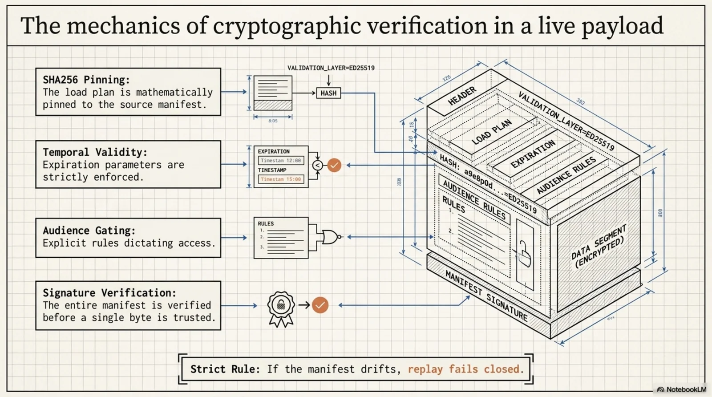
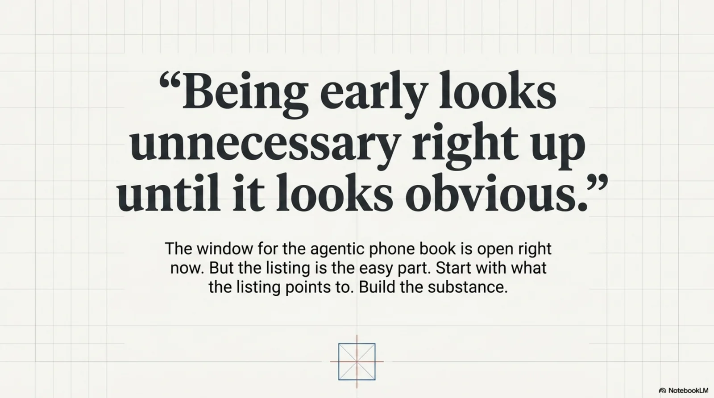

# Getting Into the Phone Book of the Agentic Internet Took an Afternoon. Here's Why.

![The Phone Book of the Agentic Internet: Beyond Discovery to Verifiability. An iceberg: above the waterline, the afternoon — 16,500+ servers already registered, cryptographic proof of ownership via DNS TXT ed25519, a minimal engineering gap. Below the waterline, the months — the signed knowledge web, deterministic planning as a pure function, infrastructure built for agents rather than eyeballs. At the base, the trust layer: Discovery (AEO) tells an agent you exist; Provenance tells it exactly what it was given and who vouched for it.](../../assets/images/phone-book-00-iceberg-overview.webp)

This morning Thomas Anglero published a piece called ["The phone book of the agentic internet is being written — and I am the first speaker in it"](https://www.linkedin.com/pulse/phone-book-agentic-internet-being-written-i-am-first-speaker-anglero-8yn7e/). His argument: the MCP registry — the official directory that tells AI agents which services they can *interact with*, not merely read — is being written right now, and the window between "technically possible" and "everyone does it" is where positions are won. He registered himself as the first professional keynote speaker in it.

<!-- more -->

He's right about the window. I'd had a runbook draft for exactly this sitting in Slack for a while — two registry entries, sketched out, waiting for a reason. Thomas's article was the reason. By the end of the day, both entries were live:

- **`no.cantara/kcp-agent`** — the tooling: a reference agent for the Knowledge Context Protocol, installable via `npx kcp-agent mcp`.
- **`org.totto/knowledge`** — the interesting one: *me*, or more precisely my signed knowledge web, as a remote MCP server at `mcp.totto.org`.

The whole thing took one working day, most of it before lunch. That number is the point of this post — but not in the way you might think. It took an afternoon because the hard part was already done, months ago. The phone book listing was cheap because the thing being listed had substance. I want to walk through both halves: the afternoon, and the months.

---

## The Afternoon

The MCP registry (registry.modelcontextprotocol.io) is refreshingly well-designed infrastructure. Around 16,500 servers are already in it. Getting in requires proving you own the namespace you're claiming — and the proof mechanisms are proper cryptography, not "paste this meta tag."

**Entry 1: the npm package.** For `no.cantara/kcp-agent`, two proofs compose. First, the npm package itself must declare its registry name — a `"mcpName": "no.cantara/kcp-agent"` field in package.json, checked at publish time, so nobody can register someone else's package. Second, the `no.cantara` namespace maps to the domain cantara.no, and you prove domain control with a DNS TXT record containing an ed25519 public key:

```
v=MCPv1; k=ed25519; p=KjNq1MHPVI8g+gJnPCMCsZAEobsLx1J/+s4StDhojWc=
```

The `mcp-publisher` CLI then challenges you to sign with the corresponding private key. Generate keypair, add TXT record, sign, publish. Done before coffee went cold.


Notice what the registry did there: its own namespace authentication is a signature scheme. The phone book itself runs on the same primitive — ed25519 — that the rest of this story runs on. That's not a coincidence; it's what infrastructure looks like when it's built for agents instead of eyeballs.

**Entry 2: myself as a remote MCP server.** This is the one Thomas's article is really about. A registry entry of type `streamable-http` says: here is a URL where any MCP client can connect and call tools. For `org.totto/knowledge`, that URL is `https://mcp.totto.org/mcp`, and the tools are the KCP planner's five: plan, load, validate, trace, replay — running against my personal knowledge web.

The engineering gap turned out to be delightfully small. `kcp-agent serve` already spoke JSON-RPC over `POST /mcp` — same handler as the stdio transport, hand-rolled on `node:http`, zero dependencies. Full spec compliance for MCP's streamable-HTTP transport needed exactly three changes:

1. Notifications must answer `202 Accepted`, not `204 No Content`.
2. `GET /mcp` must answer `405 Method Not Allowed` if you don't offer a server-initiated SSE stream (we don't — the server is deliberately stateless, which the spec permits).
3. A `--manifest` default, so a remote client can call `kcp_plan` with just a task and the server supplies the knowledge web to plan against.

About 120 lines including tests. PR, green CI, release v0.12.0 to npm.


**Hosting** was a four-line Dockerfile (`npm install -g kcp-agent@0.12.0`, run `serve` with the manifest URL) deployed to fly.io in Stockholm, with auto-stop machines — it scales to zero when no agent is calling, and wakes on demand. A Let's Encrypt cert for `mcp.totto.org`, one CNAME record, and:

```
$ curl -s https://mcp.totto.org/health
{"status":"ok","version":"0.12.0","tools":5,"uptime":11}
```

Then the moment that made the day: an MCP `tools/call` for `kcp_plan` with nothing but a task — *"who is Thor Henning Hetland?"* — and the response comes back with a deterministic load plan against `wiki.totto.org/knowledge.yaml`, pinned by sha256, and this field:

```json
"signature": {
  "status": "verified",
  "detail": "ed25519 signature verified (declared key)"
}
```

An agent that has never met me can find `org.totto/knowledge` in the registry, connect, ask, and *cryptographically verify* that what it got back is what I signed.



---

## The Months

Here's the honest accounting. The afternoon was cheap because of everything that already existed:

- **A signed knowledge web.** `wiki.totto.org/knowledge.yaml` is a KCP manifest: typed knowledge units with audiences, temporal validity, supersession chains — signed with an ed25519 key whose public half is served from the site's `.well-known`. That took real design work, and it's been live for months.
- **A deterministic planner.** kcp-agent's planner is a pure function: same manifest, same task, same options → same plan, every time, replayable and diffable. No model in the loop for navigation. That's what makes "verify what the agent was given" a meaningful sentence rather than a slogan.
- **A zero-dependency transport.** Because the MCP layer was hand-rolled JSON-RPC rather than a framework, adding a second transport was an edit, not a migration.


The registration ceremony took hours. The thing worth registering took months. I suspect this ratio generalizes: as the agentic internet's phone book fills up, the listings will be easy and the substance behind them will be the differentiator — same as it ever was.

---

## Findable Is Table Stakes. Verifiable Is the Game.

Thomas frames the registry as the new SEO — answer-engine optimization, being discoverable when agents do the searching. He's right, and he was earlier than me to say it out loud. But I think there's a second window opening right behind the first one, and it's the one I've been building for.

A phone book tells you a number. It doesn't tell you that the voice answering is who it claims to be, or that the answer you got today is the answer that was true yesterday. When *humans* browse, we compensate with judgment, brand, vibes. When *agents* consume knowledge at machine speed and act on it, "vibes" becomes a liability with a legal department attached.


The registry solves discovery. Signed, typed, replayable knowledge solves the next problem: **provenance**. When an agent plans against `org.totto/knowledge`, every unit is pinned by hash, gated by explicit rules (audience, temporal validity, supersession), and the whole manifest is signature-verified before a single byte is trusted. If the manifest drifts, replay fails closed. The agent — and whoever audits the agent — can answer not just "where did you look?" but "what exactly were you given, and who vouched for it?"

Being findable gets you into the conversation. Being verifiable is what lets an agent *act* on what you say without its operator accepting unbounded liability. The first is AEO. The second is the trust layer the agentic internet doesn't have yet — and the registry, with its ed25519 namespace proofs, is quietly built as if its authors know that's where this goes.

Thomas wrote: *"Being early looks unnecessary right up until it looks obvious."* Registering took an afternoon precisely because I'd spent the unnecessary-looking months first. If you're reading this while the window is still open: the listing is the easy part. Start with what the listing points to.



---

*The entries: [`no.cantara/kcp-agent`](https://registry.modelcontextprotocol.io/v0.1/servers?search=no.cantara) and [`org.totto/knowledge`](https://registry.modelcontextprotocol.io/v0.1/servers?search=org.totto) in the MCP registry. The knowledge web: [wiki.totto.org](https://wiki.totto.org). The agent: [github.com/Cantara/kcp-agent](https://github.com/Cantara/kcp-agent), Apache-2.0. And the article that triggered the afternoon: [Thomas Anglero on the phone book of the agentic internet](https://www.linkedin.com/pulse/phone-book-agentic-internet-being-written-i-am-first-speaker-anglero-8yn7e/).*
