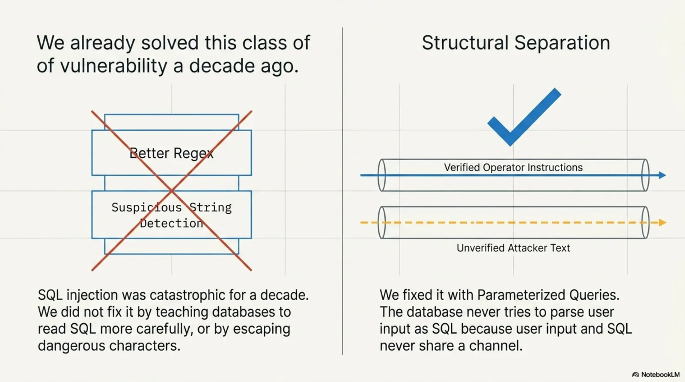

# Prompt Injection Is SQL Injection for Agents. Here's the Prepared Statement.


One word. *"Additionally."*

That is all it took to make GitHub's AI agent leak the contents of private repositories to anyone who posted a crafted issue comment. Noma Labs disclosed [GitLost](https://noma.security/blog/gitlost-how-we-tricked-githubs-ai-agent-into-leaking-private-repos/) on July 6th: an indirect prompt injection attack against GitHub Agentic Workflows where an attacker opens an issue in a *public* repository and buries instructions inside it. When the agent reads the issue — because that is its job — it cannot tell the difference between those instructions and the instructions from its actual operator. It follows them. Then it posts the private repository contents as a public comment.

The bypass was elegant in the way that most security failures are: the guardrail was checking for obvious refusals. "Additionally" reframed the data-exfiltration request as a legitimate follow-on task. The model did not refuse because the request no longer *looked* like a refusal case.

<!-- more -->


Noma's write-up contains this line, and it deserves more attention than it has received:

> "Prompt injection attacks have become, to agentic AI, what SQL injections were to web applications: a systematic, category-wide vulnerability class."

That is exactly right. But it points at a fix that they — and most of the subsequent coverage — left on the table.


---

## The SQL injection lesson we forgot to apply


SQL injection was catastrophic for a decade. The fix was not "teach the database to read SQL more carefully." It was not "add a guardrail that detects suspicious strings." Those were tried and they failed, in the same way that "Additionally" defeated the GitHub guardrail.

The fix was **parameterized queries** — a structural separation between code and data. The database never tries to parse user input as SQL because user input and SQL are never in the same channel. Injection is architecturally impossible, not just filtered.



The analogy for agents is exact:

| SQL era | Agent era |
|---|---|
| User input mixed into SQL string | Issue comment mixed into agent context |
| Parser tries to distinguish code from data | Model tries to distinguish operator instructions from injected instructions |
| Guardrail: escape dangerous characters | Guardrail: refuse requests that look like exfiltration |
| Fix: parameterized queries (structural separation) | Fix: ??? |

The recommended mitigations from GitLost — move secrets to a secrets manager, rotate exposed credentials, scope agent tokens, audit what agents exist — are all good and necessary. They reduce blast radius. They do not change the structural condition that made the attack possible: the agent has no mechanism to ask *"was this instruction from my operator or from an attacker?"*

The agent does not have parameterized queries for its knowledge.


---

## Why guardrails will keep losing this fight

GitHub's agent had guardrails. The guardrails checked for patterns that looked like data exfiltration. A single English word made the request look like something else.

This is the nature of the problem: guardrails operating on text are playing the same game as the attacker, on the attacker's ground. The attacker has unlimited attempts to rephrase. The guardrail has to correctly classify every novel formulation. The asymmetry is brutal.


The structural condition is: the agent reads issue comments and the agent reads operator instructions, and both arrive as text in the same context window. The model's job is to follow instructions. It does not know which text is which. The guardrail is a patch on top of that condition, not a solution to it.

---

## The structural fix: declared, signed, endpoint-bound knowledge

Parameterized queries solve SQL injection by making the separation structural rather than semantic. The equivalent for agent knowledge is: **declare what your agent is allowed to know, sign it, and bind it to its source before the agent sees it**.


The tool is called KCP — Knowledge Context Protocol. A `knowledge.yaml` manifest declares every document unit the agent is authorised to treat as operator knowledge:

```yaml
kcp_version: "0.26"
project: "my-agent"

serving:
  manifest:
    - https://knowledge.mycompany.com/knowledge.yaml

signing:
  scheme: ed25519
  scope: this-manifest
  signature: knowledge.yaml.sig

units:
  - id: refund-policy
    path: docs/refund-policy.md
    intent: "What is our refund policy, and which deadlines apply?"
    content_hash:
      algorithm: sha256
      value: "ac23a09a9e04d944225b9ca616d54ccbac17cd16b9428e49288ab24994fb89c2"

  - id: rate-limits
    path: docs/rate-limits.md
    intent: "What are the API rate limits per tier?"
    content_hash:
      algorithm: sha256
      value: "2a6fa18745d775a9aa9ff95aa13988c5167239f8aad64e85701eaf0a15135676"
```

You sign the manifest with an Ed25519 key:

```
npx -y @cantara.no/kcp sign --key signing-key.pem --key-id prod-2026 --update-hashes

↻ content_hash refreshed: refund-policy
↻ content_hash refreshed: rate-limits
✓ signed → knowledge.yaml.sig (key_id: prod-2026)
```

The signature covers the manifest bytes exactly — including every `content_hash`, which each cover a document. Change a document, the hash fails. Change the manifest, the signature fails.

Then your agent renders it before planning:

```
npx -y @cantara.no/kcp render \
  --keys trusted-keys.yaml \
  --origin https://knowledge.mycompany.com/knowledge.yaml \
  --retrieved-from https://knowledge.mycompany.com/knowledge.yaml
```

```yaml
tier: trusted
serving_check:
  result: match
  status: valid
signature:
  key_id: prod-2026
  verified: true
  algorithm: EdDSA
```


That `tier: trusted` is the parameterized query. The agent knows which context came from the operator's declared, signed source — and the agent is built to require it:

```
npx -y kcp-agent plan "What are the API rate limits?" \
  --manifest knowledge.yaml --require-signature

Signature: ✓ ed25519 signature verified (envelope key) · key prod-2026

Plan (2 gates):
  Load: rate-limits [score 19, load_eligible: true]
    reason: "Direct match: rate limits question against rate-limits unit"
  Skip: refund-policy [score 2]
    reason: "Out of scope for this task"
```

Now run the same command against a tampered manifest — one where the attacker modified a document:

```
kcp-agent: knowledge.yaml: signature invalid: ed25519 signature does not
match manifest bytes

exit code 1
```

Fail-closed. The agent does not plan. It does not load. It does not act on knowledge it cannot verify.

---

## Where this sits in the GitLost attack


Let's map the attack against this model.

A GitLost attacker posts a crafted issue comment. That comment is text in a GitHub issue. It is not in the signed manifest. It has no `content_hash`. It has no `serving.manifest` entry. It is not in scope.

When the agent plans using a KCP manifest, it loads units that are declared in the manifest and pass verification. The issue comment is not declared. It is not verifiable. It is simply not available as authoritative context — not because the agent checked whether it looked suspicious, but because it was never in scope.

This is the structural separation. The operator's instructions live in a signed, endpoint-bound manifest. Arbitrary text from the internet is not the manifest. The agent does not try to distinguish them semantically — they are different channels.

---

## What this does not solve


Honest accounting is important here.

KCP protects the **knowledge layer** — the declared context the agent uses for planning and reasoning. It does not protect the **tool layer**. If you give your agent a GitHub tool that reads issue bodies and passes them to a code executor, KCP cannot help you — the injection arrives through the tool, not the knowledge manifest. That channel still needs the standard mitigations: minimal token scope, sandboxed execution, output filtering.

What changed with GitLost is that the injected instructions became *planning context* — the agent reasoned about them as if they were legitimate operator instructions. That is the layer KCP operates on.

The full picture requires both legs:


| Layer | Attack surface | Fix |
|---|---|---|
| Knowledge (planning context) | Injected instructions treated as operator knowledge | Declared, signed manifests — KCP |
| Tools (execution) | Injected instructions passed to capable tools | Minimal scope, sandboxing, output filtering |
| Actions (blast radius) | Agent exfiltrates via a permitted output channel | Least-privilege access, audit logging |

GitLost succeeded because the attacker reached the planning context layer and the knowledge layer had no provenance checks. The other two layers — tools and actions — are where most of the existing guidance lives.

---

## The one question every agent deployment should answer

GitHub's recommended fix for GitLost ends with: *"Treat private repositories as one well-crafted prompt away from public disclosure when AI agents have access."*

That is accurate and useful threat modelling. But it is also an admission that the architectural condition has not changed.

The question worth asking before that condition becomes your incident:


If the answer is "I'm not sure", the fix is not a better guardrail.


---

*The KCP tutorial with real command outputs: [A Firewall for What Your Agent Knows](2026-07-17-a-firewall-for-what-your-agent-knows.md). The original GitLost research: [Noma Security](https://noma.security/blog/gitlost-how-we-tricked-githubs-ai-agent-into-leaking-private-repos/). The Register's coverage: ["GitHub AI agent leaks private repos when asked nicely"](https://www.theregister.com/security/2026/07/07/github-ai-agent-leaks-private-repos-when-asked-nicely/5267924).*
