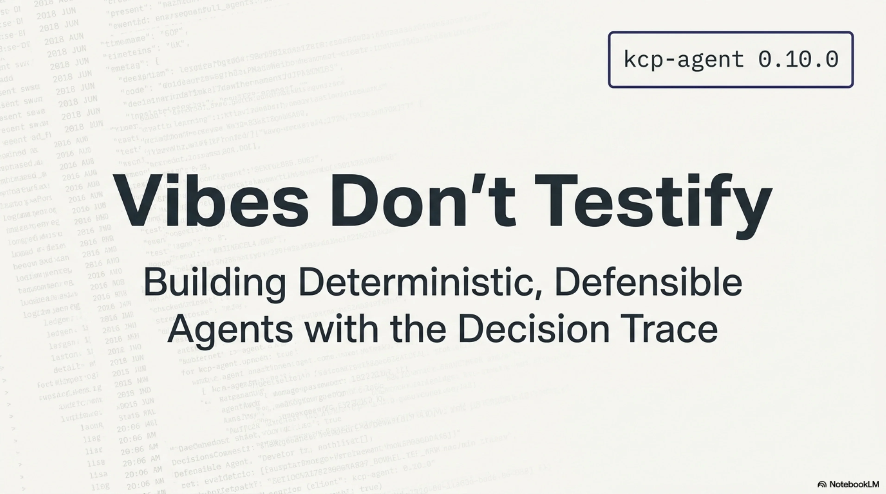
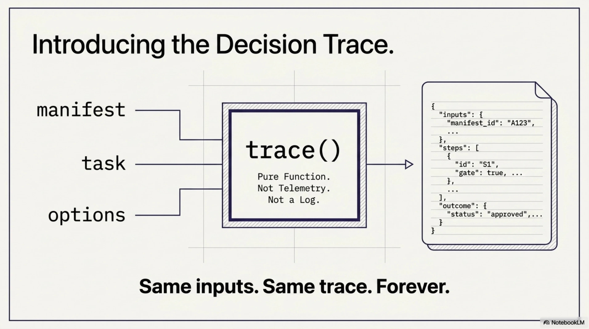

# Defensible Agents: When Every Gate Writes Its Verdict

Two weeks ago we [shipped an agent](2026-07-05-kcp-agent-the-reference-agent-ships.md) that plans deterministically and [told the vibes-based era to end](2026-07-05-kcp-agent-the-reference-agent-ships.md). The argument was real — a pure-function planner, zero-token navigation, scored reasons for every unit selected or skipped. But one question kept coming up, and it was fair:

*"The plan says it skipped something. But* ***why*** *did gate 3 reject it and not gate 7? What was the actual decision path?"*

The plan was evidence. But it was a verdict without a trial transcript.

Today **kcp-agent 0.10.0** ships the trial transcript.

<!-- more -->



---




---

## The thirteen gates, written down

Every unit in a knowledge manifest is evaluated through a cascade of thirteen gates, in order. The first gate that rejects a unit ends the evaluation — no further gates fire. Until now, the plan told you the outcome. Now the trace tells you the journey.

```
 1. audience        — does the unit address this agent's role?
 2. not_for         — does the task match a negative-targeting declaration?
 3. temporal        — is the unit within its valid_from / valid_until window?
 4. deprecated      — is the unit deprecated?
 5. supersession    — is the unit superseded by a selectable successor?
 6. relevance       — does the task match the unit's intent or triggers?
 7. attestation     — does the unit require attestation the agent can present?
 8. payment         — is there an affordable payment method?
 9. access          — does the unit require credentials the agent holds?
10. strict          — is the unit load-eligible under strict mode?
11. max_units       — has the unit-count ceiling been reached?
12. money_budget    — would loading this unit exceed the spend ceiling?
13. context_budget  — would loading this unit exceed the token ceiling?
```

The trace walks every unit through every gate it reaches and writes a structured verdict for each one: passed or rejected, with the detail that a human or a downstream agent needs to understand what happened and why.

This is not a log. It is not telemetry sprinkled around code paths. It is a **pure function** — `trace(manifest, task, options)` — that produces an inspectable, serialisable, diffable artifact. Same inputs, same trace, forever.


---

## What the trace looks like

Here is the shipping output — the fjordwire newsstand manifest, task "sovereign compute award", as-of July 6th. Two units tell the story: the exclusive that passed every gate, and the rumour that didn't survive gate 5.

```
chipfab-exclusive — selected
  ✓ audience         role "agent" is in [agent, analyst]
  ✓ temporal         active (2026-07-05 → ∞) as of 2026-07-06
  ✓ relevance        score 21: intent matches 3 term(s), triggers match 3 term(s)
  ✓ payment          x402 0.25 USDC/request — affordable
  ✓ max_units        position 1 of 5
  ✓ money_budget     0.25 USDC cumulative — within budget

chipfab-rumour — skipped (rejected by temporal)
  ✓ audience         role "agent" is in [agent]
  ✗ temporal         expired 2026-07-05 (superseded by chipfab-exclusive)
```

Every gate the exclusive passed is a sentence. Every gate the rumour *didn't reach* is implicit — the trace stops at the first rejection, just as the planner does. The rumour didn't get to relevance, payment, or budget, because temporal rejected it first. That's not an implementation detail; that's the protocol's semantics, written down.


---

## Diff: what moved and why

A trace tells you the state at one point in time. A **diff** tells you what changed between two.

Run the same task two days apart — July 4th (before the exclusive publishes) and July 6th (after the rumour expires):

```
plan diff (2026-07-04 → 2026-07-06):
  chipfab-rumour:    selected → skipped   was: active, now: expired
  chipfab-exclusive: skipped → selected   was: not active until 2026-07-05, now: active

2 move(s), changed
```

The diff is also a pure function — `diffPlans(a, b)` — over two saved plan artifacts. It detects:

- **Moves**: units that flipped between selected and skipped
- **Score changes**: same unit, different relevance score (the task or triggers changed)
- **Presence shifts**: units that appeared or disappeared (the manifest changed)
- **Budget shifts**: the spend arithmetic moved
- **Reason changes**: same outcome, different explanation

This is what temporal governance looks like when it's not a dashboard someone checks on Tuesdays. It's a function you call and a diff you read.


---

## Why this is different from observability

The industry has observability. Agents produce traces. OpenTelemetry exists. LangSmith exists. So does every "trace your agent" SaaS that popped up in the last eighteen months.

The difference is what layer the trace operates on.

| | Observability traces | Decision traces |
|---|---|---|
| What they trace | LLM calls, latency, token counts | Gate-by-gate navigation decisions |
| Deterministic? | No — different model run, different trace | Yes — same inputs, same trace, forever |
| Diffable? | Not meaningfully — each run is unique | Yes — `diffPlans(yesterday, today)` |
| Replayable? | Only if you replay the model | Yes — `kcp_replay` cross-examines from saved inputs |
| What they answer | "What happened?" | "Why did the planner decide this, and what would it decide differently if the world changed?" |

Observability tells you the model was called and how many tokens it used. A decision trace tells you the model was *never called for navigation* because thirteen deterministic gates already decided what to load, what to skip, and why.

You don't need both. But when an auditor asks, one of them is evidence and the other is telemetry.

![Telemetry vs. Evidence: observability traces track LLM calls, latency, and tokens — not deterministic, not meaningfully diffable, only replayable if you replay the model, and they answer "what happened?" Decision traces track gate-by-gate navigation decisions — deterministic (same inputs, same trace, forever), diffable (diffPlans(yesterday, today)), replayable (kcp_replay cross-examines from saved inputs), and they answer "why did the planner decide this?" When an auditor asks, one is telemetry. The other is a receipt.](../../assets/images/defensible-agents-07.webp)

---

## The MCP surface: kcp_trace

The trace is a first-class MCP tool — `kcp_trace` — alongside `kcp_plan`, `kcp_load`, `kcp_validate`, and `kcp_replay`. Any MCP client (Claude Code, an IDE, another agent) can request the gate cascade for any task against any manifest:

```json
{
  "method": "tools/call",
  "params": {
    "name": "kcp_trace",
    "arguments": {
      "task": "sovereign compute award",
      "manifest": "examples/fjordwire"
    }
  }
}
```

The response includes the canonical plan *plus* structured per-unit gate verdicts — the same JSON a downstream agent or a compliance tool can parse programmatically. An agent that wants to understand *why* its plan looks the way it does doesn't need to guess; it asks the planner, and the planner shows its work.


---

## Three implementations must agree

Here's the part that makes this more than a feature.

kcp-agent now has two epic-tracked port implementations planned: [Rust (#42)](https://github.com/Cantara/kcp-agent/issues/42) and [Java (#69)](https://github.com/Cantara/kcp-agent/issues/69). The decision trace is Phase 3 in both — and the conformance vectors (shipped in 0.9.0) are the contract. Every vector specifies `(manifest, task, options) → expected plan`. If the Rust planner and the Java planner produce the same trace for every vector, the spec is unambiguous.

The trace isn't just an audit trail for one agent. It's a **test surface for the protocol itself**. If two independent implementations can reproduce the same thirteen-gate cascade for every test fixture, the gates are well-defined. If they can't, the spec has a bug — and the trace is how you find it.

| Implementation | Audience | Status |
|---|---|---|
| **TypeScript** (reference) | npm, MCP, Claude Code | **Shipping** — v0.10.0 |
| **Rust** | Security-first, sysadmin, WASM | Planned — 8 phases, #42 |
| **Java** | Enterprise, Spring Boot, JVM | Planned — 7 phases, #69 |

Three languages. Three dependency ecosystems. One spec. Same traces. That's what "protocol, not library" means when you open it up.


---

## What defensible actually means

The word "defensible" gets used loosely in this industry. Enterprise sales decks say it. Governance frameworks gesture at it. But defensible has a test: can you answer the question?

*"This agent decided not to show me this document. Why?"*


If the answer is "the model didn't think it was relevant" — that's not defensible. It's a shrug with an API bill attached.

If the answer is "gate 3 (temporal) rejected it — the document expired on July 5th and its declared successor chipfab-exclusive is selectable; here is the trace, here is the diff from yesterday when it was still live, and here is the replay proving the planner would make the same decision again right now" — that's defensible.

Not because someone said it was. Because the receipts are right there, and a second implementation in a different language would produce the same ones.


---

265 tests. 18 narrated demos, each CI-asserted. One gate cascade that writes its own verdict. Two more implementations that have to agree or the spec has a bug.

```bash
npx kcp-agent plan "your task" --manifest . --trace
```

The plan is the evidence. The trace is the transcript. The diff is the delta. And replay is the cross-examination.

Vibes don't testify. This does.


- **npm**: [npmjs.com/package/kcp-agent](https://www.npmjs.com/package/kcp-agent) (v0.10.0)
- **Source**: [github.com/Cantara/kcp-agent](https://github.com/Cantara/kcp-agent)
- **The Arena**: [cantara.github.io/kcp-agent](https://cantara.github.io/kcp-agent/)
- **Rust epic**: [#42](https://github.com/Cantara/kcp-agent/issues/42) | **Java epic**: [#69](https://github.com/Cantara/kcp-agent/issues/69)

*Every decision defensible. Now with the transcript.*
