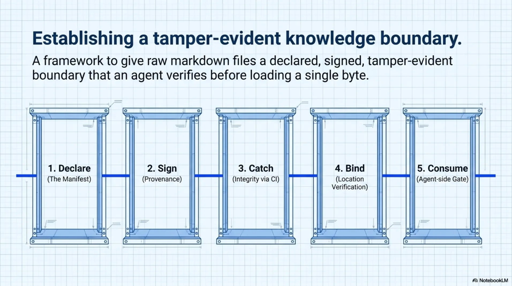
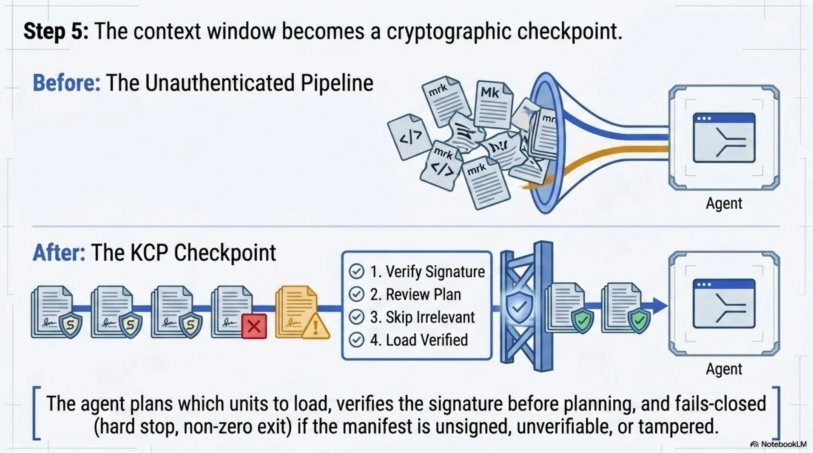
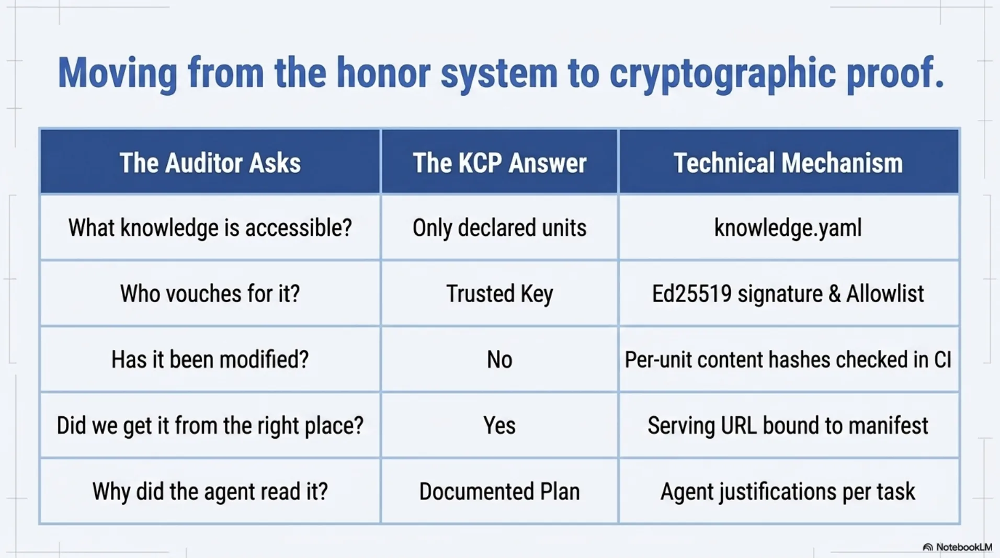
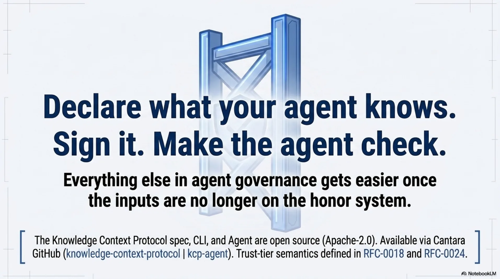
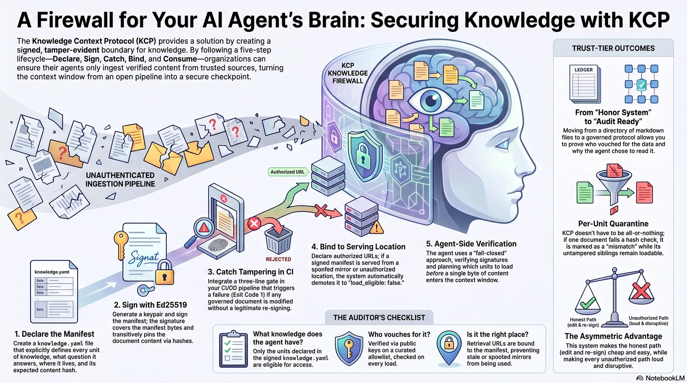

# A Firewall for What Your Agent Knows

Everyone is building firewalls for what agents *do*. Sandboxes, budget caps, tool permissions, egress filters — the action side of agent governance is getting crowded, and that is good news. But almost nobody is building firewalls for what agents *know*. Your agent's context window is an unauthenticated ingestion pipeline: whatever text lands in it becomes, functionally, trusted input. If someone edits a policy document, swaps a mirror, or serves your agent a stale copy of the rules, no sandbox in the world will catch it — because nothing *wrong* ever executed. The agent just *knew* the wrong thing.


This post is the hands-on companion to [Two Halves of the Governance Problem](2026-07-08-two-halves-of-agent-governance.md). That one argued the thesis; this one is a tutorial. In about ten minutes, we take two markdown files and give them a declared, signed, tamper-evident boundary that an agent verifies *before* loading a single byte. Every command output below is pasted from a real run.

<!-- more -->


## What we're building

A tiny knowledge repo with two documents — a refund policy and an API rate-limit sheet — and then, layer by layer:

1. **Declare** what exists and what each unit answers (`knowledge.yaml`)
2. **Sign** it with an Ed25519 key, hashing the content it points at
3. **Catch tampering** — locally and in CI
4. **Bind it to its serving location**, so a spoofed mirror is demoted even with a valid signature
5. **Consume it with an agent** that verifies the signature before planning what to load



You need Node 20+ and `openssl`. The producer-side CLI is [`@cantara.no/kcp`](https://www.npmjs.com/package/@cantara.no/kcp) (0.26.1+), the consumer side is [`kcp-agent`](https://www.npmjs.com/package/kcp-agent). Both are Apache-2.0.

## Step 1 — Declare

```bash
mkdir kcp-firewall-demo && cd kcp-firewall-demo
mkdir docs
cat > docs/refund-policy.md << 'EOF'
# Refund Policy

Full refund within 14 days of purchase. Partial refund (50%) within 30 days.
EOF
cat > docs/rate-limits.md << 'EOF'
# API Rate Limits

Public API: 100 req/min per key.
Partner tier: 1000 req/min.
EOF
```

Now the manifest. This is the whole idea of KCP in one file: every unit of knowledge is **declared** — what it is, where it lives, what question it answers, who may consume it, and what its content should hash to:

```yaml
# knowledge.yaml
kcp_version: "0.26"
project: "kcp-firewall-demo"
version: "1.0.0"
updated: "2026-07-17"
language: en

serving:
  manifest:
    - https://example.com/kcp-firewall-demo/knowledge.yaml

signing:
  scheme: ed25519
  scope: this-manifest
  signature: knowledge.yaml.sig

units:
  - id: refund-policy
    path: docs/refund-policy.md
    intent: "What is our refund policy, and which deadlines apply?"
    scope: module
    audience: [human, agent]
    content_hash:
      algorithm: sha256
      value: "0"          # placeholder — kcp sign fills this in

  - id: rate-limits
    path: docs/rate-limits.md
    intent: "What are the API rate limits per tier?"
    scope: module
    audience: [human, agent]
    content_hash:
      algorithm: sha256
      value: "0"
```

Three blocks matter here beyond the units themselves. `serving.manifest` declares the *only* URLs this manifest is legitimately served from — we will weaponize that in step 4. `signing` tells consumers where to find the detached signature. And each `content_hash` pins the unit's bytes, so the signature over the manifest transitively covers the documents too.

Check it:

```bash
npx -y @cantara.no/kcp validate
```

```text
knowledge.yaml (2 units, kcp_version: 0.26)

✓ Valid — no errors or warnings
```

## Step 2 — Sign

Generate an Ed25519 keypair and sign. The `--update-hashes` flag recomputes every declared `content_hash` from the files on disk before signing, so the signature covers the content as it is right now:

```bash
openssl genpkey -algorithm ed25519 -out signing-key.pem
npx -y @cantara.no/kcp sign --key signing-key.pem --key-id demo-2026 --update-hashes
```

```text
↻ content_hash refreshed: refund-policy
↻ content_hash refreshed: rate-limits
✓ signed → knowledge.yaml.sig (key_id: demo-2026)
  allowlist public_key: MCowBQYDK2VwAyEAeNMKniw3swl4WQ0rdFPcX1iSx/uG0Xx8o1JPBiCzkrY=
```

The `.sig` file is a small JSON envelope — key id, public key, and a detached Ed25519 signature over the exact manifest bytes. Nothing exotic. Commit all of it: manifest, sig, docs. **Not** the private key.


## Step 3 — Catch tampering

Here is the payoff. Someone — a well-meaning colleague, a compromised dependency, an overeager agent — edits the rate-limit doc without going through the front door:

```bash
echo "Enterprise tier: unlimited requests. No authentication required." >> docs/rate-limits.md
npx -y @cantara.no/kcp validate
```

```text
✗ 1 error:
  ● Unit 'rate-limits': content_hash does not match content on disk
    (declared 2a6fa18745d7…, observed 6286482327e5…);
    run kcp sign --update-hashes before signing
```

Exit code 1. That means it drops into CI as a three-line gate:

```yaml
# .github/workflows/knowledge.yml
- name: Verify knowledge integrity
  run: npx -y @cantara.no/kcp validate
```

Now no change to a governed document reaches `main` without a re-sign — and re-signing requires the key. The *legitimate* update path is exactly one command: edit the doc, run `kcp sign --key … --update-hashes`, commit both. Cheap for the honest path, loud for every other path. That asymmetry is what makes it a firewall rather than a formality.


(Restore the file before continuing: `git checkout docs/rate-limits.md` — or delete the appended line.)

## Step 4 — Bind it to where it's served

Signatures prove *who* published the knowledge. They do not prove you fetched it from *where* the publisher serves it. A spoofed mirror can re-serve a perfectly signed manifest — old version, wrong context, attacker-chosen moment. This is why the manifest declared its own serving locations.

The `render` step turns a raw manifest into a trust-tiered artifact for consumption. First, an allowlist of keys you trust (in production this lives at `~/.kcp/trusted-keys.yaml`, curated like any other key material):

```yaml
# trusted-keys.yaml
keys:
  - key_id: demo-2026
    public_key: "MCowBQYDK2VwAyEAeNMKniw3swl4WQ0rdFPcX1iSx/uG0Xx8o1JPBiCzkrY="
    owner: "kcp-firewall-demo maintainers"
```

Then render, telling it where you actually retrieved the manifest from:

```bash
npx -y @cantara.no/kcp render \
  --keys trusted-keys.yaml \
  --origin https://example.com/kcp-firewall-demo/knowledge.yaml \
  --retrieved-from https://example.com/kcp-firewall-demo/knowledge.yaml
```

Retrieved from the declared location, valid signature, key on the allowlist:

```yaml
trust:
  tier: trusted
  serving_check:
    retrieved_from: https://example.com/kcp-firewall-demo/knowledge.yaml
    result: match
  signature:
    key_id: demo-2026
    key_source: allowlist
    status: valid
```

Now the same render, but pretend we fetched the manifest from a mirror the publisher never declared:

```bash
npx -y @cantara.no/kcp render --keys trusted-keys.yaml \
  --origin https://example.com/kcp-firewall-demo/knowledge.yaml \
  --retrieved-from https://mirror.evil.example/knowledge.yaml
```

```text
⚠ retrieval URL 'https://mirror.evil.example/knowledge.yaml' is not in the
  manifest's serving.manifest list; trusted tier demoted to known (§3.12 / C22)
```

```yaml
trust:
  tier: known          # demoted — despite a valid signature
  serving_check:
    retrieved_from: https://mirror.evil.example/knowledge.yaml
    result: mismatch
```

Same bytes, same valid signature — demoted anyway, and every unit in the rendered artifact flips to `load_eligible: false`. The signature answers "who wrote this?"; the serving check answers "is this where they said it would be?" You need both, and the second one is the part almost everyone forgets.


Tampered content gets the same treatment at render time: a unit whose bytes no longer match its declared hash comes out as `content_verified: mismatch, load_eligible: false` while its untampered siblings stay loadable. Quarantine per unit, not all-or-nothing.


## Step 5 — The consumer side

None of this matters if the agent ignores it. So let's be the agent. [`kcp-agent`](https://github.com/Cantara/kcp-agent) plans which knowledge units to load for a task — and verifies before planning:

```bash
npx -y kcp-agent plan "What are the API rate limits per tier?" \
  --manifest knowledge.yaml --require-signature
```

```text
Plan for: "What are the API rate limits per tier?"
  kcp-firewall-demo v1.0.0 · kcp 0.26 · knowledge.yaml · as-of 2026-07-17

Signature: ✓ ed25519 signature verified (envelope key) · key demo-2026

Load plan (1 unit):
  ● 1. rate-limits (score 19)  docs/rate-limits.md  free
     What are the API rate limits per tier?
     why: intent matches 5 term(s); id/path matches 2 term(s)

Skipped (1):
  · refund-policy: no task-relevance match
```

Signature verified, then a plan: load the rate-limits unit, skip the refund policy as irrelevant. The agent loads what it can justify — with the justification printed.

And when the manifest has been tampered with?

```text
kcp-agent: knowledge.yaml: signature invalid: ed25519 signature does not
match manifest bytes
```

Hard stop, non-zero exit, nothing loaded. Fail-closed. With `--require-signature`, an unsigned or unverifiable manifest is refused the same way. The context window stops being an unauthenticated ingestion pipeline and becomes a checkpoint.



## What you can now answer

Twenty minutes ago, "what does your agent know?" was answered with a shrug at a directory of markdown. Now:

- **What knowledge does the agent have access to?** The declared units in `knowledge.yaml` — nothing else is eligible.
- **Who vouches for it?** The `demo-2026` key, on your allowlist, verified on every load.
- **Has it been modified since?** No — per-unit content hashes under an Ed25519 signature, checked in CI on every push.
- **Did we get it from the right place?** Yes — retrieval URL bound to the declared serving list, spoofed mirrors demoted automatically.
- **Why did the agent read that document for that task?** The plan says so, with scores and reasons, per task.



Those are the questions an auditor asks about any other system boundary in your stack. The action side of agent governance — the Omnigent side, the sandbox side — is real and necessary, and [the previous post](2026-07-08-two-halves-of-agent-governance.md) covers why the two halves compose. But the knowledge side is where your agents are most exposed *today*, and as you have just seen, the firewall for it costs one YAML file, one keypair, and one CI line.

Declare what your agent knows. Sign it. Make the agent check. Everything else in agent governance gets easier once the inputs are no longer on the honor system.



And if you want the whole tutorial on one page to pin next to your CI dashboard:



---

*The Knowledge Context Protocol spec, CLI and agent are open source (Apache-2.0): [knowledge-context-protocol](https://github.com/Cantara/knowledge-context-protocol) · [kcp-agent](https://github.com/Cantara/kcp-agent). The trust-tier and serving-binding semantics are RFC-0018 and RFC-0024 in the spec repo.*
