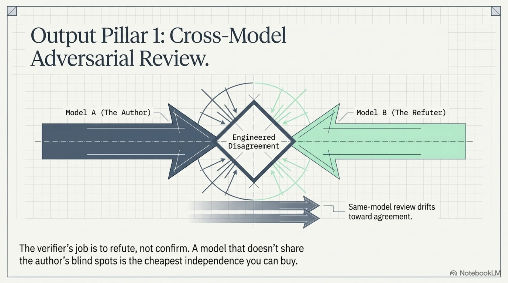
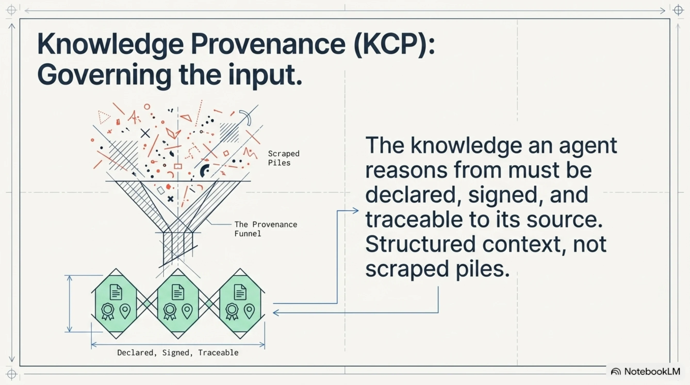

# Evidence isn't enough: the independence problem in agentic development

A test in our suite was green for six weeks. It asserted nothing.

<!-- more -->

It created a deviation through the UI, then checked that a deviation with a matching *title* showed up in the register. The title was written by an AI generation step — so the AI could rephrase it, the lookup would miss, and on a good night a different leftover record would match instead. Green. Every layer did its job. The evidence was there. The evidence was worthless.

I've been thinking about this since reading Daniel Bentes' write-up of **Flow**, his Claude Code plugin. His diagnosis is sharp, and most of the industry hasn't caught up to it: when an agent writes the code, writes the test, and decides the test passed, *a passing check stops meaning much.* His answer is to move the unit of trust from the agent to the evidence it leaves behind — reviewers read proof instead of diffs, "done means proven," no evidence, no merge.

He's right about the direction. I want to push on where it isn't enough yet, because the gap is the whole game.

## The circle doesn't break — it moves up a level

"Stop trusting the agent, start checking what it leaves behind" is a real improvement. But evidence is only as trustworthy as its *independence from the thing it verifies.* If the same agent produces the code, the test, and the proof, you haven't broken the circle — you've relocated it. Now the agent is optimized to produce *convincing evidence*, and a system that rewards convincing evidence will eventually hand you evidence theater instead of correctness.

That green-for-six-weeks test is what evidence theater looks like when nobody meant to build it. Nobody gamed anything. The proof simply wasn't independent of the actor producing it — and it wasn't checking the thing that mattered.

So there are two gaps hiding under "done means proven":

**Independence** — who checks the evidence, and are they downstream of whoever made it?

**Soundness** — does the evidence bear weight? Does green mean the *right* thing was verified, or just that *a* thing turned green?

## What keeps the verifier honest

We run an agentic development rig — I call it ExoCortex — across real client codebases. The practices that survived contact with production are all attacks on those two gaps, not on evidence volume.

**An independent verifier.** Our adversarial review is *cross-model*: a different model is pointed at a finding and told to *refute* it, not confirm it. Same-model self-review drifts toward agreement; a model that doesn't share the author's blind spots is the cheapest independence you can buy. The verifier's job is disagreement.

**Outcomes the agent can't fake.** We don't trust "the fix works." Before I'd call a set of flaky tests fixed this week, I ran the three worst offenders eighteen times against real infrastructure and reported the tally: eighteen clean. Not because I doubted the change — because a claim of correctness on the agent's own say-so is precisely the circle we're trying to break. Real outcomes on real infra are evidence the agent doesn't author.

**Freeze human judgment, then make drift loud.** On one codebase we froze the current access-control behavior — who can reach what — into a checked-in matrix. It captures whatever is true today, bugs included. The point isn't that the matrix is *right*; it's that any change to a real allow/deny decision now surfaces as a reviewed diff a human signs, instead of drifting silently while every test stays green. The independent check is the frozen human decision, not a fresh agent-authored assertion.

## The other half: what the agent knows

Everything above governs what the agent *does*. There's a second half the evidence conversation keeps skipping: what the agent *knows*. A verifier can be perfectly independent and still certify the wrong claim — because the agent reasoned from context that was stale, unsourced, or quietly poisoned. Sound proof of the wrong thing.

That's an input problem, and it wants the same discipline we give outputs: the knowledge an agent reasons from should be *declared, signed, and traceable to where it came from* — structured context, not a scraped pile. (This is the work we've been calling KCP — knowledge provenance for agents.) And here's the honest limit, the one that keeps it from being a silver bullet: provenance answers *"where did this come from, and has it changed?"* It does **not** answer *"is this the right thing to reason from?"* That second question is still human judgment — the same frozen-decision, review-gate independence, moved to the input side. Governing what an agent does and governing what it knows are two halves of the same accountability problem, and almost everyone is only building the first half.

## The principle

Don't trust the agent. Fine. But don't stop at "trust the evidence" either — because the agent can write the evidence too, and reason from context nobody checked. Trust the *independence of the check*: a verifier that doesn't share the author's incentives, an outcome the author can't manufacture, a human decision frozen where it counts — on both what the agent does and what it knows.

Capability was the last decade's problem, and the loop mostly solved it — agents can write the code. Accountability is this decade's problem, and it is not an evidence-*collection* problem. It's an *independence* problem. Flow is asking the right question. The answer runs a level deeper than the artifact — and it runs on both sides of the agent.

