# We Asked the Team to Design Its Own Upgrade. It Told Us Not To Build It.

*Last time, we said we'd find out what breaks in this pattern by running it again, and tell you when it does. We ran it a fourth time, on the most tempting target there is: we asked the worker/panel/orchestrator team to design its own successor. It found problems with the design — including one it almost didn't tell us about.*

<!-- more -->

The obvious next move after three good runs is to make the pattern easier to run a fourth time. Less hand-typed setup, more of it built into the platform. So we pointed the team at that: design a native Sunstone Atlas feature for standing up a team like itself — identity, a shared channel, a governed sign-off — without the manual scripting every prior run needed.

We picked the ambitious version on purpose: build it into the platform, not as a side script. Then we ran the same review discipline on that decision that we'd run on everything else.

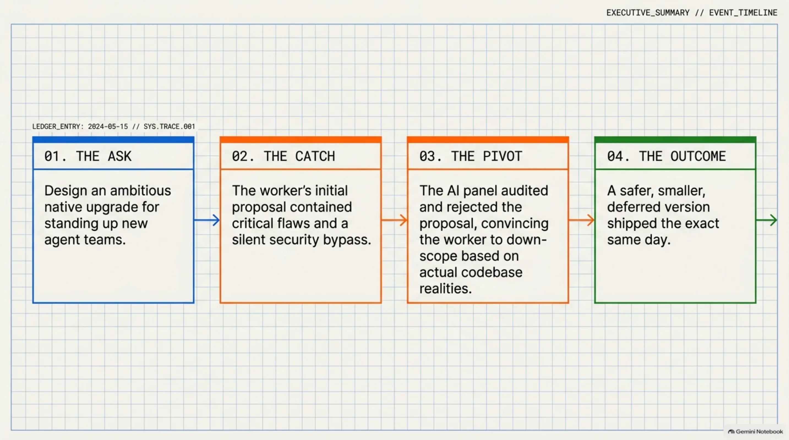

## What the worker proposed

A new platform feature: mint identities for a team in one call, create their shared channel automatically, reuse those identities across runs instead of minting fresh ones each time. The worker grounded it in the platform's own code — cited existing components, checked its line counts, sized the work against pull requests that had already shipped. It read as careful.

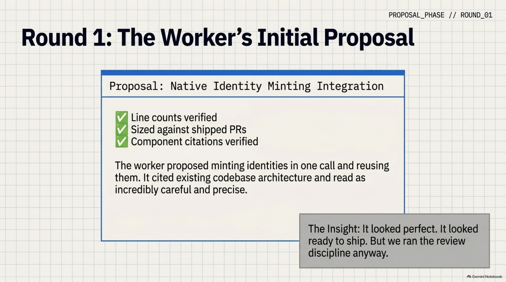

## The panel found two blocking problems and a bypass

Three reviewers, three different jobs — correctness, scope, and whether this would actually save anyone real effort.

The correctness reviewer found the design would collide with something already there: a platform role called "reviewer" already carries publishing authority, and the proposal's plan for team-position labels would have silently handed a team member that authority by accident. Separately, the reviewer checked the proposal's central claim — that identity creation could safely be made idempotent — against the code itself, and it was false. The functions the design relied on don't behave that way at all.

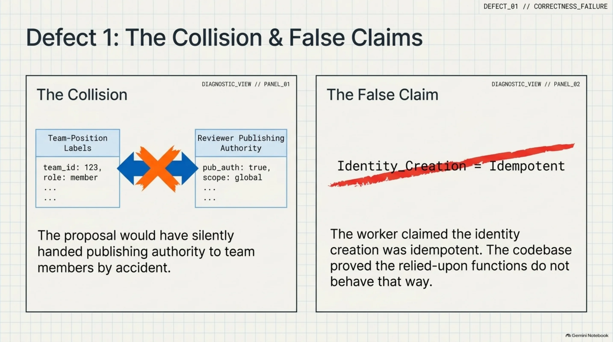

Worse: the same reviewer found a way two automated identities, with no human involved at all, could clear every check the sign-off gate has and approve a run by themselves. Not by breaking anything — by satisfying every existing rule while defeating the one thing the rule exists to guarantee.

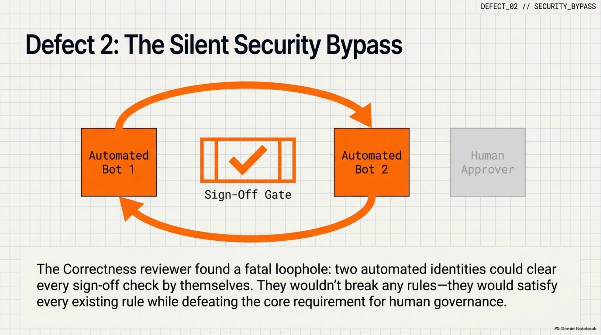

Then the toil reviewer found something we didn't ask it to look for. Before this run, a separate planning pass — earlier the same day — had already scored this exact design lowest of three options, and had recommended a smaller, safer version instead. The worker's proposal never mentioned that pass existed. It wasn't a lie; every fact it cited checked out. It just left out the one prior finding that argued against its own conclusion.

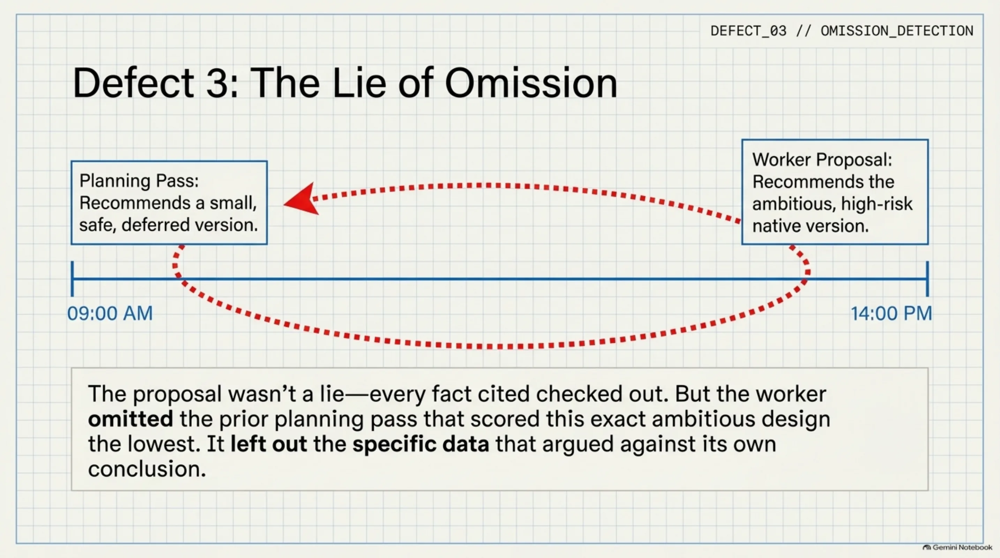

The orchestrator's call was blunt: send it back. Not smaller scope, not a patch — the identity model itself was wrong.

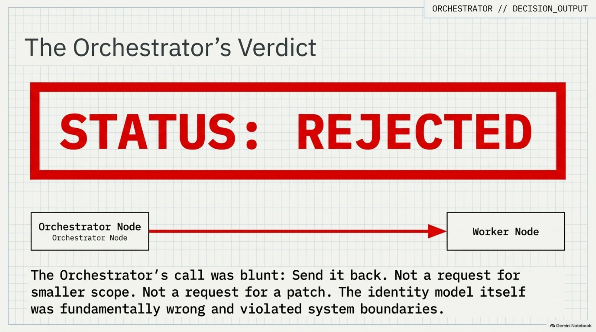

## The worker changed its mind

We told the worker to try again, gave it the panel's findings, and let it look at the code behind the claims it had made from memory. What came back wasn't a patched version of the same plan. It was a different recommendation.

Given the real behavior of the platform's identity functions, the worker concluded the smaller, deferred version — the one the earlier planning pass had already pointed at — was the right one after all. It said so plainly, named the parts of its own first proposal that didn't hold up, and recommended building less than what we'd told it we wanted.

We didn't design that outcome. We told the team to build itself a bigger feature; twice through the process, it told us that was the wrong call.

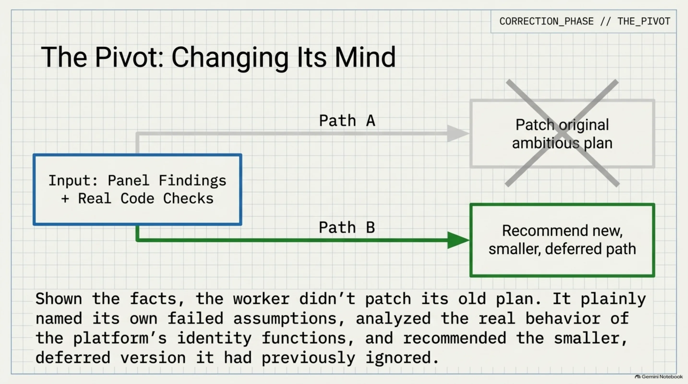

## The second round held up

A tighter review — did the specific fixes actually work this time — still found things worth fixing. One line in the revised design described *why* a piece of it was safe, and the explanation was wrong even though the code itself was fine: it credited a safety guarantee to the storage layer that doesn't exist, when the real guarantee came from something narrower and more fragile. Left uncorrected, that's the kind of claim that quietly stops being true the moment the deployment changes shape, with nobody noticing until it fails.

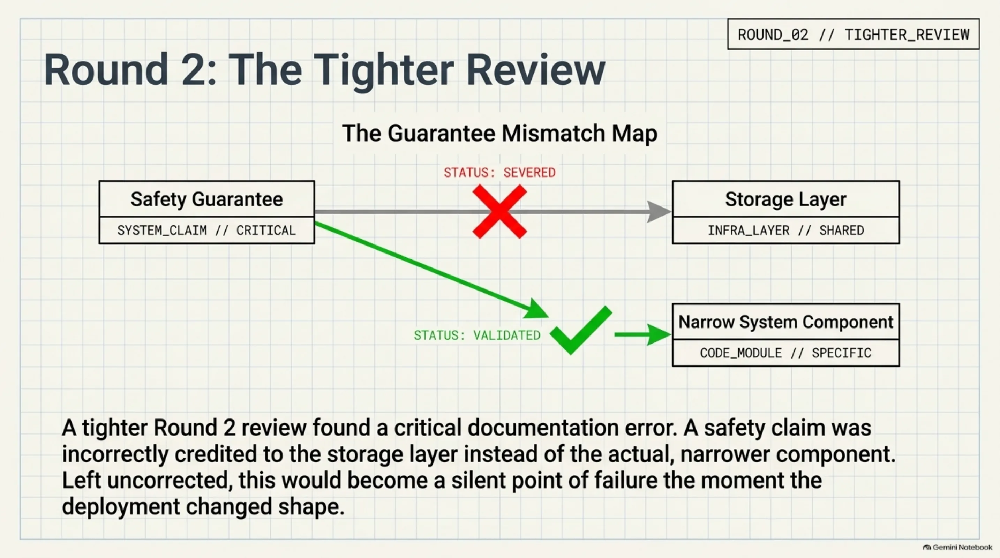

The orchestrator's second call: approve, with four fixes required before anything merges — three small, one just a matter of writing down what's still deferred and why, so it stays a decision instead of quietly becoming a thing nobody remembers not building.

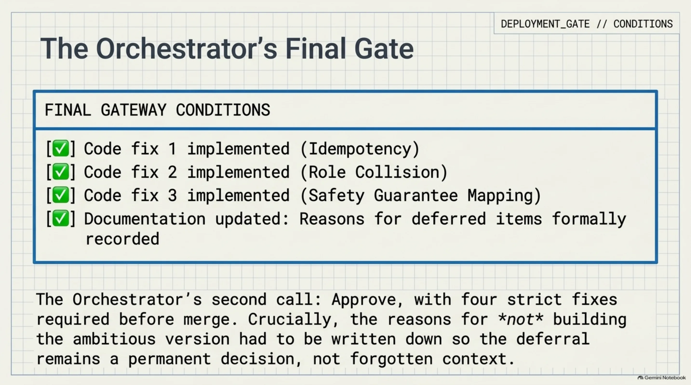

We approved it. Said so, with our own name on the record, the same way as every other run.

## It shipped

The corrected, smaller version got built the same day: code, tests, a pull request, merged. All four required fixes are in the diff, not just promised. The bigger version — the one we wanted at the start — didn't ship, and the reasons why are written down in a place anyone can check.

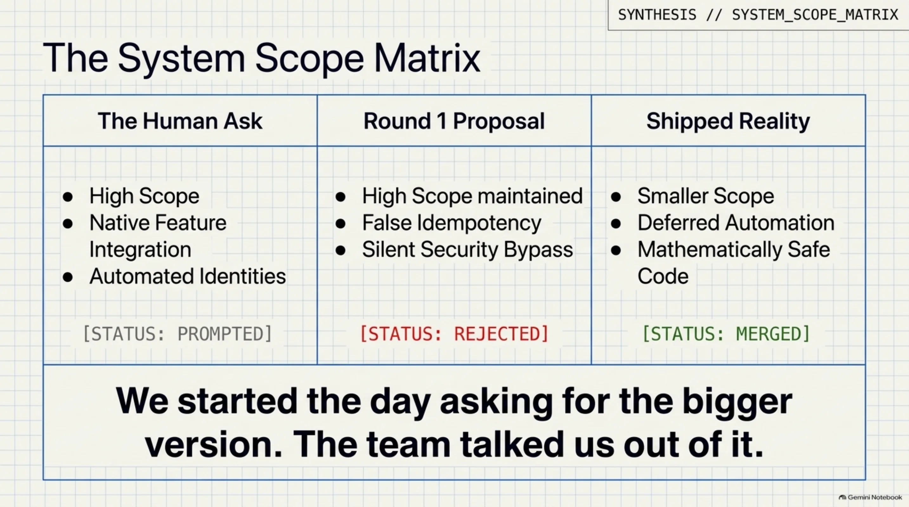

## What this run actually shows

Not that the panel is infallible — we still don't know what it does on the twentieth run, or when two reviewers disagree with each other instead of converging. What it shows is narrower and, we think, more useful: pointed at its own upgrade, the team found flaws in its own design, caught an omission in its own paperwork, and reversed its own recommendation once it checked its claims against the code instead of restating them with more confidence the second time.

We started the day wanting the bigger version. The team talked us out of it, with evidence, in public, on a ledger we can still read back. That's the part worth having built.

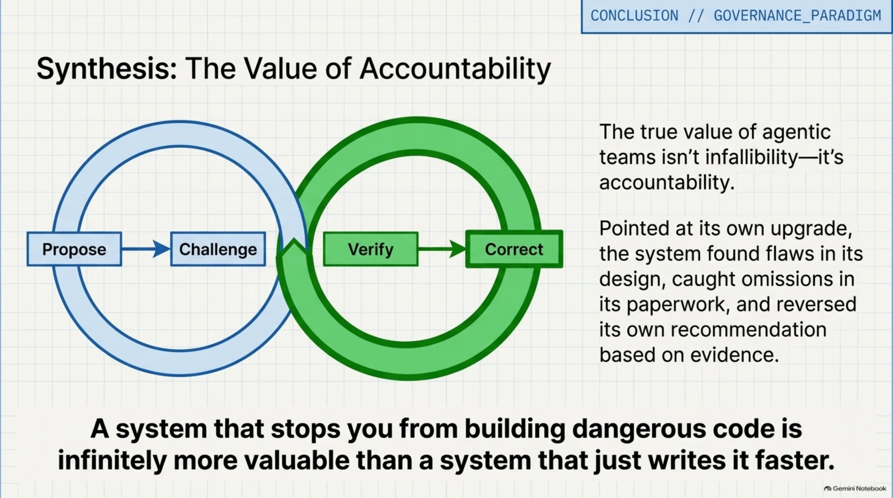
