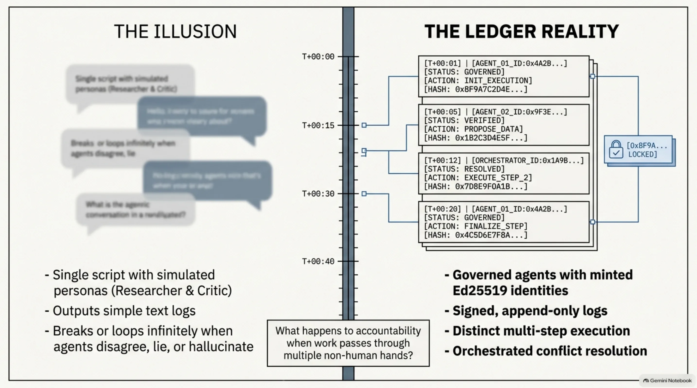
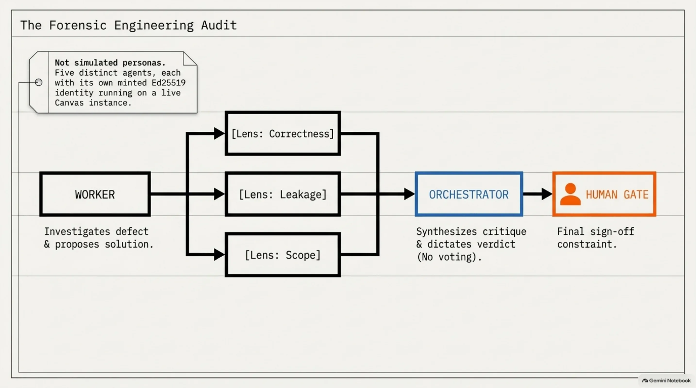
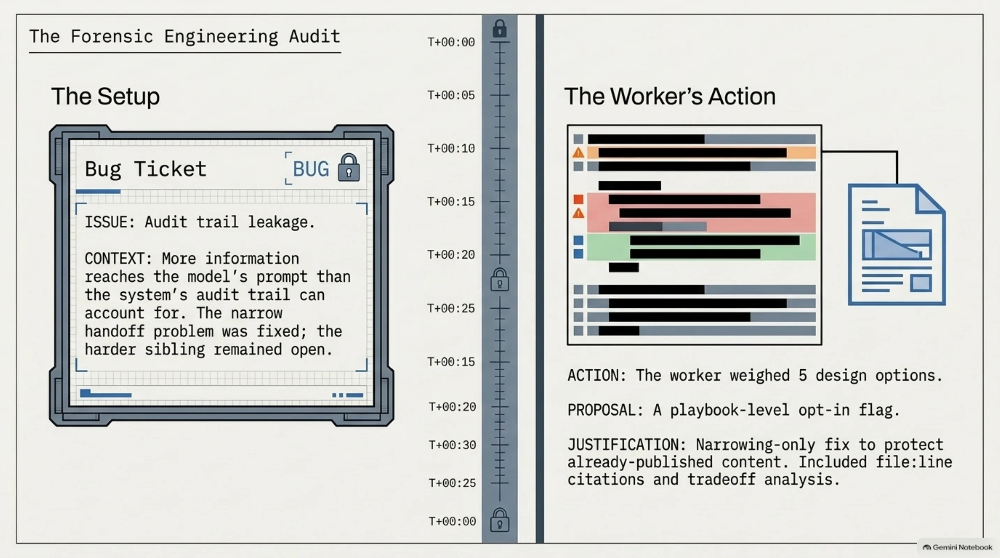
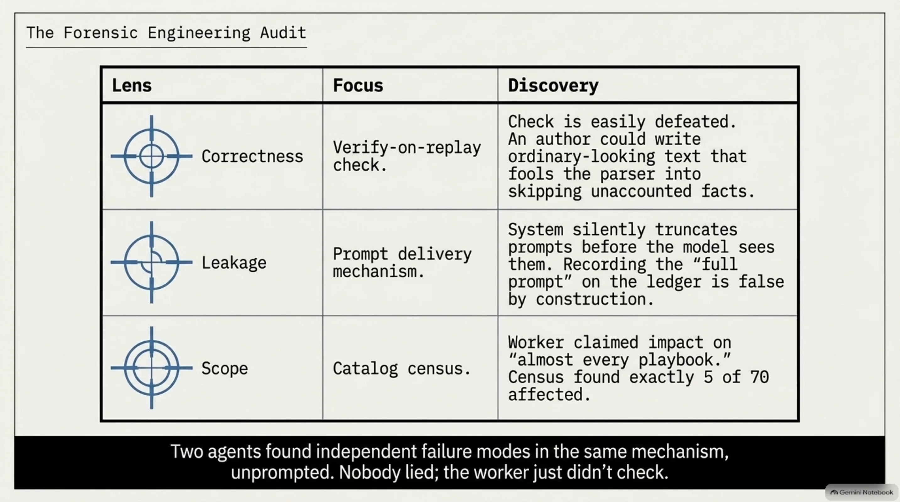
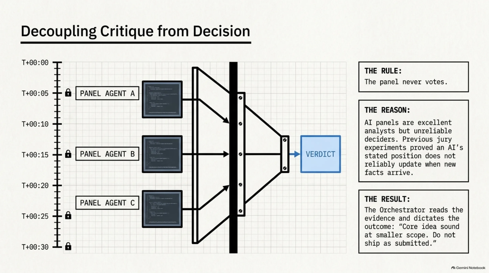
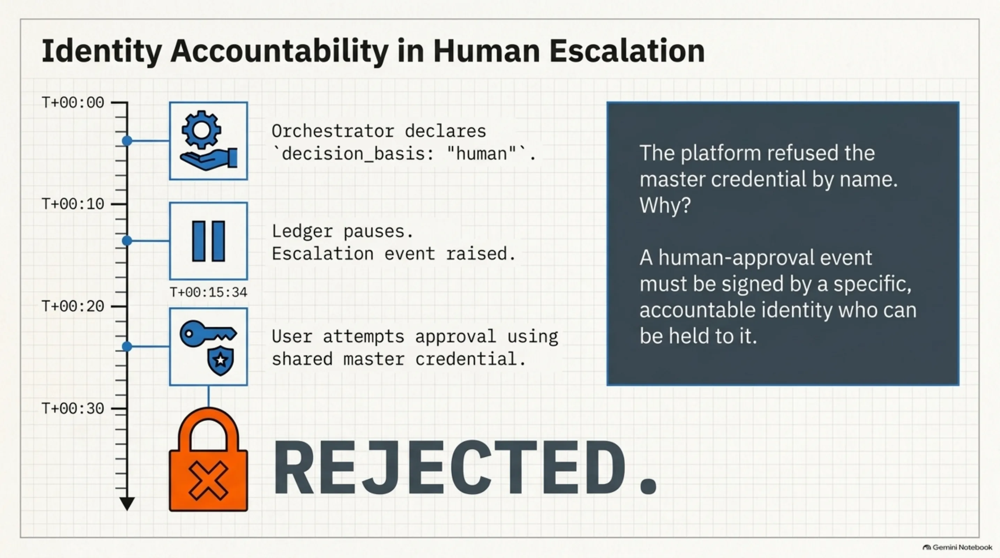
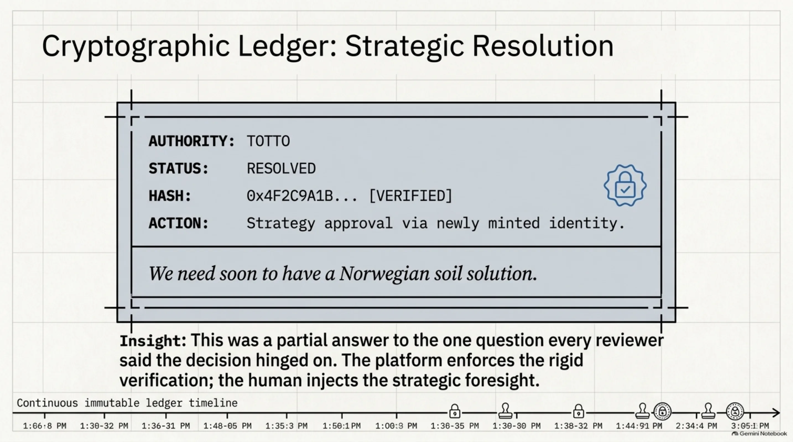
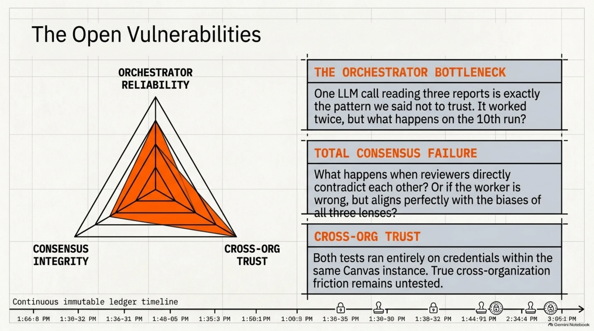
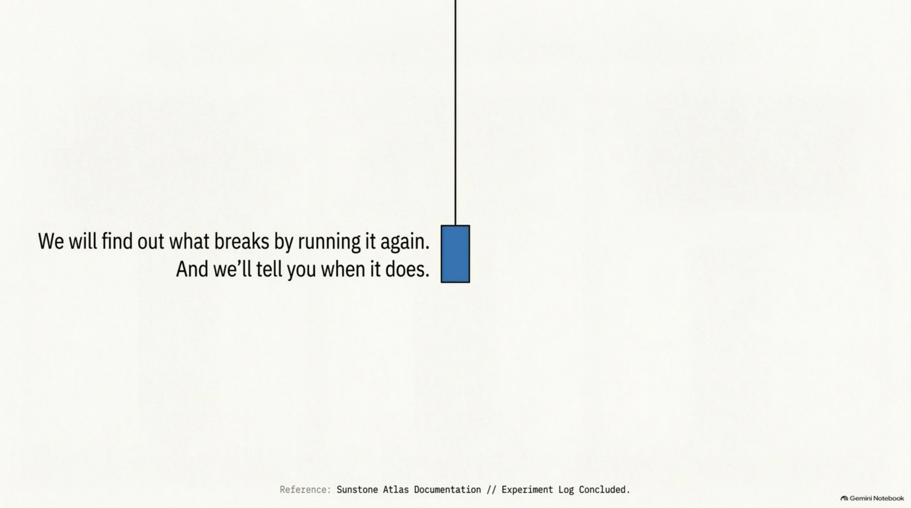

# The Platform Said No, Even to Me: Building an Agent Team on Sunstone Atlas

*Our last post on Sunstone Atlas ended with an open question: what happens to accountability when work passes through more than one pair of hands — agent to agent, agent to human, back again? We said we'd rather think about that in public than pretend we'd solved it. This week we tried it.*

<!-- more -->

Most "agent team" demos are theater: a few chat completions labeled "Researcher" and "Critic," a script that prints "consensus reached," and a README that never mentions what happens when the agents disagree, or lie, or one of them is just wrong.

So we ran one on infrastructure we'd already shipped, on a defect that was already in our own backlog, with the whole exchange on a signed channel instead of a chat log. It went about as we hoped for two-thirds of the run. Then we tried to sign off on the result, and the platform wouldn't let us.

## The setup: three roles, one signed channel

We'd already shipped the piece of Sunstone Atlas that lets one governed agent dispatch to another agent instance with its own identity — not a simulated tool call, a second agent, running its own turn. The open question was whether a *team* of them, each with a different job, beats one agent working alone, and whether the handoffs stay honest when nobody's reading every message by hand.

Three roles, each with its own minted Ed25519 identity on a live Canvas instance:

- A **worker**, whose job was to investigate a defect in our own codebase and write a design proposal.
- A three-person **review panel**, each with a genuinely different lens — correctness, information leakage, and scope. Not three copies of the same reviewer.
- An **orchestrator**, whose job was to read the panel's critique and decide what happens next. Not vote-count it. Decide.

All five talked over a HAAH group — Sunstone Atlas's human-agent-agent-human channel primitive, the same signed, append-only, membership-gated ledger we use for cross-organization collaboration. Everything below happened as a signed event on that ledger. We're paraphrasing it here rather than pasting the ledger itself — for reasons that'll make sense by the end.

## What the worker proposed

The task: our codebase has a known, deliberately-deferred defect — a place where more information reaches a model's prompt than the system's own audit trail can account for. We'd already fixed the narrow version (the previous post's "handoff problem" is exactly this shape of bug). The harder, unfixed sibling was sitting open as a tracked issue.

The worker read the code, weighed five design options, and picked one with a justification: a playbook-level opt-in flag, narrowing-only, so already-published content keeps its old behavior. It posted the proposal to the channel — diffs, file:line citations, and a tradeoffs section that named what it wasn't solving.

## The panel found two independent holes in the same verification step

The **correctness** reviewer checked the proposal's plan to verify, on replay, that a model's prompt matched what the audit trail claimed — and found the check could be defeated. An author could write ordinary-looking text that fooled the parser into skipping a fact the trail never accounted for.

Working from a different starting question, the **leakage** reviewer found something underneath that same mechanism: the system that delivers a prompt to the model silently truncates it before the model ever sees it. So the proposal's plan to record "the full prompt" on the ledger would have recorded content the model was never shown. Its own replay check would have verified a claim that was false by construction — not defeated by a clever attacker, wrong on the happy path.

We didn't run a control here — we didn't ask a single reviewer to cover all three lenses, so we can't say one generalist would have missed either hole. But two reviewers landing on two different failure modes of the same mechanism, unprompted, is the outcome the different-lens design exists to produce, and it's the first time we've watched it happen.

The third lens — **scope** — did something just as useful in a quieter register: it ran a census across our own content catalog and found the proposal had overstated its own new warning rule's reach. The proposal's own language was "almost every playbook"; the census found 5 of 70. That overstatement was doing work in the proposal's own reasoning for picking a bigger fix over a smaller one. Nobody had lied. The author just hadn't checked.

## The panel didn't decide. That's the point.

The panel never voted, and nothing asked it to. Each reviewer's job ended at "here's what I found, with evidence." A separate step — the orchestrator — read all three and made a call: don't ship as submitted, the core idea is sound at a smaller scope, here's exactly what that looks like.

We designed it that way on purpose. We'd already run an experiment asking whether an AI panel's *stated position* reliably updates when new facts arrive — the same job a jury exists to do. The honest answer, at the scale we tested: not reliably enough to hand it a decision. In that test, panels were good analysts and unreliable deciders. So we didn't ask this one to be either.

## Where it got genuinely fun

The orchestrator's decision needed an answer from a person, not a rubber stamp. This is where "agent to human, back again" stopped being theoretical.

Sunstone Atlas has a mechanism for this: a charter can declare `decision_basis: "human"`, which turns a playbook step into a pause-for-input gate the moment a run reaches it. We published a charter naming Totto as the approver, a one-step playbook with the panel's decision attached as evidence, and started the run.

It paused. Immediately — a signed `escalation-raised` event, right there in the run's permanent ledger.

Then we tried to resolve it, and the platform said no.

Not to an attacker — to us, using the account with the most access on the whole instance. Sunstone Atlas's own code checks for this and refuses by name: a human-approval event has to be signed by somebody who can actually be held to it, and the shared master credential isn't that. We minted a separate identity, built for this one decision, and Totto approved with that.

Here's the honest version of what happened, not the dramatic one: the system didn't have opinions. We'd written that refusal months ago, for a different reason, and had genuinely forgotten it would apply to us. The resulting signed event is permanent and checkable — who resolved it, what they decided, when — not because we remembered to be careful, but because a rule we'd stopped thinking about was still doing its job.

## We tried it again, on a question that wasn't code at all

One good result could be luck, so we ran the same shape — worker, three-lens panel, orchestrator, human gate — on a strategy question instead: whether to keep pushing into self-hosted, open-weight AI inference, or stop where we'd already stopped. Different lenses this time — cost/risk, technical quality, data residency — same everything else.

Two things worth reporting. The compliance reviewer found that the cheap option in the proposal was actually the *less* compliant one — it would have routed work through infrastructure we don't control, while the expensive option we were about to reject would have kept everything inside infrastructure we already trust. Nothing in the original proposal had said so. And while checking whether our own test material was even safe to use, that same reviewer found a customer's name sitting in content that was supposed to be entirely fictional, and a credential flagged for rotation at some point in the past that had never been rotated. Neither was the question we'd asked. Both were fixed the same afternoon, two small pull requests, merged.

The gate paused again, for the same reason. Totto didn't rubber-stamp it — he resolved it with a note:

*"we need soon to have a Norwegian soil solution."*

That's a partial answer to the one question every reviewer said the whole decision hinged on. It's also the one place in either run where a person, not a role, spoke.

## What's actually open

What we'd claim is narrow. A three-lens panel with distinct jobs found things one reviewer plausibly wouldn't — but we didn't run the control, so call that an instinct, not a result. Keeping critique and decision in separate steps was the right call, and we can point at the earlier experiment for why. The master-credential refusal was the platform enforcing a rule we wrote and had stopped thinking about, which is exactly what you want a rule to do.

What's still open: the orchestrator is one LLM call reading three reports and producing a verdict — the exact pattern we said not to trust a panel with. It was fine twice. We don't know what it does on the tenth run, or when two reviewers directly contradict each other, or when the worker is wrong in a way all three lenses happen to share. And we haven't touched the cross-organization case from last time — everyone in both of these teams held a credential on the same Canvas instance.

We'll find out the same way we found out this time: by running it again, and telling you when it breaks.

