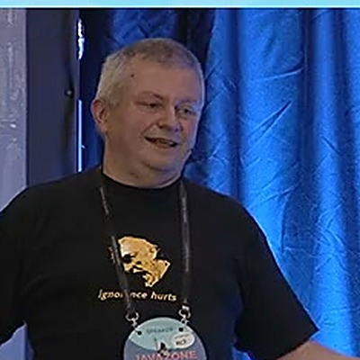

# Thor Henning Hetland

**Software architect. AI development pioneer. Community builder.**

30 years building software, communities, and organizations. Co-founder of [JavaZone](https://javazone.no) and founder of [eXOReaction](https://exoreaction.com). Java Champion since 2005. Based in Oslo.

These days I'm focused on what happens when experienced architects work _with_ AI -- not just alongside it.

[Read the blog](blog/index.md){ .md-button .md-button--primary }
[About me](about/index.md){ .md-button }

---

## Recent writing

-   :material-shield-alert:{ .card-icon } **[Production Scars Are Architecture](blog/2026/06/23/production-scars-are-architecture/)**

    ---

    Six architectural lessons from running an autonomous AI agent in production. Each scar is a failure category surprising enough to force mechanical change. Prose governance didn't work — here's what did.

    June 23, 2026

-   :material-scale-balance:{ .card-icon } **[Your AI Agent Does Not Know the Law (and How to Fix That)](blog/2026/06/22/your-ai-agent-does-not-know-the-law-and-how-to-fix-that/)**

    ---

    Your AI agent will confidently tell a customer they're GDPR-compliant when they're not. Here's the six-layer architecture that fixes that — from authoritative knowledge sources to verifiable answers.

    June 22, 2026

-   :material-graph:{ .card-icon } **[The Zombie in the Basement](blog/2026/06/19/the-zombie-in-the-basement/)**

    ---

    A company planned their ERP migration for three years. Their architecture catalog documented 23 database connections. There were 52. The migration nearly shipped that delta.

    June 19, 2026

[:octicons-arrow-right-24: All posts](blog/index.md)

---

## What I'm working on

-   :material-brain: **Skill-Driven Development**

    ---

    A methodology for structured AI collaboration that compounds daily. Six pillars. Proven 25--66x productivity gains across manufacturing, finance, energy, and security.

    [:octicons-arrow-right-24: About eXOReaction](https://exoreaction.com)

-   :material-magnify: **Synthesis · v1.29.0**

    ---

    Local-first knowledge infrastructure platform. 60+ CLI commands, 11 MCP tools, 4,300+ tests. Indexes workspaces, builds multi-layer knowledge graphs, exposes episodic memory and Notion integration to AI agents.

    [:octicons-arrow-right-24: Knowledge Infrastructure](knowledge-infrastructure/index.md) · [:octicons-link-external-16: Open Source](open-source.md)

-   :material-map: **Knowledge Context Protocol**

    ---

    A YAML standard that makes knowledge navigable by AI agents. Topology, intent, freshness, audience targeting. Submitted to the Linux Foundation's Agentic AI Foundation alongside MCP and AGENTS.md.

    [:octicons-arrow-right-24: Knowledge Infrastructure](knowledge-infrastructure/index.md)

-   :material-chip: **lib-pcb**

    ---

    A complete PCB design file processing library in Java. 8 format parsers, 28 validators, 17 auto-fixers, manufacturing-ready Gerber output. The project that proved SDD at scale -- 197,831 lines in 11 days.

    [:octicons-arrow-right-24: Open Source](open-source.md)

-   :material-shield-search: **Xorcery AAA**

    ---

    Temporal analytics and DevSecOps intelligence platform built on the Xorcery reactive framework. Tracks vulnerability lifecycles, answers "why did this break?", and automates compliance -- without cloud lock-in.

    [:octicons-arrow-right-24: Open Source](open-source.md)

-   :material-account-group: **Quadim**

    ---

    A competence management SaaS platform. Helps organisations map, develop, and visualise the skills of their people. Built with the same AI-augmented methodology as lib-pcb.

    [:octicons-arrow-right-24: quadim.ai](https://quadim.ai)

-   :material-rocket-launch: **Workshops & Training**

    ---

    Hands-on SDD workshops for development teams. From full-day intensives to multi-week mentoring programs. Real code, real methodology, real results.

    [:octicons-arrow-right-24: Get in touch](mailto:selina@exoreaction.com)

-   :material-coffee: **JavaZone & Community**

    ---

    Co-founded JavaZone in 2001 -- now Scandinavia's largest developer conference with ~3,000 attendees. Communities are where real knowledge transfer happens.

    [:octicons-arrow-right-24: Organizations](about/organizations.md)

---

## The proof

In January 2026, I built **lib-pcb** -- a complete PCB design library in Java.

| | |
|---|---|
| **197,831** | lines of Java |
| **7,461** | tests (99.8% pass) |
| **11 days** | total build time |
| **10--18 months** | industry standard |

8 format parsers. 28 validators. 17 auto-fixers. Manufacturing-ready Gerber output. Zero AI-induced production bugs.

This was not magic. It was methodology -- Skill-Driven Development applied systematically with Claude Code. The kind of thing I [write about](blog/index.md) and [teach in workshops](mailto:selina@exoreaction.com).

---

## Speaking

Conference talks on architecture, productivity, and development methodology. JavaZone, JavaOne, NDC, and more.

-   :material-play-circle-outline: **[Best Practice -- WTF!](presentations/best-practice-wtf.md)**

    JavaZone 2023 (lightning talk, video)

-   :material-presentation: **[Delivering Continuous Innovation](presentations/delivering-continuous-innovation.md)**

    Thousands of releases, zero downtime (~2023)

-   :material-presentation: **[Thousands of Releases per Year](presentations/thousands-of-releases.md)**

    Rebel Share (~2022)

[:octicons-arrow-right-24: All presentations](about/presentations.md)
