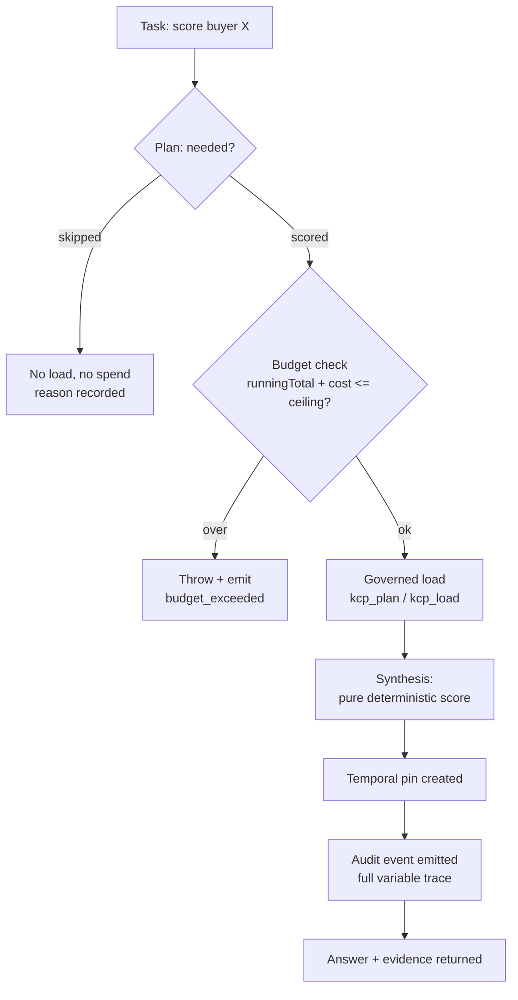

# From Task to Evidence

Most agent walkthroughs stop at the answer. The whole point of a [defendable agent](/topics/defendable-agents/argument/what-defendable-means/) is that the answer is the least interesting thing it produces. What you actually keep — the thing that survives an audit, a dispute, or your own future doubt — is the trail of evidence the run leaves behind. This page follows a single task through the [Lodestar](/topics/defendable-agents/reference/case-study-lodestar/) stack, step by step, and names the evidence each step emits.

The example domain is a regulated professional-services market: Lodestar scores *buyers* (organisations that might retain a *firm*) and computes *match* scores between buyers and firms. The mechanics are deterministic and public-data-only, but the data flow below is the same whatever your domain.

## The path a task takes

A governed session shares one audit log, one budget ledger, and one map of temporal pins. Every operation inside it runs the same six stages.



### 1. Task

A task names an entity and an operation: *score buyer X*, *compute a match*, *tier an account*. Nothing is executed yet. The task is just an intent the harness will either admit or refuse.

### 2. Plan — scored or skipped

The [deterministic planner](/topics/defendable-agents/architecture/deterministic-planner/) decides whether the operation is actually needed. If a fresh temporal pin already covers this entity and no drift is detected, the plan **skips** the work — and records *why*. A skip is evidence too: it proves the system did not burn budget or touch data it did not need. If the entity is new, stale, or drifted, the plan marks the operation **scored** and lets it proceed.

*Evidence emitted:* a plan decision, and on a skip, the reason (fresh pin, no drift).

### 3. Budget check

Before anything is loaded or computed, the [budget ledger](/topics/defendable-agents/primitives/budget-and-bounding/) checks the cost of the operation against the session ceiling. Costs are fixed per operation type:

```typescript
const OPERATION_COSTS = {
  signal_detection: 1,
  buyer_scoring: 5,
  firm_analysis: 10,
  match_scoring: 5,
  account_tiering: 2,
  gtm_plan: 10,
  playbook_generation: 5,
  monitoring_check: 1,
  reanalysis: 5,
} as const;

// record() checks BEFORE it records
record(op, entityId, cost) {
  if (this.runningTotal + cost > this.ceiling) {
    return { accepted: false, reason: "ceiling_exceeded" };
  }
  this.runningTotal += cost;
  this.entries.push({
    seq: this.entries.length + 1,
    timestamp: now(),
    operation: op, entityId, cost,
    currency: "units",
    runningTotal: this.runningTotal,
  });
  return { accepted: true };
}
```

The check happens *before* the spend is recorded. If `runningTotal + cost` would breach the ceiling (a session default of 1000 units), `record` returns `accepted: false`, the governed operation **throws**, and a `budget_exceeded` audit event is written. The task does not silently degrade — it stops, visibly. See [fail-closed behaviour](/topics/defendable-agents/architecture/fail-closed-behavior/) for why that is the safe default.

*Evidence emitted:* a `budget_spend` ledger entry `{seq, timestamp, operation, entityId, cost, currency, runningTotal}`, or a `budget_exceeded` event.

### 4. Governed load

Only now does the agent touch knowledge. The scoring models and their input units are declared as governed KCP units, so they are selected **deterministically and never silently swapped**. The harness exposes exactly two load tools to the [model at the edge](/topics/defendable-agents/architecture/model-at-the-edge/): `kcp_plan` and `kcp_load`. A domain in `harness.yaml` binds a manifest to the paths and tools an operation may use:

```yaml
governance:
  domains:
    - manifest: knowledge.yaml
      paths: [models/, data/signals/]
      tools: [kcp_plan, kcp_load]
policy:
  fail_closed: true
  audit_all: true
  max_units: 40
  budget: { amount: 1000, currency: units }
  context_budget: 200000
audit:
  path: ./audit/session.jsonl
```

If a unit is not declared, it cannot be loaded — the boundary is enforced by the harness, not by a note in a runbook. See [wiring KCP, the agent, and MCP](/topics/defendable-agents/kcp/wiring-kcp-agent-mcp/) for the plumbing.

*Evidence emitted:* the exact units and model version loaded, captured in the pin and audit event below.

### 5. Synthesis

The loaded inputs pass into a **pure function**. A buyer score is a weighted composite of three layers — Need (0.40), Attractiveness (0.25), Winnability (0.35) — each layer being the mean of its six 1-5 variable scores times 20. The same inputs always yield the same 0-100 total and the same [priority band](/topics/defendable-agents/decisions/layers-weights-bands/). No sampling, no temperature, no model in this step. The [model at the edge](/topics/defendable-agents/architecture/model-at-the-edge/) may have *drafted* the variable inputs, but it does not compute the score.

*Evidence emitted:* the full variable trace — every `{id, score}`, each layer score, the total, and the band.

### 6. Pin and audit

Two artefacts close the operation. First, a **temporal pin** `{scoredAt, dataAsOf, signalDates[], modelVersion, modelHash}` records exactly what data and which model produced this score, so [drift detection](/topics/defendable-agents/primitives/temporal-pinning/) can later tell staleness from freshness. Second, an append-only [audit event](/topics/defendable-agents/primitives/audit-trail/) is written to JSONL — one line, `fsync` on flush — carrying the decision, the scoring trace, the temporal block, the budget block, and `durationMs`:

```json
{
  "timestamp": "2026-07-08T09:14:22Z",
  "sessionId": "sess-4b1",
  "sequence": 7,
  "type": "buyer_scored",
  "actor": "scoring-agent",
  "entity": { "type": "buyer", "id": "X", "name": "Buyer X" },
  "decision": {
    "action": "score",
    "justification": "signal freshness 4.0, mandate-value 5"
  },
  "scoring": {
    "model": "buyer-scoring@2.3.0",
    "layerScores": { "need": 78, "attractiveness": 64, "winnability": 71 },
    "total": 72, "band": "High"
  },
  "temporal": { "dataAsOf": "2026-07-06", "scoredAt": "2026-07-08T09:14:22Z" },
  "budget": { "cost": 5, "currency": "units", "runningTotal": 42, "ceiling": 1000, "remaining": 958 },
  "durationMs": 34
}
```

*Evidence emitted:* one immutable audit line and one temporal pin per operation.

## Evidence is a byproduct, not a report

Notice what you did *not* do: you never wrote an evidence report. The [decision trace](/topics/defendable-agents/primitives/decision-traces/), the ledger, and the pins accumulate as the natural residue of running the work correctly. An [evidence package](/topics/defendable-agents/compliance/evidence-packages/) is later just a selection over lines that already exist.

## Honest limits

This flow guarantees *process*, not *correctness*. If a variable is mis-designed, step 5 applies the mistake consistently to every entity — but it does so visibly and reproducibly, which is precisely how you catch it. Temporal pinning in step 6 *detects* staleness; it does not refresh the data. And the planner's skip in step 2 is only as good as its drift rules — tune fail-closed too tight and it will block legitimate work. The trail tells you what happened; reading it is still your job.
